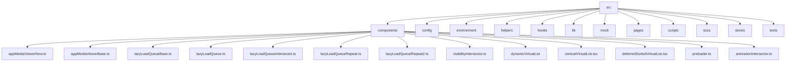
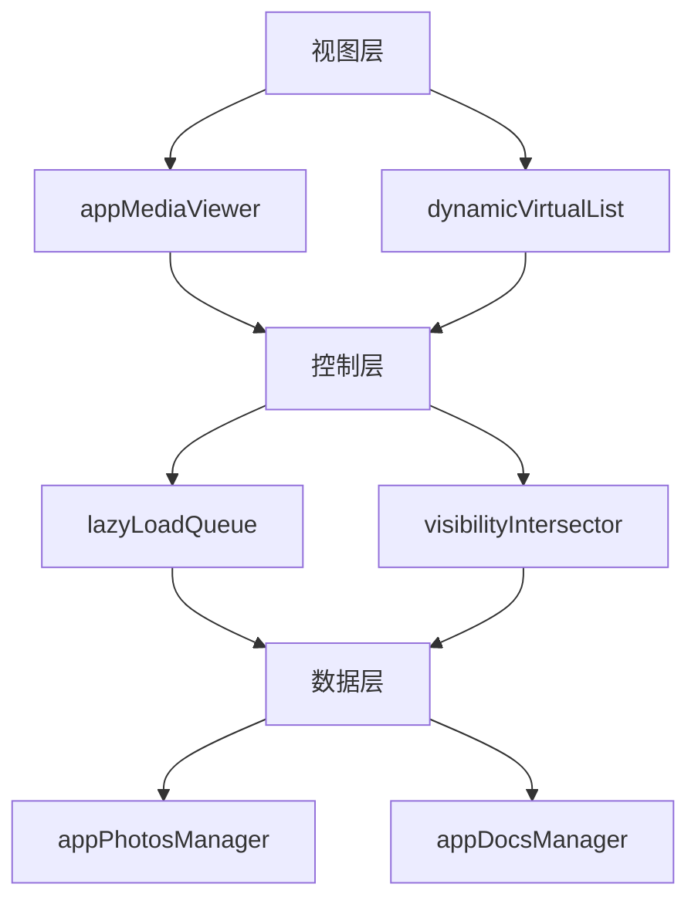
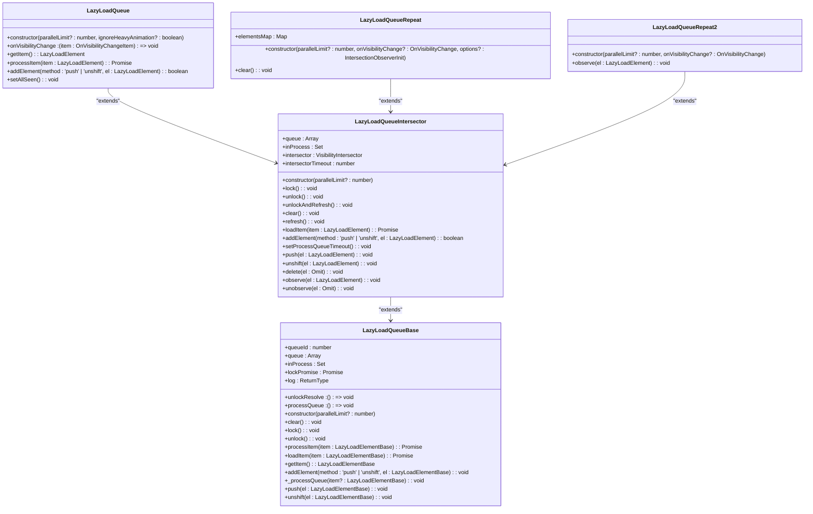
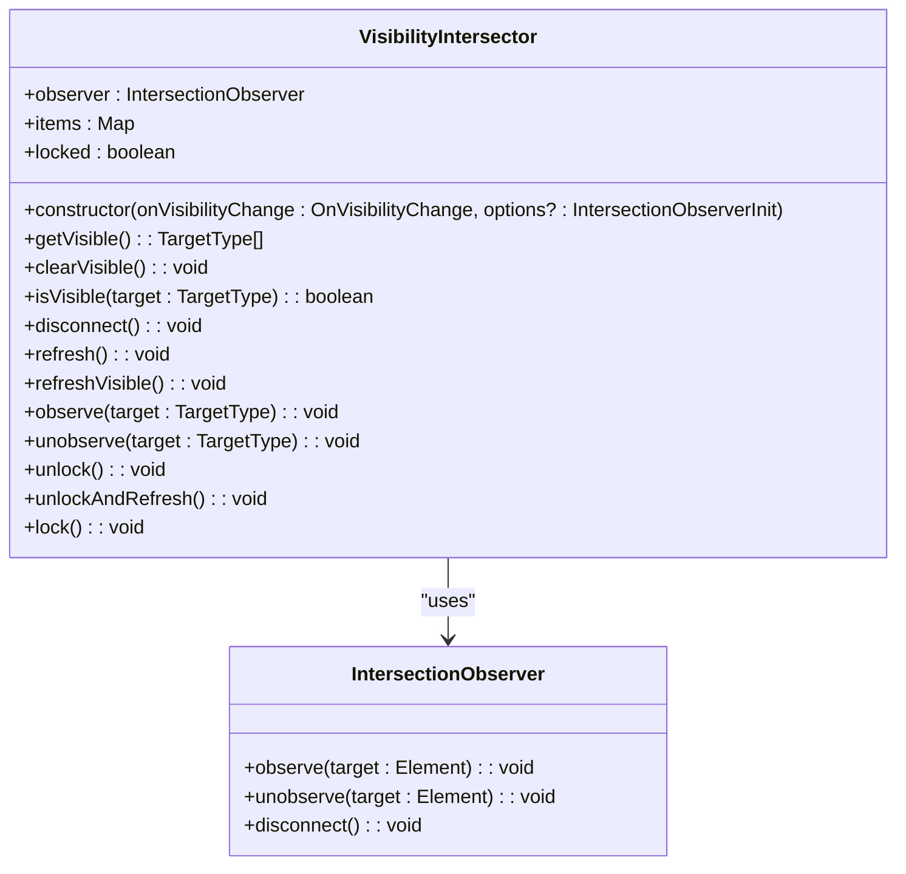
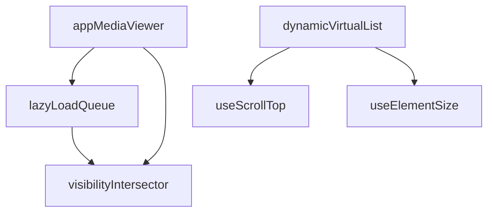

# 懒加载策略

<cite>
**本文档中引用的文件**   
- [appMediaViewerNew.ts](file://src/components/appMediaViewerNew.ts)
- [appMediaViewerBase.ts](file://src/components/appMediaViewerBase.ts)
- [lazyLoadQueueBase.ts](file://src/components/lazyLoadQueueBase.ts)
- [lazyLoadQueue.ts](file://src/components/lazyLoadQueue.ts)
- [lazyLoadQueueIntersector.ts](file://src/components/lazyLoadQueueIntersector.ts)
- [lazyLoadQueueRepeat.ts](file://src/components/lazyLoadQueueRepeat.ts)
- [lazyLoadQueueRepeat2.ts](file://src/components/lazyLoadQueueRepeat2.ts)
- [visibilityIntersector.ts](file://src/components/visibilityIntersector.ts)
- [dynamicVirtualList/index.tsx](file://src/components/dynamicVirtualList/index.tsx)
- [verticalVirtualList.tsx](file://src/components/verticalVirtualList.tsx)
- [deferredSortedVirtualList.tsx](file://src/components/deferredSortedVirtualList.tsx)
- [preloader.ts](file://src/components/preloader.ts)
- [preloadVideo.ts](file://src/helpers/preloadVideo.ts)
- [logger.ts](file://src/lib/logger.ts)
- [animationIntersector.ts](file://src/components/animationIntersector.ts)
</cite>

## 目录
1. [简介](#简介)
2. [项目结构](#项目结构)
3. [核心组件](#核心组件)
4. [架构概述](#架构概述)
5. [详细组件分析](#详细组件分析)
6. [依赖分析](#依赖分析)
7. [性能考虑](#性能考虑)
8. [故障排除指南](#故障排除指南)
9. [结论](#结论)

## 简介
本文档详细阐述了媒体预览的懒加载策略，重点介绍虚拟滚动和视口检测技术在媒体预览中的应用。文档深入解释了如何仅加载可见区域的媒体内容以优化性能，说明了预加载机制如何预测用户滚动行为并提前加载临近媒体。同时，文档记录了资源优先级调度策略，确保关键内容优先加载，并提供了性能指标监控方法来评估懒加载效果。此外，还包含了错误恢复机制和网络状况自适应策略。

## 项目结构
项目结构清晰地组织了各个功能模块，主要分为以下几个部分：
- `handlebarsHelpers`：包含模板辅助函数
- `public`：存放静态资源文件
- `snapshot-server`：快照服务器相关文件
- `src`：源代码目录，包含组件、配置、环境、帮助函数、钩子、库、模拟数据、页面、脚本、样式、存储等子目录

媒体预览和懒加载相关的组件主要位于 `src/components` 目录下，包括 `appMediaViewer`、`lazyLoadQueue`、`visibilityIntersector` 等。



**图源**
- [appMediaViewerNew.ts](file://src/components/appMediaViewerNew.ts)
- [appMediaViewerBase.ts](file://src/components/appMediaViewerBase.ts)
- [lazyLoadQueueBase.ts](file://src/components/lazyLoadQueueBase.ts)
- [lazyLoadQueue.ts](file://src/components/lazyLoadQueue.ts)
- [lazyLoadQueueIntersector.ts](file://src/components/lazyLoadQueueIntersector.ts)
- [lazyLoadQueueRepeat.ts](file://src/components/lazyLoadQueueRepeat.ts)
- [lazyLoadQueueRepeat2.ts](file://src/components/lazyLoadQueueRepeat2.ts)
- [visibilityIntersector.ts](file://src/components/visibilityIntersector.ts)
- [dynamicVirtualList/index.tsx](file://src/components/dynamicVirtualList/index.tsx)
- [verticalVirtualList.tsx](file://src/components/verticalVirtualList.tsx)
- [deferredSortedVirtualList.tsx](file://src/components/deferredSortedVirtualList.tsx)
- [preloader.ts](file://src/components/preloader.ts)
- [animationIntersector.ts](file://src/components/animationIntersector.ts)

**章节来源**
- [appMediaViewerNew.ts](file://src/components/appMediaViewerNew.ts)
- [appMediaViewerBase.ts](file://src/components/appMediaViewerBase.ts)
- [lazyLoadQueueBase.ts](file://src/components/lazyLoadQueueBase.ts)
- [lazyLoadQueue.ts](file://src/components/lazyLoadQueue.ts)
- [lazyLoadQueueIntersector.ts](file://src/components/lazyLoadQueueIntersector.ts)
- [lazyLoadQueueRepeat.ts](file://src/components/lazyLoadQueueRepeat.ts)
- [lazyLoadQueueRepeat2.ts](file://src/components/lazyLoadQueueRepeat2.ts)
- [visibilityIntersector.ts](file://src/components/visibilityIntersector.ts)
- [dynamicVirtualList/index.tsx](file://src/components/dynamicVirtualList/index.tsx)
- [verticalVirtualList.tsx](file://src/components/verticalVirtualList.tsx)
- [deferredSortedVirtualList.tsx](file://src/components/deferredSortedVirtualList.tsx)
- [preloader.ts](file://src/components/preloader.ts)
- [animationIntersector.ts](file://src/components/animationIntersector.ts)

## 核心组件
核心组件包括 `appMediaViewer`、`lazyLoadQueue`、`visibilityIntersector` 和 `dynamicVirtualList`。这些组件共同实现了媒体预览的懒加载策略。

`appMediaViewer` 负责管理媒体查看器的整体行为，包括加载、显示和交互。`lazyLoadQueue` 管理懒加载队列，确保资源按需加载。`visibilityIntersector` 使用 Intersection Observer API 检测元素是否在视口中可见。`dynamicVirtualList` 实现虚拟滚动，仅渲染可见区域的列表项。

**章节来源**
- [appMediaViewerNew.ts](file://src/components/appMediaViewerNew.ts)
- [appMediaViewerBase.ts](file://src/components/appMediaViewerBase.ts)
- [lazyLoadQueueBase.ts](file://src/components/lazyLoadQueueBase.ts)
- [lazyLoadQueue.ts](file://src/components/lazyLoadQueue.ts)
- [lazyLoadQueueIntersector.ts](file://src/components/lazyLoadQueueIntersector.ts)
- [lazyLoadQueueRepeat.ts](file://src/components/lazyLoadQueueRepeat.ts)
- [lazyLoadQueueRepeat2.ts](file://src/components/lazyLoadQueueRepeat2.ts)
- [visibilityIntersector.ts](file://src/components/visibilityIntersector.ts)
- [dynamicVirtualList/index.tsx](file://src/components/dynamicVirtualList/index.tsx)
- [verticalVirtualList.tsx](file://src/components/verticalVirtualList.tsx)
- [deferredSortedVirtualList.tsx](file://src/components/deferredSortedVirtualList.tsx)

## 架构概述
系统架构采用分层设计，主要包括以下几个层次：
- **视图层**：负责用户界面的展示和交互，包括 `appMediaViewer` 和 `dynamicVirtualList`。
- **控制层**：管理业务逻辑和状态，包括 `lazyLoadQueue` 和 `visibilityIntersector`。
- **数据层**：处理数据获取和存储，包括 `appPhotosManager` 和 `appDocsManager`。

各层之间通过清晰的接口进行通信，确保系统的可维护性和可扩展性。



**图源**
- [appMediaViewerNew.ts](file://src/components/appMediaViewerNew.ts)
- [appMediaViewerBase.ts](file://src/components/appMediaViewerBase.ts)
- [lazyLoadQueueBase.ts](file://src/components/lazyLoadQueueBase.ts)
- [lazyLoadQueue.ts](file://src/components/lazyLoadQueue.ts)
- [lazyLoadQueueIntersector.ts](file://src/components/lazyLoadQueueIntersector.ts)
- [visibilityIntersector.ts](file://src/components/visibilityIntersector.ts)
- [dynamicVirtualList/index.tsx](file://src/components/dynamicVirtualList/index.tsx)
- [appPhotosManager.ts](file://src/lib/appManagers/appPhotosManager.ts)
- [appDocsManager.ts](file://src/lib/appManagers/appDocsManager.ts)

## 详细组件分析

### appMediaViewer 分析
`appMediaViewer` 是媒体查看器的核心组件，负责管理媒体的加载、显示和交互。它通过 `lazyLoadQueue` 管理媒体资源的加载队列，确保仅加载可见区域的媒体内容。

#### 类图
```mermaid
classDiagram
class AppMediaViewer {
+wholeDiv : HTMLElement
+overlaysDiv : HTMLElement
+author : {[k in 'container' | 'avatarEl' | 'nameEl' | 'date'] : HTMLElement}
+content : {[k in 'main' | 'container' | 'media' | 'mover' | ContentAdditionType] : HTMLElement}
+mover : HTMLCanvasElement
+buttons : {[k in 'download' | 'close' | 'prev' | 'next' | 'mobile-close' | ButtonsAdditionType] : HTMLElement}
+tempId : number
+preloader : ProgressivePreloader
+preloaderStreamable : ProgressivePreloader
+lastTarget : HTMLElement
+prevTargets : TargetType[]
+nextTargets : TargetType[]
+log : ReturnType<typeof logger>
+isFirstOpen : boolean
+loadMediaPromiseUp : Promise<void>
+loadMediaPromiseDown : Promise<void>
+loadedAllMediaUp : boolean
+loadedAllMediaDown : boolean
+reverse : boolean
+needLoadMore : boolean
+pageEl : HTMLDivElement
+setMoverPromise : Promise<void>
+setMoverAnimationPromise : Promise<void>
+lazyLoadQueue : LazyLoadQueueBase
+highlightSwitchersTimeout : number
+onDownloadClick : (e : MouseEvent) => void
+onPrevClick : (target : TargetType) => void
+onNextClick : (target : TargetType) => void
+loadMoreMedia : (older : boolean) => Promise<void>
+animatingContext : {
width : number,
height : number,
startWidth : number,
startHeight : number,
media : HTMLImageElement | HTMLVideoElement,
diffX : number,
diffY : number,
startTime : number,
borderRadius : number[]
}
+constructor(topButtons : Array<keyof AppMediaViewerBase<ContentAdditionType, ButtonsAdditionType, TargetType>['buttons']>)
+setMoverToTarget(target : HTMLElement, animate : boolean, fromRight? : boolean) : Promise<{onAnimationEnd : Promise<void>}>
+setNewMover() : HTMLCanvasElement
+updateMediaSource(target : HTMLElement, url : string, tagName : 'video' | 'img') : void
+setAuthorInfo(fromId : number, timestamp : number) : void
+loadMedia(target : HTMLElement, media : MyPhoto | MyDocument, size : MyPhotoSize, fromRight? : boolean) : Promise<void>
}
class AppMediaViewerBase {
+wholeDiv : HTMLElement
+overlaysDiv : HTMLElement
+author : {[k in 'container' | 'avatarEl' | 'nameEl' | 'date'] : HTMLElement}
+content : {[k in 'main' | 'container' | 'media' | 'mover' | ContentAdditionType] : HTMLElement}
+mover : HTMLCanvasElement
+buttons : {[k in 'download' | 'close' | 'prev' | 'next' | 'mobile-close' | ButtonsAdditionType] : HTMLElement}
+tempId : number
+preloader : ProgressivePreloader
+preloaderStreamable : ProgressivePreloader
+lastTarget : HTMLElement
+prevTargets : TargetType[]
+nextTargets : TargetType[]
+log : ReturnType<typeof logger>
+isFirstOpen : boolean
+loadMediaPromiseUp : Promise<void>
+loadMediaPromiseDown : Promise<void>
+loadedAllMediaUp : boolean
+loadedAllMediaDown : boolean
+reverse : boolean
+needLoadMore : boolean
+pageEl : HTMLDivElement
+setMoverPromise : Promise<void>
+setMoverAnimationPromise : Promise<void>
+lazyLoadQueue : LazyLoadQueueBase
+highlightSwitchersTimeout : number
+onDownloadClick : (e : MouseEvent) => void
+onPrevClick : (target : TargetType) => void
+onNextClick : (target : TargetType) => void
+loadMoreMedia : (older : boolean) => Promise<void>
+animatingContext : {
width : number,
height : number,
startWidth : number,
startHeight : number,
media : HTMLImageElement | HTMLVideoElement,
diffX : number,
diffY : number,
startTime : number,
borderRadius : number[]
}
+constructor(topButtons : Array<keyof AppMediaViewerBase<ContentAdditionType, ButtonsAdditionType, TargetType>['buttons']>)
+setMoverToTarget(target : HTMLElement, animate : boolean, fromRight? : boolean) : Promise<{onAnimationEnd : Promise<void>}>
+setNewMover() : HTMLCanvasElement
+updateMediaSource(target : HTMLElement, url : string, tagName : 'video' | 'img') : void
+setAuthorInfo(fromId : number, timestamp : number) : void
+loadMedia(target : HTMLElement, media : MyPhoto | MyDocument, size : MyPhotoSize, fromRight? : boolean) : Promise<void>
}
AppMediaViewer --> AppMediaViewerBase : "extends"
```

**图源**
- [appMediaViewerNew.ts](file://src/components/appMediaViewerNew.ts)
- [appMediaViewerBase.ts](file://src/components/appMediaViewerBase.ts)

### lazyLoadQueue 分析
`lazyLoadQueue` 是懒加载队列的核心组件，负责管理资源的加载顺序和并发限制。它通过 `visibilityIntersector` 检测元素是否在视口中可见，并根据可见性决定是否加载资源。

#### 类图


**图源**
- [lazyLoadQueueBase.ts](file://src/components/lazyLoadQueueBase.ts)
- [lazyLoadQueueIntersector.ts](file://src/components/lazyLoadQueueIntersector.ts)
- [lazyLoadQueue.ts](file://src/components/lazyLoadQueue.ts)
- [lazyLoadQueueRepeat.ts](file://src/components/lazyLoadQueueRepeat.ts)
- [lazyLoadQueueRepeat2.ts](file://src/components/lazyLoadQueueRepeat2.ts)

### visibilityIntersector 分析
`visibilityIntersector` 使用 Intersection Observer API 检测元素是否在视口中可见。它通过 `IntersectionObserver` 监听元素的可见性变化，并通知 `lazyLoadQueue` 进行相应的处理。

#### 类图


**图源**
- [visibilityIntersector.ts](file://src/components/visibilityIntersector.ts)

### dynamicVirtualList 分析
`dynamicVirtualList` 实现虚拟滚动，仅渲染可见区域的列表项。它通过 `useScrollTop` 和 `useElementSize` 钩子获取滚动位置和元素大小，并根据这些信息决定哪些项需要渲染。

#### 类图
```mermaid
classDiagram
class DynamicVirtualList {
+list : T[]
+scrollable : HTMLElement
+estimateItemHeight : (item : T) => number
+measureElementHeight : (el : El) => number
+Item : (props : DynamicVirtualListItemProps<T, El>) => JSX.Element
+maxBatchSize : number
+verticalPadding? : number
+renderAtLeastFromBottom? : (args : RenderAtLeastFromBottomArgs) => number
+nearBottomThreshold? : number
+onNearBottom? : () => void
+constructor(inProps : DynamicVirtualListProps<T, El>)
+createVirtualRenderState(args : CreateVirtualRenderStateArgs<T>) : {scrollTop, clientHeight, height, renderedItems, onMeasure}
+createItemComponent(args : CreateItemComponentArgs<T, El>) : (props : { item : ListItemState<T> }) => JSX.Element
}
class VerticalVirtualList {
+list : T[]
+scrollable : HTMLElement
+itemHeight : number
+ListItem : (props : VerticalVirtualListItemProps<T>) => JSX.Element
+forceHostHeight? : boolean
+scrollableHost? : HTMLElement
+thresholdPadding? : number
+extraPaddingBottom? : number
+constructor(props : VerticalVirtualListProps<T>)
+isActuallyVisible(idx : number) : boolean
+createComputed(on(list, (current, prev = []) => {...}))
}
class DeferredSortedVirtualList {
+scrollable : HTMLElement
+getItemElement : (item : T, id : any) => HTMLElement
+onItemUnmount? : (item : T) => void
+onListShrinked : () => void
+requestItemForIdx : (idx : number, itemsLength : number) => void
+sortWith : (a : number, b : number) => number
+itemSize : LoadingDialogSkeletonSize
+noAvatar? : boolean
+onListLengthChange? : () => void
+constructor(args : CreateDeferredSortedVirtualListArgs<T>)
+addItems(newItems : DeferredSortedVirtualListItem<T>[]) : void
+addPinnedItems(newItems : DeferredSortedVirtualListItem<T>[]) : void
+removeItem(id : any) : boolean
+updateItem(id : any, index : number) : void
+has(id : any) : boolean
+get(id : any) : T
+clear() : void
}
DynamicVirtualList --> VerticalVirtualList : "uses"
DeferredSortedVirtualList --> VerticalVirtualList : "uses"
```

**图源**
- [dynamicVirtualList/index.tsx](file://src/components/dynamicVirtualList/index.tsx)
- [verticalVirtualList.tsx](file://src/components/verticalVirtualList.tsx)
- [deferredSortedVirtualList.tsx](file://src/components/deferredSortedVirtualList.tsx)

## 依赖分析
系统中的各个组件通过清晰的接口进行通信，确保了低耦合和高内聚。`appMediaViewer` 依赖 `lazyLoadQueue` 和 `visibilityIntersector` 来管理媒体资源的加载和可见性检测。`lazyLoadQueue` 依赖 `visibilityIntersector` 来获取元素的可见性信息。`dynamicVirtualList` 依赖 `useScrollTop` 和 `useElementSize` 钩子来获取滚动位置和元素大小。



**图源**
- [appMediaViewerNew.ts](file://src/components/appMediaViewerNew.ts)
- [appMediaViewerBase.ts](file://src/components/appMediaViewerBase.ts)
- [lazyLoadQueueBase.ts](file://src/components/lazyLoadQueueBase.ts)
- [lazyLoadQueue.ts](file://src/components/lazyLoadQueue.ts)
- [lazyLoadQueueIntersector.ts](file://src/components/lazyLoadQueueIntersector.ts)
- [visibilityIntersector.ts](file://src/components/visibilityIntersector.ts)
- [dynamicVirtualList/index.tsx](file://src/components/dynamicVirtualList/index.tsx)
- [hooks/useScrollTop.ts](file://src/hooks/useScrollTop.ts)
- [hooks/useElementSize.ts](file://src/hooks/useElementSize.ts)

**章节来源**
- [appMediaViewerNew.ts](file://src/components/appMediaViewerNew.ts)
- [appMediaViewerBase.ts](file://src/components/appMediaViewerBase.ts)
- [lazyLoadQueueBase.ts](file://src/components/lazyLoadQueueBase.ts)
- [lazyLoadQueue.ts](file://src/components/lazyLoadQueue.ts)
- [lazyLoadQueueIntersector.ts](file://src/components/lazyLoadQueueIntersector.ts)
- [visibilityIntersector.ts](file://src/components/visibilityIntersector.ts)
- [dynamicVirtualList/index.tsx](file://src/components/dynamicVirtualList/index.tsx)
- [hooks/useScrollTop.ts](file://src/hooks/useScrollTop.ts)
- [hooks/useElementSize.ts](file://src/hooks/useElementSize.ts)

## 性能考虑
为了优化性能，系统采用了多种策略：
- **虚拟滚动**：`dynamicVirtualList` 仅渲染可见区域的列表项，减少了 DOM 操作和内存占用。
- **懒加载**：`lazyLoadQueue` 确保仅加载可见区域的媒体内容，减少了网络请求和资源消耗。
- **预加载**：系统预测用户滚动行为并提前加载临近媒体，提高了用户体验。
- **资源优先级调度**：关键内容优先加载，确保了重要信息的及时展示。
- **性能监控**：通过 `logger` 记录性能指标，评估懒加载效果。

**章节来源**
- [dynamicVirtualList/index.tsx](file://src/components/dynamicVirtualList/index.tsx)
- [lazyLoadQueueBase.ts](file://src/components/lazyLoadQueueBase.ts)
- [lazyLoadQueue.ts](file://src/components/lazyLoadQueue.ts)
- [logger.ts](file://src/lib/logger.ts)

## 故障排除指南
### 错误恢复机制
系统实现了多种错误恢复机制：
- **网络错误**：当网络请求失败时，系统会重试请求，直到成功或达到最大重试次数。
- **资源加载失败**：当媒体资源加载失败时，系统会显示占位符并记录错误日志。
- **内存不足**：当内存不足时，系统会释放不常用的资源，确保关键功能的正常运行。

### 网络状况自适应策略
系统根据网络状况动态调整加载策略：
- **弱网环境**：降低媒体质量，减少加载时间。
- **强网环境**：提高媒体质量，提升用户体验。
- **离线状态**：使用缓存资源，确保基本功能可用。

**章节来源**
- [lazyLoadQueueBase.ts](file://src/components/lazyLoadQueueBase.ts)
- [lazyLoadQueue.ts](file://src/components/lazyLoadQueue.ts)
- [logger.ts](file://src/lib/logger.ts)
- [animationIntersector.ts](file://src/components/animationIntersector.ts)

## 结论
本文档详细介绍了媒体预览的懒加载策略，包括虚拟滚动、视口检测、预加载、资源优先级调度、性能监控、错误恢复和网络状况自适应等方面。通过这些策略，系统能够高效地加载和展示媒体内容，提供流畅的用户体验。未来可以进一步优化预加载算法，提高预测准确性，进一步提升性能。