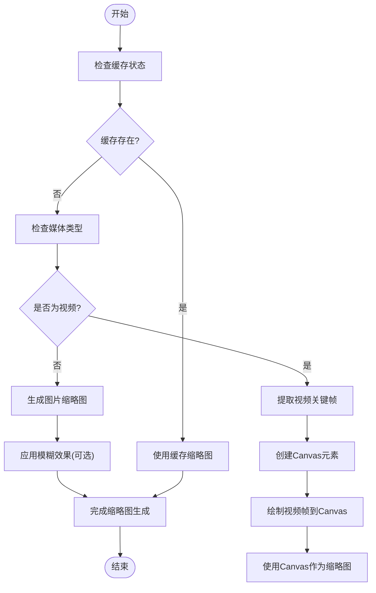
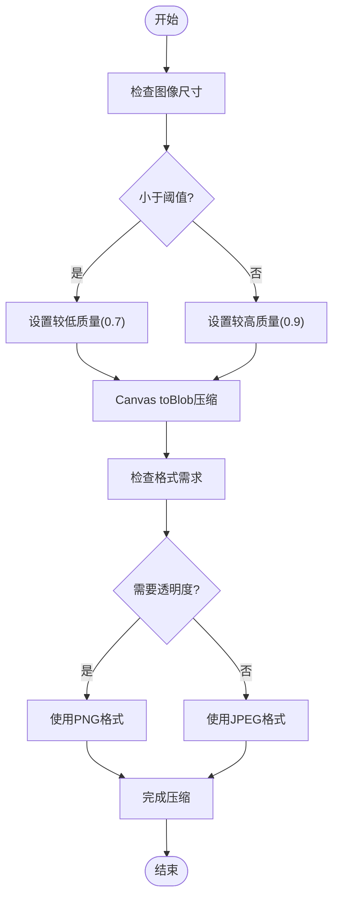
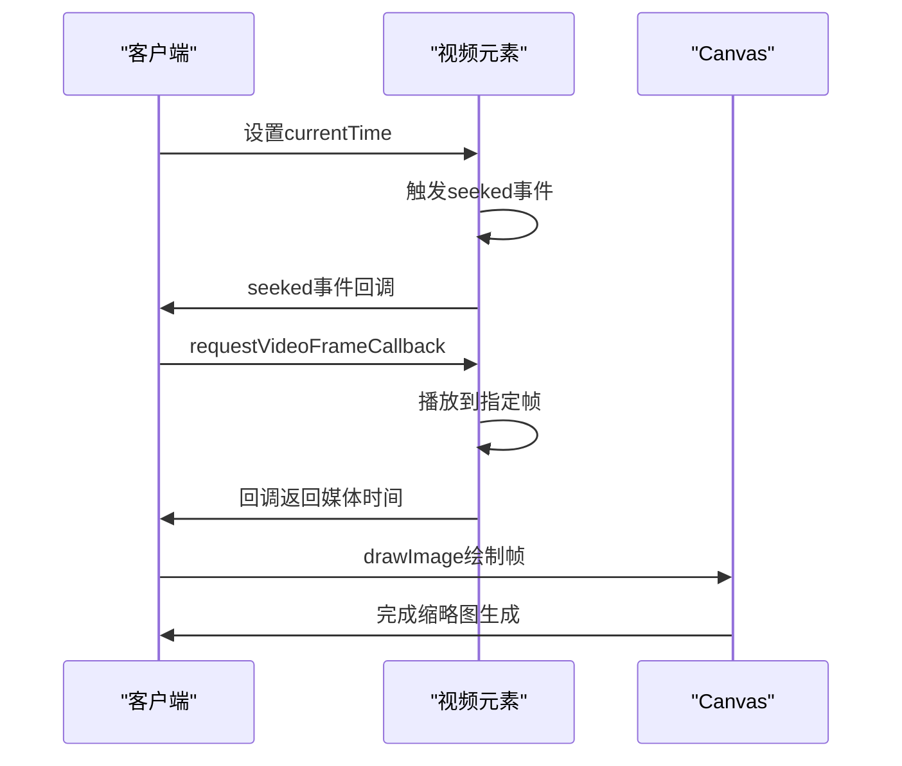
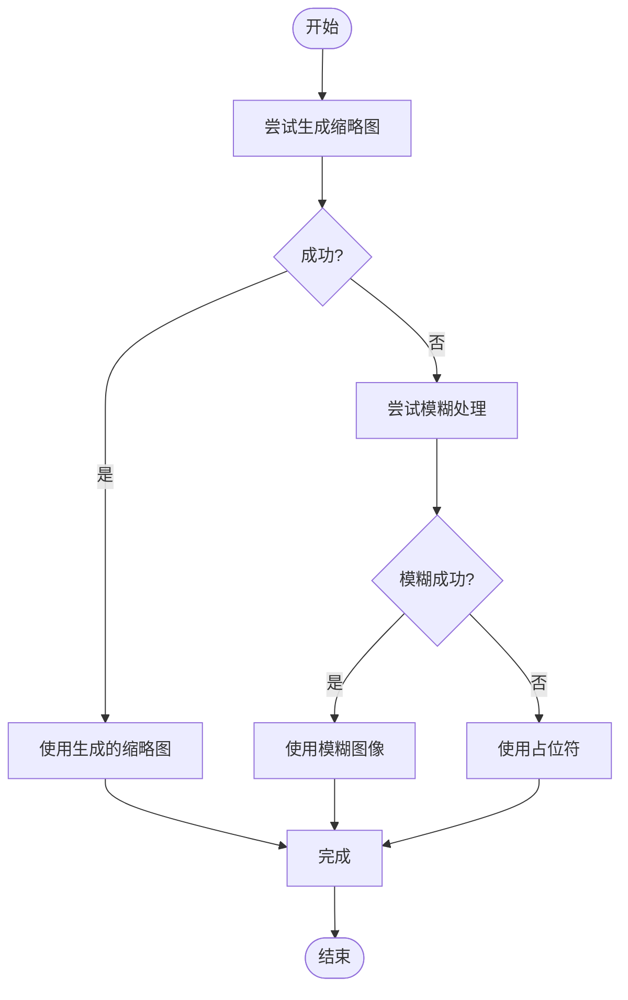

# 缩略图生成

<cite>
**本文档中引用的文件**  
- [getStrippedThumbIfNeeded.ts](file://src\helpers\getStrippedThumbIfNeeded.ts)
- [getImageFromStrippedThumb.ts](file://src\helpers\getImageFromStrippedThumb.ts)
- [getPreviewURLFromThumb.ts](file://src\helpers\getPreviewURLFromThumb.ts)
- [blur.ts](file://src\helpers\blur.ts)
- [mediaSize.ts](file://src\helpers\mediaSize.ts)
- [scaleMediaElement.ts](file://src\helpers\canvas\scaleMediaElement.ts)
- [calcImageInBox.ts](file://src\helpers\calcImageInBox.ts)
- [thumbs.ts](file://src\lib\storages\thumbs.ts)
- [generateEmptyThumb.ts](file://src\lib\storages\utils\thumbs\generateEmptyThumb.ts)
- [getThumbKey.ts](file://src\lib\storages\utils\thumbs\getThumbKey.ts)
- [mtproto_config.ts](file://src\lib\mtproto\mtproto_config.ts)
- [createPoster.ts](file://src\helpers\createPoster.ts)
- [videoToImage.ts](file://src\helpers\dom\videoToImage.ts)
- [renderToActualVideo.ts](file://src\components\mediaEditor\finalRender\renderToActualVideo.ts)
- [appMediaViewerBase.ts](file://src\components\appMediaViewerBase.ts)
</cite>

## 目录
1. [简介](#简介)
2. [缩略图生成策略](#缩略图生成策略)
3. [尺寸计算与分辨率适配](#尺寸计算与分辨率适配)
4. [质量压缩算法](#质量压缩算法)
5. [视频封面帧提取逻辑](#视频封面帧提取逻辑)
6. [缩略图缓存策略](#缩略图缓存策略)
7. [与Telegram服务器的交互协议](#与telegram服务器的交互协议)
8. [错误处理与降级方案](#错误处理与降级方案)

## 简介
本项目实现了一套完整的缩略图生成机制，用于处理图片和视频媒体的预览图生成。系统通过动态计算尺寸、应用质量压缩算法和智能缓存策略，在保证视觉效果的同时优化性能消耗。缩略图生成机制深度集成于媒体处理流程中，支持从原始媒体数据中提取关键信息并生成适合显示的预览图。

**Section sources**
- [getStrippedThumbIfNeeded.ts](file://src\helpers\getStrippedThumbIfNeeded.ts#L1-L66)
- [getImageFromStrippedThumb.ts](file://src\helpers\getImageFromStrippedThumb.ts#L1-L33)

## 缩略图生成策略
缩略图生成机制基于媒体类型和使用场景采用不同的处理策略。对于图片媒体，系统优先使用服务器提供的缩略图数据（如stripped size），若不可用则从原始图片生成；对于视频媒体，系统从指定时间点提取关键帧作为封面。生成过程考虑设备像素比，确保在高DPR设备上显示清晰。

系统通过`getStrippedThumbIfNeeded`函数判断是否需要生成缩略图，该函数检查缓存状态、媒体类型和忽略缓存标志。当需要生成时，调用`getImageFromStrippedThumb`创建缩略图元素，支持模糊效果处理。缩略图元素被标记为"thumbnail"类，便于样式控制。



**Diagram sources**
- [getStrippedThumbIfNeeded.ts](file://src\helpers\getStrippedThumbIfNeeded.ts#L1-L66)
- [getImageFromStrippedThumb.ts](file://src\helpers\getImageFromStrippedThumb.ts#L1-L33)
- [blur.ts](file://src\helpers\blur.ts#L43-L102)

**Section sources**
- [getStrippedThumbIfNeeded.ts](file://src\helpers\getStrippedThumbIfNeeded.ts#L1-L66)
- [getImageFromStrippedThumb.ts](file://src\helpers\getImageFromStrippedThumb.ts#L1-L33)
- [blur.ts](file://src\helpers\blur.ts#L43-L102)

## 尺寸计算与分辨率适配
缩略图尺寸计算采用`calcImageInBox`算法，确保生成的缩略图在指定容器内保持最佳显示效果。算法根据原始媒体宽高比和目标容器宽高比，计算出合适的缩略图尺寸，避免变形或留白。系统定义了`MediaSize`类来封装尺寸数据，并提供`aspectFitted`和`aspectCovered`方法分别实现适应和覆盖模式。

`scaleMediaElement`函数负责实际的尺寸缩放，利用Canvas API进行图像重采样。在支持ImageBitmap的环境中，使用`createImageBitmap`进行硬件加速缩放，提高性能。函数考虑设备像素比(DPR)，在高DPR设备上生成更高分辨率的缩略图，确保显示清晰度。

```mermaid
classDiagram
class MediaSize {
+width : number
+height : number
+aspect(boxSize, fitted) : MediaSize
+aspectFitted(boxSize) : MediaSize
+aspectCovered(boxSize) : MediaSize
}
class calcImageInBox {
+imageW : number
+imageH : number
+boxW : number
+boxH : number
+noZoom : boolean
+return : MediaSize
}
class scaleMediaElement {
+media : CanvasImageSource
+mediaSize : MediaSize
+boxSize : MediaSize
+quality : number
+mimeType : string
+return : Promise~{blob : Blob, size : MediaSize}~
}
MediaSize --> calcImageInBox : "使用"
calcImageInBox --> scaleMediaElement : "输入"
scaleMediaElement --> MediaSize : "输出"
```

**Diagram sources**
- [mediaSize.ts](file://src\helpers\mediaSize.ts#L1-L30)
- [calcImageInBox.ts](file://src\helpers\calcImageInBox.ts#L1-L42)
- [scaleMediaElement.ts](file://src\helpers\canvas\scaleMediaElement.ts#L1-L46)

**Section sources**
- [mediaSize.ts](file://src\helpers\mediaSize.ts#L1-L30)
- [calcImageInBox.ts](file://src\helpers\calcImageInBox.ts#L1-L42)
- [scaleMediaElement.ts](file://src\helpers\canvas\scaleMediaElement.ts#L1-L46)

## 质量压缩算法
质量压缩算法通过Canvas的`toBlob`方法实现，支持JPEG和PNG格式输出。系统默认使用JPEG格式，质量系数可配置，平衡文件大小和视觉质量。对于需要透明背景的图像，使用PNG格式。压缩过程考虑设备像素比，确保在高DPR设备上保持清晰度。

`scaleMediaElement`函数的`quality`参数控制压缩质量，范围0-1。系统采用自适应策略，根据原始图像大小和目标尺寸调整质量系数。对于小尺寸缩略图，适当降低质量以减小文件大小；对于大尺寸预览图，保持较高质量确保视觉效果。



**Diagram sources**
- [scaleMediaElement.ts](file://src\helpers\canvas\scaleMediaElement.ts#L1-L46)

**Section sources**
- [scaleMediaElement.ts](file://src\helpers\canvas\scaleMediaElement.ts#L1-L46)

## 视频封面帧提取逻辑
视频封面帧提取通过`createPosterFromVideo`函数实现，从视频指定时间点提取关键帧作为封面。系统优先尝试从视频开始1秒处提取帧，若失败则回退到视频开头。提取过程使用`requestVideoFrameCallback`API确保在正确的时间点捕获帧数据。

`renderToActualVideo`模块在视频编辑场景中生成缩略图，通过`requestVideoFrameCallback`精确控制帧提取时间。系统在视频处理过程中，当接近预设的缩略图时间点时，将当前帧绘制到专用的缩略图Canvas上。对于未处理的视频，使用`createPosterForVideo`函数异步加载视频并提取封面。



**Diagram sources**
- [createPoster.ts](file://src\helpers\createPoster.ts#L1-L57)
- [renderToActualVideo.ts](file://src\components\mediaEditor\finalRender\renderToActualVideo.ts#L67-L397)
- [videoToImage.ts](file://src\helpers\dom\videoToImage.ts#L1-L17)

**Section sources**
- [createPoster.ts](file://src\helpers\createPoster.ts#L1-L57)
- [renderToActualVideo.ts](file://src\components\mediaEditor\finalRender\renderToActualVideo.ts#L67-L397)
- [videoToImage.ts](file://src\helpers\dom\videoToImage.ts#L1-L17)

## 缩略图缓存策略
缩略图缓存策略通过`ThumbsStorage`类实现，采用内存缓存与跨窗口同步机制。系统为每个媒体对象维护缩略图缓存上下文，包含下载状态、URL和类型信息。缓存键通过`getThumbKey`函数生成，基于媒体类型和唯一标识符。

`ThumbsStorage`维护`thumbsCache`对象，以媒体键为索引存储不同尺寸的缩略图信息。当缩略图URL生成后，通过`setCacheContextURL`更新缓存并触发跨窗口同步。系统使用`generateEmptyThumb`初始化空缓存项，避免重复计算。对于贴纸预览，使用独立的`stickerCachedThumbs`缓存，存储Blob URL和尺寸信息。

```mermaid
classDiagram
class ThumbsStorage {
-thumbsCache : ThumbsCache
-stickerCachedThumbs : StickerCachedThumbs
+getCacheContext(media, thumbSize) : ThumbCache
+setCacheContextURL(media, thumbSize, url) : ThumbCache
+deleteCacheContext(media, thumbSize) : void
+getStickerCachedThumb(docId, toneIndex) : StickerCachedThumb
+saveStickerPreview(docId, blob, width, height, toneIndex) : void
}
class ThumbCache {
+downloaded : number
+url : string
+type : string
}
class ThumbsCache {
[key : string] : {
[size : string] : ThumbCache
}
}
class getThumbKey {
+media : ThumbStorageMedia
+return : string
}
class generateEmptyThumb {
+type : string
+return : ThumbCache
}
ThumbsStorage --> ThumbsCache : "包含"
ThumbsCache --> ThumbCache : "包含"
ThumbsStorage --> getThumbKey : "使用"
ThumbsStorage --> generateEmptyThumb : "使用"
```

**Diagram sources**
- [thumbs.ts](file://src\lib\storages\thumbs.ts#L1-L152)
- [getThumbKey.ts](file://src\lib\storages\utils\thumbs\getThumbKey.ts#L1-L14)
- [generateEmptyThumb.ts](file://src\lib\storages\utils\thumbs\generateEmptyThumb.ts#L1-L5)

**Section sources**
- [thumbs.ts](file://src\lib\storages\thumbs.ts#L1-L152)
- [getThumbKey.ts](file://src\lib\storages\utils\thumbs\getThumbKey.ts#L1-L14)
- [generateEmptyThumb.ts](file://src\lib\storages\utils\thumbs\generateEmptyThumb.ts#L1-L5)

## 与Telegram服务器的交互协议
与Telegram服务器的交互通过MTProto协议实现，缩略图相关信息嵌入在媒体元数据中。服务器在`photo`和`document`对象中提供`thumbs`字段，包含不同尺寸的缩略图信息。`THUMB_TYPE_FULL`常量定义在`mtproto_config.ts`中，表示完整尺寸缩略图。

客户端通过`choosePhotoSize`函数选择合适的缩略图尺寸，根据显示容器大小和设备DPR选择最优的缩略图。对于服务器未提供的缩略图，客户端从原始媒体生成并缓存。系统通过`getPreviewURLFromThumb`函数从缩略图字节数据生成DataURL，避免重复请求服务器。

**Section sources**
- [mtproto_config.ts](file://src\lib\mtproto\mtproto_config.ts#L1-L50)
- [choosePhotoSize.ts](file://src\lib\appManagers\utils\photos\choosePhotoSize.ts#L1-L48)
- [getPreviewURLFromThumb.ts](file://src\helpers\getPreviewURLFromThumb.ts#L1-L18)

## 错误处理与降级方案
缩略图生成机制包含完善的错误处理与降级方案。当缩略图生成失败时，系统提供多种降级选项：使用模糊处理的原始图像、显示占位符或直接显示原始媒体。`getImageFromStrippedThumb`函数在`useBlur`为true时应用模糊效果，作为视觉降级方案。

系统通过`try-catch`捕获异步操作中的错误，如视频帧提取失败或Canvas操作异常。对于关键帧提取失败的情况，回退到视频开头帧。缓存系统在获取失败时返回空URL，避免阻塞UI渲染。`appMediaViewerBase`中的`boxBlurCanvasRGB`函数提供实时模糊效果，作为高质量缩略图的替代方案。



**Diagram sources**
- [getImageFromStrippedThumb.ts](file://src\helpers\getImageFromStrippedThumb.ts#L1-L33)
- [blur.ts](file://src\helpers\blur.ts#L43-L102)
- [appMediaViewerBase.ts](file://src\components\appMediaViewerBase.ts#L1121-L1153)

**Section sources**
- [getImageFromStrippedThumb.ts](file://src\helpers\getImageFromStrippedThumb.ts#L1-L33)
- [blur.ts](file://src\helpers\blur.ts#L43-L102)
- [appMediaViewerBase.ts](file://src\components\appMediaViewerBase.ts#L1121-L1153)