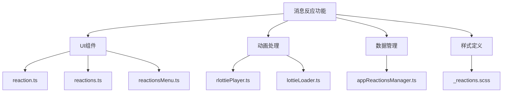
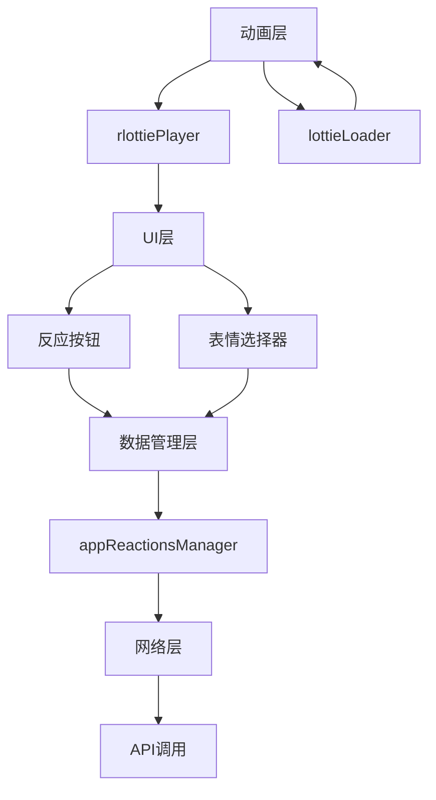
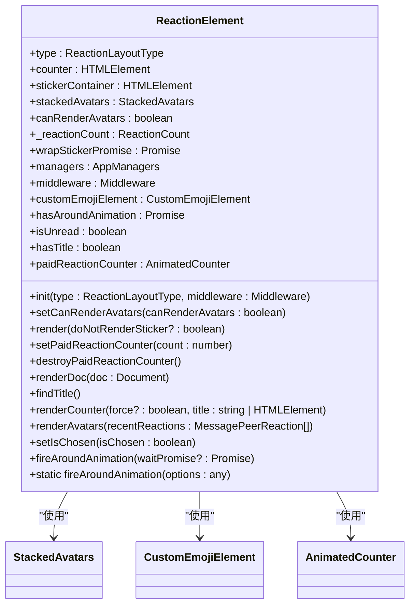
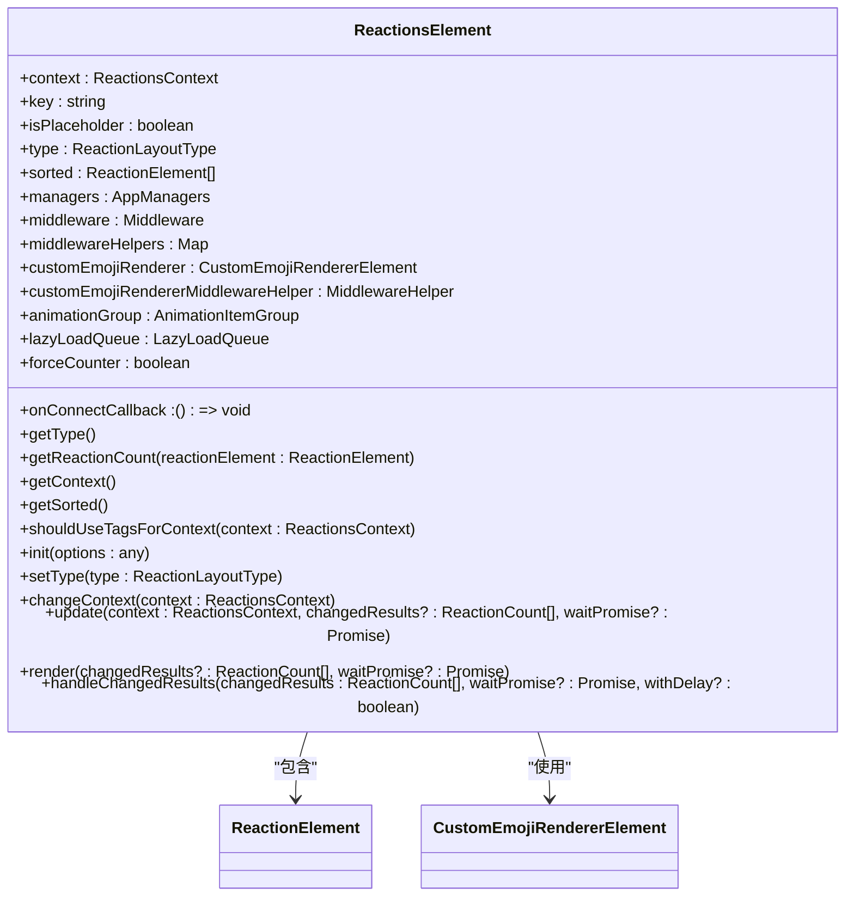
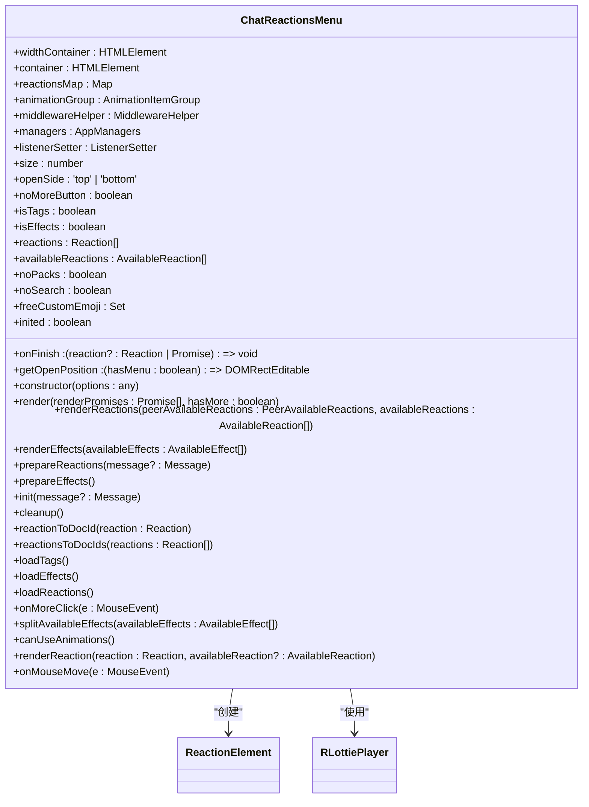
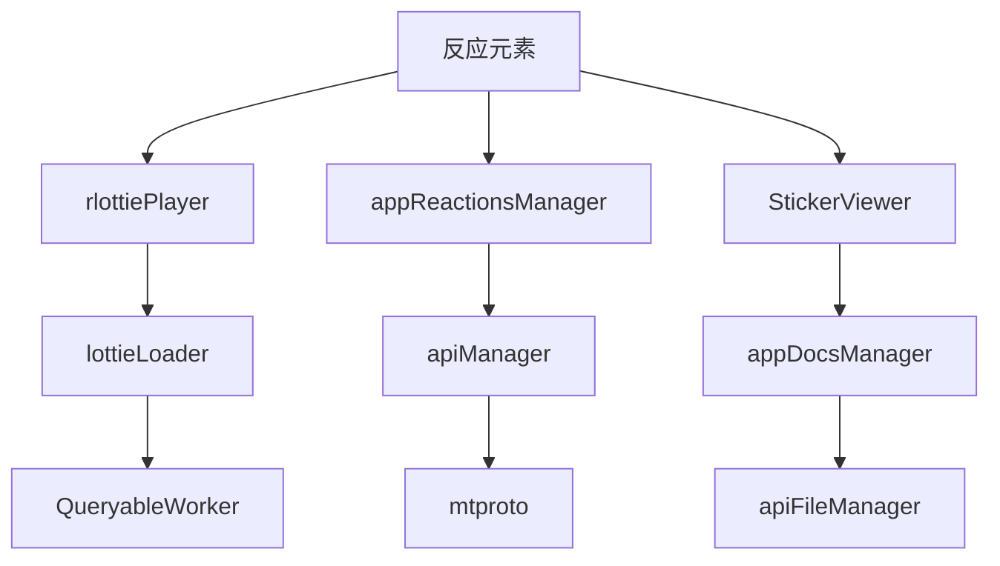

# 消息反应

<cite>
**本文档引用的文件**
- [reaction.ts](file://src/components/chat/reaction.ts)
- [reactions.ts](file://src/components/chat/reactions.ts)
- [reactionsMenu.ts](file://src/components/chat/reactionsMenu.ts)
- [rlottiePlayer.ts](file://src/lib/rlottie/rlottiePlayer.ts)
- [lottieLoader.ts](file://src/lib/rlottie/lottieLoader.ts)
- [appReactionsManager.ts](file://src/lib/appManagers/appReactionsManager.ts)
- [_reactions.scss](file://src/scss/partials/_reactions.scss)
- [bubbles.ts](file://src/components/chat/bubbles.ts)
</cite>

## 目录
1. [简介](#简介)
2. [项目结构](#项目结构)
3. [核心组件](#核心组件)
4. [架构概述](#架构概述)
5. [详细组件分析](#详细组件分析)
6. [依赖分析](#依赖分析)
7. [性能考虑](#性能考虑)
8. [故障排除指南](#故障排除指南)
9. [结论](#结论)

## 简介
本文档详细介绍了Telegram Web客户端中消息反应功能的实现机制。该功能允许用户通过点击反应按钮为消息添加表情符号反应，系统会实时同步反应数据并渲染动画效果。文档深入探讨了表情选择器的UI设计、使用rlottie处理动画的渲染方式、反应数据的存储结构和实时同步机制。同时，文档还说明了不同聊天类型和用户角色的反应权限控制，以及反应数据的本地缓存策略和网络同步机制。通过性能优化方案，如反应动画的懒加载和内存管理，确保了功能的高效运行。

## 项目结构
消息反应功能主要分布在`src/components/chat/`目录下，核心文件包括`reaction.ts`、`reactions.ts`和`reactionsMenu.ts`。动画处理由`src/lib/rlottie/`目录下的`rlottiePlayer.ts`和`lottieLoader.ts`负责。反应数据管理由`src/lib/appManagers/`目录下的`appReactionsManager.ts`实现。样式定义位于`src/scss/partials/_reactions.scss`。这些文件共同构成了消息反应功能的完整实现。

**Diagram sources**
- [reaction.ts](file://src/components/chat/reaction.ts)
- [reactions.ts](file://src/components/chat/reactions.ts)
- [reactionsMenu.ts](file://src/components/chat/reactionsMenu.ts)
- [rlottiePlayer.ts](file://src/lib/rlottie/rlottiePlayer.ts)
- [lottieLoader.ts](file://src/lib/rlottie/lottieLoader.ts)
- [appReactionsManager.ts](file://src/lib/appManagers/appReactionsManager.ts)
- [_reactions.scss](file://src/scss/partials/_reactions.scss)

**Section sources**
- [reaction.ts](file://src/components/chat/reaction.ts)
- [reactions.ts](file://src/components/chat/reactions.ts)
- [reactionsMenu.ts](file://src/components/chat/reactionsMenu.ts)
- [rlottiePlayer.ts](file://src/lib/rlottie/rlottiePlayer.ts)
- [lottieLoader.ts](file://src/lib/rlottie/lottieLoader.ts)
- [appReactionsManager.ts](file://src/lib/appManagers/appReactionsManager.ts)
- [_reactions.scss](file://src/scss/partials/_reactions.scss)

## 核心组件
消息反应功能的核心组件包括反应元素（ReactionElement）、反应集合（ReactionsElement）和反应菜单（ChatReactionsMenu）。这些组件协同工作，实现了从UI交互到数据同步的完整流程。

**Section sources**
- [reaction.ts](file://src/components/chat/reaction.ts)
- [reactions.ts](file://src/components/chat/reactions.ts)
- [reactionsMenu.ts](file://src/components/chat/reactionsMenu.ts)

## 架构概述
消息反应功能的架构分为UI层、动画层、数据管理层和网络层。UI层负责用户交互和界面展示，动画层处理反应动画的渲染，数据管理层管理反应数据的本地存储和状态，网络层负责与服务器的实时同步。

**Diagram sources**
- [reaction.ts](file://src/components/chat/reaction.ts)
- [reactions.ts](file://src/components/chat/reactions.ts)
- [reactionsMenu.ts](file://src/components/chat/reactionsMenu.ts)
- [rlottiePlayer.ts](file://src/lib/rlottie/rlottiePlayer.ts)
- [lottieLoader.ts](file://src/lib/rlottie/lottieLoader.ts)
- [appReactionsManager.ts](file://src/lib/appManagers/appReactionsManager.ts)

## 详细组件分析

### 反应元素分析
反应元素（ReactionElement）是消息反应功能的基本构建块，负责单个反应的显示和交互。

#### 类图

**Diagram sources**
- [reaction.ts](file://src/components/chat/reaction.ts)

**Section sources**
- [reaction.ts](file://src/components/chat/reaction.ts)

### 反应集合分析
反应集合（ReactionsElement）管理一组反应元素，负责它们的布局和状态同步。

#### 类图

**Diagram sources**
- [reactions.ts](file://src/components/chat/reactions.ts)

**Section sources**
- [reactions.ts](file://src/components/chat/reactions.ts)

### 反应菜单分析
反应菜单（ChatReactionsMenu）提供用户选择反应的界面，处理用户交互并触发反应添加。

#### 类图

**Diagram sources**
- [reactionsMenu.ts](file://src/components/chat/reactionsMenu.ts)

**Section sources**
- [reactionsMenu.ts](file://src/components/chat/reactionsMenu.ts)

## 依赖分析
消息反应功能依赖于多个核心模块，包括动画处理、数据管理和UI组件。这些模块通过明确的接口进行交互，确保了功能的模块化和可维护性。

**Diagram sources**
- [reaction.ts](file://src/components/chat/reaction.ts)
- [rlottiePlayer.ts](file://src/lib/rlottie/rlottiePlayer.ts)
- [appReactionsManager.ts](file://src/lib/appManagers/appReactionsManager.ts)
- [lottieLoader.ts](file://src/lib/rlottie/lottieLoader.ts)

**Section sources**
- [reaction.ts](file://src/components/chat/reaction.ts)
- [rlottiePlayer.ts](file://src/lib/rlottie/rlottiePlayer.ts)
- [appReactionsManager.ts](file://src/lib/appManagers/appReactionsManager.ts)
- [lottieLoader.ts](file://src/lib/rlottie/lottieLoader.ts)

## 性能考虑
消息反应功能在性能方面进行了多项优化，包括动画的懒加载、内存管理和渲染优化。通过使用rlottie的缓存机制和Web Worker，确保了动画的流畅播放，同时减少了主线程的负担。

**Section sources**
- [rlottiePlayer.ts](file://src/lib/rlottie/rlottiePlayer.ts)
- [lottieLoader.ts](file://src/lib/rlottie/lottieLoader.ts)

## 故障排除指南
在使用消息反应功能时，可能会遇到动画不播放、反应不显示或同步失败等问题。这些问题通常与网络连接、浏览器兼容性或资源加载有关。建议检查网络状态、清除浏览器缓存或尝试在不同浏览器中使用。

**Section sources**
- [rlottiePlayer.ts](file://src/lib/rlottie/rlottiePlayer.ts)
- [appReactionsManager.ts](file://src/lib/appManagers/appReactionsManager.ts)

## 结论
消息反应功能通过精心设计的架构和优化的实现，为用户提供了一个流畅、直观的交互体验。从UI设计到动画渲染，再到数据同步，每个环节都经过了细致的考虑和实现。未来可以通过进一步优化动画性能和扩展反应类型来提升用户体验。