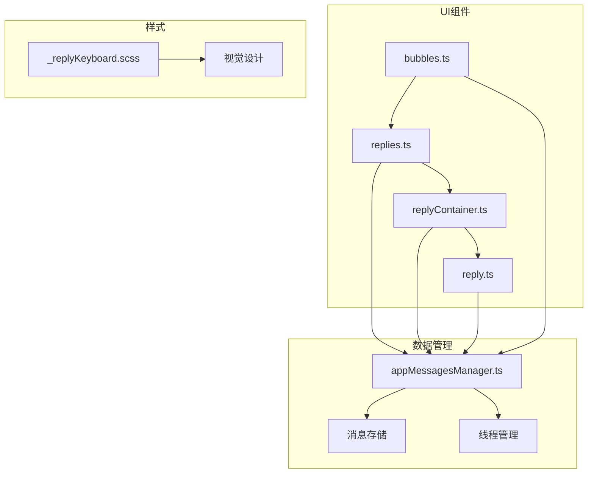
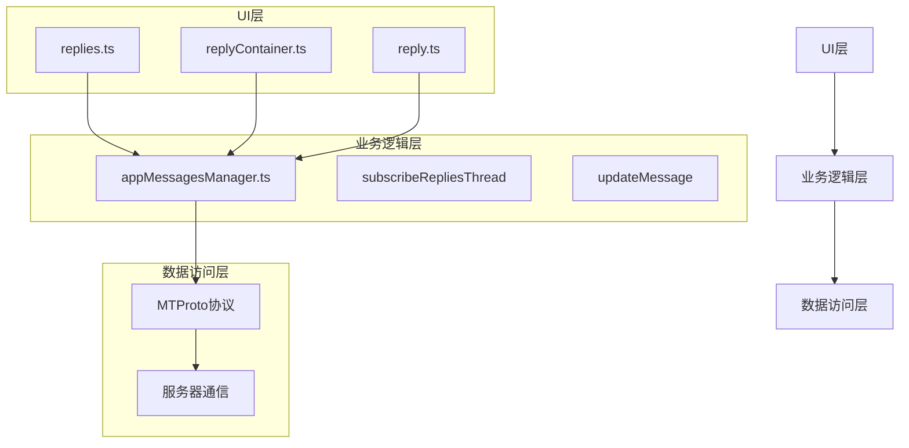
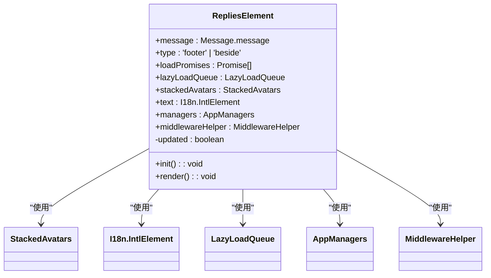
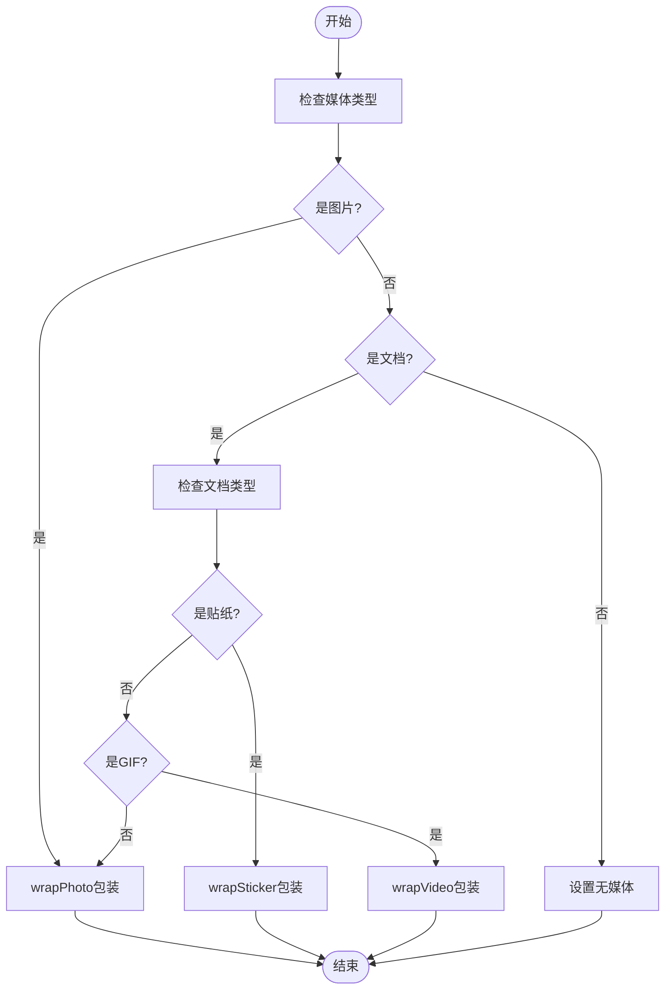
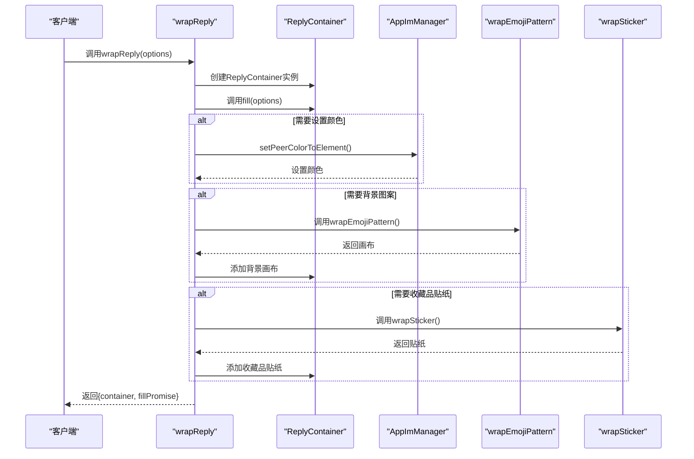
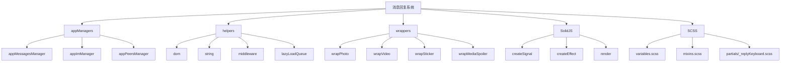

# 消息回复

<cite>
**本文档引用的文件**   
- [replies.ts](file://src/components/chat/replies.ts)
- [replyContainer.ts](file://src/components/chat/replyContainer.ts)
- [reply.ts](file://src/components/wrappers/reply.ts)
- [bubbles.ts](file://src/components/chat/bubbles.ts)
- [appMessagesManager.ts](file://src/lib/appManagers/appMessagesManager.ts)
- [bubbleParts/adminLogsResolver/reply.tsx](file://src/components/chat/bubbleParts/adminLogsResolver/reply.tsx)
</cite>

## 目录
1. [简介](#简介)
2. [项目结构](#项目结构)
3. [核心组件](#核心组件)
4. [架构概述](#架构概述)
5. [详细组件分析](#详细组件分析)
6. [依赖分析](#依赖分析)
7. [性能考虑](#性能考虑)
8. [故障排除指南](#故障排除指南)
9. [结论](#结论)

## 简介
本文档全面阐述了Telegram Web客户端中消息回复功能的实现。该功能支持两种模式：单条消息回复和话题线程回复，为用户提供灵活的对话管理能力。系统通过清晰的视觉设计展示回复关系，确保用户能够直观地理解对话上下文。在数据存储方面，系统采用高效的数据库设计来维护回复链的完整性和一致性。权限控制机制根据用户角色和聊天类型动态调整回复权限，保障了不同场景下的安全性和功能性。此外，系统还实现了强大的搜索和查找功能，使用户能够快速定位特定的回复消息。为了优化性能，系统采用了懒加载和内存管理策略，确保在处理大量回复消息时仍能保持流畅的用户体验。

## 项目结构
消息回复功能的实现分布在多个组件和模块中，形成了一个层次分明、职责清晰的架构。核心功能主要集中在`src/components/chat`目录下，其中`replies.ts`文件负责处理回复的显示和更新逻辑，`replyContainer.ts`管理回复内容的包装和渲染，而`reply.ts`则提供了回复的通用包装功能。这些组件与`bubbles.ts`中的消息气泡系统紧密集成，确保回复能够正确地显示在消息流中。在数据管理层，`appMessagesManager.ts`提供了订阅回复线程和更新消息的核心API，实现了客户端与服务器之间的实时同步。视觉设计方面，SCSS样式文件定义了回复元素的外观和交互效果，确保了一致的用户体验。整个系统通过事件驱动的方式进行通信，`rootScope`作为全局事件总线，协调各个组件之间的状态更新。

**Diagram sources**
- [replies.ts](file://src/components/chat/replies.ts#L1-L157)
- [replyContainer.ts](file://src/components/chat/replyContainer.ts#L1-L234)
- [reply.ts](file://src/components/wrappers/reply.ts#L1-L123)
- [bubbles.ts](file://src/components/chat/bubbles.ts#L1-L10306)
- [appMessagesManager.ts](file://src/lib/appManagers/appMessagesManager.ts#L1-L12000)

**Section sources**
- [replies.ts](file://src/components/chat/replies.ts#L1-L157)
- [replyContainer.ts](file://src/components/chat/replyContainer.ts#L1-L234)
- [reply.ts](file://src/components/wrappers/reply.ts#L1-L123)

## 核心组件
消息回复系统的核心组件包括回复元素管理、回复容器和回复包装器。`RepliesElement`类负责管理回复的显示状态，它通过监听`replies_updated`事件来实时更新界面。该组件支持两种显示模式：页脚模式和旁边模式，分别用于显示回复统计信息和具体的回复内容。`ReplyContainer`类作为回复内容的容器，负责处理媒体内容的包装和渲染，支持图片、视频、贴纸等多种媒体类型。它通过`wrapReplyDivAndCaption`函数实现内容的异步加载和渲染，确保了界面的流畅性。`wrapReply`函数提供了通用的回复包装功能，支持设置颜色、高亮和边框等视觉属性，使回复消息在界面中更加突出。这些组件共同构成了消息回复功能的基础，为用户提供了一致且直观的交互体验。

**Section sources**
- [replies.ts](file://src/components/chat/replies.ts#L30-L157)
- [replyContainer.ts](file://src/components/chat/replyContainer.ts#L202-L234)
- [reply.ts](file://src/components/wrappers/reply.ts#L33-L123)

## 架构概述
消息回复系统的架构采用分层设计，分为UI层、业务逻辑层和数据访问层。UI层由`replies.ts`、`replyContainer.ts`和`reply.ts`等组件构成，负责处理用户界面的显示和交互。业务逻辑层主要由`appMessagesManager.ts`中的方法组成，负责处理回复的订阅、更新和同步逻辑。数据访问层则通过MTProto协议与Telegram服务器进行通信，获取和发送回复相关的数据。系统通过事件驱动的方式进行组件间的通信，`rootScope`作为全局事件总线，发布和订阅各种状态变化事件。这种架构设计使得各层之间的耦合度降低，提高了代码的可维护性和可扩展性。同时，异步加载和懒加载策略的应用，确保了系统在处理大量数据时仍能保持良好的性能表现。

**Diagram sources**
- [replies.ts](file://src/components/chat/replies.ts#L1-L157)
- [replyContainer.ts](file://src/components/chat/replyContainer.ts#L1-L234)
- [reply.ts](file://src/components/wrappers/reply.ts#L1-L123)
- [appMessagesManager.ts](file://src/lib/appManagers/appMessagesManager.ts#L1-L12000)

## 详细组件分析
### 回复元素分析
`RepliesElement`类是消息回复功能的核心UI组件，它继承自`HTMLElement`，实现了自定义的Web组件。该组件通过`init`方法初始化，设置数据键和CSS类名。`render`方法负责根据消息的回复信息更新界面显示，包括回复数量、最近回复者头像和未读状态指示。组件支持两种显示模式：页脚模式显示在消息底部，包含回复统计和最近回复者头像；旁边模式显示在消息旁边，仅显示回复数量。组件通过`middlewareHelper`管理生命周期，确保在组件销毁时正确清理资源。`loadPromises`数组用于跟踪异步加载任务，确保所有资源加载完成后才更新界面。

**Diagram sources**
- [replies.ts](file://src/components/chat/replies.ts#L30-L157)

**Section sources**
- [replies.ts](file://src/components/chat/replies.ts#L30-L157)

### 回复容器分析
`ReplyContainer`类负责管理回复内容的包装和渲染，它继承自`DivAndCaption`基类。该类通过`wrapReplyDivAndCaption`函数实现内容的异步加载和渲染，支持标题、副标题和媒体内容的包装。函数接受一个包含消息、媒体元素、中间件等参数的选项对象，根据消息类型选择合适的包装策略。对于图片和视频，使用`wrapPhoto`和`wrapVideo`函数进行包装；对于贴纸，使用`wrapSticker`函数。媒体内容的尺寸被限制为32x32像素，确保了界面的一致性。函数还处理了敏感内容的模糊显示，通过`wrapMediaSpoiler`函数添加模糊效果。所有异步加载任务都被添加到`loadPromises`数组中，确保在所有资源加载完成后才更新界面。

**Diagram sources**
- [replyContainer.ts](file://src/components/chat/replyContainer.ts#L202-L234)

**Section sources**
- [replyContainer.ts](file://src/components/chat/replyContainer.ts#L29-L200)

### 回复包装器分析
`wrapReply`函数提供了通用的回复包装功能，它接受一个包含各种选项的参数对象，返回一个包含容器和填充承诺的包装结果。函数首先创建一个`ReplyContainer`实例，然后调用其`fill`方法填充内容。包装器支持设置颜色、高亮和边框等视觉属性，通过`appImManager.setPeerColorToElement`函数将用户颜色应用到回复容器。对于收藏品颜色，使用`wrapEmojiPattern`函数添加背景图案，并通过`wrapSticker`函数添加收藏品贴纸。包装器还处理了引用和故事过期等特殊场景，通过添加相应的CSS类名来调整显示效果。所有异步操作都通过中间件进行管理，确保在组件销毁时正确清理资源。

**Diagram sources**
- [reply.ts](file://src/components/wrappers/reply.ts#L33-L123)

**Section sources**
- [reply.ts](file://src/components/wrappers/reply.ts#L33-L123)

## 依赖分析
消息回复系统依赖于多个核心模块和外部库，形成了一个复杂的依赖网络。主要依赖包括`appManagers`模块，提供消息管理、用户管理和会话管理等功能；`helpers`模块，提供各种实用函数，如DOM操作、字符串处理和异步控制；`wrappers`模块，提供各种内容包装功能，如图片、视频和贴纸的包装。系统还依赖于SolidJS框架，用于实现响应式UI和组件化开发。在样式方面，系统使用SCSS进行样式管理，通过变量和混合宏实现样式的复用和维护。这些依赖关系通过TypeScript的模块系统进行管理，确保了类型安全和代码的可维护性。

**Diagram sources**
- [replies.ts](file://src/components/chat/replies.ts#L1-L157)
- [replyContainer.ts](file://src/components/chat/replyContainer.ts#L1-L234)
- [reply.ts](file://src/components/wrappers/reply.ts#L1-L123)
- [bubbles.ts](file://src/components/chat/bubbles.ts#L1-L10306)

**Section sources**
- [replies.ts](file://src/components/chat/replies.ts#L1-L157)
- [replyContainer.ts](file://src/components/chat/replyContainer.ts#L1-L234)
- [reply.ts](file://src/components/wrappers/reply.ts#L1-L123)

## 性能考虑
消息回复系统的性能优化主要体现在以下几个方面：首先，系统采用了懒加载策略，通过`LazyLoadQueue`管理媒体资源的异步加载，避免了页面加载时的性能瓶颈。其次，系统使用了虚拟滚动技术，只渲染可见区域的消息，大大减少了DOM元素的数量，提高了滚动性能。第三，系统通过事件节流和防抖技术，减少了频繁的状态更新对性能的影响。第四，系统使用了Web Worker进行后台计算，避免了主线程的阻塞。最后，系统通过缓存机制，避免了重复的数据获取和计算，提高了响应速度。这些优化措施共同确保了系统在处理大量消息时仍能保持流畅的用户体验。

## 故障排除指南
在使用消息回复功能时，可能会遇到一些常见问题。如果回复消息无法显示，首先检查网络连接是否正常，然后确认服务器是否返回了正确的回复数据。如果回复显示异常，检查浏览器控制台是否有JavaScript错误，确认相关组件是否正确加载。如果回复加载缓慢，检查网络带宽和服务器响应时间，确认是否需要优化懒加载策略。如果回复权限异常，检查用户角色和聊天类型设置，确认权限控制逻辑是否正确。对于调试，可以使用浏览器的开发者工具，查看网络请求和DOM结构，定位问题根源。此外，系统提供了详细的日志记录，可以通过`logger`模块查看运行时状态，帮助诊断问题。

**Section sources**
- [replies.ts](file://src/components/chat/replies.ts#L23-L28)
- [appMessagesManager.ts](file://src/lib/appManagers/appMessagesManager.ts#L5404-L5434)

## 结论
本文档全面阐述了Telegram Web客户端中消息回复功能的实现。该功能通过清晰的架构设计和高效的实现策略，为用户提供了一个强大且易用的对话管理工具。系统采用分层架构，将UI、业务逻辑和数据访问分离，提高了代码的可维护性和可扩展性。通过事件驱动的方式进行组件间通信，确保了状态的一致性和实时性。性能优化方面，系统采用了懒加载、虚拟滚动和缓存等策略，确保了在处理大量数据时的流畅体验。未来，可以进一步优化回复链的加载策略，支持更复杂的搜索和过滤功能，提升用户的交互体验。