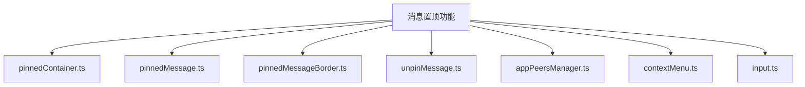
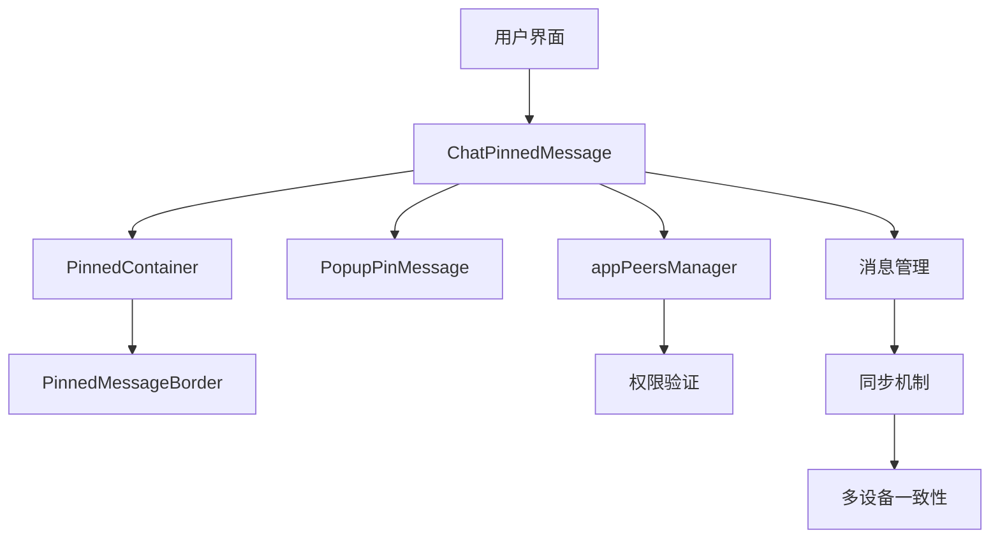
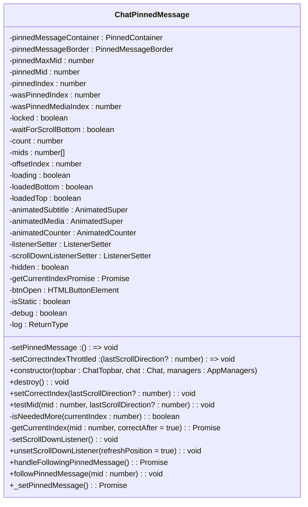
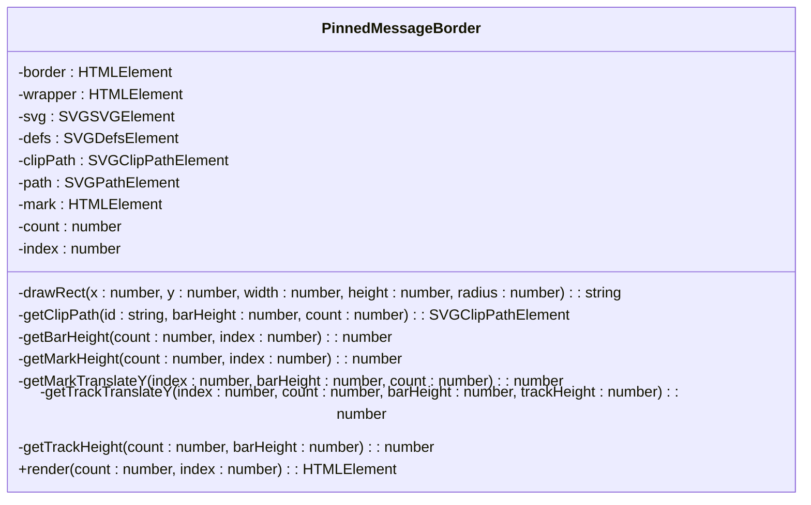
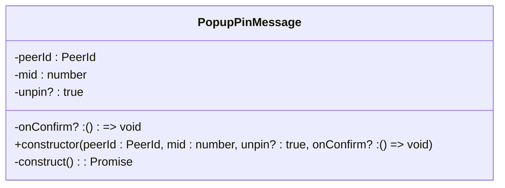
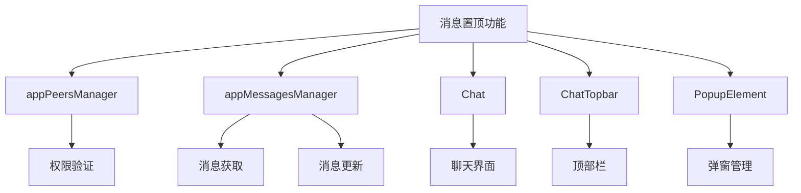

# 消息置顶

<cite>
**本文档引用的文件**
- [pinnedContainer.ts](file://src/components/chat/pinnedContainer.ts)
- [pinnedMessage.ts](file://src/components/chat/pinnedMessage.ts)
- [pinnedMessageBorder.ts](file://src/components/chat/pinnedMessageBorder.ts)
- [unpinMessage.ts](file://src/components/popups/unpinMessage.ts)
- [appPeersManager.ts](file://src/lib/appManagers/appPeersManager.ts)
- [contextMenu.ts](file://src/components/chat/contextMenu.ts)
- [input.ts](file://src/components/chat/input.ts)
</cite>

## 目录
1. [简介](#简介)
2. [项目结构](#项目结构)
3. [核心组件](#核心组件)
4. [架构概述](#架构概述)
5. [详细组件分析](#详细组件分析)
6. [依赖分析](#依赖分析)
7. [性能考虑](#性能考虑)
8. [故障排除指南](#故障排除指南)
9. [结论](#结论)
10. [附录](#附录)（如有必要）

## 简介
本文档全面阐述了消息置顶功能的实现，包括置顶消息的存储结构、UI显示方式、权限控制机制、同步机制和交互设计。文档详细解释了置顶消息在聊天界面顶部的显示逻辑，如何处理多条置顶消息的展示，以及置顶操作的权限验证。同时，文档还提供了性能优化建议，如置顶消息的快速加载和内存管理策略。

## 项目结构
消息置顶功能主要由以下几个核心组件构成，这些组件位于`src/components/chat`目录下：



**Diagram sources**
- [pinnedContainer.ts](file://src/components/chat/pinnedContainer.ts)
- [pinnedMessage.ts](file://src/components/chat/pinnedMessage.ts)
- [pinnedMessageBorder.ts](file://src/components/chat/pinnedMessageBorder.ts)
- [unpinMessage.ts](file://src/components/popups/unpinMessage.ts)
- [appPeersManager.ts](file://src/lib/appManagers/appPeersManager.ts)
- [contextMenu.ts](file://src/components/chat/contextMenu.ts)
- [input.ts](file://src/components/chat/input.ts)

**Section sources**
- [pinnedContainer.ts](file://src/components/chat/pinnedContainer.ts)
- [pinnedMessage.ts](file://src/components/chat/pinnedMessage.ts)
- [pinnedMessageBorder.ts](file://src/components/chat/pinnedMessageBorder.ts)
- [unpinMessage.ts](file://src/components/popups/unpinMessage.ts)
- [appPeersManager.ts](file://src/lib/appManagers/appPeersManager.ts)
- [contextMenu.ts](file://src/components/chat/contextMenu.ts)
- [input.ts](file://src/components/chat/input.ts)

## 核心组件
消息置顶功能的核心组件包括`PinnedContainer`、`ChatPinnedMessage`、`PinnedMessageBorder`和`PopupPinMessage`。这些组件协同工作，实现了置顶消息的显示、交互和管理。

**Section sources**
- [pinnedContainer.ts](file://src/components/chat/pinnedContainer.ts)
- [pinnedMessage.ts](file://src/components/chat/pinnedMessage.ts)
- [pinnedMessageBorder.ts](file://src/components/chat/pinnedMessageBorder.ts)
- [unpinMessage.ts](file://src/components/popups/unpinMessage.ts)

## 架构概述
消息置顶系统的架构如下图所示：



**Diagram sources**
- [pinnedContainer.ts](file://src/components/chat/pinnedContainer.ts)
- [pinnedMessage.ts](file://src/components/chat/pinnedMessage.ts)
- [pinnedMessageBorder.ts](file://src/components/chat/pinnedMessageBorder.ts)
- [unpinMessage.ts](file://src/components/popups/unpinMessage.ts)
- [appPeersManager.ts](file://src/lib/appManagers/appPeersManager.ts)

## 详细组件分析

### PinnedContainer 分析
`PinnedContainer`组件负责管理置顶消息的容器，包括显示、隐藏和关闭操作。

```mermaid
classDiagram
class PinnedContainer {
+wrapperUtils : HTMLElement
+btnClose : HTMLElement
+container : HTMLElement
+wrapper : HTMLElement
+topbar? : ChatTopbar
+chat : Chat
+listenerSetter : ListenerSetter
+className : string
+divAndCaption : DivAndCaption<(options : WrapPinnedContainerOptions) => void>
+floating : boolean
+onClose? : () => void | Promise<boolean>
+height : number | 'auto'
+constructor(options : {topbar : PinnedContainer['topbar'], chat : PinnedContainer['chat'], listenerSetter : PinnedContainer['listenerSetter'], className : PinnedContainer['className'], divAndCaption? : PinnedContainer['divAndCaption'], onClose? : PinnedContainer['onClose'], floating? : PinnedContainer['floating'], height : number | 'auto'})
+destroy() : void
+attachOnCloseEvent(elem : HTMLElement) : void
+toggle(hide? : boolean) : void
+isVisible() : boolean
+isFloating() : boolean
+fill(options : WrapPinnedContainerOptions) : void
}
```

**Diagram sources**
- [pinnedContainer.ts](file://src/components/chat/pinnedContainer.ts#L30-L152)

**Section sources**
- [pinnedContainer.ts](file://src/components/chat/pinnedContainer.ts#L1-L152)

### ChatPinnedMessage 分析
`ChatPinnedMessage`组件是消息置顶功能的核心，负责管理置顶消息的显示、滚动和交互。



**Diagram sources**
- [pinnedMessage.ts](file://src/components/chat/pinnedMessage.ts#L33-L482)

**Section sources**
- [pinnedMessage.ts](file://src/components/chat/pinnedMessage.ts#L1-L482)

### PinnedMessageBorder 分析
`PinnedMessageBorder`组件负责绘制置顶消息的边框和指示器，用于显示多条置顶消息的状态。



**Diagram sources**
- [pinnedMessageBorder.ts](file://src/components/chat/pinnedMessageBorder.ts#L15-L205)

**Section sources**
- [pinnedMessageBorder.ts](file://src/components/chat/pinnedMessageBorder.ts#L1-L205)

### PopupPinMessage 分析
`PopupPinMessage`组件负责处理置顶和取消置顶消息的弹窗操作。



**Diagram sources**
- [unpinMessage.ts](file://src/components/popups/unpinMessage.ts#L13-L125)

**Section sources**
- [unpinMessage.ts](file://src/components/popups/unpinMessage.ts#L1-L125)

## 依赖分析
消息置顶功能依赖于多个核心模块，包括权限管理、消息管理和用户界面组件。



**Diagram sources**
- [appPeersManager.ts](file://src/lib/appManagers/appPeersManager.ts)
- [pinnedMessage.ts](file://src/components/chat/pinnedMessage.ts)
- [unpinMessage.ts](file://src/components/popups/unpinMessage.ts)

**Section sources**
- [appPeersManager.ts](file://src/lib/appManagers/appPeersManager.ts)
- [pinnedMessage.ts](file://src/components/chat/pinnedMessage.ts)
- [unpinMessage.ts](file://src/components/popups/unpinMessage.ts)

## 性能考虑
消息置顶功能在设计时考虑了性能优化，包括：

1. **懒加载**：置顶消息在需要时才加载，避免一次性加载所有消息。
2. **节流和防抖**：使用`throttle`和`debounce`函数来优化频繁的滚动和更新操作。
3. **内存管理**：及时销毁不再需要的组件和监听器，避免内存泄漏。
4. **异步操作**：将耗时的操作（如网络请求）放在异步队列中执行，避免阻塞主线程。

**Section sources**
- [pinnedMessage.ts](file://src/components/chat/pinnedMessage.ts)
- [helpers/schedulers](file://src/helpers/schedulers)

## 故障排除指南
在使用消息置顶功能时，可能会遇到以下问题：

1. **置顶消息不显示**：检查用户是否有置顶消息的权限，以及聊天界面是否正确初始化。
2. **多条置顶消息显示异常**：检查`PinnedMessageBorder`组件的`render`方法是否正确处理了多条消息的显示逻辑。
3. **置顶操作失败**：检查网络连接和权限验证，确保用户有权限执行置顶操作。

**Section sources**
- [pinnedMessage.ts](file://src/components/chat/pinnedMessage.ts)
- [unpinMessage.ts](file://src/components/popups/unpinMessage.ts)
- [appPeersManager.ts](file://src/lib/appManagers/appPeersManager.ts)

## 结论
消息置顶功能通过`PinnedContainer`、`ChatPinnedMessage`、`PinnedMessageBorder`和`PopupPinMessage`等组件的协同工作，实现了置顶消息的显示、交互和管理。该功能在设计时充分考虑了性能优化和用户体验，确保了多设备间的一致性和高效性。

## 附录
### 置顶消息的存储结构
置顶消息的存储结构如下：

```typescript
interface WrapPinnedContainerOptions {
  title: string | HTMLElement | DocumentFragment;
  subtitle?: WrapPinnedContainerOptions['title'];
  message?: Message.message | Message.messageService;
  storyItem?: StoryItem.storyItem;
  isChatSensitive?: boolean;
}
```

### 置顶消息的UI显示方式
置顶消息在聊天界面顶部显示，包含标题、副标题和内容。多条置顶消息通过`PinnedMessageBorder`组件的边框和指示器进行区分。

### 置顶操作的权限控制
置顶操作的权限控制通过`appPeersManager.canPinMessage`方法实现，只有具有相应权限的用户才能执行置顶操作。

### 置顶消息的同步机制
置顶消息的同步机制通过`appMessagesManager`的`getHistory`和`getPinnedMessage`方法实现，确保多设备间的一致性。

### 置顶消息的交互设计
置顶消息的交互设计包括点击置顶消息跳转到原消息位置、通过弹窗进行置顶和取消置顶操作等。