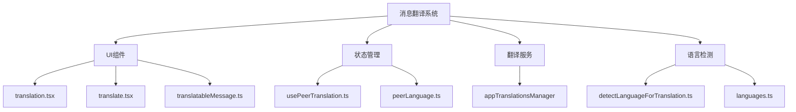
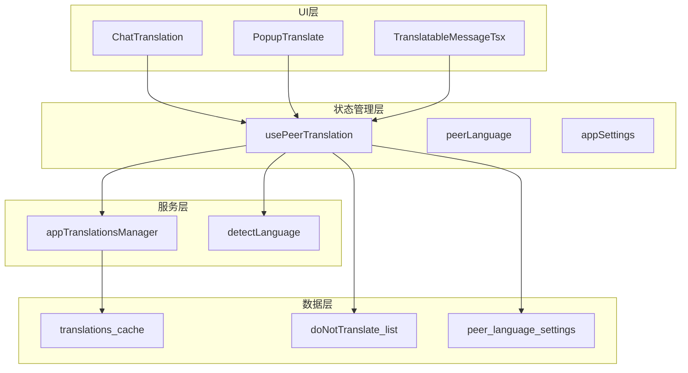
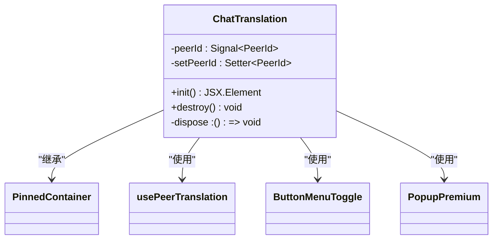
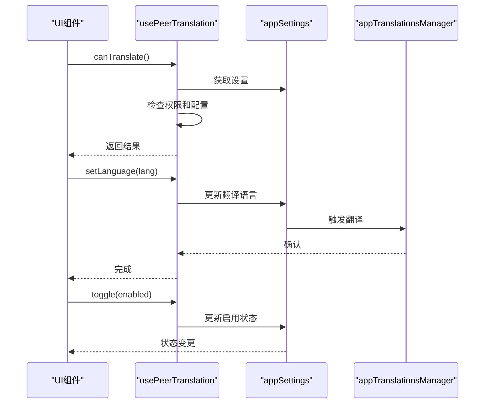
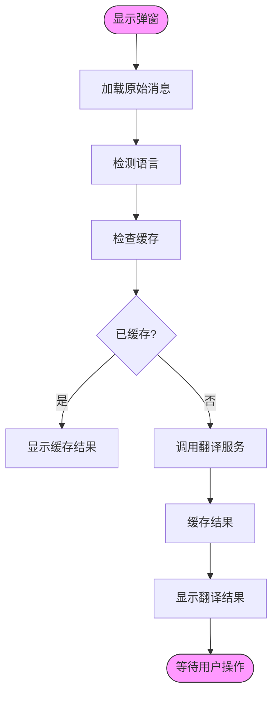
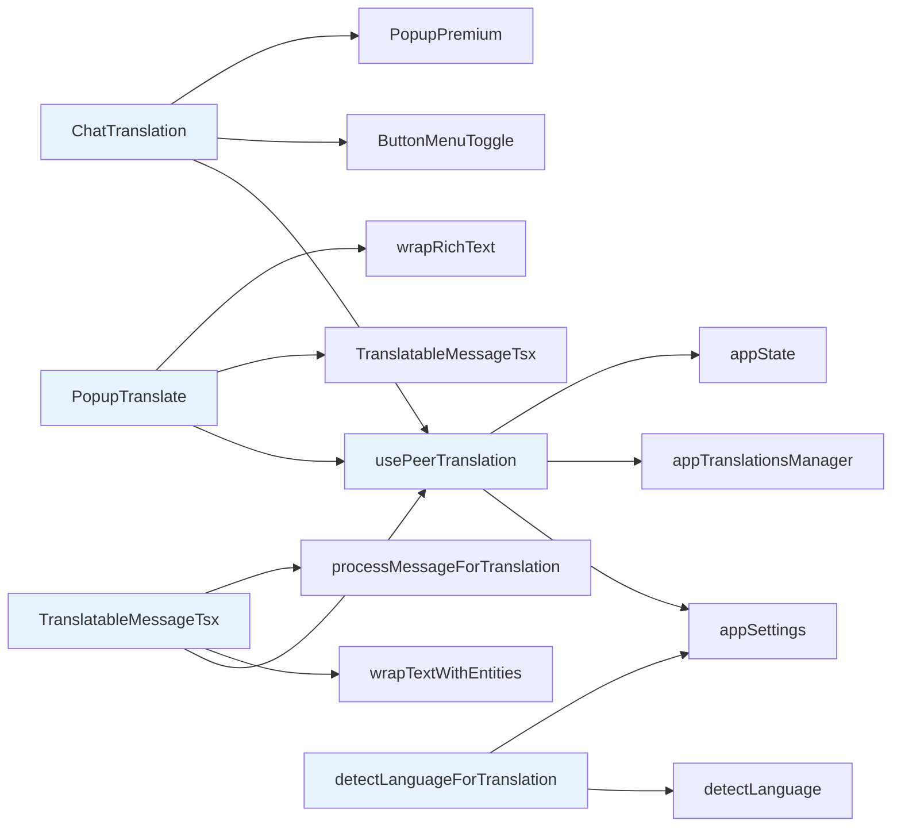

# 消息翻译

<cite>
**本文档引用的文件**  
- [translation.tsx](file://src/components/chat/translation.tsx)
- [usePeerTranslation.ts](file://src/hooks/usePeerTranslation.ts)
- [translate.tsx](file://src/components/popups/translate.tsx)
- [languages.ts](file://src/lib/tinyld/languages.ts)
- [detectLanguageForTranslation.ts](file://src/helpers/detectLanguageForTranslation.ts)
- [translatableMessage.ts](file://src/components/translatableMessage.ts)
- [_translate.scss](file://src/scss/partials/popups/_translate.scss)
</cite>

## 目录
1. [简介](#简介)
2. [项目结构](#项目结构)
3. [核心组件](#核心组件)
4. [架构概述](#架构概述)
5. [详细组件分析](#详细组件分析)
6. [依赖分析](#依赖分析)
7. [性能考虑](#性能考虑)
8. [故障排除指南](#故障排除指南)
9. [结论](#结论)

## 简介
本文档详细描述了消息翻译功能的实现机制，包括语言自动检测、翻译服务集成、缓存策略、用户界面交互流程、权限控制、错误处理和性能优化方案。系统基于 SolidJS 框架构建，采用模块化设计，支持多语言自动检测和翻译。

## 项目结构
消息翻译功能主要分布在 `src/components/chat`、`src/hooks` 和 `src/components/popups` 目录中。核心逻辑由多个组件协同工作，包括翻译按钮、翻译弹窗、语言选择器和翻译状态管理。

**Diagram sources**
- [translation.tsx](file://src/components/chat/translation.tsx)
- [usePeerTranslation.ts](file://src/hooks/usePeerTranslation.ts)
- [translate.tsx](file://src/components/popups/translate.tsx)
- [languages.ts](file://src/lib/tinyld/languages.ts)
- [detectLanguageForTranslation.ts](file://src/helpers/detectLanguageForTranslation.ts)

**Section sources**
- [translation.tsx](file://src/components/chat/translation.tsx)
- [usePeerTranslation.ts](file://src/hooks/usePeerTranslation.ts)

## 核心组件
消息翻译功能的核心组件包括翻译容器、翻译弹窗和可翻译消息组件。这些组件协同工作，提供完整的翻译体验，从语言检测到结果展示。

**Section sources**
- [translation.tsx](file://src/components/chat/translation.tsx)
- [translate.tsx](file://src/components/popups/translate.tsx)
- [translatableMessage.ts](file://src/components/translatableMessage.ts)

## 架构概述
系统采用分层架构，分为UI层、状态管理层、服务层和数据层。UI层负责用户交互，状态管理层管理翻译状态，服务层处理翻译请求，数据层存储配置和缓存。

**Diagram sources**
- [translation.tsx](file://src/components/chat/translation.tsx)
- [usePeerTranslation.ts](file://src/hooks/usePeerTranslation.ts)
- [translate.tsx](file://src/components/popups/translate.tsx)
- [translatableMessage.ts](file://src/components/translatableMessage.ts)

## 详细组件分析

### ChatTranslation 分析
ChatTranslation 组件是消息翻译功能的主要入口，作为固定容器显示在聊天界面顶部。它提供翻译开关和菜单，控制整个聊天的翻译状态。

**Diagram sources**
- [translation.tsx](file://src/components/chat/translation.tsx)

**Section sources**
- [translation.tsx](file://src/components/chat/translation.tsx)

### usePeerTranslation 分析
usePeerTranslation 是一个自定义 Hook，负责管理单个聊天的翻译状态。它封装了翻译可用性检查、权限验证和状态持久化逻辑。

**Diagram sources**
- [usePeerTranslation.ts](file://src/hooks/usePeerTranslation.ts)

**Section sources**
- [usePeerTranslation.ts](file://src/hooks/usePeerTranslation.ts)

### PopupTranslate 分析
PopupTranslate 组件在用户手动触发翻译时显示，提供源语言和目标语言的翻译结果对比，支持语言切换和结果查看。

**Diagram sources**
- [translate.tsx](file://src/components/popups/translate.tsx)

**Section sources**
- [translate.tsx](file://src/components/popups/translate.tsx)

## 依赖分析
消息翻译功能依赖多个核心模块和外部服务，包括语言检测库、翻译服务管理器、状态存储和UI组件库。

**Diagram sources**
- [translation.tsx](file://src/components/chat/translation.tsx)
- [usePeerTranslation.ts](file://src/hooks/usePeerTranslation.ts)
- [translate.tsx](file://src/components/popups/translate.tsx)
- [translatableMessage.ts](file://src/components/translatableMessage.ts)
- [detectLanguageForTranslation.ts](file://src/helpers/detectLanguageForTranslation.ts)

**Section sources**
- [translation.tsx](file://src/components/chat/translation.tsx)
- [usePeerTranslation.ts](file://src/hooks/usePeerTranslation.ts)
- [translate.tsx](file://src/components/popups/translate.tsx)
- [translatableMessage.ts](file://src/components/translatableMessage.ts)
- [detectLanguageForTranslation.ts](file://src/helpers/detectLanguageForTranslation.ts)

## 性能考虑
系统通过多种机制优化翻译功能的性能，包括结果缓存、懒加载、节流控制和资源预加载。

- **缓存策略**：翻译结果存储在内存缓存中，避免重复请求
- **懒加载**：仅在消息可见时才进行翻译
- **节流控制**：限制频繁的翻译请求
- **预加载**：预加载常用语言包和UI资源
- **条件渲染**：仅在需要时渲染翻译UI

**Section sources**
- [translatableMessage.ts](file://src/components/translatableMessage.ts)
- [usePeerTranslation.ts](file://src/hooks/usePeerTranslation.ts)

## 故障排除指南
常见问题及解决方案：

1. **翻译按钮不显示**
   - 检查用户是否为高级用户
   - 确认聊天设置中未禁用翻译
   - 验证消息内容是否可翻译

2. **翻译结果加载缓慢**
   - 检查网络连接
   - 验证翻译服务是否可用
   - 查看是否触发了节流限制

3. **语言检测不准确**
   - 确认文本长度足够
   - 检查是否包含多种语言混合
   - 验证语言检测库是否最新

4. **缓存未生效**
   - 检查缓存键生成逻辑
   - 验证缓存过期策略
   - 确认内存使用情况

**Section sources**
- [usePeerTranslation.ts](file://src/hooks/usePeerTranslation.ts)
- [translatableMessage.ts](file://src/components/translatableMessage.ts)
- [detectLanguageForTranslation.ts](file://src/helpers/detectLanguageForTranslation.ts)

## 结论
消息翻译功能通过模块化设计和分层架构，提供了高效、可靠的翻译服务。系统充分利用了现代前端技术，如响应式编程和组件化开发，确保了良好的用户体验和可维护性。通过合理的缓存策略和性能优化，系统能够在保证功能完整性的同时，提供流畅的用户交互体验。