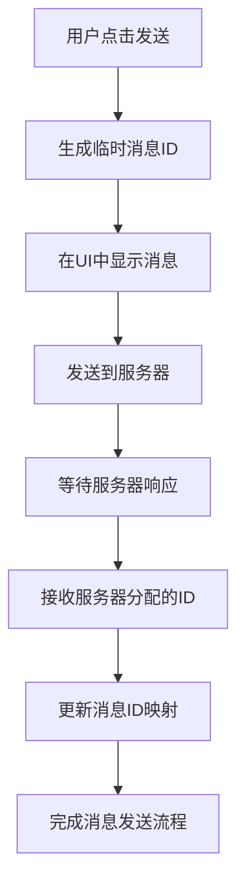
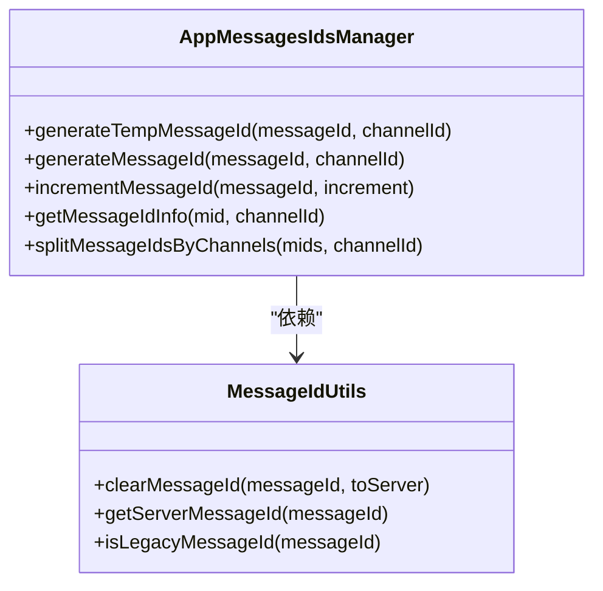
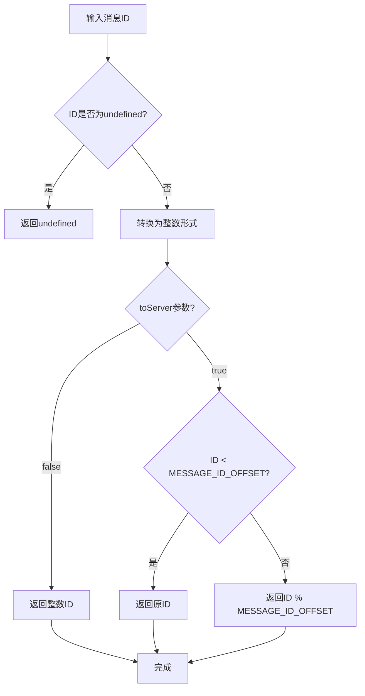
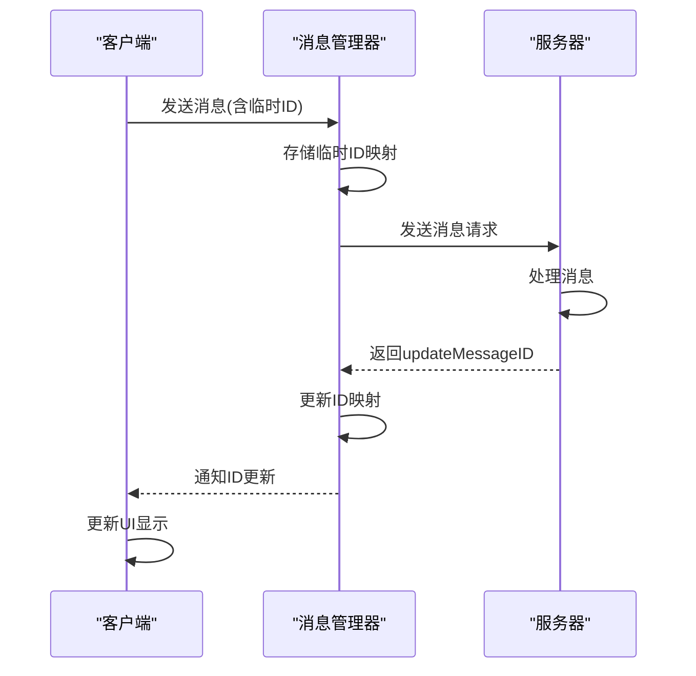
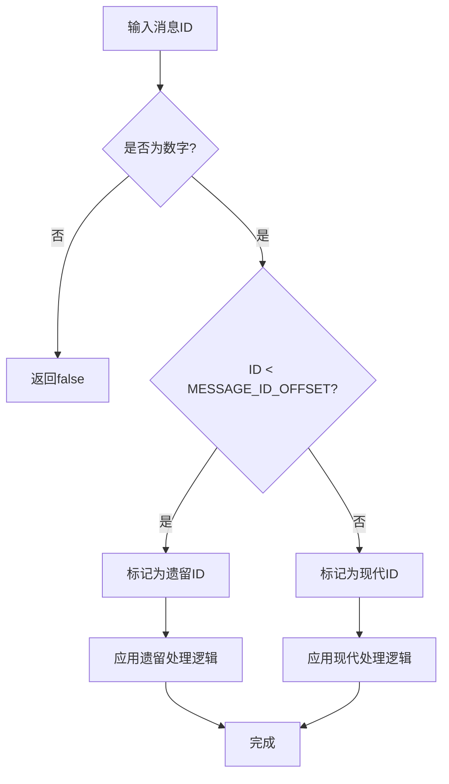
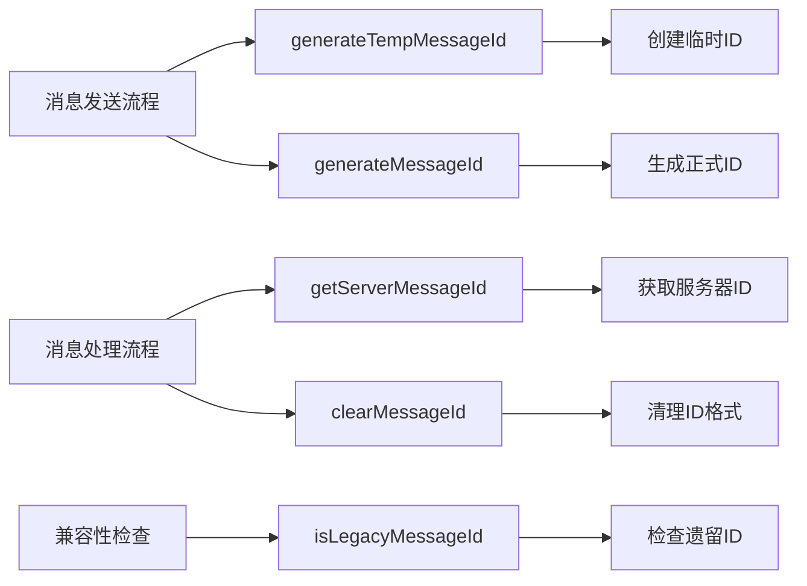

# 消息ID管理

<cite>
**本文档引用的文件**
- [appMessagesIdsManager.ts](file://src/lib/appManagers/appMessagesIdsManager.ts)
- [clearMessageId.ts](file://src/lib/appManagers/utils/messageId/clearMessageId.ts)
- [getServerMessageId.ts](file://src/lib/appManagers/utils/messageId/getServerMessageId.ts)
- [isLegacyMessageId.ts](file://src/lib/appManagers/utils/messageId/isLegacyMessageId.ts)
- [mtproto_config.ts](file://src/lib/mtproto/mtproto_config.ts)
- [bubbles.ts](file://src/components/chat/bubbles.ts)
- [appImManager.ts](file://src/lib/appManagers/appImManager.ts)
- [appMessagesManager.ts](file://src/lib/appManagers/appMessagesManager.ts)
</cite>

## 目录
1. [简介](#简介)
2. [消息ID生成机制](#消息id生成机制)
3. [临时ID与服务器ID映射关系](#临时id与服务器id映射关系)
4. [工具函数实现逻辑](#工具函数实现逻辑)
5. [ID转换状态跟踪](#id转换状态跟踪)
6. [遗留消息ID处理](#遗留消息id处理)
7. [API调用示例](#api调用示例)
8. [结论](#结论)

## 简介
本文档详细阐述了Telegram Web客户端中消息ID管理功能的实现机制。系统通过客户端临时ID和服务器ID的双重机制确保消息在发送过程中的唯一性和一致性。当用户发送消息时，客户端会立即生成一个临时ID用于UI展示，同时等待服务器分配正式ID。这种设计保证了用户界面的即时响应性，同时维护了消息系统的完整性。

**Section sources**
- [appMessagesIdsManager.ts](file://src/lib/appManagers/appMessagesIdsManager.ts#L1-L73)

## 消息ID生成机制

### 客户端临时ID创建规则
客户端临时ID的生成遵循特定的数学规则，确保其与服务器ID的区分。系统使用`generateTempMessageId`方法创建临时ID，该方法在基础消息ID上添加一个小数部分（0.0001）并保留四位小数精度。这种设计使得临时ID在数值上与正式ID有明显区别，便于系统识别和处理。

临时ID的用途主要体现在消息发送的初始阶段。当用户输入消息并点击发送时，系统立即生成临时ID并将其关联到消息对象上，使消息能够立即显示在聊天界面中。这提供了即时的用户反馈，避免了因网络延迟导致的界面卡顿。

**Diagram sources**
- [appMessagesIdsManager.ts](file://src/lib/appManagers/appMessagesIdsManager.ts#L16-L18)

### 服务器ID生成策略
服务器ID的生成基于MTProto协议规范，通过`generateMessageId`方法实现。该方法首先验证输入参数的有效性，然后结合频道ID和消息ID偏移量（MESSAGE_ID_OFFSET）生成最终的ID。系统使用固定的偏移量0x100000000（即4294967296）来区分不同类型的ID。

当消息需要递增ID时，系统调用`incrementMessageId`方法，该方法会先获取服务器ID，然后根据是否为遗留消息ID来决定递增策略。这种设计确保了ID序列的连续性和正确性。

**Section sources**
- [appMessagesIdsManager.ts](file://src/lib/appManagers/appMessagesIdsManager.ts#L20-L39)
- [mtproto_config.ts](file://src/lib/mtproto/mtproto_config.ts#L28)

## 临时ID与服务器ID映射关系

### 映射管理机制
系统通过`getMessageIdInfo`方法管理临时ID与服务器ID的映射关系。该方法接收消息ID作为输入，返回包含服务器ID和频道ID的信息对象。当消息ID等于服务器ID时，表示这是正式ID；否则，系统会根据ID的数值范围判断其是否属于特定频道。

映射关系的管理对于消息系统的正常运行至关重要。它确保了客户端能够正确识别和处理来自服务器的更新，将临时ID替换为正式ID，同时保持消息在UI中的位置和状态不变。

**Diagram sources**
- [appMessagesIdsManager.ts](file://src/lib/appManagers/appMessagesIdsManager.ts#L45-L72)
- [getServerMessageId.ts](file://src/lib/appManagers/utils/messageId/getServerMessageId.ts#L1-L14)

### ID转换流程
ID转换过程涉及多个步骤的协调。首先，客户端生成临时ID并发送消息；然后，服务器处理消息并分配正式ID；最后，客户端接收`updateMessageID`更新，将临时ID映射到正式ID。这个过程通过API更新管理器（apiUpdatesManager）实现，确保了ID转换的原子性和一致性。

在转换过程中，系统会维护一个待处理消息队列，跟踪每个临时ID对应的消息状态。当收到服务器响应时，系统会从队列中查找对应的临时ID，并更新其映射关系。

**Section sources**
- [appMessagesManager.ts](file://src/lib/appManagers/appMessagesManager.ts#L1005-L1043)
- [appImManager.ts](file://src/lib/appManagers/appImManager.ts#L2290-L2310)

## 工具函数实现逻辑

### clearMessageId函数
`clearMessageId`函数负责清理和标准化消息ID。该函数首先检查输入ID的有效性，然后根据`toServer`参数决定处理方式。如果`toServer`为false，函数直接返回整数形式的ID；如果为true，则根据ID是否小于偏移量来决定是否进行模运算。

该函数的实现考虑了边界情况，如undefined输入的处理，以及ID精度的标准化（使用toFixed(0)确保整数形式）。这种设计确保了ID在不同系统组件间传递时的一致性。

**Diagram sources**
- [clearMessageId.ts](file://src/lib/appManagers/utils/messageId/clearMessageId.ts#L9-L32)

### getServerMessageId函数
`getServerMessageId`函数是ID处理的核心工具之一，它通过调用`clearMessageId`函数并设置`toServer`参数为true来获取服务器ID。该函数的实现非常简洁，体现了单一职责原则——只负责获取服务器端的消息ID表示形式。

函数的注释明确指出其会忽略出站偏移，这表明它专门用于处理从服务器接收或需要发送到服务器的ID，确保了ID格式的统一性。

**Section sources**
- [getServerMessageId.ts](file://src/lib/appManagers/utils/messageId/getServerMessageId.ts#L1-L14)

## ID转换状态跟踪

### 状态跟踪机制
系统通过多种机制跟踪ID转换过程中的状态。在消息发送过程中，每个消息对象都包含一个promise属性，用于跟踪其发送状态。当消息被发送到服务器时，系统会创建一个待处理请求，并在收到服务器响应后解析该promise。

状态跟踪还包括UI层面的反馈。例如，在`bubbles.ts`文件中，系统使用`clearMessageId`函数过滤真实消息，确保只有有效的消息被包含在历史记录中。这种双重验证机制提高了系统的健壮性。

**Diagram sources**
- [bubbles.ts](file://src/components/chat/bubbles.ts#L3306)
- [appMessagesManager.ts](file://src/lib/appManagers/appMessagesManager.ts#L1037-L1042)

### 一致性保障
为确保消息在发送前后的一致性，系统采用了多层验证机制。首先，在生成临时ID时，系统确保其格式符合规范；其次，在接收服务器ID时，通过`updateMessageID`更新进行验证；最后，在UI更新时，系统会重新计算和验证消息状态。

这种分层验证设计有效防止了ID冲突和消息丢失，即使在网络不稳定的情况下也能保证消息系统的可靠性。

**Section sources**
- [appMessagesManager.ts](file://src/lib/appManagers/appMessagesManager.ts#L1015-L1043)
- [bubbles.ts](file://src/components/chat/bubbles.ts#L3300-L3310)

## 遗留消息ID处理

### 兼容性策略
系统通过`isLegacyMessageId`函数处理遗留消息ID。该函数检查消息ID是否小于`MESSAGE_ID_OFFSET`，如果是，则认为是遗留ID。这种设计允许系统向后兼容旧版本的ID格式，确保了不同客户端版本间的互操作性。

兼容性策略还包括对ID范围的特殊处理。例如，ID为0的情况需要特殊转换，因为服务器可能使用0xFFFFFFFF表示，系统需要正确处理这种边界情况。

**Diagram sources**
- [isLegacyMessageId.ts](file://src/lib/appManagers/utils/messageId/isLegacyMessageId.ts#L3-L5)
- [mtproto_config.ts](file://src/lib/mtproto/mtproto_config.ts#L28)

### 迁移方案
对于从旧系统迁移过来的消息，系统提供了平滑的迁移方案。当检测到遗留ID时，系统会自动将其转换为现代ID格式，同时保持消息的原始属性不变。这种透明的转换对用户完全不可见，确保了用户体验的一致性。

迁移过程中，系统会记录转换日志，便于调试和问题追踪。同时，通过单元测试验证各种ID转换场景，确保迁移过程的可靠性。

**Section sources**
- [appMessagesIdsManager.ts](file://src/lib/appManagers/appMessagesIdsManager.ts#L41-L43)
- [isLegacyMessageId.ts](file://src/lib/appManagers/utils/messageId/isLegacyMessageId.ts#L3-L6)

## API调用示例

### 消息ID管理API使用
以下示例展示了消息ID管理API在实际应用中的调用方式：

在具体实现中，`appImManager`在处理消息交互时会调用`getServerMessageId`获取服务器ID，如在发送表情互动时：

**Section sources**
- [appImManager.ts](file://src/lib/appManagers/appImManager.ts#L2935)
- [appImManager.ts](file://src/lib/appManagers/appImManager.ts#L2294)

### 消息生命周期应用
消息ID管理贯穿消息的整个生命周期。从创建、发送、接收、显示到最终存储，每个阶段都涉及ID的处理和转换。系统通过统一的ID管理接口，确保了消息在不同状态间的平滑过渡。

例如，在加载历史消息时，系统会使用`getRenderedHistory`方法过滤真实消息，排除临时ID的影响，确保历史记录的准确性。

**Section sources**
- [bubbles.ts](file://src/components/chat/bubbles.ts#L3300-L3310)
- [appMessagesIdsManager.ts](file://src/lib/appManagers/appMessagesIdsManager.ts#L56-L72)

## 结论
消息ID管理系统是Telegram Web客户端的核心组件之一，它通过精心设计的临时ID和服务器ID机制，实现了消息发送的即时响应和数据一致性。系统采用模块化的工具函数设计，分离了ID生成、清理、转换等职责，提高了代码的可维护性和可测试性。

通过分析可知，该系统充分考虑了边界情况和兼容性需求，采用了分层验证和状态跟踪机制，确保了在各种网络条件下的可靠性。未来可以进一步优化ID生成算法，提高其随机性和唯一性保证，同时增强对大规模消息并发的处理能力。