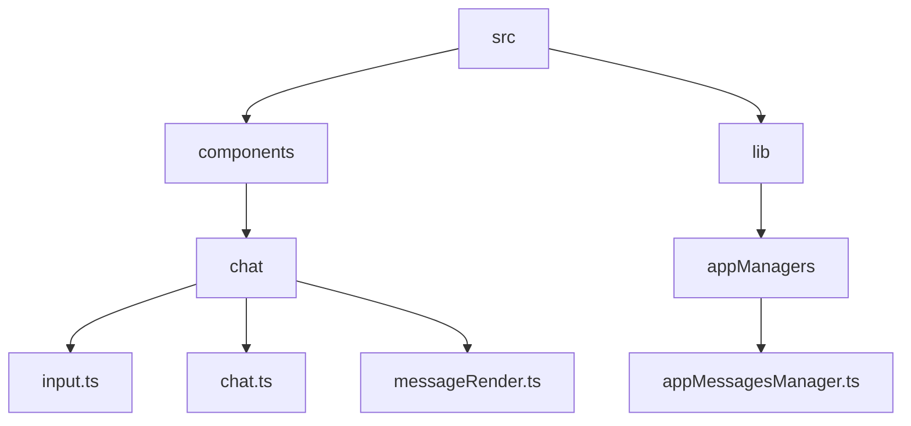
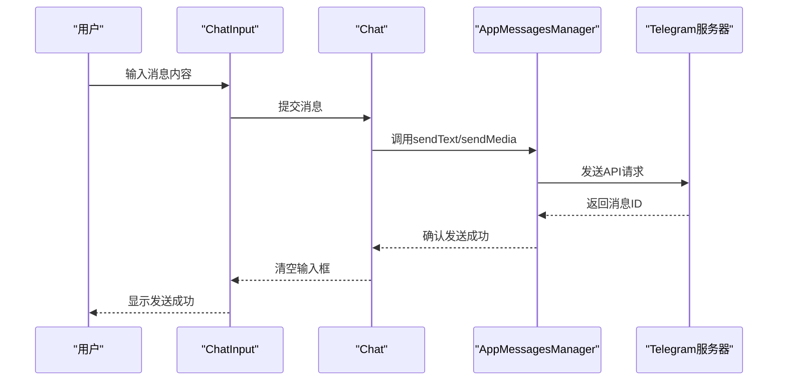
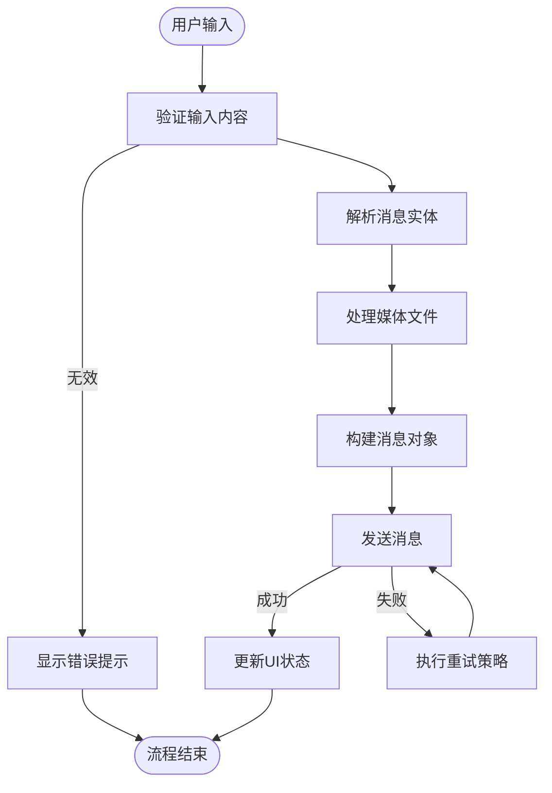
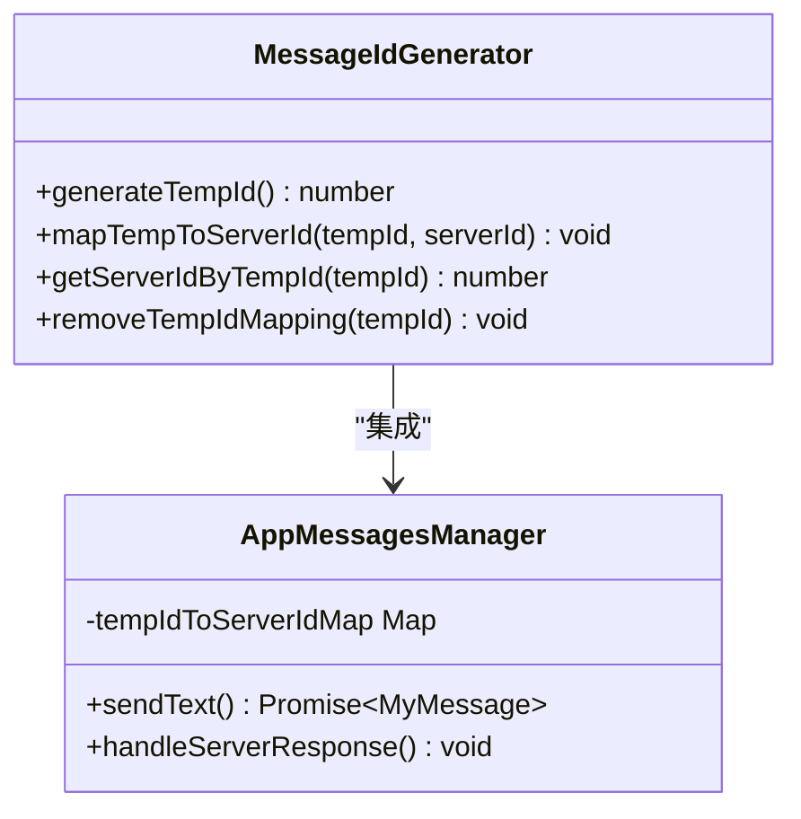
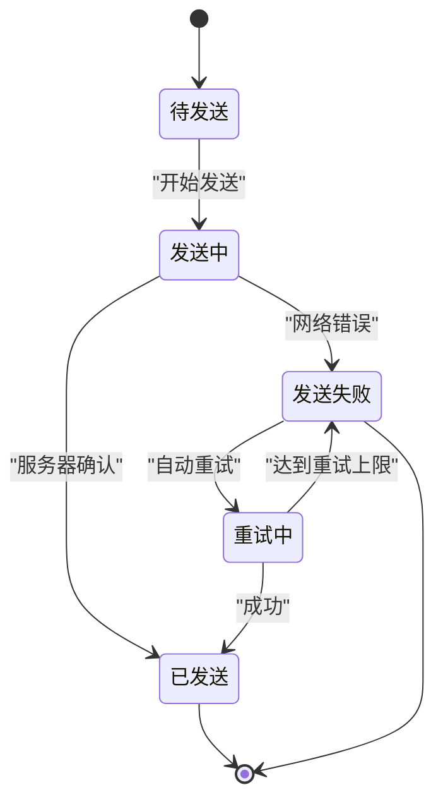
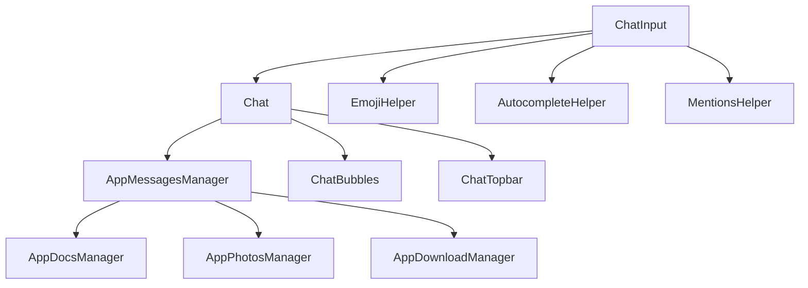

# 消息发送

<cite>
**本文档引用的文件**
- [input.ts](file://src/components/chat/input.ts)
- [chat.ts](file://src/components/chat/chat.ts)
- [appMessagesManager.ts](file://src/lib/appManagers/appMessagesManager.ts)
- [messageRender.ts](file://src/components/chat/messageRender.ts)
- [actions.ts](file://src/components/chat/actions.ts)
</cite>

## 目录
1. [简介](#简介)
2. [项目结构](#项目结构)
3. [核心组件](#核心组件)
4. [架构概述](#架构概述)
5. [详细组件分析](#详细组件分析)
6. [依赖分析](#依赖分析)
7. [性能考虑](#性能考虑)
8. [故障排除指南](#故障排除指南)
9. [结论](#结论)
10. [附录](#附录)（如有必要）

## 简介
本文档详细阐述了Telegram Web客户端中消息发送功能的完整实现流程。从用户输入到消息成功发送，涵盖了文本和多媒体消息的处理、消息构建过程、消息ID生成机制、发送状态管理、错误处理和重试策略等关键环节。文档通过代码分析和架构图示，全面揭示了消息发送系统的内部工作机制。

## 项目结构
项目结构清晰地组织了消息发送相关的组件和管理器。核心功能主要分布在`src/components/chat`目录下的输入组件和`src/lib/appManagers`目录下的消息管理器中。



**Diagram sources**
- [input.ts](file://src/components/chat/input.ts)
- [chat.ts](file://src/components/chat/chat.ts)
- [appMessagesManager.ts](file://src/lib/appManagers/appMessagesManager.ts)

**Section sources**
- [input.ts](file://src/components/chat/input.ts)
- [chat.ts](file://src/components/chat/chat.ts)

## 核心组件
消息发送功能的核心组件包括聊天输入组件（ChatInput）、聊天主组件（Chat）和消息管理器（AppMessagesManager）。这些组件协同工作，实现了从用户界面交互到后端消息处理的完整流程。

**Section sources**
- [input.ts](file://src/components/chat/input.ts)
- [chat.ts](file://src/components/chat/chat.ts)
- [appMessagesManager.ts](file://src/lib/appManagers/appMessagesManager.ts)

## 架构概述
消息发送系统采用分层架构设计，前端组件与后端管理器通过清晰的接口进行通信。用户输入通过ChatInput组件捕获，经由Chat组件协调，最终由AppMessagesManager负责与服务器通信。



**Diagram sources**
- [input.ts](file://src/components/chat/input.ts)
- [chat.ts](file://src/components/chat/chat.ts)
- [appMessagesManager.ts](file://src/lib/appManagers/appMessagesManager.ts)

## 详细组件分析

### 消息发送流程分析
消息发送流程从用户在输入框中输入内容开始，经过一系列处理步骤，最终将消息发送到服务器。

#### 消息构建过程
消息构建过程包括输入内容验证、实体解析和媒体文件处理等环节。



**Diagram sources**
- [input.ts](file://src/components/chat/input.ts)
- [appMessagesManager.ts](file://src/lib/appManagers/appMessagesManager.ts)

**Section sources**
- [input.ts](file://src/components/chat/input.ts)
- [appMessagesManager.ts](file://src/lib/appManagers/appMessagesManager.ts)

#### 消息ID生成机制
系统采用临时ID和服务器ID的映射机制来管理消息状态。



**Diagram sources**
- [appMessagesManager.ts](file://src/lib/appManagers/appMessagesManager.ts)

**Section sources**
- [appMessagesManager.ts](file://src/lib/appManagers/appMessagesManager.ts)

### 消息状态管理
系统实现了完整的消息发送状态管理，包括发送中、已发送、发送失败等状态。



**Diagram sources**
- [appMessagesManager.ts](file://src/lib/appManagers/appMessagesManager.ts)

**Section sources**
- [appMessagesManager.ts](file://src/lib/appManagers/appMessagesManager.ts)

## 依赖分析
消息发送功能依赖于多个核心组件和管理器，形成了复杂的依赖关系网络。



**Diagram sources**
- [input.ts](file://src/components/chat/input.ts)
- [chat.ts](file://src/components/chat/chat.ts)
- [appMessagesManager.ts](file://src/lib/appManagers/appMessagesManager.ts)

**Section sources**
- [input.ts](file://src/components/chat/input.ts)
- [chat.ts](file://src/components/chat/chat.ts)
- [appMessagesManager.ts](file://src/lib/appManagers/appMessagesManager.ts)

## 性能考虑
消息发送功能在性能方面进行了多项优化，包括输入处理的防抖机制、媒体上传的进度管理以及网络请求的错误重试策略。系统还实现了消息的批量处理和状态更新，以提高整体性能。

## 故障排除指南
当消息发送出现问题时，可以按照以下步骤进行排查：

1. 检查网络连接状态
2. 验证输入内容是否符合要求
3. 检查媒体文件大小和格式是否支持
4. 查看浏览器控制台是否有错误信息
5. 确认用户权限是否允许发送消息

**Section sources**
- [input.ts](file://src/components/chat/input.ts)
- [appMessagesManager.ts](file://src/lib/appManagers/appMessagesManager.ts)

## 结论
Telegram Web客户端的消息发送功能通过精心设计的架构和组件协作，实现了高效、可靠的消息传输。系统不仅支持文本和多媒体消息的发送，还提供了完善的状态管理和错误处理机制，确保了良好的用户体验。

## 附录
### API调用示例
```typescript
// 发送文本消息
appMessagesManager.sendText({
  peerId: targetPeerId,
  message: "Hello World",
  entities: []
});

// 发送媒体消息
appMessagesManager.sendMedia({
  peerId: targetPeerId,
  media: mediaInput,
  caption: "Check this out!"
});
```

### 配置选项
| 选项 | 类型 | 描述 |
|------|------|------|
| peerId | PeerId | 目标用户或群组ID |
| threadId | number | 主题ID（可选） |
| replyToMsgId | number | 回复的消息ID（可选） |
| scheduleDate | number | 定时发送时间戳（可选） |
| silent | boolean | 是否静默发送（可选） |