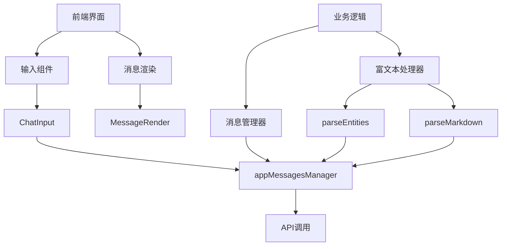
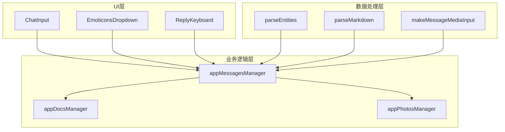
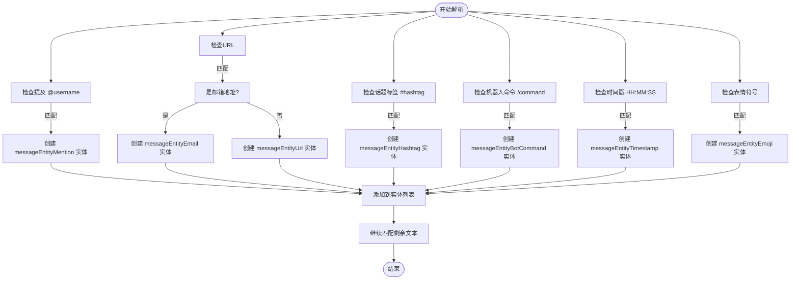
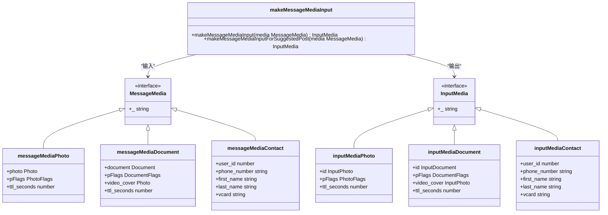
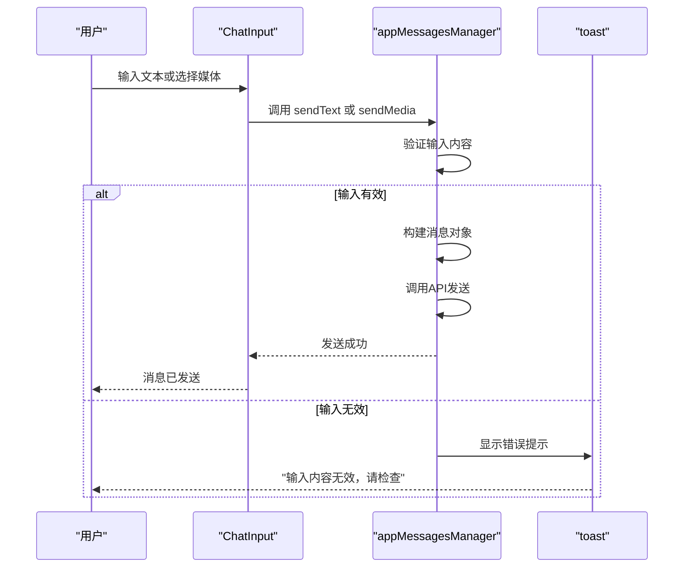
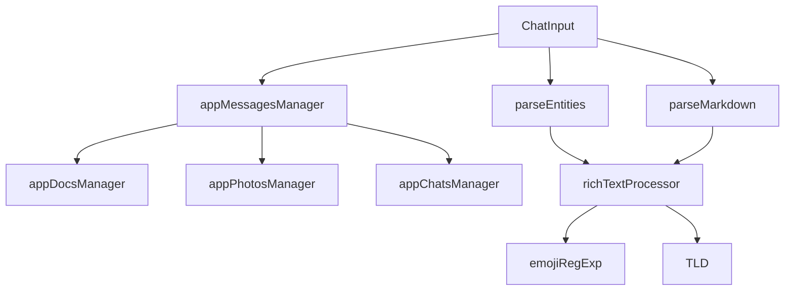

# 消息构建

<cite>
**本文档中引用的文件**  
- [input.ts](file://src/components/chat/input.ts)
- [makeMessageMediaInput.ts](file://src/lib/appManagers/utils/messages/makeMessageMediaInput.ts)
- [parseEntities.ts](file://src/lib/richTextProcessor/parseEntities.ts)
- [parseMarkdown.ts](file://src/lib/richTextProcessor/parseMarkdown.ts)
- [appMessagesManager.ts](file://src/lib/appManagers/appMessagesManager.ts)
- [richTextProcessor/index.ts](file://src/lib/richTextProcessor/index.ts)
</cite>

## 目录
1. [介绍](#介绍)
2. [项目结构](#项目结构)
3. [核心组件](#核心组件)
4. [架构概述](#架构概述)
5. [详细组件分析](#详细组件分析)
6. [依赖分析](#依赖分析)
7. [性能考虑](#性能考虑)
8. [故障排除指南](#故障排除指南)
9. [结论](#结论)
10. [附录](#附录)（如有必要）

## 介绍
本文档详细阐述了Telegram Web客户端中消息构建功能的实现机制。重点分析从用户输入内容到最终消息对象创建的完整流程，包括文本消息的实体解析（如URL、表情符号、提及等）、多媒体消息的媒体输入构建、消息内容验证等关键环节。文档深入解析了`makeMessageMediaInput`工具函数的实现逻辑，说明如何将不同类型的媒体文件（图片、视频、音频、文档）转换为适合传输的格式。同时，记录了消息构建过程中的错误处理机制，包括无效输入的检测和用户提示。通过实际代码示例，展示不同类型消息的构建方式和参数配置。

## 项目结构
该项目是一个基于TypeScript的Web客户端，其结构清晰地分为多个功能模块。消息构建功能主要集中在`src/components/chat`和`src/lib/appManagers`目录下。`src/components/chat`包含与聊天界面相关的UI组件，如输入框、气泡、回复键盘等。而`src/lib/appManagers`则包含了核心的业务逻辑管理器，特别是`appMessagesManager.ts`负责处理所有与消息相关的操作，包括发送、接收、存储和解析。`src/lib/richTextProcessor`目录专门处理富文本的解析和格式化，是实体识别和Markdown解析的核心。

**图表来源**
- [input.ts](file://src/components/chat/input.ts#L1-L800)
- [appMessagesManager.ts](file://src/lib/appManagers/appMessagesManager.ts#L1-L200)
- [parseEntities.ts](file://src/lib/richTextProcessor/parseEntities.ts#L1-L129)
- [parseMarkdown.ts](file://src/lib/richTextProcessor/parseMarkdown.ts#L1-L223)

**章节来源**
- [input.ts](file://src/components/chat/input.ts#L1-L800)
- [appMessagesManager.ts](file://src/lib/appManagers/appMessagesManager.ts#L1-L200)

## 核心组件
消息构建的核心流程始于用户在聊天输入框中的操作。`ChatInput`类负责管理整个输入过程，包括文本输入、媒体选择、回复和转发等功能。当用户输入文本时，系统会实时进行实体解析，识别其中的URL、提及、话题标签等。当用户选择发送媒体文件时，`appMessagesManager`会调用`makeMessageMediaInput`函数将文件转换为Telegram API所需的`InputMedia`格式。整个流程由`appMessagesManager`协调，确保消息在发送前经过正确的格式化和验证。

**章节来源**
- [input.ts](file://src/components/chat/input.ts#L1-L800)
- [appMessagesManager.ts](file://src/lib/appManagers/appMessagesManager.ts#L1-L200)

## 架构概述
消息构建功能的架构分为三层：UI层、业务逻辑层和数据处理层。UI层由`ChatInput`组件构成，负责接收用户输入和展示输入状态。业务逻辑层以`appMessagesManager`为核心，负责协调消息的发送、存储和状态管理。数据处理层则由`richTextProcessor`模块组成，专门负责解析和格式化文本内容。这三层通过清晰的接口进行通信，确保了功能的模块化和可维护性。

**图表来源**
- [input.ts](file://src/components/chat/input.ts#L1-L800)
- [appMessagesManager.ts](file://src/lib/appManagers/appMessagesManager.ts#L1-L200)
- [makeMessageMediaInput.ts](file://src/lib/appManagers/utils/messages/makeMessageMediaInput.ts#L1-L54)
- [parseEntities.ts](file://src/lib/richTextProcessor/parseEntities.ts#L1-L129)
- [parseMarkdown.ts](file://src/lib/richTextProcessor/parseMarkdown.ts#L1-L223)

## 详细组件分析
本节将深入分析消息构建过程中的关键组件，包括实体解析、媒体输入构建和错误处理。

### 文本消息实体解析
当用户在输入框中输入文本时，系统会实时调用`parseEntities`函数来识别文本中的特殊实体。该函数使用一个复杂的正则表达式`FULL_REG_EXP`来匹配多种实体类型，包括提及、URL、话题标签、机器人命令和时间戳等。

**图表来源**
- [parseEntities.ts](file://src/lib/richTextProcessor/parseEntities.ts#L1-L129)
- [richTextProcessor/index.ts](file://src/lib/richTextProcessor/index.ts#L1-L144)

**章节来源**
- [parseEntities.ts](file://src/lib/richTextProcessor/parseEntities.ts#L1-L129)

### 多媒体消息媒体输入构建
`makeMessageMediaInput`函数是构建多媒体消息的核心。它接收一个`MessageMedia`对象，并根据其类型将其转换为相应的`InputMedia`对象，以便通过API发送。

**图表来源**
- [makeMessageMediaInput.ts](file://src/lib/appManagers/utils/messages/makeMessageMediaInput.ts#L1-L54)

**章节来源**
- [makeMessageMediaInput.ts](file://src/lib/appManagers/utils/messages/makeMessageMediaInput.ts#L1-L54)

### 消息内容验证与错误处理
在消息发送前，系统会进行一系列验证。`appMessagesManager`中的`sendText`和`sendMedia`方法会检查输入的有效性，如文本长度、媒体文件大小等。如果检测到无效输入，会通过`toast`组件向用户显示提示信息。

**图表来源**
- [input.ts](file://src/components/chat/input.ts#L1-L800)
- [appMessagesManager.ts](file://src/lib/appManagers/appMessagesManager.ts#L1-L200)

**章节来源**
- [input.ts](file://src/components/chat/input.ts#L1-L800)
- [appMessagesManager.ts](file://src/lib/appManagers/appMessagesManager.ts#L1-L200)

## 依赖分析
消息构建功能依赖于多个核心模块。`richTextProcessor`模块提供了文本解析的基础能力，`appManagers`中的各个管理器（如`appDocsManager`、`appPhotosManager`）提供了媒体文件的处理能力。UI组件如`ChatInput`和`EmoticonsDropdown`则依赖于这些底层服务来实现完整的用户交互。

**图表来源**
- [input.ts](file://src/components/chat/input.ts#L1-L800)
- [appMessagesManager.ts](file://src/lib/appManagers/appMessagesManager.ts#L1-L200)
- [parseEntities.ts](file://src/lib/richTextProcessor/parseEntities.ts#L1-L129)
- [parseMarkdown.ts](file://src/lib/richTextProcessor/parseMarkdown.ts#L1-L223)

**章节来源**
- [input.ts](file://src/components/chat/input.ts#L1-L800)
- [appMessagesManager.ts](file://src/lib/appManagers/appMessagesManager.ts#L1-L200)
- [parseEntities.ts](file://src/lib/richTextProcessor/parseEntities.ts#L1-L129)
- [parseMarkdown.ts](file://src/lib/richTextProcessor/parseMarkdown.ts#L1-L223)

## 性能考虑
消息构建功能在性能方面进行了优化。`parseEntities`和`parseMarkdown`函数使用了高效的正则表达式和缓存机制，避免了重复解析。`ChatInput`组件利用了SolidJS的响应式系统，确保了UI更新的高效性。对于大型媒体文件，系统采用了流式上传和预加载技术，以减少用户等待时间。

## 故障排除指南
在使用消息构建功能时，可能会遇到以下常见问题：
- **实体未被正确识别**：检查输入文本是否符合预期格式，如URL是否包含有效协议。
- **媒体文件无法发送**：确认文件大小和格式是否符合Telegram的限制。
- **消息发送失败**：检查网络连接状态和API调用权限。

**章节来源**
- [input.ts](file://src/components/chat/input.ts#L1-L800)
- [appMessagesManager.ts](file://src/lib/appManagers/appMessagesManager.ts#L1-L200)

## 结论
本文档全面分析了Telegram Web客户端中消息构建功能的实现。通过深入解析`ChatInput`、`appMessagesManager`和`richTextProcessor`等核心组件，揭示了从用户输入到消息发送的完整流程。该功能设计精巧，层次分明，通过模块化的设计实现了高内聚低耦合，为用户提供了一个高效、可靠的聊天体验。