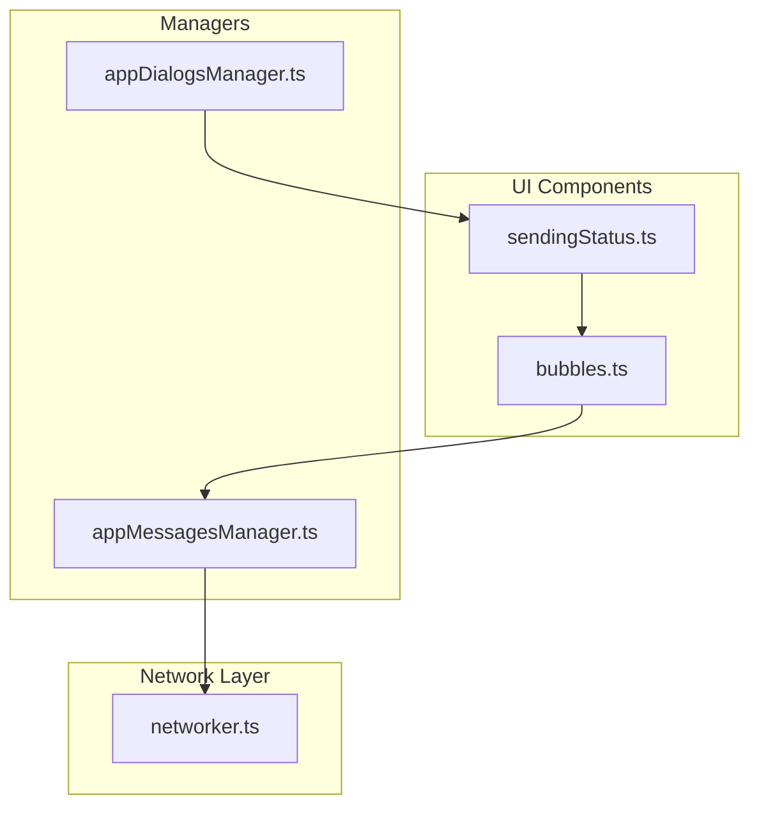
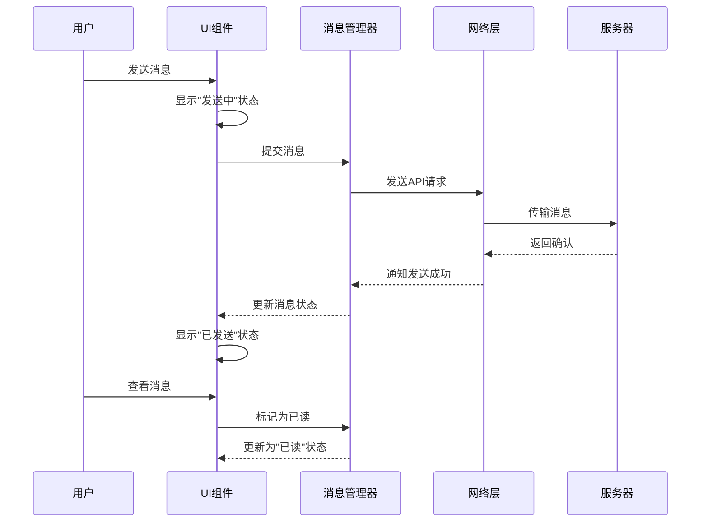
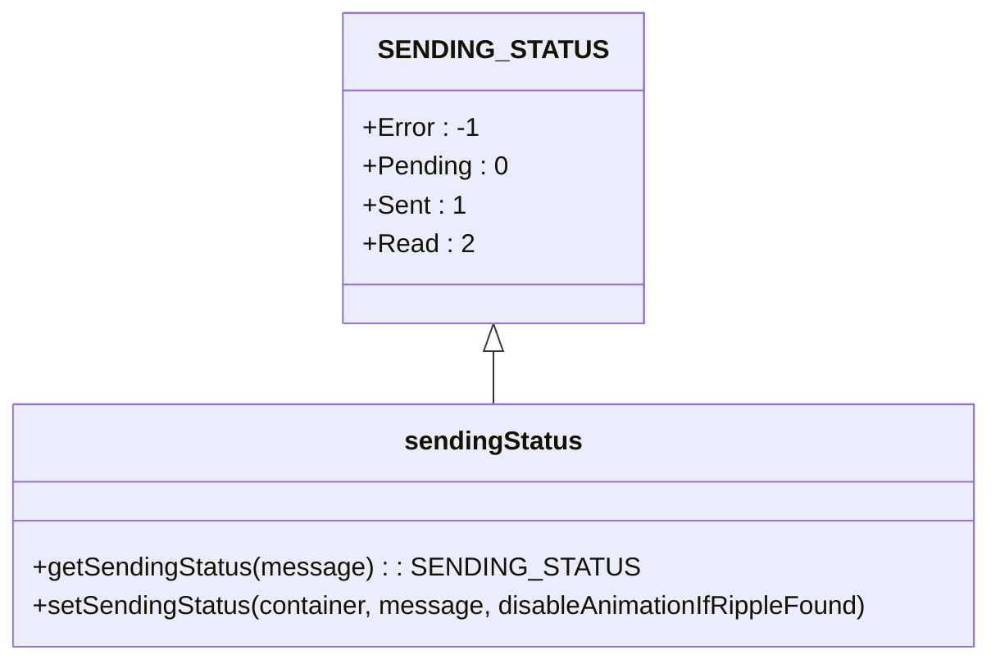
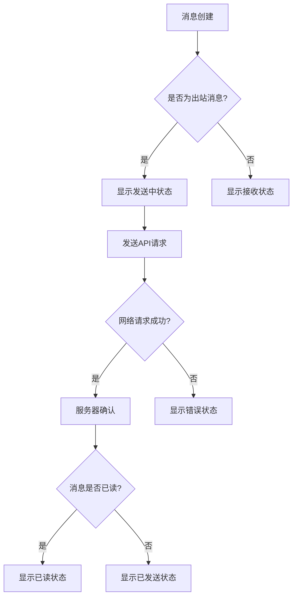
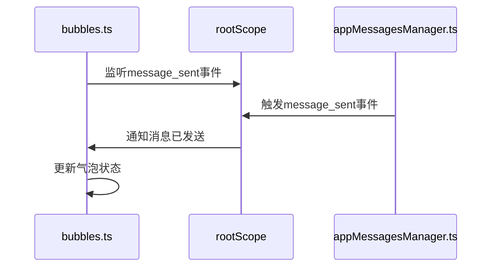
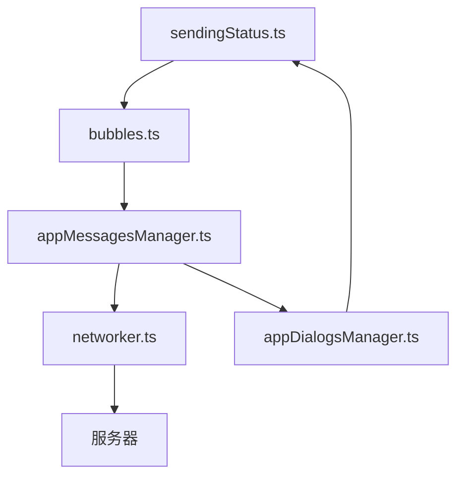

# 消息状态跟踪

<cite>
**本文档中引用的文件**  
- [sendingStatus.ts](file://src/components/sendingStatus.ts)
- [bubbles.ts](file://src/components/chat/bubbles.ts)
- [networker.ts](file://src/lib/mtproto/networker.ts)
- [appMessagesManager.ts](file://src/lib/appManagers/appMessagesManager.ts)
- [appDialogsManager.ts](file://src/lib/appManagers/appDialogsManager.ts)
</cite>

## 目录
1. [简介](#简介)
2. [项目结构](#项目结构)
3. [核心组件](#核心组件)
4. [架构概述](#架构概述)
5. [详细组件分析](#详细组件分析)
6. [依赖分析](#依赖分析)
7. [性能考虑](#性能考虑)
8. [故障排除指南](#故障排除指南)
9. [结论](#结论)

## 简介
本文档详细介绍了Telegram Web客户端中的消息状态跟踪功能。该功能负责管理消息在发送过程中的各种状态，包括发送中、已发送、已读和发送失败等状态。文档深入分析了状态管理机制、UI反馈系统以及网络异常处理策略。

## 项目结构
消息状态跟踪功能主要分布在客户端的组件和管理器模块中。核心功能由sendingStatus组件实现，该组件负责渲染消息状态图标，并与聊天气泡组件集成。状态管理逻辑分布在多个层级，包括UI组件、消息管理器和网络层。

**Diagram sources**
- [sendingStatus.ts](file://src/components/sendingStatus.ts)
- [bubbles.ts](file://src/components/chat/bubbles.ts)
- [appMessagesManager.ts](file://src/lib/appManagers/appMessagesManager.ts)
- [appDialogsManager.ts](file://src/lib/appManagers/appDialogsManager.ts)
- [networker.ts](file://src/lib/mtproto/networker.ts)

**Section sources**
- [sendingStatus.ts](file://src/components/sendingStatus.ts)
- [bubbles.ts](file://src/components/chat/bubbles.ts)

## 核心组件
消息状态跟踪系统的核心是sendingStatus组件，它定义了消息的四种基本状态：错误、待发送、已发送和已读。该组件通过setSendingStatus函数将状态映射到相应的UI图标，为用户提供直观的反馈。

**Section sources**
- [sendingStatus.ts](file://src/components/sendingStatus.ts#L14-L19)
- [bubbles.ts](file://src/components/chat/bubbles.ts#L5429-L5454)

## 架构概述
消息状态跟踪系统采用分层架构，从UI层到网络层形成完整的状态管理闭环。当用户发送消息时，系统首先在UI层显示"发送中"状态，然后通过网络层发送消息，最后根据服务器响应更新状态。

**Diagram sources**
- [sendingStatus.ts](file://src/components/sendingStatus.ts)
- [bubbles.ts](file://src/components/chat/bubbles.ts)
- [networker.ts](file://src/lib/mtproto/networker.ts)

## 详细组件分析

### sendingStatus组件分析
sendingStatus组件是消息状态UI的核心实现，它定义了状态枚举和状态设置函数。组件通过图标类名映射不同的消息状态，提供清晰的视觉反馈。

**Diagram sources**
- [sendingStatus.ts](file://src/components/sendingStatus.ts#L14-L19)

#### 状态转换逻辑
消息状态的转换遵循严格的流程，从发送到确认再到已读，每个状态都有明确的触发条件。

**Diagram sources**
- [sendingStatus.ts](file://src/components/sendingStatus.ts)
- [bubbles.ts](file://src/components/chat/bubbles.ts)

### 消息管理器分析
消息管理器负责处理消息的生命周期，包括状态更新和事件分发。当消息成功发送后，管理器会触发message_sent事件，通知UI组件更新状态。

**Diagram sources**
- [bubbles.ts](file://src/components/chat/bubbles.ts#L732-L778)
- [appMessagesManager.ts](file://src/lib/appManagers/appMessagesManager.ts#L1015-L1043)

## 依赖分析
消息状态跟踪系统依赖于多个核心模块，包括网络层、消息管理器和UI组件。这些模块通过事件系统和函数调用紧密协作，形成完整的状态管理链路。

**Diagram sources**
- [sendingStatus.ts](file://src/components/sendingStatus.ts)
- [bubbles.ts](file://src/components/chat/bubbles.ts)
- [appMessagesManager.ts](file://src/lib/appManagers/appMessagesManager.ts)
- [appDialogsManager.ts](file://src/lib/appManagers/appDialogsManager.ts)
- [networker.ts](file://src/lib/mtproto/networker.ts)

**Section sources**
- [sendingStatus.ts](file://src/components/sendingStatus.ts)
- [bubbles.ts](file://src/components/chat/bubbles.ts)
- [appMessagesManager.ts](file://src/lib/appManagers/appMessagesManager.ts)
- [appDialogsManager.ts](file://src/lib/appManagers/appDialogsManager.ts)
- [networker.ts](file://src/lib/mtproto/networker.ts)

## 性能考虑
消息状态跟踪系统在设计时考虑了性能优化，特别是在状态更新和UI渲染方面。系统采用防抖和节流技术，避免频繁的状态更新导致的性能问题。

## 故障排除指南
当消息状态显示异常时，可以检查以下方面：
1. 网络连接状态
2. 服务器响应时间
3. 事件监听器是否正常工作
4. 状态转换逻辑是否正确执行

**Section sources**
- [networker.ts](file://src/lib/mtproto/networker.ts#L910-L925)
- [bubbles.ts](file://src/components/chat/bubbles.ts#L732-L778)

## 结论
消息状态跟踪功能是Telegram Web客户端的重要组成部分，它通过清晰的状态指示和可靠的网络处理机制，为用户提供流畅的通信体验。系统的分层架构和模块化设计使其易于维护和扩展。