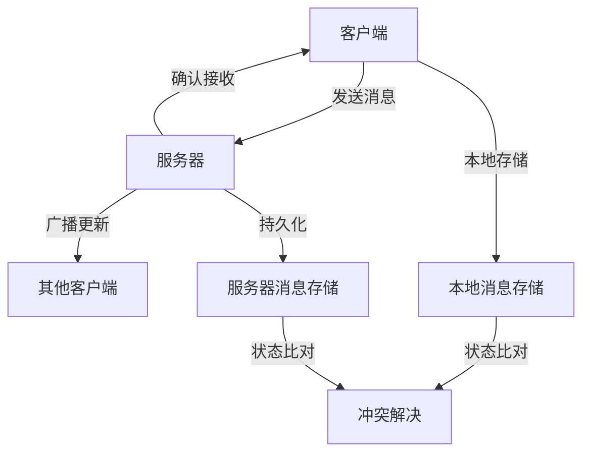
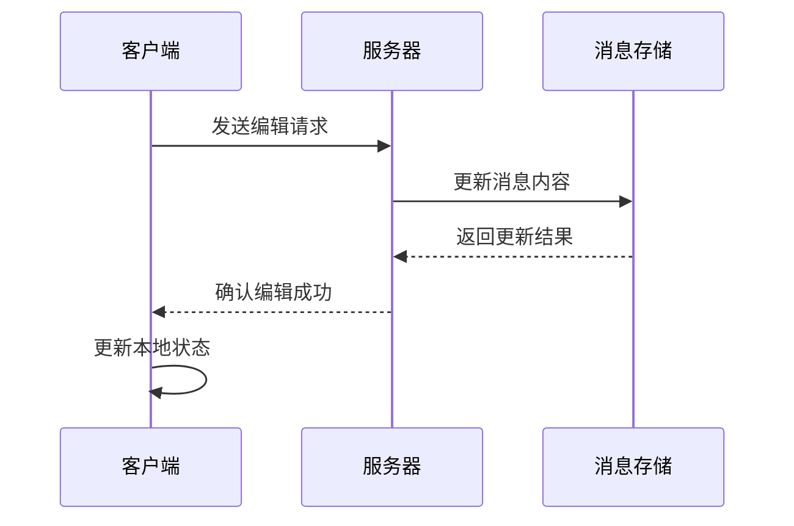
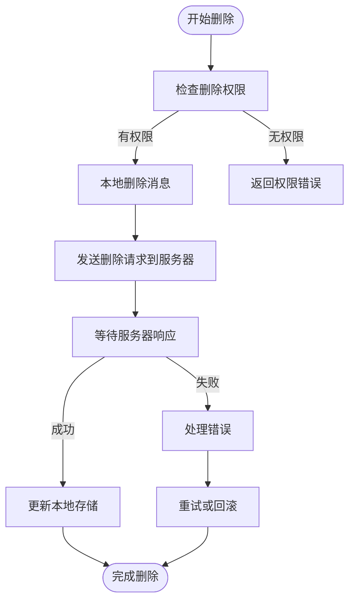
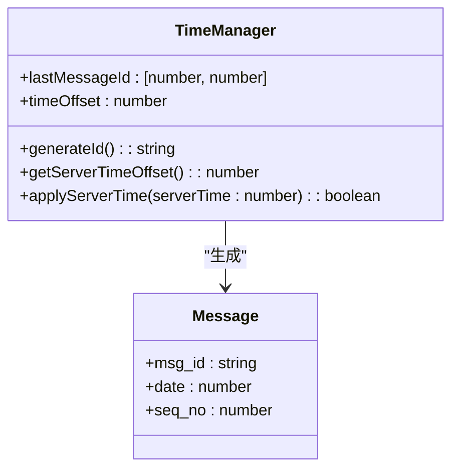
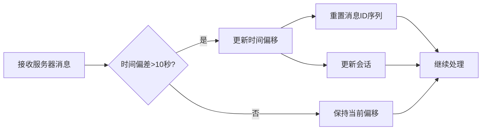
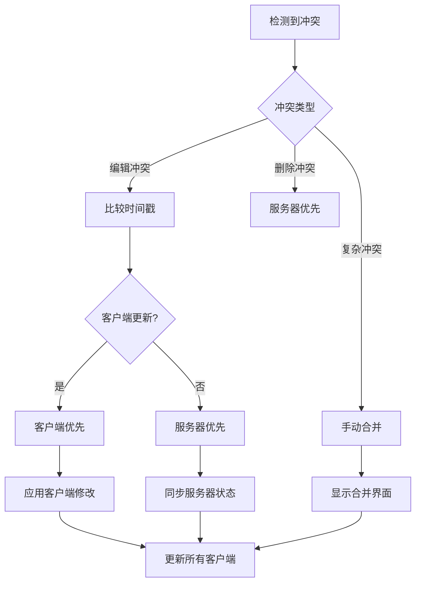
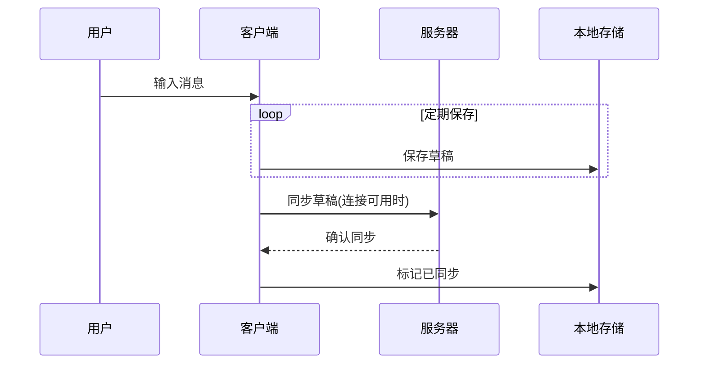
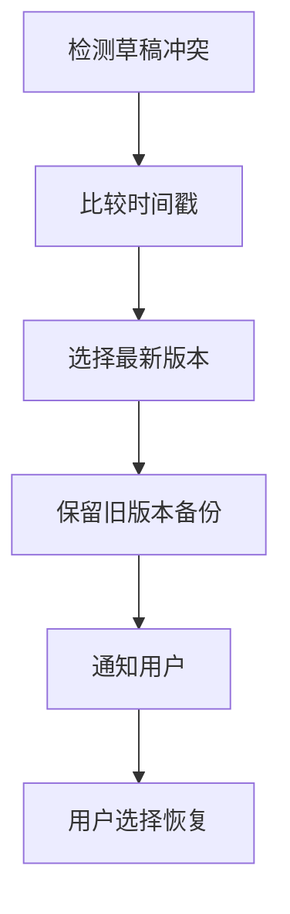
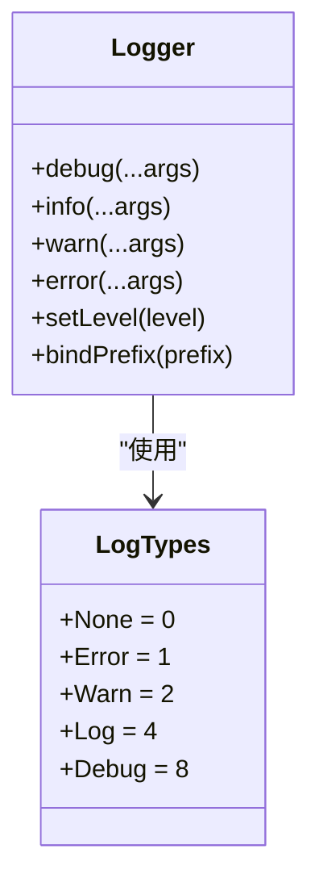
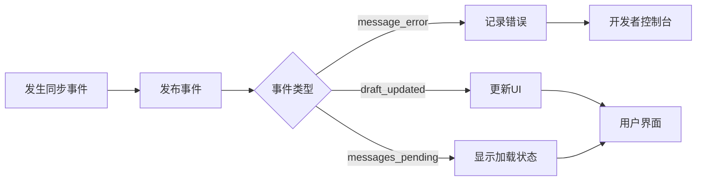

# 冲突解决

<cite>
**本文档中引用的文件**  
- [networker.ts](file://src/lib/mtproto/networker.ts)
- [timeManager.ts](file://src/lib/mtproto/timeManager.ts)
- [appMessagesManager.ts](file://src/lib/appManagers/appMessagesManager.ts)
- [appDraftsManager.ts](file://src/lib/appManagers/appDraftsManager.ts)
- [apiUpdatesManager.ts](file://src/lib/appManagers/apiUpdatesManager.ts)
- [logger.ts](file://src/lib/logger.ts)
</cite>

## 目录
1. [简介](#简介)
2. [消息同步机制概述](#消息同步机制概述)
3. [消息状态冲突处理](#消息状态冲突处理)
4. [版本控制与消息标识](#版本控制与消息标识)
5. [冲突解决算法](#冲突解决算法)
6. [本地草稿协调机制](#本地草稿协调机制)
7. [调试与日志记录](#调试与日志记录)
8. [结论](#结论)

## 简介

本文档详细阐述了Telegram Web客户端中消息同步冲突的解决策略。当客户端与服务器端消息状态出现不一致时，系统通过一系列机制确保数据一致性，包括消息编辑、删除和发送状态的冲突处理。文档深入分析了版本控制策略、冲突解决算法、本地草稿协调机制以及调试工具的实现。

## 消息同步机制概述

Telegram Web客户端采用基于MTProto协议的双向同步机制，确保客户端与服务器之间的消息状态一致性。系统通过消息ID、时间戳和序列号进行状态比对，检测并解决潜在的冲突。

**Diagram sources**
- [networker.ts](file://src/lib/mtproto/networker.ts#L880-L927)
- [appMessagesManager.ts](file://src/lib/appManagers/appMessagesManager.ts#L3719-L4747)

## 消息状态冲突处理

当客户端与服务器端消息状态不一致时，系统通过以下机制进行处理：

### 消息编辑冲突

当同一消息在客户端和服务器端被同时编辑时，系统通过消息ID和时间戳确定最新版本。`appMessagesManager`中的`editMessage`方法处理消息编辑操作，确保最终状态的一致性。

**Diagram sources**
- [appMessagesManager.ts](file://src/lib/appManagers/appMessagesManager.ts#L9934-L9981)
- [apiUpdatesManager.ts](file://src/lib/appManagers/apiUpdatesManager.ts#L30-L636)

### 消息删除冲突

消息删除操作通过`deleteMessages`方法实现。系统记录删除操作的时间戳和操作者信息，当检测到冲突时，根据预设策略（如服务器优先）进行解决。

**Diagram sources**
- [appMessagesManager.ts](file://src/lib/appManagers/appMessagesManager.ts#L3491-L3522)
- [deleteMegagroupMessages.tsx](file://src/components/popups/deleteMegagroupMessages.tsx#L33-L77)

## 版本控制与消息标识

系统采用多层次的版本控制策略，确保消息状态的准确比对。

### 消息ID生成

`TimeManager`类负责生成唯一的消息ID，结合本地时间戳和服务器时间偏移，确保ID的全局唯一性。

**Diagram sources**
- [timeManager.ts](file://src/lib/mtproto/timeManager.ts#L73-L117)
- [networker.ts](file://src/lib/mtproto/networker.ts#L880-L927)

### 时间偏移同步

客户端通过`applyServerTime`方法同步服务器时间偏移，确保时间戳的准确性。当检测到时间偏差超过阈值时，系统自动调整并重新生成会话。

**Diagram sources**
- [timeManager.ts](file://src/lib/mtproto/timeManager.ts#L99-L115)
- [networker.ts](file://src/lib/mtproto/networker.ts#L1797-L1839)

## 冲突解决算法

系统实现了多种冲突解决策略，根据场景选择最合适的算法。

### 客户端优先策略

在离线编辑场景下，客户端修改优先于服务器状态。系统通过`pendingByRandomId`映射跟踪待处理的本地修改，确保它们最终被应用。

### 服务器优先策略

对于敏感操作（如消息删除），服务器状态具有最高优先级。客户端在收到服务器更新后，立即同步本地状态。

### 手动合并策略

对于复杂冲突（如多人同时编辑），系统提供手动合并界面，允许用户选择最终版本。

**Diagram sources**
- [appMessagesManager.ts](file://src/lib/appManagers/appMessagesManager.ts#L7873-L7911)
- [apiUpdatesManager.ts](file://src/lib/appManagers/apiUpdatesManager.ts#L557-L596)

## 本地草稿协调机制

`AppDraftsManager`负责管理本地草稿，确保未发送的消息不会被意外覆盖。

### 草稿保存与同步

当用户输入消息时，系统定期保存草稿到本地存储，并在连接可用时同步到服务器。

**Diagram sources**
- [appDraftsManager.ts](file://src/lib/appManagers/appDraftsManager.ts#L144-L183)
- [appDraftsManager.ts](file://src/lib/appManagers/appDraftsManager.ts#L77-L80)

### 草稿冲突处理

当同一对话的草稿在多个设备上被编辑时，系统通过时间戳选择最新版本，同时保留旧版本供用户恢复。

**Section sources**
- [appDraftsManager.ts](file://src/lib/appManagers/appDraftsManager.ts#L1-L390)

## 调试与日志记录

系统提供完善的调试工具和日志记录功能，帮助开发者诊断同步冲突问题。

### 日志级别管理

`logger.ts`实现了多级别的日志系统，支持错误、警告、信息和调试日志。

**Diagram sources**
- [logger.ts](file://src/lib/logger.ts#L12-L184)

### 调试事件监控

系统通过`rootScope.dispatchEvent`发布关键事件，开发者可以监听这些事件来监控同步状态。

**Section sources**
- [appMessagesManager.ts](file://src/lib/appManagers/appMessagesManager.ts#L3515-L3522)
- [appDraftsManager.ts](file://src/lib/appManagers/appDraftsManager.ts#L174-L180)

## 结论

Telegram Web客户端通过综合运用消息ID、时间戳、序列号等机制，实现了高效可靠的消息同步冲突解决。系统采用分层策略，针对不同类型的冲突选择最优解决方案，同时通过完善的调试工具确保问题可追踪、可诊断。本地草稿管理机制有效保护了用户未发送的内容，提升了整体用户体验。