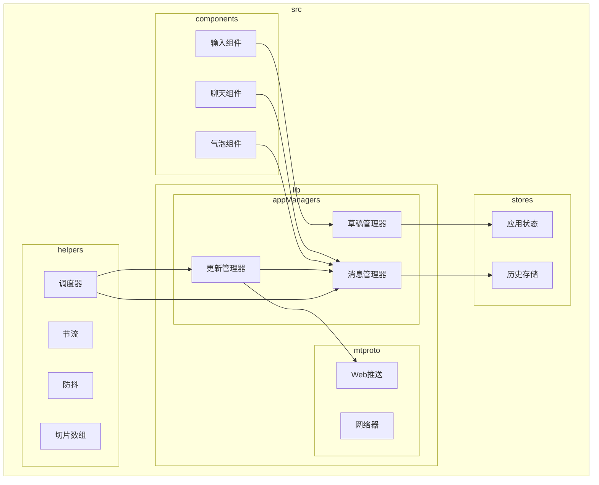
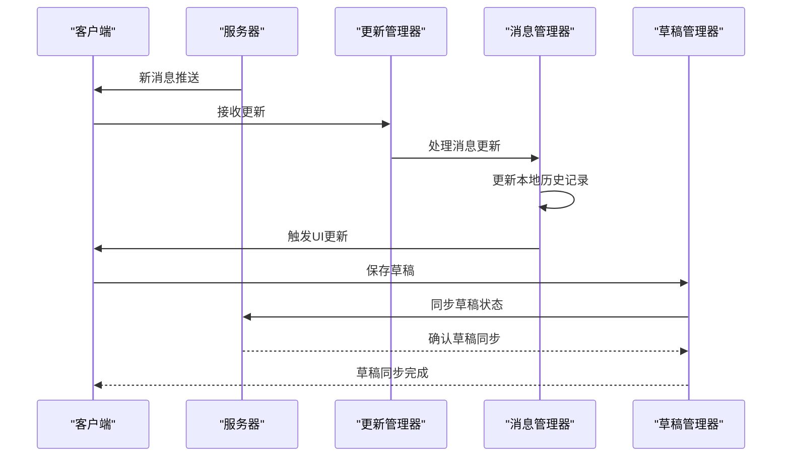
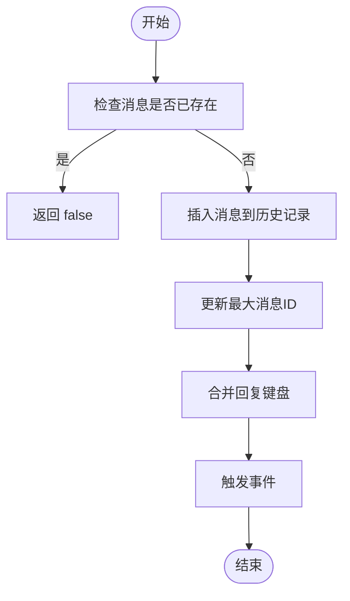
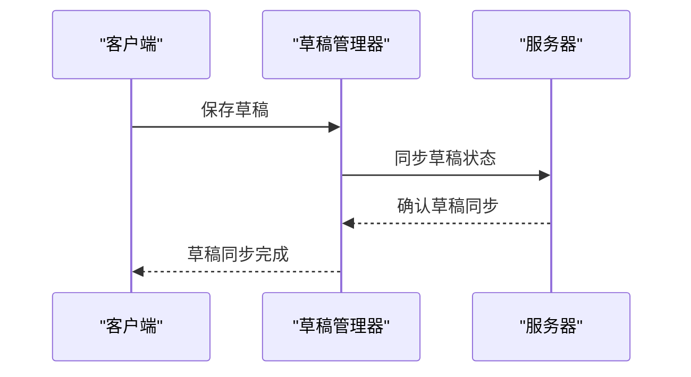
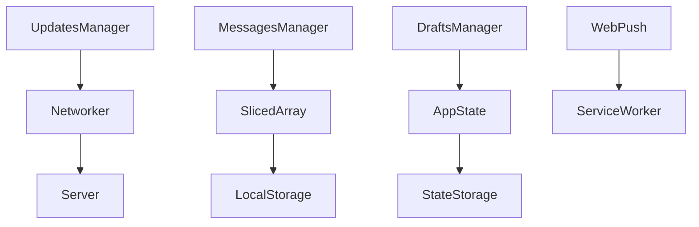
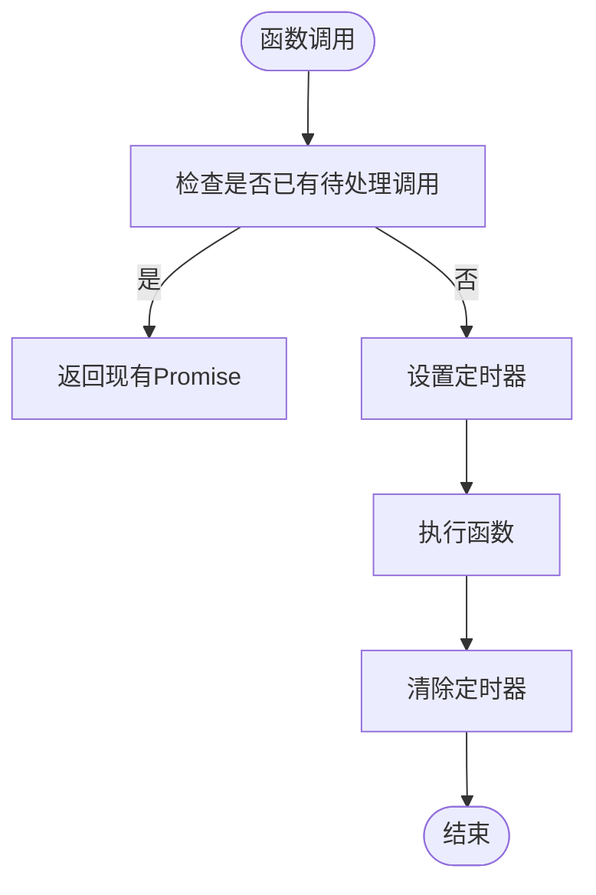

# 增量同步

<cite>
**本文档引用的文件**
- [apiUpdatesManager.ts](file://src/lib/appManagers/apiUpdatesManager.ts)
- [appMessagesManager.ts](file://src/lib/appManagers/appMessagesManager.ts)
- [appDraftsManager.ts](file://src/lib/appManagers/appDraftsManager.ts)
- [webPushApiManager.ts](file://src/lib/mtproto/webPushApiManager.ts)
- [serviceWorker/push.ts](file://src/lib/serviceWorker/push.ts)
- [schedulers.ts](file://src/helpers/schedulers/debounce.ts)
- [schedulers.ts](file://src/helpers/schedulers/throttle.ts)
- [slicedArray.ts](file://src/helpers/slicedArray.ts)
- [createMirroredStore.ts](file://src/helpers/solid/createMirroredStore.ts)
</cite>

## 目录
1. [引言](#引言)
2. [项目结构](#项目结构)
3. [核心组件](#核心组件)
4. [架构概述](#架构概述)
5. [详细组件分析](#详细组件分析)
6. [依赖分析](#依赖分析)
7. [性能考虑](#性能考虑)
8. [故障排除指南](#故障排除指南)
9. [结论](#结论)

## 引言
本文档详细阐述了消息应用中增量消息同步机制的实现方式。该机制允许客户端在首次同步后实时获取新消息，通过长轮询、WebSocket或事件推送等技术实现。文档深入探讨了增量更新的数据结构处理，包括消息的插入、更新和删除对本地状态的影响。同时，说明了同步触发条件，涵盖用户操作、后台轮询和系统事件等多种场景。此外，文档还记录了冲突检测机制，用于处理服务器消息与本地草稿之间的潜在冲突，并提供了性能优化措施，如批量处理、节流策略和网络流量压缩，以确保消息实时性的同时降低资源消耗。

## 项目结构
项目采用模块化设计，主要分为组件、配置、环境、帮助函数、钩子、库、模拟、页面、脚本、SCSS、存储和类型定义等目录。核心功能实现在`src/lib`目录下，特别是`appManagers`子目录中的各类管理器负责处理应用的核心逻辑，如消息、用户、聊天等。同步机制主要由`apiUpdatesManager.ts`和`appMessagesManager.ts`等文件实现，而性能优化和调度策略则分散在`helpers`目录下的各种工具函数中。



**图表来源**
- [apiUpdatesManager.ts](file://src/lib/appManagers/apiUpdatesManager.ts)
- [appMessagesManager.ts](file://src/lib/appManagers/appMessagesManager.ts)
- [appDraftsManager.ts](file://src/lib/appManagers/appDraftsManager.ts)
- [webPushApiManager.ts](file://src/lib/mtproto/webPushApiManager.ts)
- [schedulers.ts](file://src/helpers/schedulers/debounce.ts)
- [schedulers.ts](file://src/helpers/schedulers/throttle.ts)
- [slicedArray.ts](file://src/helpers/slicedArray.ts)

**章节来源**
- [apiUpdatesManager.ts](file://src/lib/appManagers/apiUpdatesManager.ts#L1-L818)
- [appMessagesManager.ts](file://src/lib/appManagers/appMessagesManager.ts#L1-L200)
- [schedulers.ts](file://src/helpers/schedulers/debounce.ts#L1-L79)
- [schedulers.ts](file://src/helpers/schedulers/throttle.ts#L1-L47)

## 核心组件
增量同步机制的核心组件包括更新管理器（`ApiUpdatesManager`）、消息管理器（`AppMessagesManager`）和草稿管理器（`AppDraftsManager`）。更新管理器负责处理来自服务器的更新消息，通过长轮询或WebSocket接收增量更新，并将其分发给相应的处理器。消息管理器管理本地消息历史记录，处理消息的插入、更新和删除操作，并维护消息的排序和状态。草稿管理器则负责管理用户的未发送消息草稿，确保在不同设备间同步草稿状态。

**章节来源**
- [apiUpdatesManager.ts](file://src/lib/appManagers/apiUpdatesManager.ts#L45-L818)
- [appMessagesManager.ts](file://src/lib/appManagers/appMessagesManager.ts#L119-L200)
- [appDraftsManager.ts](file://src/lib/appManagers/appDraftsManager.ts#L117-L389)

## 架构概述
系统的增量同步架构基于客户端-服务器模型，客户端通过长轮询或WebSocket与服务器保持连接，实时接收消息更新。当服务器有新消息时，会通过更新管理器将消息推送到客户端。客户端的消息管理器接收到更新后，会根据消息类型（新消息、编辑消息、删除消息等）更新本地消息历史记录，并触发相应的UI更新。草稿管理器则负责同步用户的未发送消息，确保在不同设备间的一致性。



**图表来源**
- [apiUpdatesManager.ts](file://src/lib/appManagers/apiUpdatesManager.ts#L182-L253)
- [appMessagesManager.ts](file://src/lib/appManagers/appMessagesManager.ts#L6726-L7037)
- [appDraftsManager.ts](file://src/lib/appManagers/appDraftsManager.ts#L144-L388)

## 详细组件分析

### 更新管理器分析
更新管理器是增量同步机制的核心，负责处理来自服务器的更新消息。它通过`processUpdateMessage`方法接收更新消息，并根据消息类型调用相应的处理器。对于新消息，它会调用`processUpdate`方法；对于消息编辑，它会调用`saveUpdate`方法。更新管理器还维护了一个待处理更新队列，用于处理因网络延迟或顺序错乱导致的更新消息。

#### 更新管理器类图
```mermaid
classDiagram
class ApiUpdatesManager {
+updatesState : UpdatesState
+channelStates : {[channelId : ChatId] : UpdatesState}
+subscriptions : {[channelId : ChatId] : {count : number, interval? : number}}
+processUpdateMessage(updateMessage : any, options : Partial<{override : boolean, ignoreSyncLoading : boolean, local : boolean}>) : void
+processUpdate(update : Update, options : Partial<{date : number, seq : number, seqStart : number}> & Parameters<ApiUpdatesManager['processUpdateMessage']>[1]) : boolean
+saveUpdate(update : Update) : void
+getDifference(first : boolean) : Promise<void>
+getChannelDifference(channelId : ChatId) : Promise<void>
}
class UpdatesState {
+pendingPtsUpdates : (Update & {pts : number, pts_count : number})[]
+pendingSeqUpdates? : {[seq : number] : {seq : number, date : number, updates : any[]}}
+syncPending : {seqAwaiting? : number, ptsAwaiting? : boolean, timeout : number}
+syncLoading : Promise<void>
+seq? : number
+pts? : number
+date? : number
+lastPtsUpdateTime? : number
+lastDifferenceTime? : number
}
ApiUpdatesManager --> UpdatesState : "包含"
```

**图表来源**
- [apiUpdatesManager.ts](file://src/lib/appManagers/apiUpdatesManager.ts#L26-L41)
- [apiUpdatesManager.ts](file://src/lib/appManagers/apiUpdatesManager.ts#L45-L818)

**章节来源**
- [apiUpdatesManager.ts](file://src/lib/appManagers/apiUpdatesManager.ts#L182-L253)

### 消息管理器分析
消息管理器负责管理本地消息历史记录，处理消息的插入、更新和删除操作。它通过`insertMessage`方法将新消息插入到历史记录中，并根据消息ID维护消息的排序。对于消息编辑，它会调用`editMessage`方法更新消息内容，并触发相应的UI更新。消息管理器还维护了一个消息历史存储，用于持久化消息数据。

#### 消息管理器流程图


**图表来源**
- [appMessagesManager.ts](file://src/lib/appManagers/appMessagesManager.ts#L6726-L7037)

**章节来源**
- [appMessagesManager.ts](file://src/lib/appManagers/appMessagesManager.ts#L6726-L7037)

### 草稿管理器分析
草稿管理器负责管理用户的未发送消息草稿，确保在不同设备间同步草稿状态。它通过`saveDraft`方法保存草稿，并将草稿同步到服务器。当用户在不同设备间切换时，草稿管理器会从服务器获取最新的草稿状态，并更新本地草稿。

#### 草稿管理器序列图


**图表来源**
- [appDraftsManager.ts](file://src/lib/appManagers/appDraftsManager.ts#L144-L388)

**章节来源**
- [appDraftsManager.ts](file://src/lib/appManagers/appDraftsManager.ts#L144-L388)

## 依赖分析
增量同步机制依赖于多个核心组件和外部服务。更新管理器依赖于网络层（`mtproto`）接收服务器推送，消息管理器依赖于本地存储（`slicedArray`）管理消息历史记录，草稿管理器依赖于应用状态管理（`appStateManager`）同步草稿状态。此外，系统还依赖于Web Push API进行消息推送通知，确保用户即使在应用未运行时也能收到新消息提醒。



**图表来源**
- [apiUpdatesManager.ts](file://src/lib/appManagers/apiUpdatesManager.ts#L28-L29)
- [appMessagesManager.ts](file://src/lib/appManagers/appMessagesManager.ts#L30-L31)
- [appDraftsManager.ts](file://src/lib/appManagers/appDraftsManager.ts#L134-L141)
- [webPushApiManager.ts](file://src/lib/mtproto/webPushApiManager.ts#L51-L52)
- [serviceWorker/push.ts](file://src/lib/serviceWorker/push.ts#L524-L526)

**章节来源**
- [apiUpdatesManager.ts](file://src/lib/appManagers/apiUpdatesManager.ts#L28-L29)
- [appMessagesManager.ts](file://src/lib/appManagers/appMessagesManager.ts#L30-L31)
- [appDraftsManager.ts](file://src/lib/appManagers/appDraftsManager.ts#L134-L141)
- [webPushApiManager.ts](file://src/lib/mtproto/webPushApiManager.ts#L51-L52)
- [serviceWorker/push.ts](file://src/lib/serviceWorker/push.ts#L524-L526)

## 性能考虑
为了确保消息实时性的同时降低资源消耗，系统采用了多种性能优化措施。首先，通过节流（throttle）和防抖（debounce）技术控制更新频率，避免频繁的网络请求和UI更新。其次，使用切片数组（slicedArray）高效管理大量消息数据，减少内存占用和提高访问速度。此外，系统还实现了批量处理机制，将多个小更新合并为一个大更新，减少网络开销。

### 节流与防抖策略


**图表来源**
- [schedulers.ts](file://src/helpers/schedulers/debounce.ts#L1-L79)
- [schedulers.ts](file://src/helpers/schedulers/throttle.ts#L1-L47)

**章节来源**
- [schedulers.ts](file://src/helpers/schedulers/debounce.ts#L1-L79)
- [schedulers.ts](file://src/helpers/schedulers/throttle.ts#L1-L47)

## 故障排除指南
在使用增量同步机制时，可能会遇到一些常见问题。例如，消息不同步、草稿丢失或推送通知不工作等。以下是一些常见的故障排除步骤：

1. **检查网络连接**：确保设备网络连接正常，能够访问服务器。
2. **检查同步状态**：查看应用的同步状态，确认是否正在进行同步。
3. **清除缓存**：尝试清除应用缓存，重新同步数据。
4. **检查权限**：确保应用具有必要的权限，如网络访问和通知权限。
5. **查看日志**：检查应用日志，查找可能的错误信息。

**章节来源**
- [apiUpdatesManager.ts](file://src/lib/appManagers/apiUpdatesManager.ts#L279-L372)
- [appMessagesManager.ts](file://src/lib/appManagers/appMessagesManager.ts#L6269-L8618)
- [webPushApiManager.ts](file://src/lib/mtproto/webPushApiManager.ts#L64-L66)

## 结论
本文档详细介绍了消息应用中增量消息同步机制的实现方式。通过长轮询、WebSocket或事件推送等技术，客户端能够在首次同步后实时获取新消息。系统通过更新管理器、消息管理器和草稿管理器等核心组件，实现了消息的插入、更新和删除对本地状态的影响。同时，通过节流、防抖和批量处理等性能优化措施，确保了消息实时性的同时降低了资源消耗。未来可以进一步优化同步算法，提高同步效率和可靠性。