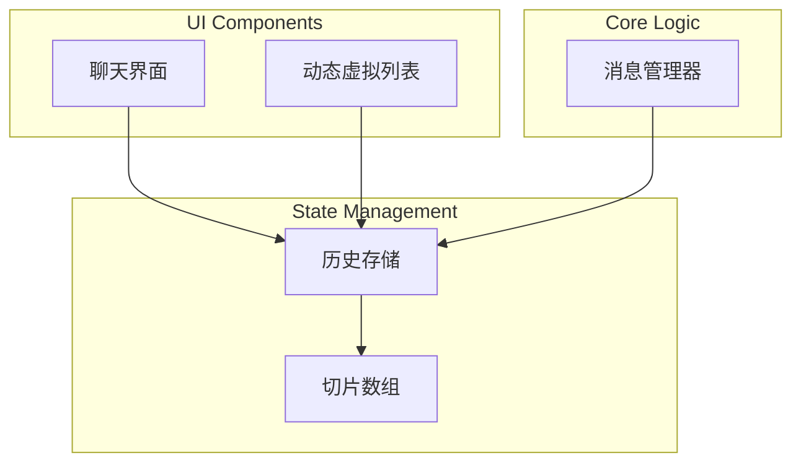
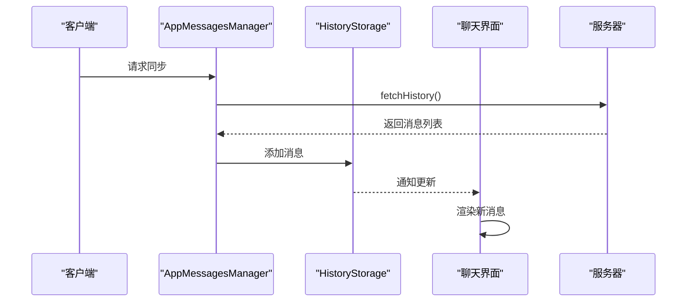
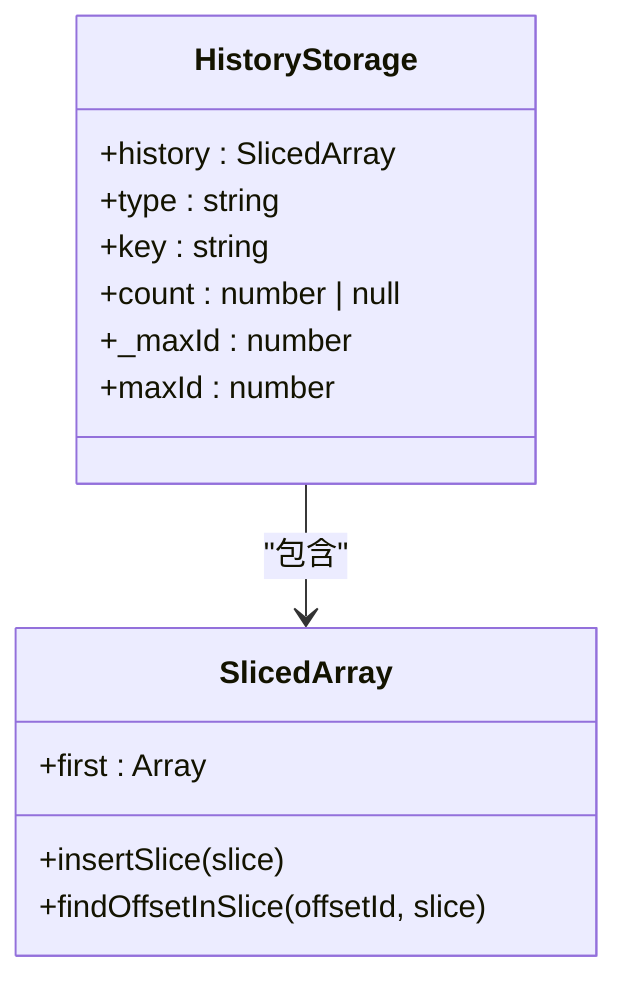
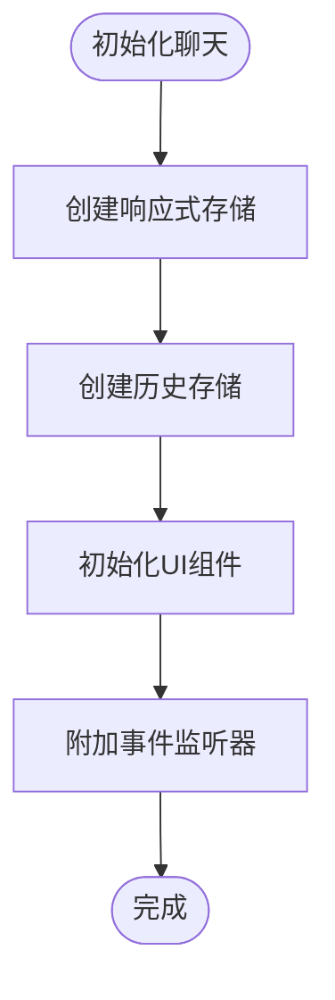
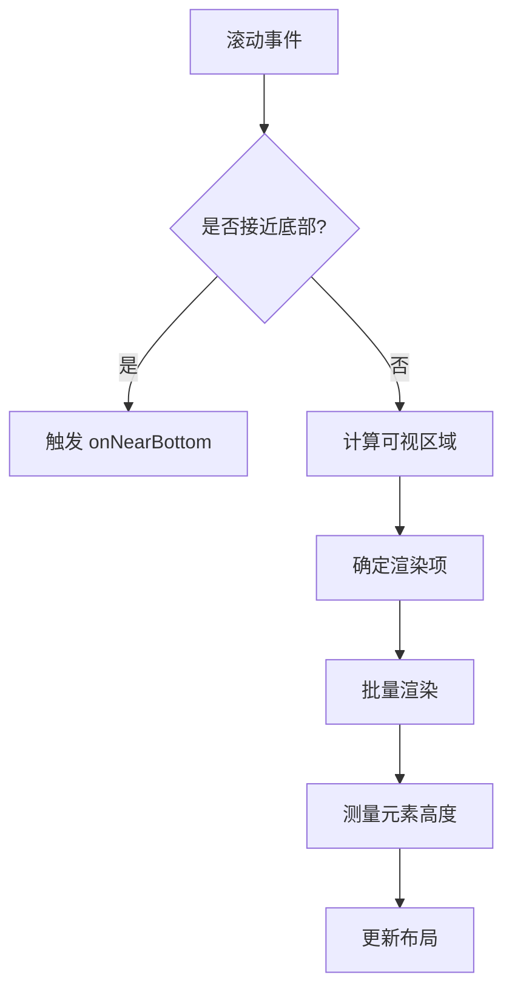
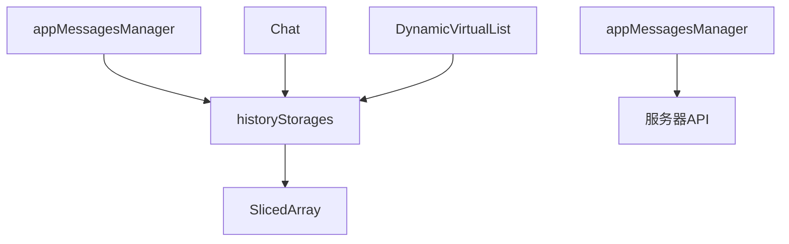

# 消息同步

<cite>
**本文档中引用的文件**  
- [historyStorages.ts](file://src/stores/historyStorages.ts)
- [createHistoryStorage.ts](file://src/lib/appManagers/utils/messages/createHistoryStorage.ts)
- [chat.ts](file://src/components/chat/chat.ts)
- [appMessagesManager.ts](file://src/lib/appManagers/appMessagesManager.ts)
- [slicedArray.ts](file://src/helpers/slicedArray.ts)
- [dynamicVirtualList/index.tsx](file://src/components/dynamicVirtualList/index.tsx)
</cite>

## 目录
1. [简介](#简介)
2. [项目结构](#项目结构)
3. [核心组件](#核心组件)
4. [架构概述](#架构概述)
5. [详细组件分析](#详细组件分析)
6. [依赖分析](#依赖分析)
7. [性能考虑](#性能考虑)
8. [故障排除指南](#故障排除指南)
9. [结论](#结论)

## 简介
本文档详细阐述了客户端与服务器之间的消息同步机制，涵盖首次同步、增量同步、同步范围确定、冲突解决、分页加载、同步状态管理及性能优化等关键方面。系统通过高效的数据结构和算法实现消息的实时同步与本地缓存管理，确保用户体验流畅且数据一致。

## 项目结构
项目采用模块化设计，消息同步相关功能主要分布在 `src/lib/appManagers` 和 `src/stores` 目录下。核心消息管理由 `appMessagesManager` 负责，历史消息存储通过 `historyStorages` 管理，UI 层的聊天界面由 `chat` 组件驱动，虚拟列表实现高效渲染。

**Diagram sources**
- [chat.ts](file://src/components/chat/chat.ts)
- [historyStorages.ts](file://src/stores/historyStorages.ts)
- [slicedArray.ts](file://src/helpers/slicedArray.ts)
- [appMessagesManager.ts](file://src/lib/appManagers/appMessagesManager.ts)

**Section sources**
- [src/components](file://src/components)
- [src/lib/appManagers](file://src/lib/appManagers)
- [src/stores](file://src/stores)

## 核心组件
系统的核心是 `appMessagesManager`，它负责与服务器通信，管理消息的获取、存储和同步。`historyStorages` 作为状态存储，使用 `SlicedArray` 高效管理消息历史，支持分页和增量更新。`Chat` 组件监听存储变化，驱动 UI 更新。

**Section sources**
- [appMessagesManager.ts](file://src/lib/appManagers/appMessagesManager.ts)
- [historyStorages.ts](file://src/stores/historyStorages.ts)
- [chat.ts](file://src/components/chat/chat.ts)

## 架构概述
消息同步采用客户端-服务器架构。客户端通过 `appMessagesManager` 发起同步请求，服务器返回消息数据。客户端将数据存入 `HistoryStorage`，该存储使用 `SlicedArray` 维护有序消息列表。UI 组件通过 Solid.js 的响应式系统订阅存储变化，实现视图自动更新。

**Diagram sources**
- [appMessagesManager.ts](file://src/lib/appManagers/appMessagesManager.ts)
- [historyStorages.ts](file://src/stores/historyStorages.ts)
- [chat.ts](file://src/components/chat/chat.ts)

## 详细组件分析

### 历史存储分析
`HistoryStorage` 是消息同步的核心数据结构，封装了消息列表、类型和计数等信息。

#### 类图

**Diagram sources**
- [createHistoryStorage.ts](file://src/lib/appManagers/utils/messages/createHistoryStorage.ts)
- [slicedArray.ts](file://src/helpers/slicedArray.ts)

**Section sources**
- [createHistoryStorage.ts](file://src/lib/appManagers/utils/messages/createHistoryStorage.ts)
- [historyStorages.ts](file://src/stores/historyStorages.ts)

### 聊天界面分析
`Chat` 组件是消息同步的UI入口，负责初始化、设置对等体和管理UI元素。

#### 初始化流程

**Diagram sources**
- [chat.ts](file://src/components/chat/chat.ts)

**Section sources**
- [chat.ts](file://src/components/chat/chat.ts)

### 虚拟列表分析
`DynamicVirtualList` 组件实现无限滚动和分页加载，优化大量消息的渲染性能。

#### 渲染流程

**Diagram sources**
- [dynamicVirtualList/index.tsx](file://src/components/dynamicVirtualList/index.tsx)

**Section sources**
- [dynamicVirtualList/index.tsx](file://src/components/dynamicVirtualList/index.tsx)

## 依赖分析
系统各组件间存在清晰的依赖关系，确保了功能的解耦和可维护性。

**Diagram sources**
- [appMessagesManager.ts](file://src/lib/appManagers/appMessagesManager.ts)
- [historyStorages.ts](file://src/stores/historyStorages.ts)
- [slicedArray.ts](file://src/helpers/slicedArray.ts)
- [chat.ts](file://src/components/chat/chat.ts)
- [dynamicVirtualList/index.tsx](file://src/components/dynamicVirtualList/index.tsx)

**Section sources**
- [package.json](file://package.json)
- [src/lib/appManagers](file://src/lib/appManagers)

## 性能考虑
系统通过多种机制优化消息同步性能：
- 使用 `SlicedArray` 实现高效的增量更新和范围查询
- 虚拟列表按需渲染，减少DOM操作
- 响应式系统最小化不必要的重新渲染
- 批量处理和防抖优化事件处理

## 故障排除指南
常见问题及解决方案：
- **消息不同步**：检查网络连接，验证 `appMessagesManager` 的请求是否成功
- **滚动卡顿**：检查虚拟列表的 `estimateItemHeight` 是否准确
- **内存泄漏**：确保组件销毁时清理所有事件监听器和订阅

**Section sources**
- [chat.ts](file://src/components/chat/chat.ts)
- [appMessagesManager.ts](file://src/lib/appManagers/appMessagesManager.ts)

## 结论
本系统实现了高效、可靠的消息同步机制，通过合理的架构设计和性能优化，确保了在各种场景下的流畅体验。未来可进一步优化冲突解决策略和离线同步能力。