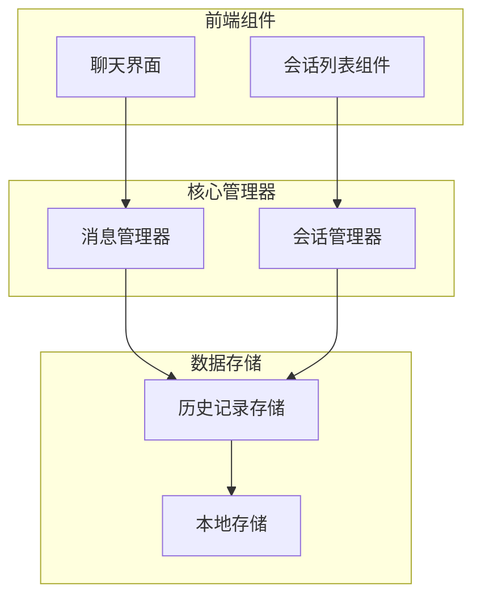
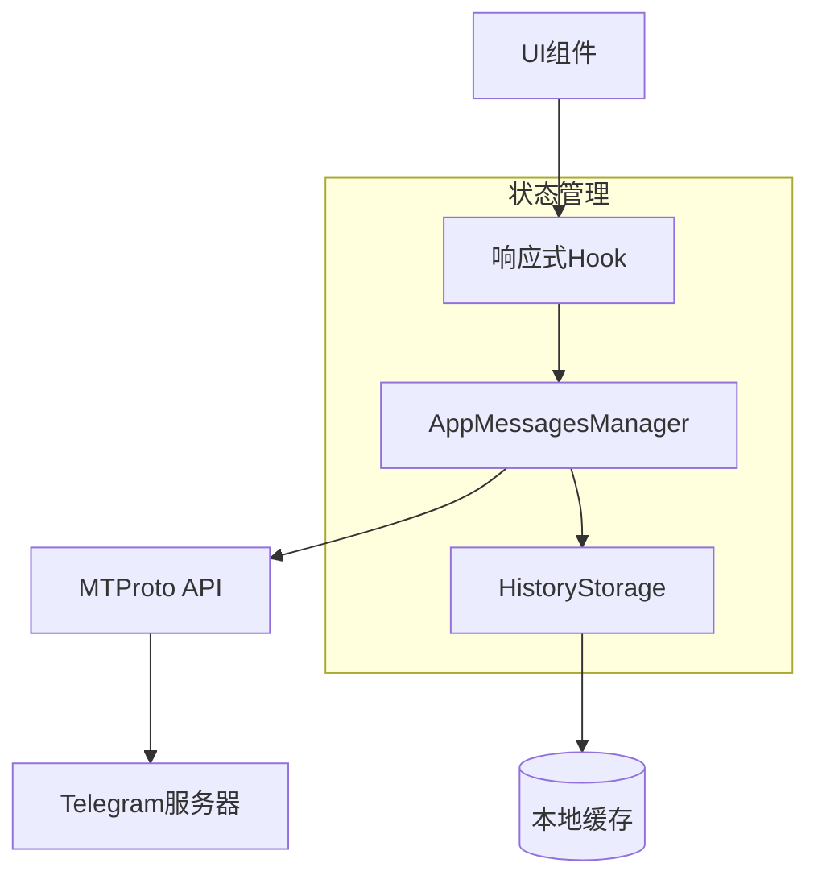
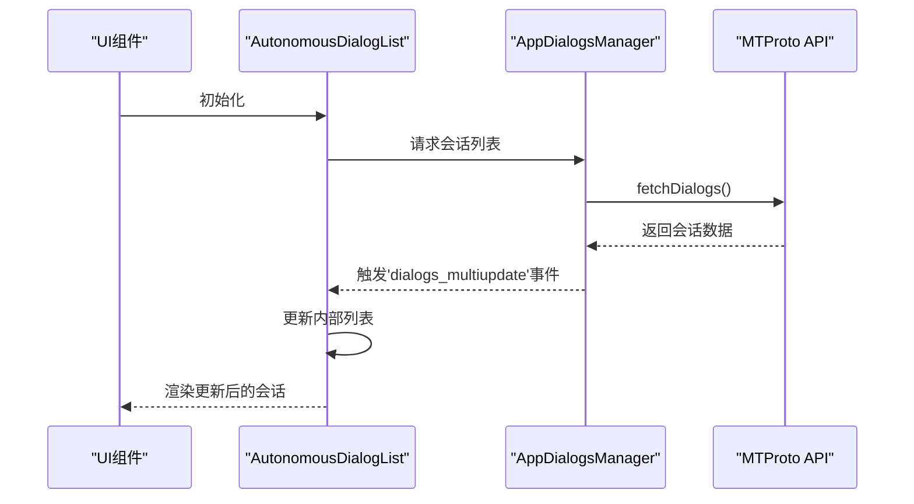
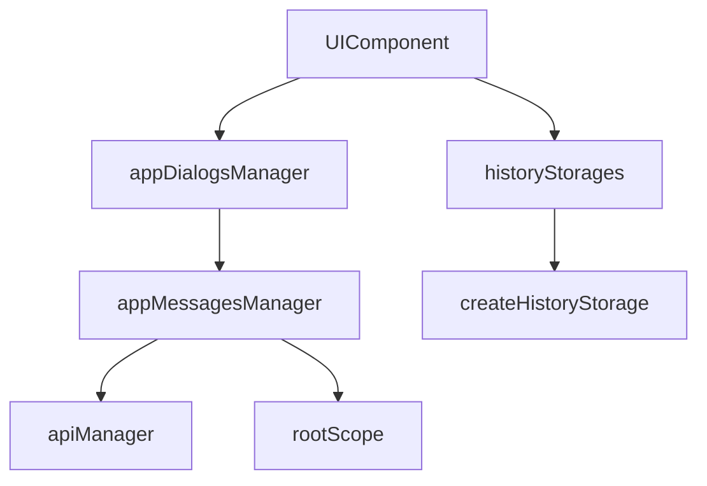

# 首次同步

<cite>
**本文档中引用的文件**  
- [manager.ts](file://src/lib/appManagers/manager.ts)
- [historyStorages.ts](file://src/stores/historyStorages.ts)
- [createHistoryStorage.ts](file://src/lib/appManagers/utils/messages/createHistoryStorage.ts)
- [dialogs.ts](file://src/components/autonomousDialogList/dialogs.ts)
- [appMessagesManager.ts](file://src/lib/appManagers/appMessagesManager.ts)
- [appDialogsManager.ts](file://src/lib/appManagers/appDialogsManager.ts)
</cite>

## 目录
1. [简介](#简介)
2. [项目结构](#项目结构)
3. [核心组件](#核心组件)
4. [架构概述](#架构概述)
5. [详细组件分析](#详细组件分析)
6. [依赖分析](#依赖分析)
7. [性能考虑](#性能考虑)
8. [故障排除指南](#故障排除指南)
9. [结论](#结论)

## 简介
本文档详细阐述了Telegram Web客户端在用户首次初始化时的消息同步机制。重点描述了客户端如何从服务器获取完整的消息历史记录，包括会话列表的加载顺序、并行请求策略、数据范围确定逻辑、状态管理机制、分页与批量处理策略，以及性能优化措施。该机制确保用户能够快速进入主界面并获得完整的聊天历史体验。

## 项目结构
项目采用模块化架构，主要分为组件（components）、管理器（appManagers）、存储（stores）和工具函数（helpers）等核心目录。消息同步功能主要由`appMessagesManager`和`appDialogsManager`等管理器类实现，配合`historyStorages`进行本地状态管理。会话列表的渲染由`autonomousDialogList`等组件负责。



**Diagram sources**
- [dialogs.ts](file://src/components/autonomousDialogList/dialogs.ts#L1-L340)
- [appMessagesManager.ts](file://src/lib/appManagers/appMessagesManager.ts#L1-L50)
- [historyStorages.ts](file://src/stores/historyStorages.ts#L1-L29)

**Section sources**
- [src/components/autonomousDialogList](file://src/components/autonomousDialogList)
- [src/lib/appManagers](file://src/lib/appManagers)
- [src/stores](file://src/stores)

## 核心组件
首次消息同步的核心逻辑由`AppMessagesManager`和`AppDialogsManager`两个管理器类实现。`AppMessagesManager`负责与MTProto协议层通信，获取消息历史数据，并通过`HistoryStorage`对象管理每个会话的消息缓存。`AppDialogsManager`则负责管理会话列表的加载和排序。`historyStorages`模块利用SolidJS的响应式系统，为UI组件提供高效的数据绑定。

**Section sources**
- [manager.ts](file://src/lib/appManagers/manager.ts#L66-L147)
- [appMessagesManager.ts](file://src/lib/appManagers/appMessagesManager.ts)
- [appDialogsManager.ts](file://src/lib/appManagers/appDialogsManager.ts)

## 架构概述
首次同步的架构遵循分层设计原则。UI层通过`useHistoryStorage`等Hook订阅数据；业务逻辑层的管理器类（Manager）处理复杂的同步逻辑和状态管理；数据访问层通过`apiManager`与Telegram的MTProto API进行通信。`HistoryStorage`作为核心数据结构，封装了消息历史的分页加载、缓存和查询逻辑。



**Diagram sources**
- [historyStorages.ts](file://src/stores/historyStorages.ts#L1-L29)
- [createHistoryStorage.ts](file://src/lib/appManagers/utils/messages/createHistoryStorage.ts#L1-L50)
- [manager.ts](file://src/lib/appManagers/manager.ts#L66-L147)

## 详细组件分析

### 消息历史存储分析
`HistoryStorage`是消息同步的核心数据结构，它使用`SlicedArray`来高效地管理分页加载的消息列表。

```mermaid
classDiagram
class HistoryStorage {
+history : SlicedArray~number~
+type : string
+key : string
+count : number | null
+_maxId : number | undefined
+get maxId() : number | undefined
}
class SlicedArray {
+first : T[]
+insertSlice(slice : T[]) : T[]
+findOffsetInSlice(offsetId : any, slice : T[]) : {slice : T[], offset : number} | undefined
}
HistoryStorage --> SlicedArray : "包含"
```

**Diagram sources**
- [createHistoryStorage.ts](file://src/lib/appManagers/utils/messages/createHistoryStorage.ts#L9-L28)
- [slicedArray.ts](file://src/helpers/slicedArray.ts)

**Section sources**
- [createHistoryStorage.ts](file://src/lib/appManagers/utils/messages/createHistoryStorage.ts#L1-L50)
- [slicedArray.ts](file://src/helpers/slicedArray.ts)

### 会话列表加载分析
`AutonomousDialogList`组件负责加载和渲染会话列表。它通过监听`rootScope`上的各种事件（如`dialogs_multiupdate`、`dialog_flush`）来实时更新UI。



**Diagram sources**
- [dialogs.ts](file://src/components/autonomousDialogList/dialogs.ts#L33-L90)
- [appDialogsManager.ts](file://src/lib/appManagers/appDialogsManager.ts)

**Section sources**
- [dialogs.ts](file://src/components/autonomousDialogList/dialogs.ts#L1-L340)
- [appDialogsManager.ts](file://src/lib/appManagers/appDialogsManager.ts)

## 依赖分析
首次同步机制依赖于多个核心模块。`appMessagesManager`依赖`apiManager`进行网络通信，并依赖`rootScope`进行事件分发。`historyStorages`依赖`createHistoryStorage`工厂函数来创建存储实例。UI组件通过`managers`对象访问所有管理器，形成了清晰的依赖链。



**Diagram sources**
- [manager.ts](file://src/lib/appManagers/manager.ts#L84-L93)
- [historyStorages.ts](file://src/stores/historyStorages.ts#L3)
- [dialogs.ts](file://src/components/autonomousDialogList/dialogs.ts#L3-L4)

**Section sources**
- [manager.ts](file://src/lib/appManagers/manager.ts#L66-L147)
- [appMessagesManager.ts](file://src/lib/appManagers/appMessagesManager.ts)
- [appDialogsManager.ts](file://src/lib/appManagers/appDialogsManager.ts)

## 性能考虑
该机制通过多种方式优化性能。使用`SlicedArray`进行分页加载，避免一次性加载大量消息导致内存溢出。`BatchProcessor`用于批量处理DOM更新，减少重排重绘。`SolidJS`的细粒度响应式系统确保只有受影响的UI组件才会重新渲染。此外，`HistoryStorage`的`maxId`属性使用getter进行惰性计算，避免不必要的性能开销。

## 故障排除指南
若首次同步失败，应检查以下方面：1) 网络连接是否正常；2) `apiManager`是否成功建立与服务器的连接；3) `HistoryStorage`的`key`是否正确生成；4) `rootScope`事件监听器是否正常工作。可通过在`manager.ts`中设置断点，跟踪`setManagersAndAccountNumber`的调用流程来诊断初始化问题。

**Section sources**
- [manager.ts](file://src/lib/appManagers/manager.ts#L141-L147)
- [appMessagesManager.ts](file://src/lib/appManagers/appMessagesManager.ts)

## 结论
Telegram Web客户端的首次消息同步机制是一个高效、健壮的系统。它通过分层架构、响应式数据流和智能的分页策略，确保了用户在登录后能够快速、流畅地访问其完整的消息历史。该设计充分考虑了性能、可维护性和用户体验，是现代Web应用状态管理的一个优秀范例。