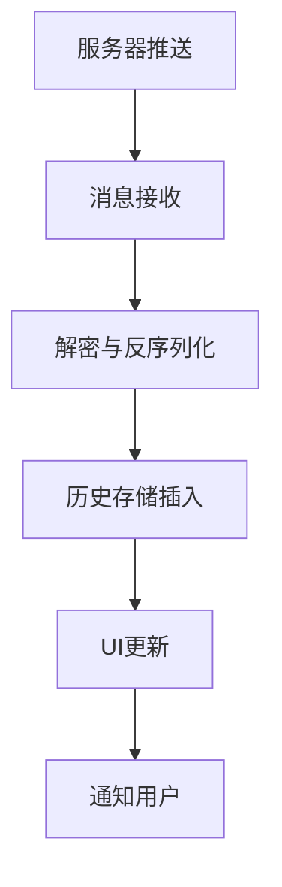
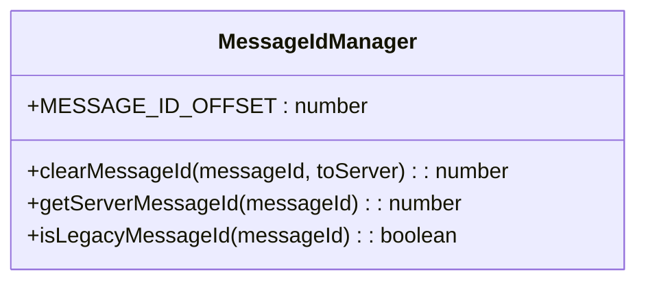
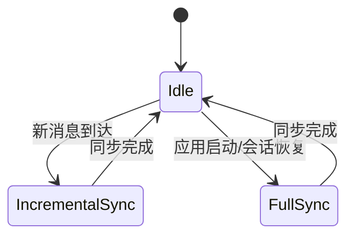
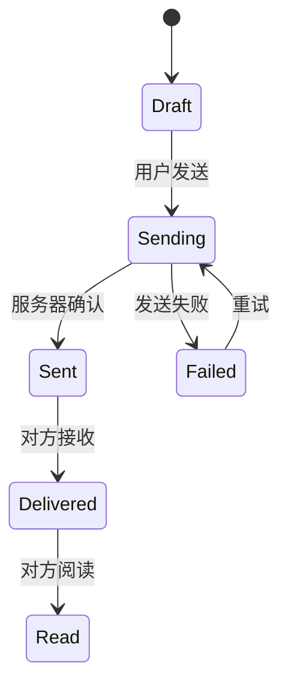
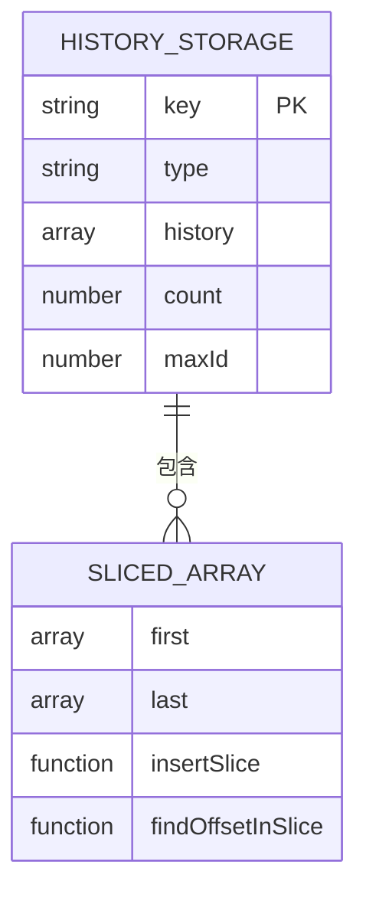
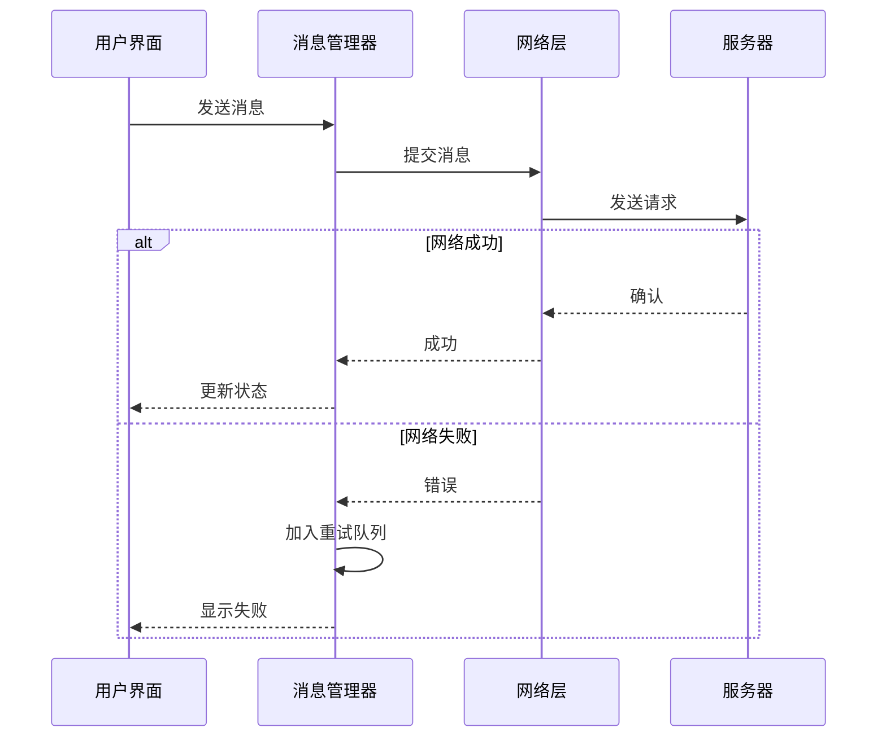
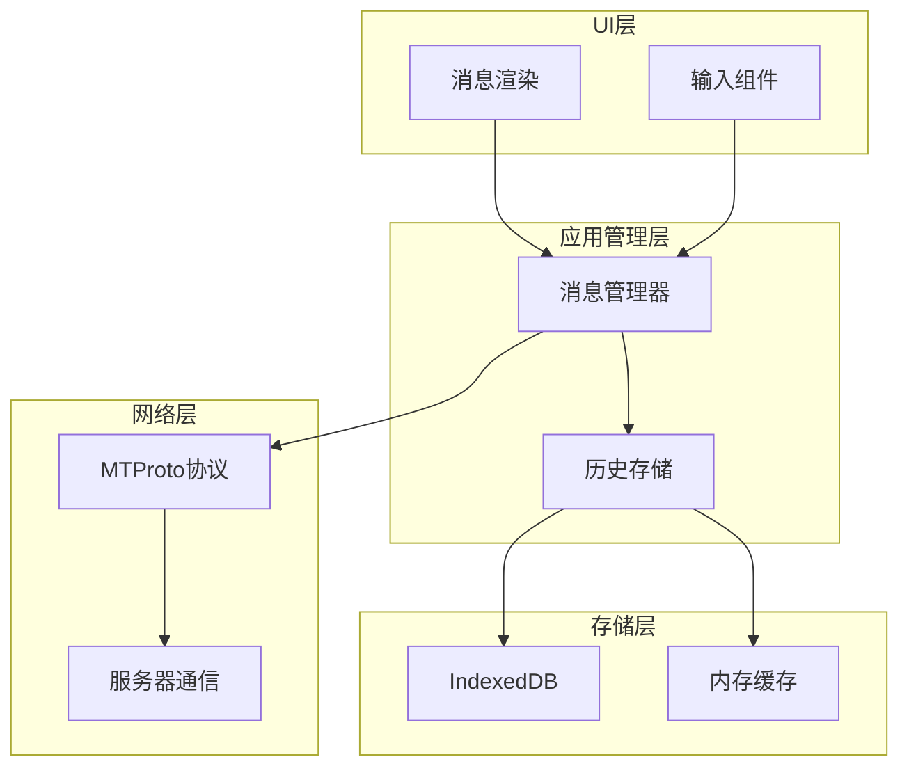

# 消息处理

<cite>
**本文档引用的文件**
- [appMessagesManager.ts](file://src/lib/appManagers/appMessagesManager.ts)
- [clearMessageId.ts](file://src/lib/appManagers/utils/messageId/clearMessageId.ts)
- [getServerMessageId.ts](file://src/lib/appManagers/utils/messageId/getServerMessageId.ts)
- [isLegacyMessageId.ts](file://src/lib/appManagers/utils/messageId/isLegacyMessageId.ts)
- [createHistoryStorage.ts](file://src/lib/appManagers/utils/messages/createHistoryStorage.ts)
- [historyStorages.ts](file://src/stores/historyStorages.ts)
- [messageRender.ts](file://src/components/chat/messageRender.ts)
</cite>

## 目录
1. [简介](#简介)
2. [消息创建与发送流程](#消息创建与发送流程)
3. [消息接收与存储机制](#消息接收与存储机制)
4. [消息ID生成与管理](#消息id生成与管理)
5. [消息同步策略](#消息同步策略)
6. [消息状态管理](#消息状态管理)
7. [消息缓存与持久化](#消息缓存与持久化)
8. [消息去重与排序算法](#消息去重与排序算法)
9. [错误处理与重试机制](#错误处理与重试机制)
10. [架构概览](#架构概览)

## 简介
本文件详细描述了Telegram Web客户端的消息处理机制，涵盖消息的创建、发送、接收、存储、同步和状态管理等核心功能。系统采用基于MTProto协议的客户端-服务器架构，通过IndexedDB实现本地持久化存储，并维护消息ID映射关系以支持离线操作和状态同步。

## 消息创建与发送流程
消息创建始于用户输入，系统生成带有临时ID的本地消息对象。该临时ID用于在等待服务器确认期间标识消息。消息通过MTProto协议发送到Telegram服务器，同时更新本地状态为"发送中"。发送过程包含序列化、加密和网络传输等步骤。

**Section sources**
- [appMessagesManager.ts](file://src/lib/appManagers/appMessagesManager.ts#L1-L500)
- [messageRender.ts](file://src/components/chat/messageRender.ts#L1-L100)

## 消息接收与存储机制
消息接收由应用管理器监听服务器推送事件触发。接收到的消息经过解密和反序列化处理后，通过历史存储机制进行组织。系统使用SlicedArray数据结构管理消息历史，支持高效的消息插入和检索操作。

**Diagram sources**
- [appMessagesManager.ts](file://src/lib/appManagers/appMessagesManager.ts#L200-L300)
- [historyStorages.ts](file://src/stores/historyStorages.ts#L1-L50)

**Section sources**
- [appMessagesManager.ts](file://src/lib/appManagers/appMessagesManager.ts#L200-L400)
- [historyStorages.ts](file://src/stores/historyStorages.ts#L1-L50)

## 消息ID生成与管理
系统采用混合消息ID机制，区分客户端生成的临时ID和服务器分配的永久ID。临时ID用于标识尚未确认的消息，而服务器ID由Telegram后端生成。`clearMessageId`和`getServerMessageId`工具函数负责ID转换和清理，`MESSAGE_ID_OFFSET`常量定义了ID空间的分界点。

**Diagram sources**
- [clearMessageId.ts](file://src/lib/appManagers/utils/messageId/clearMessageId.ts#L1-L33)
- [getServerMessageId.ts](file://src/lib/appManagers/utils/messageId/getServerMessageId.ts#L1-L15)
- [isLegacyMessageId.ts](file://src/lib/appManagers/utils/messageId/isLegacyMessageId.ts#L1-L6)

**Section sources**
- [clearMessageId.ts](file://src/lib/appManagers/utils/messageId/clearMessageId.ts#L1-L33)
- [getServerMessageId.ts](file://src/lib/appManagers/utils/messageId/getServerMessageId.ts#L1-L15)
- [isLegacyMessageId.ts](file://src/lib/appManagers/utils/messageId/isLegacyMessageId.ts#L1-L6)

## 消息同步策略
消息同步采用增量更新与全量同步相结合的策略。增量更新通过监听服务器事件实时同步新消息，而全量同步在应用启动或会话恢复时触发。同步条件包括：应用从后台恢复、网络连接重新建立、用户切换会话等场景。

**Section sources**
- [appMessagesManager.ts](file://src/lib/appManagers/appMessagesManager.ts#L500-L800)
- [historyStorages.ts](file://src/stores/historyStorages.ts#L20-L60)

## 消息状态管理
消息状态机涵盖发送中、已发送、已送达、已读等状态。状态转换由网络事件和用户交互驱动。系统通过`sendingStatus`组件可视化消息状态，并在本地存储中维护状态信息，确保跨设备状态一致性。

**Section sources**
- [appMessagesManager.ts](file://src/lib/appManagers/appMessagesManager.ts#L300-L500)
- [messageRender.ts](file://src/components/chat/messageRender.ts#L50-L150)

## 消息缓存与持久化
系统使用IndexedDB实现消息的本地持久化存储，通过`historyStorages`管理不同会话的历史记录。`createHistoryStorage`函数初始化历史存储结构，包含消息列表、计数和最大ID等元数据。SlicedArray数据结构优化了大量消息的内存管理和访问性能。

**Diagram sources**
- [createHistoryStorage.ts](file://src/lib/appManagers/utils/messages/createHistoryStorage.ts#L1-L50)
- [historyStorages.ts](file://src/stores/historyStorages.ts#L1-L30)

**Section sources**
- [createHistoryStorage.ts](file://src/lib/appManagers/utils/messages/createHistoryStorage.ts#L1-L50)
- [historyStorages.ts](file://src/stores/historyStorages.ts#L1-L50)

## 消息去重与排序算法
系统通过消息ID和时间戳确保消息顺序的正确性。SlicedArray的有序插入机制防止重复消息，并维护时间序列的完整性。排序算法优先考虑服务器时间戳，同时处理客户端时钟偏差的情况，确保跨设备消息顺序的一致性。

**Section sources**
- [createHistoryStorage.ts](file://src/lib/appManagers/utils/messages/createHistoryStorage.ts#L30-L50)
- [appMessagesManager.ts](file://src/lib/appManagers/appMessagesManager.ts#L400-L500)

## 错误处理与重试机制
网络异常情况下的消息发送通过重试队列和错误状态管理处理。失败的消息标记为"发送失败"状态，并在网络恢复后自动重试。系统记录错误类型和重试次数，避免无限重试循环，并向用户提供明确的错误反馈。

**Diagram sources**
- [appMessagesManager.ts](file://src/lib/appManagers/appMessagesManager.ts#L600-L800)

**Section sources**
- [appMessagesManager.ts](file://src/lib/appManagers/appMessagesManager.ts#L600-L900)

## 架构概览
消息处理系统采用分层架构，包括UI层、应用管理层、存储层和网络层。各层通过明确定义的接口通信，确保关注点分离和模块化设计。应用管理器作为核心协调组件，处理消息生命周期的所有阶段。

**Diagram sources**
- [appMessagesManager.ts](file://src/lib/appManagers/appMessagesManager.ts#L1-L100)
- [historyStorages.ts](file://src/stores/historyStorages.ts#L1-L20)

**Section sources**
- [appMessagesManager.ts](file://src/lib/appManagers/appMessagesManager.ts#L1-L100)
- [historyStorages.ts](file://src/stores/historyStorages.ts#L1-L20)