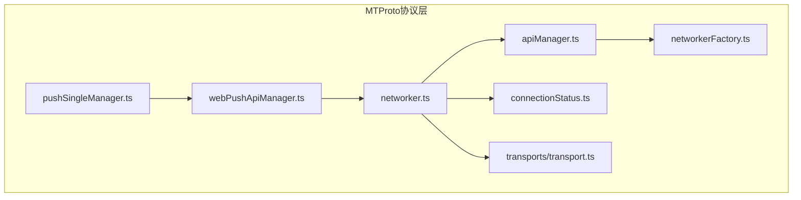
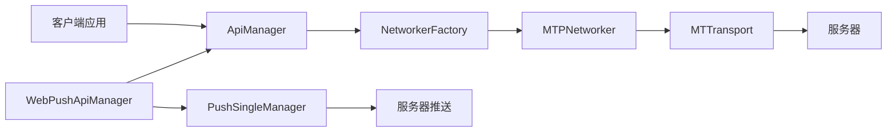
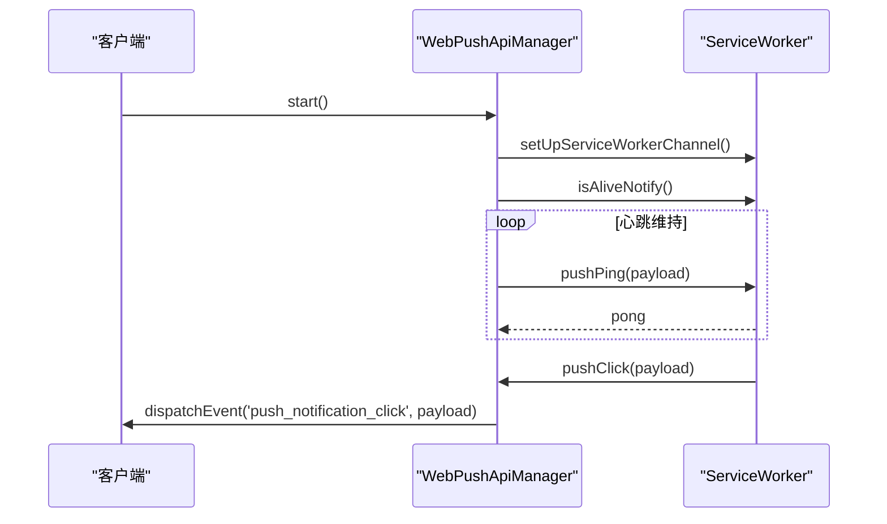
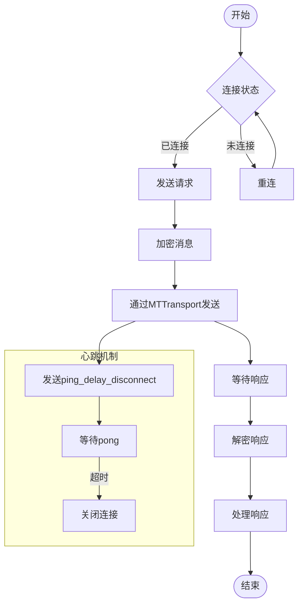
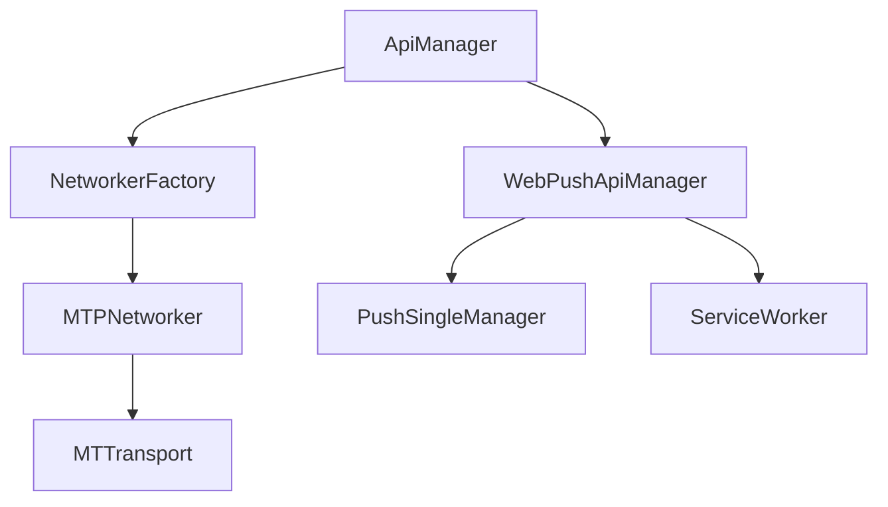

# 更新监听

<cite>
**本文档中引用的文件**  
- [pushSingleManager.ts](file://src/lib/mtproto/pushSingleManager.ts)
- [webPushApiManager.ts](file://src/lib/mtproto/webPushApiManager.ts)
- [networker.ts](file://src/lib/mtproto/networker.ts)
- [apiManager.ts](file://src/lib/mtproto/apiManager.ts)
- [connectionStatus.ts](file://src/lib/mtproto/connectionStatus.ts)
- [networkerFactory.ts](file://src/lib/mtproto/networkerFactory.ts)
- [transport.ts](file://src/lib/mtproto/transports/transport.ts)
</cite>

## 目录
1. [简介](#简介)
2. [项目结构](#项目结构)
3. [核心组件](#核心组件)
4. [架构概述](#架构概述)
5. [详细组件分析](#详细组件分析)
6. [依赖分析](#依赖分析)
7. [性能考虑](#性能考虑)
8. [故障排除指南](#故障排除指南)
9. [结论](#结论)

## 简介
本文档详细描述了基于MTProto协议的API更新管理器的实现机制，重点阐述客户端如何接收服务器推送的实时更新。文档涵盖了连接建立、心跳维持、断线重连等网络通信机制，以及不同类型更新消息的监听与分发流程。同时，深入解析了更新队列的管理策略，包括顺序保证、去重处理和优先级排序，并提供了错误处理与恢复机制的完整说明。最后，文档还包含了性能优化建议，如批量处理更新和资源释放的最佳实践。

## 项目结构
项目采用模块化设计，将MTProto协议相关的功能集中于`src/lib/mtproto`目录下。该目录包含了网络传输、消息加密、连接管理、更新推送等核心功能模块。整体结构清晰，各组件职责分明，便于维护和扩展。



**图源**
- [pushSingleManager.ts](file://src/lib/mtproto/pushSingleManager.ts)
- [webPushApiManager.ts](file://src/lib/mtproto/webPushApiManager.ts)
- [networker.ts](file://src/lib/mtproto/networker.ts)
- [apiManager.ts](file://src/lib/mtproto/apiManager.ts)
- [networkerFactory.ts](file://src/lib/mtproto/networkerFactory.ts)
- [connectionStatus.ts](file://src/lib/mtproto/connectionStatus.ts)
- [transport.ts](file://src/lib/mtproto/transports/transport.ts)

**节源**
- [pushSingleManager.ts](file://src/lib/mtproto/pushSingleManager.ts)
- [webPushApiManager.ts](file://src/lib/mtproto/webPushApiManager.ts)
- [networker.ts](file://src/lib/mtproto/networker.ts)
- [apiManager.ts](file://src/lib/mtproto/apiManager.ts)
- [networkerFactory.ts](file://src/lib/mtproto/networkerFactory.ts)
- [connectionStatus.ts](file://src/lib/mtproto/connectionStatus.ts)
- [transport.ts](file://src/lib/mtproto/transports/transport.ts)

## 核心组件
系统的核心组件包括`PushSingleManager`、`WebPushApiManager`、`MTPNetworker`和`ApiManager`。这些组件协同工作，实现了从连接建立到消息处理的完整流程。`PushSingleManager`负责管理推送密钥和设备注册，`WebPushApiManager`处理Web Push API的交互，`MTPNetworker`负责底层网络通信，而`ApiManager`则提供了高层API调用接口。

**节源**
- [pushSingleManager.ts](file://src/lib/mtproto/pushSingleManager.ts#L26-L218)
- [webPushApiManager.ts](file://src/lib/mtproto/webPushApiManager.ts#L40-L253)
- [networker.ts](file://src/lib/mtproto/networker.ts#L132-L1998)
- [apiManager.ts](file://src/lib/mtproto/apiManager.ts#L68-L818)

## 架构概述
系统采用分层架构，上层应用通过`ApiManager`发起API调用，`ApiManager`通过`NetworkerFactory`创建和管理`MTPNetworker`实例，`MTPNetworker`使用具体的传输协议（如WebSocket或HTTP）与服务器通信。更新消息通过`WebPushApiManager`接收并解密，最终由`ApiManager`分发给上层应用。



**图源**
- [apiManager.ts](file://src/lib/mtproto/apiManager.ts#L68-L818)
- [networkerFactory.ts](file://src/lib/mtproto/networkerFactory.ts#L18-L105)
- [networker.ts](file://src/lib/mtproto/networker.ts#L132-L1998)
- [transport.ts](file://src/lib/mtproto/transports/transport.ts#L10-L29)
- [webPushApiManager.ts](file://src/lib/mtproto/webPushApiManager.ts#L40-L253)
- [pushSingleManager.ts](file://src/lib/mtproto/pushSingleManager.ts#L26-L218)

## 详细组件分析

### PushSingleManager分析
`PushSingleManager`类负责管理推送通知的密钥和设备注册。它在用户登录时自动注册设备，并在需要时重新注册。该组件还提供了推送消息的解密功能，确保只有授权设备才能读取推送内容。

```mermaid
classDiagram
class PushSingleManager {
+log : ReturnType<typeof logger>
+registeredDevice : PushSubscriptionNotify
+keys : Promise<PushKey[]>
+name : string
+constructor()
+getKeys() : Promise<PushKey[]>
+getKeyForAccountNumber(accountNumber : ActiveAccountNumber, isUsingPasscode : boolean) : Promise<PushKey>
+getKeysIdsBase64() : Promise<string[]>
+registerAgain()
+isRegistered() : boolean
+getLoggedInAccounts() : Promise<{accountNumber : ActiveAccountNumber, userId : UserId, managers : any}[]>
+registerDevice(tokenData : PushSubscriptionNotify, override? : boolean) : Promise<boolean>
+unregisterDevice(tokenData : PushSubscriptionNotify) : Promise<void>
+decryptPush(pString : string, idBase64 : string) : Promise<PushNotificationObject>
}
PushSingleManager --> "uses" PushKey
PushSingleManager --> "uses" PushSubscriptionNotify
PushSingleManager --> "uses" PushNotificationObject
```

**图源**
- [pushSingleManager.ts](file://src/lib/mtproto/pushSingleManager.ts#L26-L218)

**节源**
- [pushSingleManager.ts](file://src/lib/mtproto/pushSingleManager.ts#L26-L218)

### WebPushApiManager分析
`WebPushApiManager`是Web Push API的封装，负责与浏览器的推送服务进行交互。它管理推送订阅的生命周期，包括订阅、取消订阅和心跳维持。该组件还处理推送通知的点击事件，并将其转发给上层应用。



**图源**
- [webPushApiManager.ts](file://src/lib/mtproto/webPushApiManager.ts#L40-L253)

**节源**
- [webPushApiManager.ts](file://src/lib/mtproto/webPushApiManager.ts#L40-L253)

### MTPNetworker分析
`MTPNetworker`是MTProto协议的核心实现，负责所有网络通信。它管理消息的发送和接收，处理连接状态变化，并实现心跳和重连机制。该组件还负责消息的加密和解密，确保通信的安全性。



**图源**
- [networker.ts](file://src/lib/mtproto/networker.ts#L132-L1998)

**节源**
- [networker.ts](file://src/lib/mtproto/networker.ts#L132-L1998)

### ApiManager分析
`ApiManager`为上层应用提供了一个简洁的API接口。它封装了底层网络通信的复杂性，使应用可以方便地调用MTProto API。该组件还负责管理多个DC（数据中心）的连接，并在需要时进行迁移。

```mermaid
classDiagram
class ApiManager {
+cachedNetworkers : {[transportType in TransportType] : {[connectionType in ConnectionType] : {[dcId : DcId] : MTPNetworker[]}}}
+cachedExportPromise : {[x : number] : Promise<unknown>}
+gettingNetworkers : {[dcIdAndType : string] : Promise<MTPNetworker>}
+baseDcId : DcId
+afterMessageTempIds : {[tempId : string] : {messageId : string, promise : Promise<any>}}
+transportType : TransportType
+loggingOut : boolean
+constructor()
+after() : void
+getTransportType(connectionType : ConnectionType) : TransportType
+iterateNetworkers(callback : (o : {networker : MTPNetworker, dcId : DcId, connectionType : ConnectionType, transportType : TransportType, index : number, array : MTPNetworker[]}) => void) : void
+chooseServer(dcId : DcId, connectionType : ConnectionType, transportType : TransportType) : MTTransport
+changeTransportType(transportType : TransportType) : void
+getBaseDcId() : Promise<DcId>
+setUserAuth(userAuth : UserAuth | UserId) : Promise<void>
+setBaseDcId(dcId : DcId) : void
+logOut(migrateAccountTo? : ActiveAccountNumber) : Promise<void>
+forceLogOutAll() : Promise<void>
+generateNetworkerGetKey(dcId : DcId, transportType : TransportType, connectionType : ConnectionType) : string
+getNetworker(dcId : DcId, options : InvokeApiOptions = {}) : Promise<MTPNetworker>
+getNetworkerVoid(dcId : DcId) : Promise<void>
+changeNetworkerTransport(networker : MTPNetworker, transport? : MTTransport) : void
+onNetworkerDrain(networker : MTPNetworker) : void
+setOnDrainIfNeeded(networker : MTPNetworker) : void
+setUpdatesProcessor(callback : (obj : any) => void) : void
+invokeApi<T extends keyof MethodDeclMap>(method : T, params : MethodDeclMap[T]['req'] = {}, options : InvokeApiOptions = {}) : CancellablePromise<MethodDeclMap[T]['res']>
}
ApiManager --> "uses" MTPNetworker
ApiManager --> "uses" NetworkerFactory
ApiManager --> "uses" DcConfigurator
```

**图源**
- [apiManager.ts](file://src/lib/mtproto/apiManager.ts#L68-L818)

**节源**
- [apiManager.ts](file://src/lib/mtproto/apiManager.ts#L68-L818)

## 依赖分析
各组件之间的依赖关系清晰，形成了一个稳定的调用链。`ApiManager`依赖`NetworkerFactory`创建`MTPNetworker`，`MTPNetworker`依赖具体的`MTTransport`实现进行网络通信。`WebPushApiManager`依赖`PushSingleManager`进行推送密钥管理，同时与`ServiceWorker`进行通信。



**图源**
- [apiManager.ts](file://src/lib/mtproto/apiManager.ts#L68-L818)
- [networkerFactory.ts](file://src/lib/mtproto/networkerFactory.ts#L18-L105)
- [networker.ts](file://src/lib/mtproto/networker.ts#L132-L1998)
- [transport.ts](file://src/lib/mtproto/transports/transport.ts#L10-L29)
- [webPushApiManager.ts](file://src/lib/mtproto/webPushApiManager.ts#L40-L253)
- [pushSingleManager.ts](file://src/lib/mtproto/pushSingleManager.ts#L26-L218)

**节源**
- [apiManager.ts](file://src/lib/mtproto/apiManager.ts#L68-L818)
- [networkerFactory.ts](file://src/lib/mtproto/networkerFactory.ts#L18-L105)
- [networker.ts](file://src/lib/mtproto/networker.ts#L132-L1998)
- [transport.ts](file://src/lib/mtproto/transports/transport.ts#L10-L29)
- [webPushApiManager.ts](file://src/lib/mtproto/webPushApiManager.ts#L40-L253)
- [pushSingleManager.ts](file://src/lib/mtproto/pushSingleManager.ts#L26-L218)

## 性能考虑
系统在设计时充分考虑了性能优化。通过批量发送消息减少网络开销，使用连接池管理多个网络连接，以及实现智能的心跳机制来平衡实时性和资源消耗。此外，系统还支持断线重连和消息重发，确保在网络不稳定的情况下仍能可靠地传递消息。

## 故障排除指南
当遇到连接问题时，首先检查网络状态和服务器地址是否正确。如果推送通知无法接收，请确认设备已成功注册，并检查推送密钥是否有效。对于消息丢失或重复的问题，可以检查更新队列的管理逻辑，确保顺序保证和去重处理正确实现。

**节源**
- [networker.ts](file://src/lib/mtproto/networker.ts#L132-L1998)
- [webPushApiManager.ts](file://src/lib/mtproto/webPushApiManager.ts#L40-L253)

## 结论
本文档详细描述了基于MTProto协议的API更新管理器的实现。通过分析核心组件和它们之间的交互，我们了解了系统如何高效、可靠地处理实时更新。该设计具有良好的可扩展性和稳定性，能够满足现代Web应用对实时通信的高要求。