# 消息接收

<cite>
**本文档引用的文件**   
- [appMessagesManager.ts](file://src/lib/appManagers/appMessagesManager.ts)
- [chat.ts](file://src/components/chat/chat.ts)
- [messageRender.ts](file://src/components/chat/messageRender.ts)
- [apiUpdatesManager.ts](file://src/lib/appManagers/apiUpdatesManager.ts)
- [layer.d.ts](file://src/layer.d.ts)
</cite>

## 目录
1. [简介](#简介)
2. [消息接收机制](#消息接收机制)
3. [消息解析流程](#消息解析流程)
4. [消息来源识别](#消息来源识别)
5. [消息预处理逻辑](#消息预处理逻辑)
6. [消息分类与路由](#消息分类与路由)
7. [错误处理机制](#错误处理机制)

## 简介
本文档详细描述了Telegram Web客户端中消息接收系统的实现机制。系统通过实时推送和轮询相结合的方式接收服务器消息，对消息内容进行解析和处理，并根据消息类型和来源进行分类路由。文档涵盖了从消息接收、解析、预处理到错误恢复的完整流程。

## 消息接收机制

### 实时消息推送
系统通过`apiUpdatesManager`组件实现基于WebSocket的实时消息推送机制。当服务器有新消息时，会立即通过WebSocket连接推送到客户端。

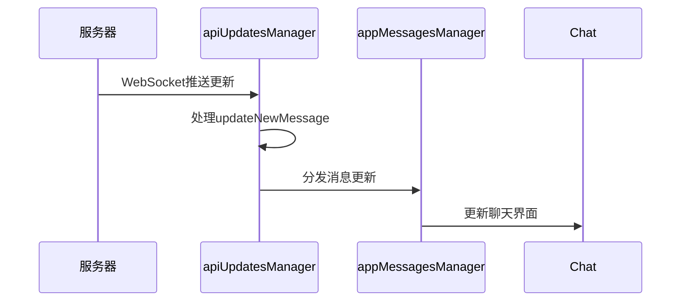

**Diagram sources**
- [apiUpdatesManager.ts](file://src/lib/appManagers/apiUpdatesManager.ts#L172-L186)
- [appMessagesManager.ts](file://src/lib/appManagers/appMessagesManager.ts#L524-L574)

### 轮询机制
作为实时推送的补充，系统实现了轮询机制以确保消息的可靠接收。当客户端检测到网络不稳定或长时间未收到推送时，会主动向服务器请求最新消息。

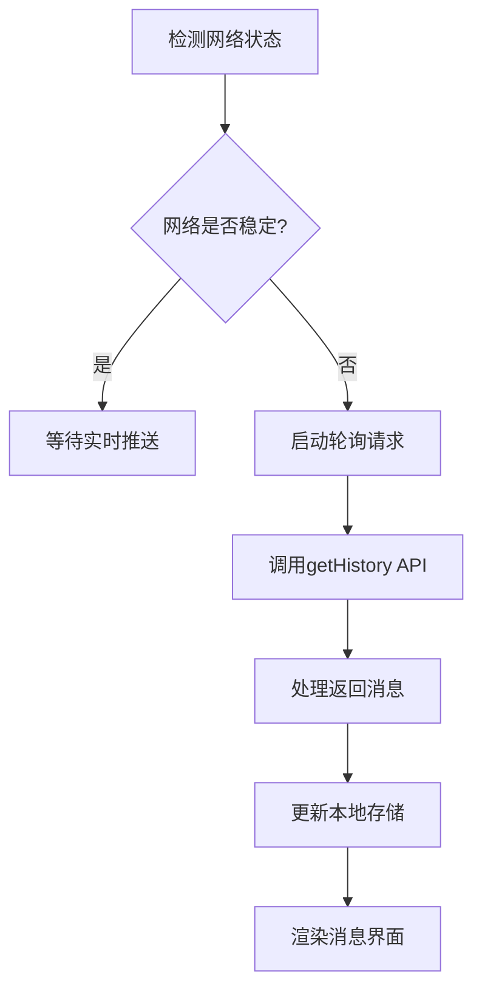

**Diagram sources**
- [appMessagesManager.ts](file://src/lib/appManagers/appMessagesManager.ts#L137-L164)

**Section sources**
- [appMessagesManager.ts](file://src/lib/appManagers/appMessagesManager.ts#L111-L117)

## 消息解析流程

### 消息数据结构
系统定义了标准化的消息数据结构，包含消息内容、发送者信息、时间戳和媒体附件等核心字段。

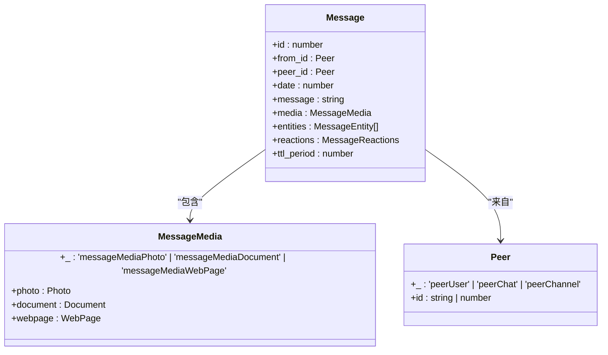

**Diagram sources**
- [layer.d.ts](file://src/layer.d.ts#L958-L1083)

### 消息解析过程
消息解析流程包括实体提取、时间处理、媒体信息解析等步骤。

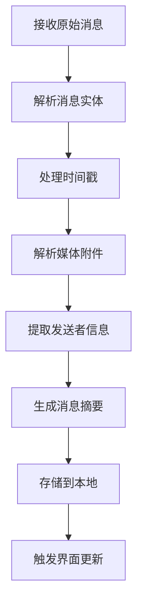

**Section sources**
- [messageRender.ts](file://src/components/chat/messageRender.ts#L175-L319)

## 消息来源识别

### 个人聊天
系统通过`peerUser`类型识别个人聊天消息，提取发送者的用户ID和基本信息。

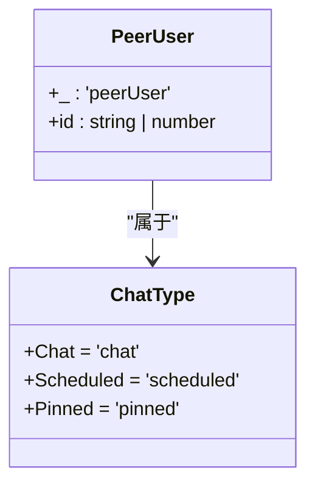

**Diagram sources**
- [layer.d.ts](file://src/layer.d.ts#L466-L481)
- [chat.ts](file://src/components/chat/chat.ts#L81)

### 群组与频道
通过`peerChat`和`peerChannel`类型区分群组和频道消息，并处理相应的权限和属性。

```mermaid
classDiagram
class PeerChat {
+_ : 'peerChat'
+id : string | number
}
class PeerChannel {
+_ : 'peerChannel'
+id : string | number
+pFlags : Partial~{
broadcast? : true,
megagroup? : true,
forum? : true
}~
}
class Chat {
+isBroadcast : boolean
+isMegagroup : boolean
+isForum : boolean
}
PeerChat --> Chat : "映射"
PeerChannel --> Chat : "映射"
```

**Diagram sources**
- [layer.d.ts](file://src/layer.d.ts#L670-L774)
- [chat.ts](file://src/components/chat/chat.ts#L151-L158)

## 消息预处理逻辑

### 敏感内容过滤
系统在消息显示前进行敏感内容过滤，确保内容安全。

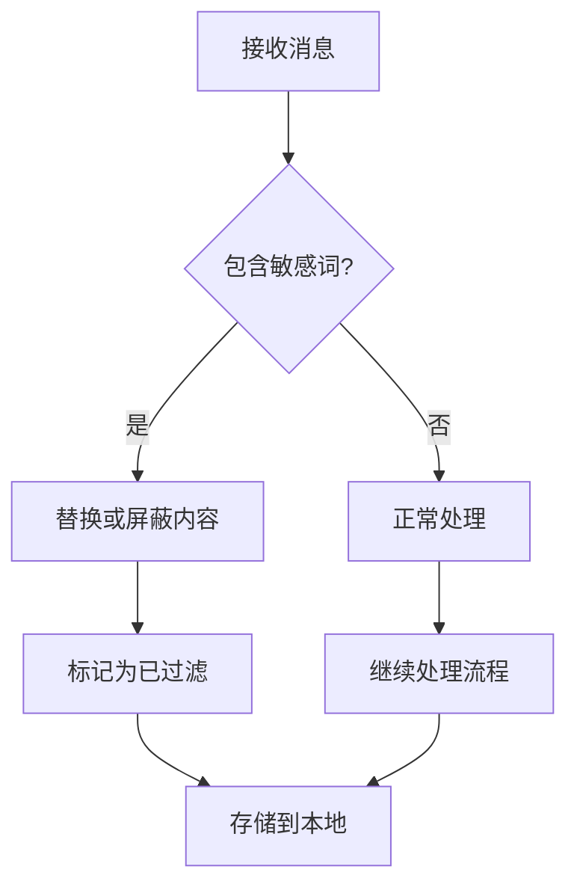

### 链接预览生成
自动识别消息中的链接并生成预览卡片。

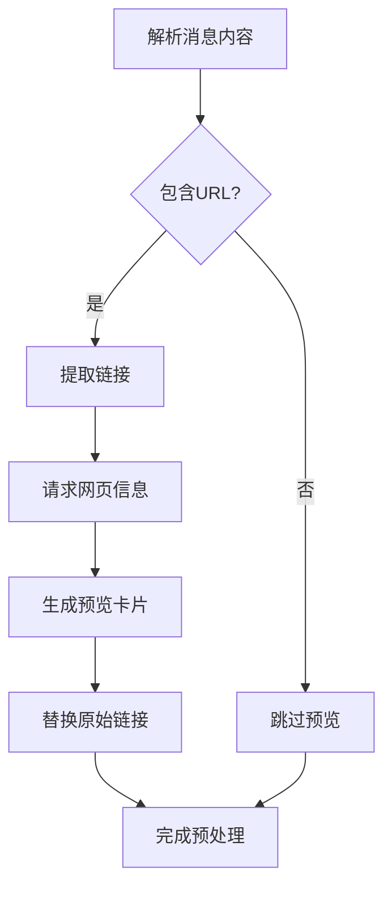

**Section sources**
- [messageRender.ts](file://src/components/chat/messageRender.ts#L800-L803)

## 消息分类和路由

### 消息类型分类
系统根据消息内容和媒体类型进行分类处理。

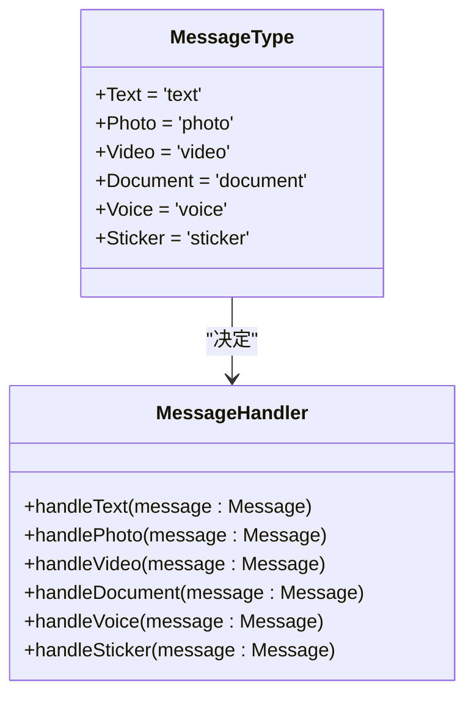

### 路由策略
根据消息的目标和类型，路由到相应的处理模块。

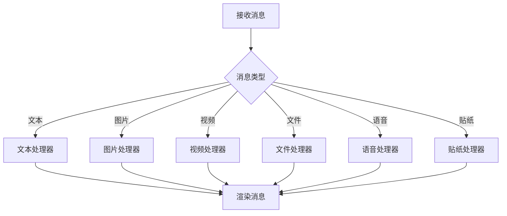

**Section sources**
- [appMessagesManager.ts](file://src/lib/appManagers/appMessagesManager.ts#L1110-L1599)

## 错误处理机制

### 消息接收失败处理
当消息接收失败时，系统会尝试重试并记录错误信息。

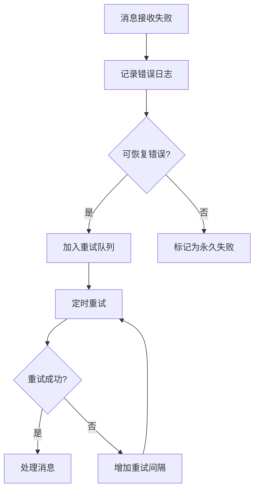

### 数据损坏恢复
对损坏的消息数据进行验证和修复。

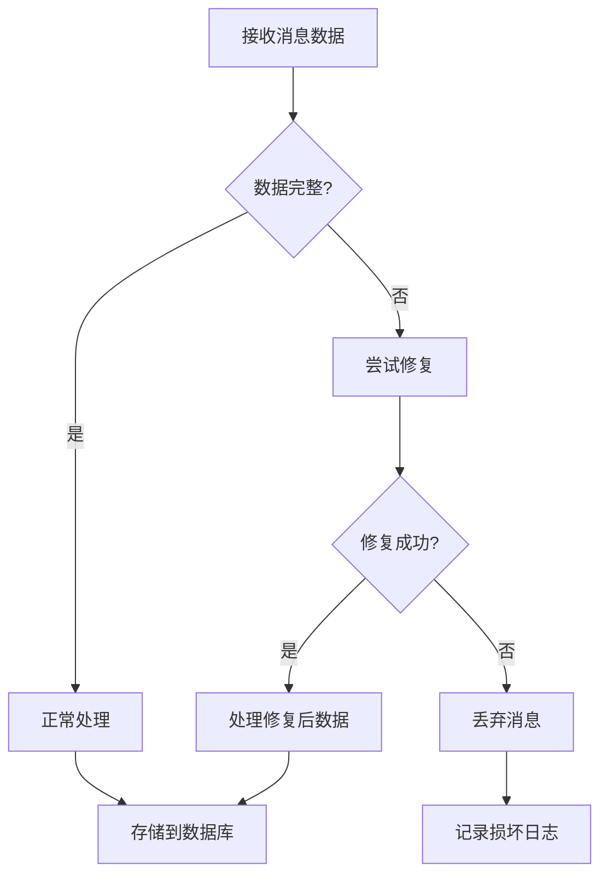

**Section sources**
- [appMessagesManager.ts](file://src/lib/appManagers/appMessagesManager.ts#L1068-L1083)
- [apiUpdatesManager.ts](file://src/lib/appManagers/apiUpdatesManager.ts#L199-L200)