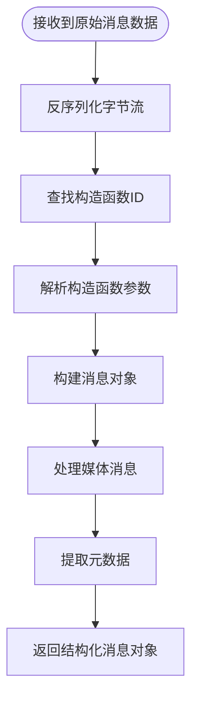
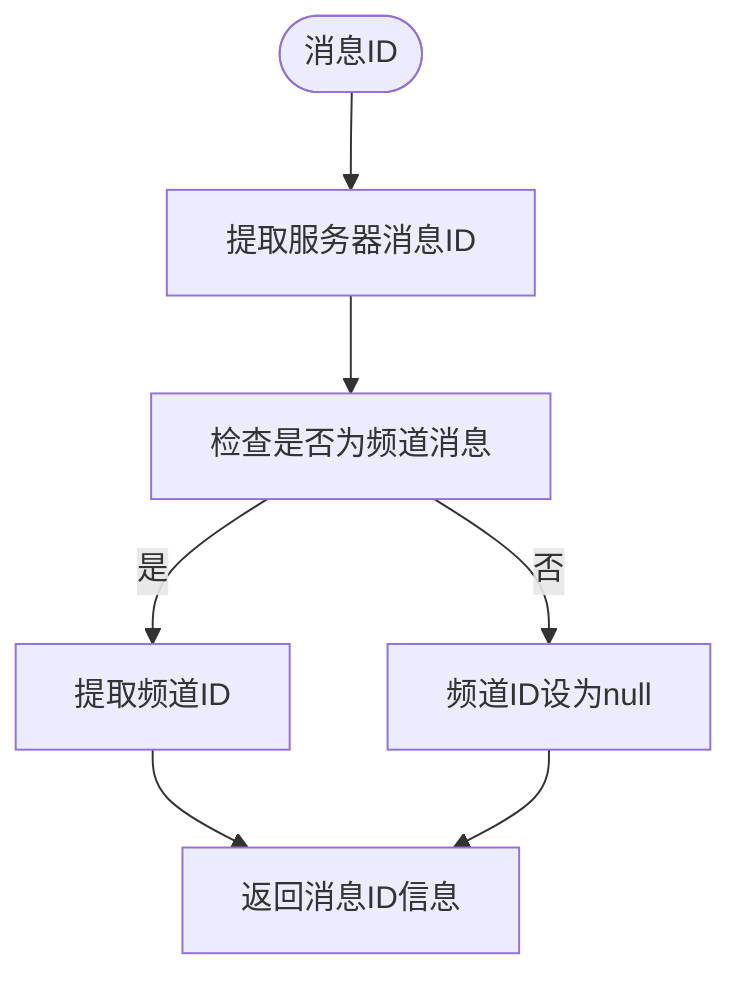
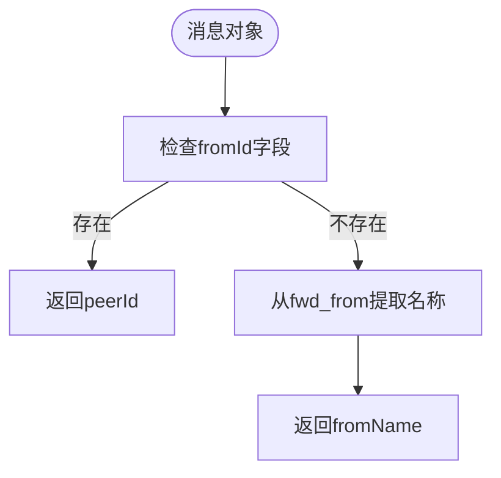
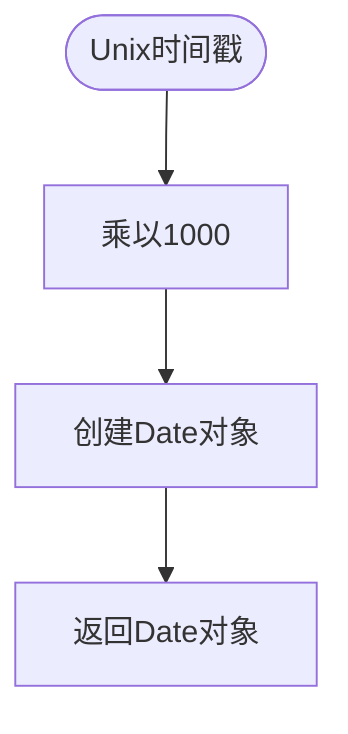
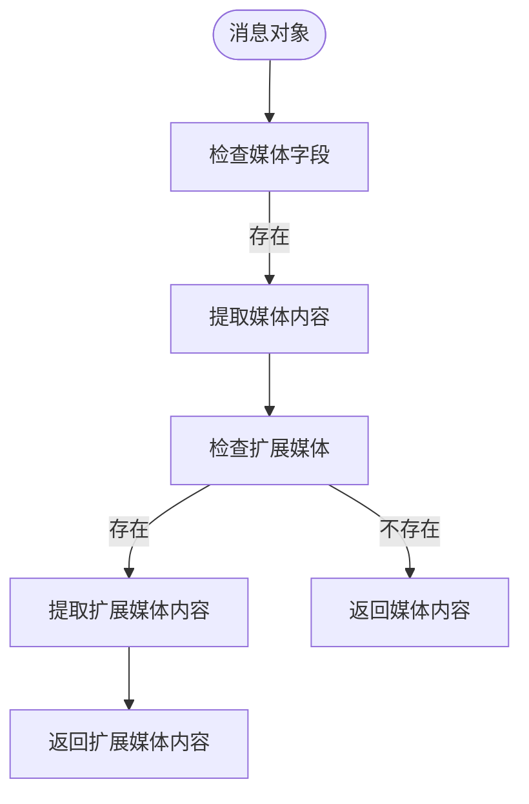
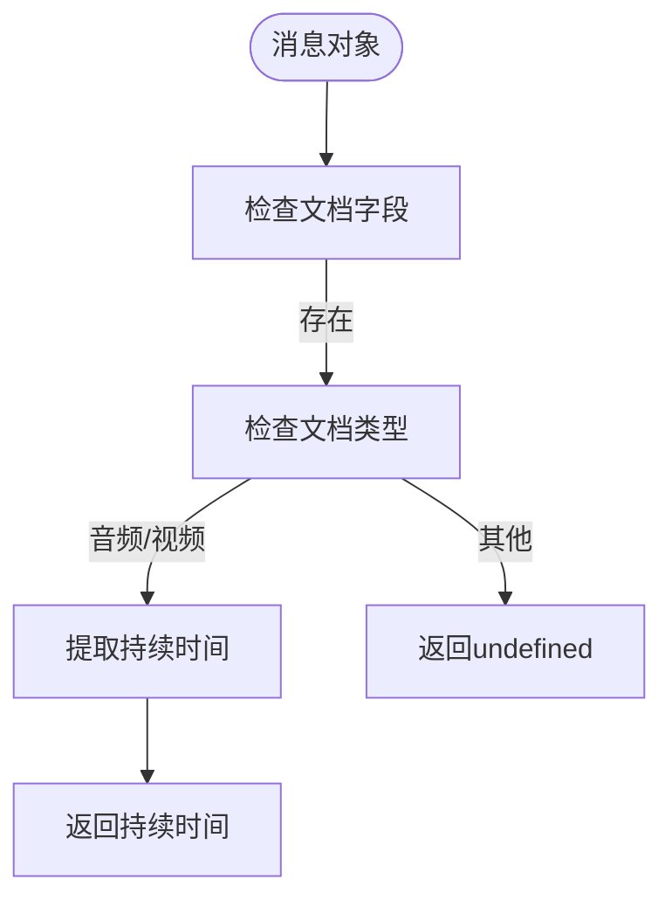
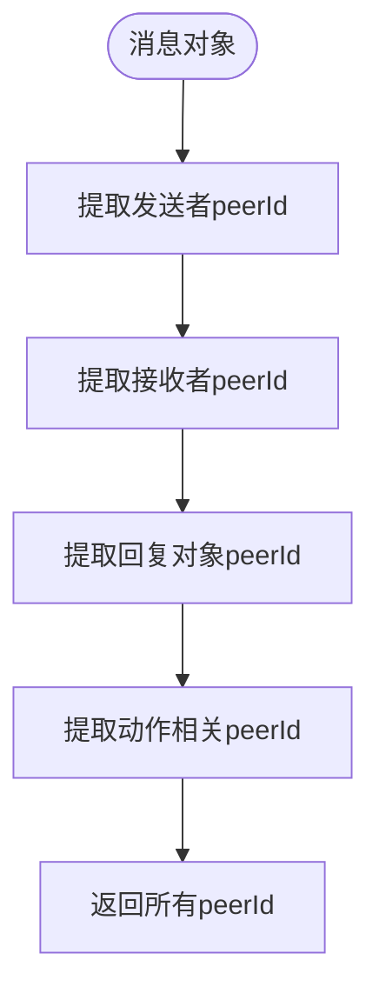
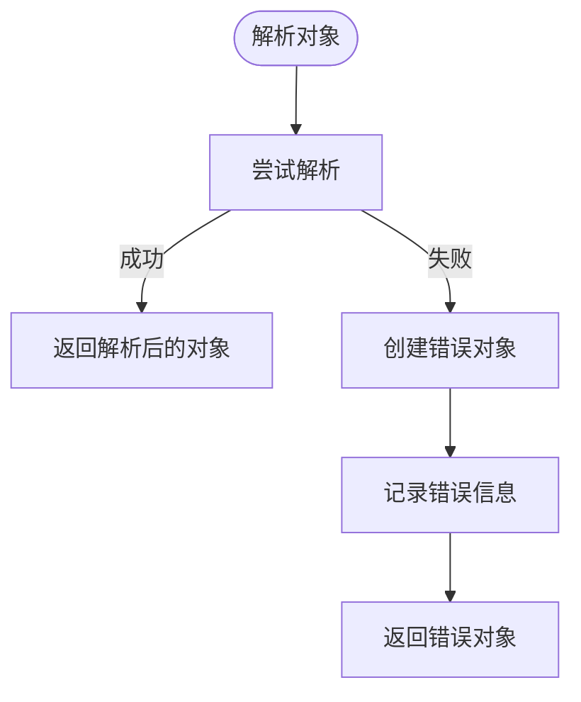
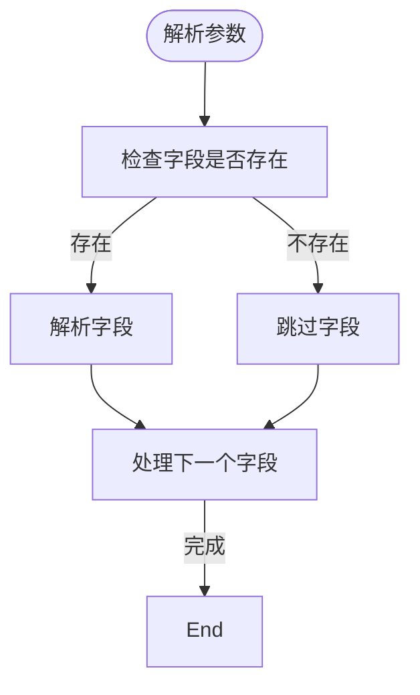

# 消息解析

<cite>
**本文档引用的文件**   
- [tl_utils.ts](file://src/lib/mtproto/tl_utils.ts)
- [networker.ts](file://src/lib/mtproto/networker.ts)
- [appMessagesManager.ts](file://src/lib/appManagers/appMessagesManager.ts)
- [getMediaFromMessage.ts](file://src/lib/appManagers/utils/messages/getMediaFromMessage.ts)
- [getMediaDurationFromMessage.ts](file://src/lib/appManagers/utils/messages/getMediaDurationFromMessage.ts)
- [getPeerIdsFromMessage.ts](file://src/lib/appManagers/utils/messages/getPeerIdsFromMessage.ts)
- [getMessageSenderPeerIdOrName.ts](file://src/lib/appManagers/utils/messages/getMessageSenderPeerIdOrName.ts)
- [getServerMessageId.ts](file://src/lib/appManagers/utils/messageId/getServerMessageId.ts)
- [appMessagesIdsManager.ts](file://src/lib/appManagers/appMessagesIdsManager.ts)
- [sentTime.ts](file://src/components/wrappers/sentTime.ts)
- [makeDateFromTimestamp.ts](file://src/helpers/date/makeDateFromTimestamp.ts)
</cite>

## 目录
1. [简介](#简介)
2. [消息解析流程](#消息解析流程)
3. [核心组件分析](#核心组件分析)
4. [消息ID处理](#消息id处理)
5. [发送者信息提取](#发送者信息提取)
6. [时间戳解析](#时间戳解析)
7. [媒体消息元数据解析](#媒体消息元数据解析)
8. [消息来源识别](#消息来源识别)
9. [边界情况处理](#边界情况处理)

## 简介
本文档详细阐述了Telegram Web客户端中消息解析的完整流程。文档全面分析了从接收到的原始消息数据到结构化消息对象的转换过程，包括消息ID、发送者信息、时间戳、内容类型等字段的提取方法。特别关注了媒体消息（图片、视频、文件等）的元数据解析过程，以及附件信息的获取方式。文档还解释了消息来源识别逻辑，涵盖个人聊天、群组、频道等不同场景的处理规则。通过实际代码示例，展示了关键解析函数的调用方式和返回结果，并详细说明了在处理无效数据格式、缺失字段等情况下的容错机制。

## 消息解析流程
消息解析流程始于接收到的原始二进制数据，通过MTProto协议的反序列化机制逐步解析为结构化的消息对象。整个流程由`TLDeserialization`类驱动，该类负责从字节流中提取各种数据类型，并根据Telegram的TL（Type Language）模式构建相应的对象结构。解析过程首先确定消息的构造函数ID，然后根据该ID查找对应的构造函数数据，最后逐个解析构造函数的参数，构建出完整的消息对象。



**Diagram sources**
- [tl_utils.ts](file://src/lib/mtproto/tl_utils.ts#L641-L792)
- [networker.ts](file://src/lib/mtproto/networker.ts#L1456-L1497)

## 核心组件分析
消息解析的核心组件主要包括`TLDeserialization`类和`appMessagesManager`类。`TLDeserialization`类负责底层的二进制数据解析，而`appMessagesManager`类则负责高层的消息管理和处理。这两个组件协同工作，确保消息能够被正确解析和处理。

### TLDeserialization类分析
`TLDeserialization`类是消息解析的核心，它提供了从字节流中提取各种数据类型的方法。该类通过`fetchObject`方法根据类型字符串调用相应的提取方法，如`fetchInt`、`fetchLong`、`fetchString`等。对于复杂对象，它会递归地解析其参数。

```mermaid
classDiagram
class TLDeserialization {
+offset : number
+override : {[key : string] : (result : any, field : string) => void}
+buffer : ArrayBuffer
+intView : Int32Array
+byteView : Uint8Array
+mtproto : boolean
+debug : boolean
+fetchInt(field? : string) : number
+fetchLong(field? : string) : MTLong
+fetchBool(field? : string) : boolean
+fetchString(field? : string) : string
+fetchBytes(field? : string) : Uint8Array
+fetchObject(type : string, field? : string) : any
+fetchVector(type : string, field? : string) : any[]
}
```

**Diagram sources**
- [tl_utils.ts](file://src/lib/mtproto/tl_utils.ts#L413-L792)

### appMessagesManager类分析
`appMessagesManager`类负责消息的高层管理和处理，包括消息的存储、检索和显示。它提供了各种工具函数来提取消息的特定信息，如发送者、媒体内容、持续时间等。

```mermaid
classDiagram
class appMessagesManager {
+getMediaFromMessage(message : Message, onlyInner? : boolean, index? : number) : Photo.photo | Document.document | Game.game | WebPage.webPage
+getMediaDurationFromMessage(message : Message.message) : number
+getPeerIdsFromMessage(message : MyMessage) : PeerId[]
+getMessageSenderPeerIdOrName(message : MyMessage) : {peerId? : PeerId, fromName? : string}
+getExtendedMedia(peerId : PeerId, mids : number[]) : Promise<void>
+getMidsByMessage(message : Message) : number[]
+getMessagesByGroupedId(groupedId : string) : Message.message[]
}
```

**Diagram sources**
- [appMessagesManager.ts](file://src/lib/appManagers/appMessagesManager.ts#L9177-L9223)
- [getMediaFromMessage.ts](file://src/lib/appManagers/utils/messages/getMediaFromMessage.ts#L1-L34)
- [getMediaDurationFromMessage.ts](file://src/lib/appManagers/utils/messages/getMediaDurationFromMessage.ts#L1-L9)
- [getPeerIdsFromMessage.ts](file://src/lib/appManagers/utils/messages/getPeerIdsFromMessage.ts#L32-L94)
- [getMessageSenderPeerIdOrName.ts](file://src/lib/appManagers/utils/messages/getMessageSenderPeerIdOrName.ts#L1-L15)

## 消息ID处理
消息ID的处理由`appMessagesIdsManager`类负责，该类提供了生成、解析和管理消息ID的方法。消息ID的解析主要通过`getMessageIdInfo`方法实现，该方法将消息ID分解为服务器消息ID和频道ID。



**Diagram sources**
- [appMessagesIdsManager.ts](file://src/lib/appManagers/appMessagesIdsManager.ts#L45-L73)
- [getServerMessageId.ts](file://src/lib/appManagers/utils/messageId/getServerMessageId.ts#L1-L14)

**Section sources**
- [appMessagesIdsManager.ts](file://src/lib/appManagers/appMessagesIdsManager.ts#L45-L73)
- [getServerMessageId.ts](file://src/lib/appManagers/utils/messageId/getServerMessageId.ts#L1-L14)

## 发送者信息提取
发送者信息的提取通过`getMessageSenderPeerIdOrName`函数实现。该函数首先检查消息的`fromId`字段，如果存在则直接返回对应的`peerId`；否则，它会从转发信息中提取发送者名称。



**Diagram sources**
- [getMessageSenderPeerIdOrName.ts](file://src/lib/appManagers/utils/messages/getMessageSenderPeerIdOrName.ts#L5-L15)
- [getFwdFromName.ts](file://src/lib/appManagers/utils/messages/getFwdFromName.ts#L1-L5)

**Section sources**
- [getMessageSenderPeerIdOrName.ts](file://src/lib/appManagers/utils/messages/getMessageSenderPeerIdOrName.ts#L5-L15)

## 时间戳解析
时间戳的解析通过`makeDateFromTimestamp`函数实现，该函数将Unix时间戳（以秒为单位）转换为JavaScript的`Date`对象。这个转换过程简单直接，只需将时间戳乘以1000即可得到毫秒值。



**Diagram sources**
- [makeDateFromTimestamp.ts](file://src/helpers/date/makeDateFromTimestamp.ts#L1-L3)
- [sentTime.ts](file://src/components/wrappers/sentTime.ts#L10-L16)

**Section sources**
- [makeDateFromTimestamp.ts](file://src/helpers/date/makeDateFromTimestamp.ts#L1-L3)

## 媒体消息元数据解析
媒体消息的元数据解析是消息解析中的重要环节，它涉及到从消息中提取媒体内容的详细信息，如类型、尺寸、持续时间等。这一过程主要通过`getMediaFromMessage`和`getMediaDurationFromMessage`等函数实现。

### 媒体内容提取
`getMediaFromMessage`函数负责从消息中提取媒体内容。它首先检查消息的媒体字段，然后根据媒体类型提取相应的数据。对于包含扩展媒体的消息，它会进一步解析扩展媒体的内容。



**Diagram sources**
- [getMediaFromMessage.ts](file://src/lib/appManagers/utils/messages/getMediaFromMessage.ts#L7-L34)

### 媒体持续时间提取
`getMediaDurationFromMessage`函数专门用于提取媒体消息的持续时间。它首先检查消息的文档字段，然后根据文档类型判断是否包含持续时间信息。



**Diagram sources**
- [getMediaDurationFromMessage.ts](file://src/lib/appManagers/utils/messages/getMediaDurationFromMessage.ts#L3-L8)

**Section sources**
- [getMediaFromMessage.ts](file://src/lib/appManagers/utils/messages/getMediaFromMessage.ts#L7-L34)
- [getMediaDurationFromMessage.ts](file://src/lib/appManagers/utils/messages/getMediaDurationFromMessage.ts#L3-L8)

## 消息来源识别
消息来源识别逻辑通过`getPeerIdsFromMessage`函数实现，该函数能够从消息中提取所有相关的`peerId`，包括发送者、接收者、回复对象等。这对于正确显示消息的上下文和关系至关重要。



**Diagram sources**
- [getPeerIdsFromMessage.ts](file://src/lib/appManagers/utils/messages/getPeerIdsFromMessage.ts#L32-L94)

**Section sources**
- [getPeerIdsFromMessage.ts](file://src/lib/appManagers/utils/messages/getPeerIdsFromMessage.ts#L32-L94)

## 边界情况处理
消息解析过程中需要处理各种边界情况，如无效数据格式、缺失字段等。系统通过异常捕获和默认值设置来确保解析过程的健壮性。

### 异常处理
在`TLDeserialization`类的`fetchObject`方法中，系统通过try-catch块捕获解析过程中的异常。当遇到无法解析的数据时，它会创建一个包含错误信息的特殊对象，而不是让整个解析过程失败。



**Diagram sources**
- [tl_utils.ts](file://src/lib/mtproto/tl_utils.ts#L1467-L1475)

### 缺失字段处理
对于可选字段，系统通过检查字段是否存在来决定是否进行解析。如果字段不存在，解析过程会跳过该字段，继续处理后续字段，确保即使部分数据缺失，消息的其他部分仍能被正确解析。



**Section sources**
- [tl_utils.ts](file://src/lib/mtproto/tl_utils.ts#L756-L780)