# 消息预处理

<cite>
**本文档引用的文件**  
- [wrapRichText.ts](file://src/lib/richTextProcessor/wrapRichText.ts)
- [wrapPlainText.ts](file://src/lib/richTextProcessor/wrapPlainText.ts)
- [encodeSpoiler.ts](file://src/lib/richTextProcessor/encodeSpoiler.ts)
- [parseEntities.ts](file://src/lib/richTextProcessor/parseEntities.ts)
- [appMessagesManager.ts](file://src/lib/appManagers/appMessagesManager.ts)
- [messageForReply.ts](file://src/components/wrappers/messageForReply.ts)
- [messageRender.ts](file://src/components/chat/messageRender.ts)
- [index.ts](file://src/lib/richTextProcessor/index.ts)
</cite>

## 目录
1. [引言](#引言)
2. [消息预处理流程](#消息预处理流程)
3. [预处理步骤详解](#预处理步骤详解)
4. [事实核查功能](#事实核查功能)
5. [预处理管道设计模式](#预处理管道设计模式)
6. [性能考量](#性能考量)
7. [扩展点说明](#扩展点说明)
8. [结论](#结论)

## 引言

消息预处理机制是消息显示前的关键处理流程，负责对原始消息内容进行一系列转换和处理，包括敏感内容过滤、链接预览生成、表情符号替换、文本格式化等。该机制确保消息在显示给用户之前已经过适当的处理和格式化，同时支持事实核查等高级功能。本文档将详细描述该预处理机制的实现细节、设计模式和性能优化策略。

## 消息预处理流程

消息预处理流程从接收到原始消息文本开始，经过多个处理步骤，最终生成可用于显示的格式化内容。整个流程采用管道模式，每个处理步骤专注于特定的功能，如实体解析、格式化、敏感内容处理等。流程的起点通常是`wrapRichText`函数，它接收原始文本和实体信息，通过递归处理生成最终的DOM结构。

预处理流程首先解析消息中的各种实体，如提及、链接、表情符号等，然后根据实体类型应用相应的格式化规则。对于包含敏感内容的消息，系统会应用特殊的处理逻辑，如对验证码等敏感信息进行模糊处理。整个流程支持异步操作，允许在处理过程中加载外部资源，如自定义表情符号。

**Section sources**
- [wrapRichText.ts](file://src/lib/richTextProcessor/wrapRichText.ts#L122-L200)
- [parseEntities.ts](file://src/lib/richTextProcessor/parseEntities.ts#L18-L129)

## 预处理步骤详解

### 敏感内容过滤

敏感内容过滤主要针对特定类型的消息，如验证码消息，系统会自动识别并应用模糊处理。当检测到服务消息或验证代码机器人发送的消息时，系统会使用正则表达式匹配其中的代码，并将其包装在`messageEntitySpoiler`实体中，实现内容的隐藏和点击显示功能。

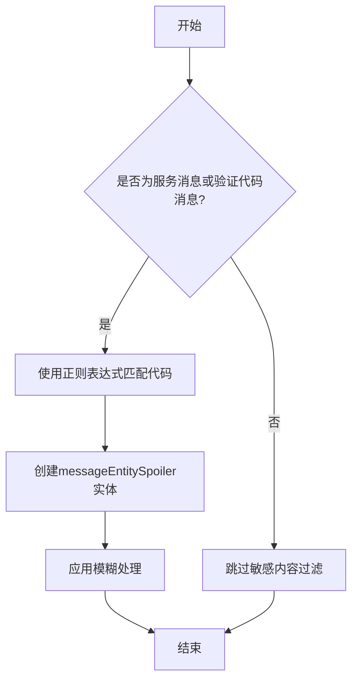

**Diagram sources**
- [messageForReply.ts](file://src/components/wrappers/messageForReply.ts#L354-L368)

### 链接预览生成

链接预览生成功能通过解析消息中的URL实体实现。系统使用复杂的正则表达式匹配各种格式的链接，包括带有协议的URL、电子邮件地址和IP地址。对于匹配到的链接，系统会创建`messageEntityUrl`实体，并在显示时生成可点击的链接预览。

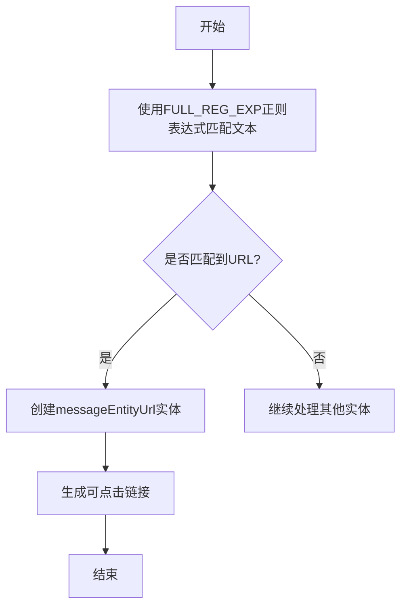

**Diagram sources**
- [parseEntities.ts](file://src/lib/richTextProcessor/parseEntities.ts#L37-L74)
- [index.ts](file://src/lib/richTextProcessor/index.ts#L49-L68)

### 表情符号替换

表情符号替换功能通过解析文本中的表情符号实体实现。系统使用专门的正则表达式匹配各种表情符号，并将其转换为对应的Unicode编码。对于自定义表情符号，系统会创建`messageEntityCustomEmoji`实体，并在显示时加载相应的表情符号图像或动画。

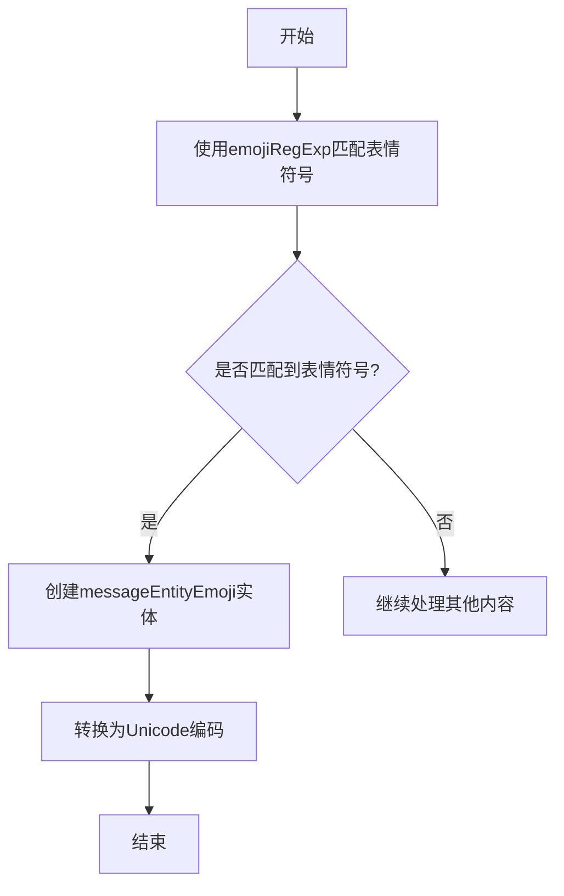

**Diagram sources**
- [parseEntities.ts](file://src/lib/richTextProcessor/parseEntities.ts#L81-L90)
- [getEmojiUnified.ts](file://src/lib/richTextProcessor/getEmojiUnified.ts)

### 文本格式化

文本格式化功能处理各种文本样式，如粗体、斜体、删除线等。系统通过解析`messageEntityBold`、`messageEntityItalic`等实体，将相应的HTML标签应用到文本上。对于Markdown格式的文本，系统还支持将Markdown语法转换为相应的HTML格式。

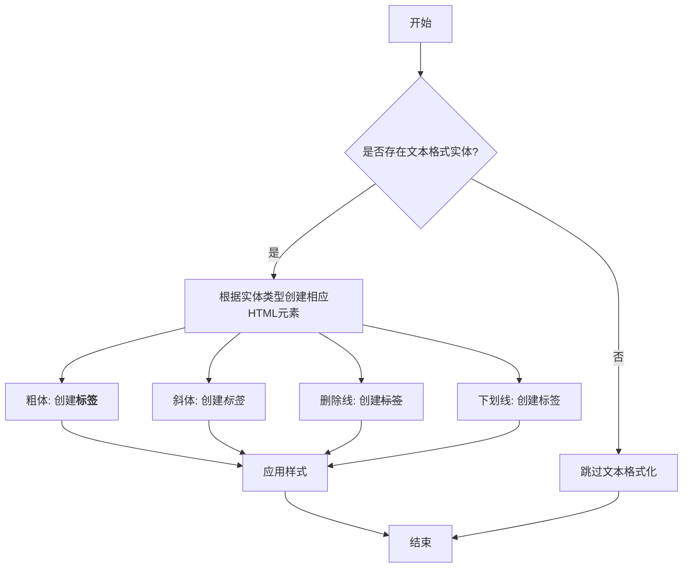

**Diagram sources**
- [wrapRichText.ts](file://src/lib/richTextProcessor/wrapRichText.ts#L215-L252)
- [index.ts](file://src/lib/richTextProcessor/index.ts#L92-L99)

## 事实核查功能

### 触发条件

事实核查功能的触发需要满足多个条件。首先，消息必须是广播类型的对等实体（peer），其次消息本身必须支持事实核查，最后用户必须具有编辑事实核查的权限。这些条件通过`canUpdateFactCheck`方法进行验证，确保只有符合条件的消息才能进行事实核查操作。

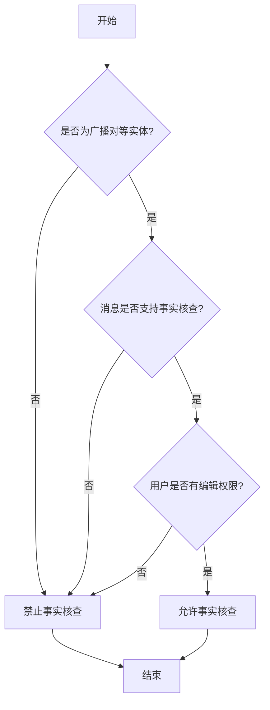

**Diagram sources**
- [appMessagesManager.ts](file://src/lib/appManagers/appMessagesManager.ts#L9670-L9683)

### 处理逻辑

事实核查的处理逻辑采用批处理模式，将多个事实核查请求合并为一个批量请求，以提高效率。系统使用`factCheckBatcher`来管理批处理队列，当达到批处理大小或超时后，会一次性发送所有待处理的请求。这种设计减少了网络请求次数，提高了系统性能。

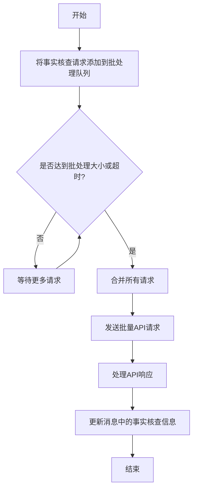

**Diagram sources**
- [appMessagesManager.ts](file://src/lib/appManagers/appMessagesManager.ts#L9632-L9667)

### 与其他预处理步骤的协同

事实核查功能与其他预处理步骤协同工作，确保在消息显示前完成所有必要的处理。事实核查结果作为消息的一部分存储在客户端，与其他预处理结果一起影响消息的最终显示效果。当用户查看消息时，系统会同时应用文本格式化、敏感内容过滤和事实核查状态显示。

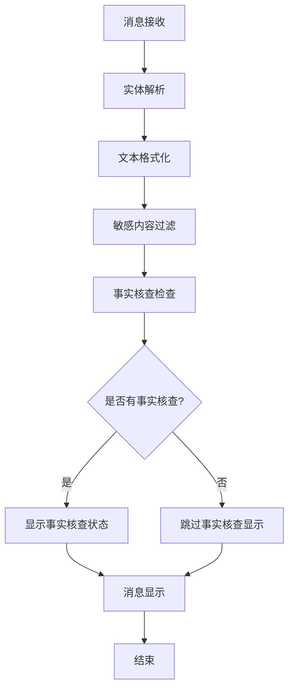

**Diagram sources**
- [appMessagesManager.ts](file://src/lib/appManagers/appMessagesManager.ts#L9700-L9708)
- [wrapRichText.ts](file://src/lib/richTextProcessor/wrapRichText.ts)

## 预处理管道设计模式

### 处理顺序

预处理管道采用严格的处理顺序，确保每个步骤都能正确处理前一步骤的输出。处理顺序从实体解析开始，然后是文本格式化、敏感内容处理，最后是事实核查状态的添加。这种顺序确保了文本格式化不会影响实体解析的结果，同时敏感内容过滤可以在格式化后的文本上进行。

**Diagram sources**
- [wrapRichText.ts](file://src/lib/richTextProcessor/wrapRichText.ts)
- [appMessagesManager.ts](file://src/lib/appManagers/appMessagesManager.ts)

### 中间数据格式

预处理管道使用统一的中间数据格式来传递处理结果。核心数据结构是`MessageEntity`数组，每个实体包含类型、偏移量和长度等信息。这种格式使得各个处理步骤可以独立工作，同时又能共享相同的数据结构。对于文本内容，系统使用字符串和DOM片段的组合格式，既保持了文本的可读性，又支持复杂的格式化需求。

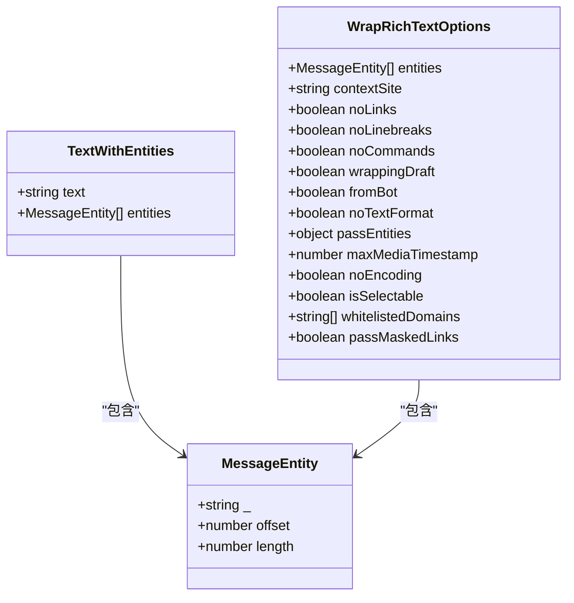

**Diagram sources**
- [layer.d.ts](file://src/layer.d.ts)
- [wrapRichText.ts](file://src/lib/richTextProcessor/wrapRichText.ts#L38-L73)

### 错误传播机制

预处理管道采用健壮的错误传播机制，确保任何步骤的错误都不会导致整个处理流程的崩溃。系统使用Promise和异常处理机制来捕获和处理错误，对于可恢复的错误，系统会尝试继续处理剩余内容，对于不可恢复的错误，则会记录错误信息并返回部分处理结果。

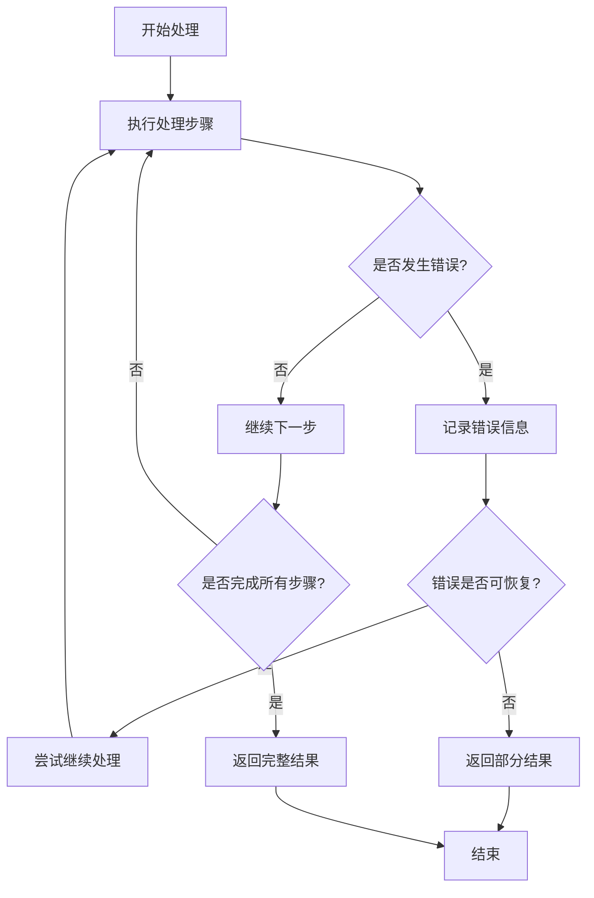

**Diagram sources**
- [appMessagesManager.ts](file://src/lib/appManagers/appMessagesManager.ts#L9656-L9662)
- [wrapRichText.ts](file://src/lib/richTextProcessor/wrapRichText.ts)

## 性能考量

### 异步处理策略

系统采用异步处理策略来提高性能，特别是在处理包含大量外部资源的消息时。对于自定义表情符号、链接预览等需要网络请求的功能，系统使用Promise和异步加载机制，确保主线程不会被阻塞。同时，系统实现了资源加载队列，通过`lazyLoadQueue`管理资源的加载顺序和优先级。

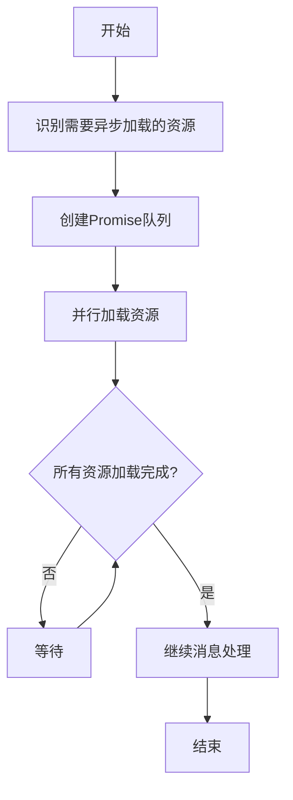

**Diagram sources**
- [wrapRichText.ts](file://src/lib/richTextProcessor/wrapRichText.ts#L68-L69)
- [lazyLoadQueue.ts](file://src/components/lazyLoadQueue.ts)

### 资源消耗控制

为了控制资源消耗，系统实现了多种优化机制。首先，对于表情符号等高频使用的资源，系统实现了缓存机制，避免重复加载。其次，系统使用节流和防抖技术控制事实核查等API请求的频率，防止过度消耗网络资源。此外，对于大型消息的处理，系统采用分批处理策略，避免一次性处理过多内容导致内存占用过高。

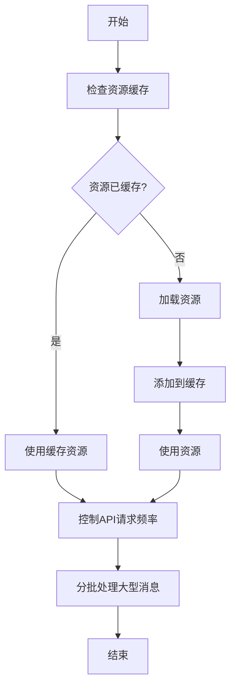

**Diagram sources**
- [appMessagesManager.ts](file://src/lib/appManagers/appMessagesManager.ts#L9775-L9777)
- [sortedList.ts](file://src/helpers/sortedList.ts)

## 扩展点说明

### 添加新的预处理规则

要添加新的预处理规则，开发者需要在`wrapRichText`函数的处理流程中添加新的实体类型处理逻辑。首先，定义新的实体类型，然后在`switch`语句中添加相应的处理分支。新的处理分支应该遵循现有的代码风格和错误处理机制，确保与现有代码的兼容性。

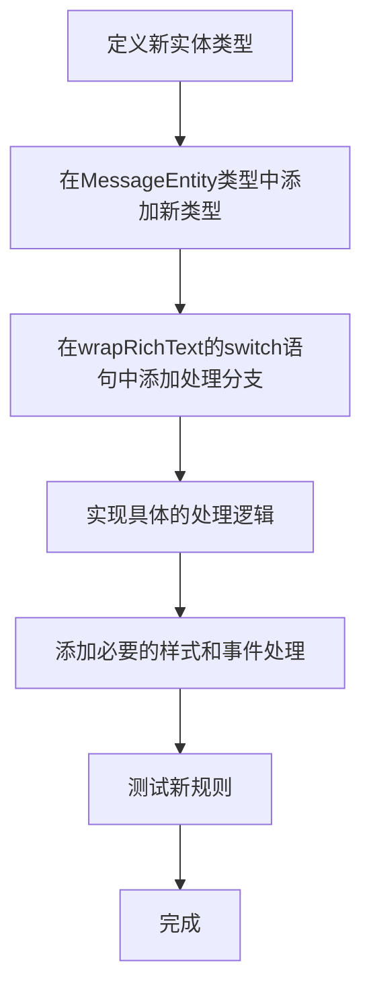

**Diagram sources**
- [wrapRichText.ts](file://src/lib/richTextProcessor/wrapRichText.ts)
- [layer.d.ts](file://src/layer.d.ts)

### 修改现有预处理行为

修改现有预处理行为时，应遵循最小修改原则，尽量通过配置选项而不是直接修改核心逻辑来实现。系统提供了多种配置选项，如`noLinks`、`noTextFormat`等，可以通过这些选项控制预处理行为。对于必须修改核心逻辑的情况，应确保修改不会影响其他功能的正常运行，并添加相应的单元测试。

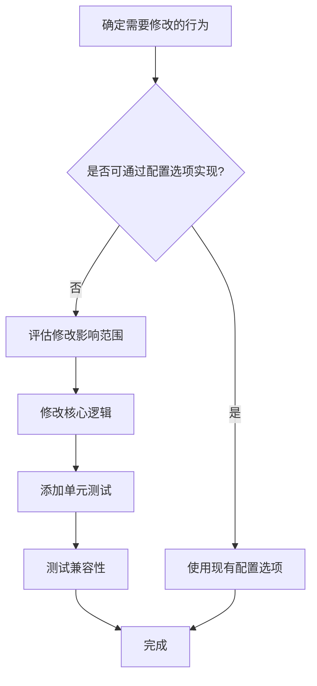

**Diagram sources**
- [wrapRichText.ts](file://src/lib/richTextProcessor/wrapRichText.ts#L38-L73)
- [wrapRichText.test.ts](file://src/lib/richTextProcessor/wrapRichText.test.ts)

## 结论

消息预处理机制通过一系列精心设计的处理步骤，确保了消息在显示前的质量和安全性。该机制采用管道模式，将复杂的处理流程分解为多个独立的步骤，每个步骤专注于特定的功能。事实核查功能的引入进一步增强了消息的可信度，而异步处理和资源消耗控制策略则保证了系统的高性能。通过清晰的扩展点设计，系统具有良好的可维护性和可扩展性，能够适应未来的需求变化。