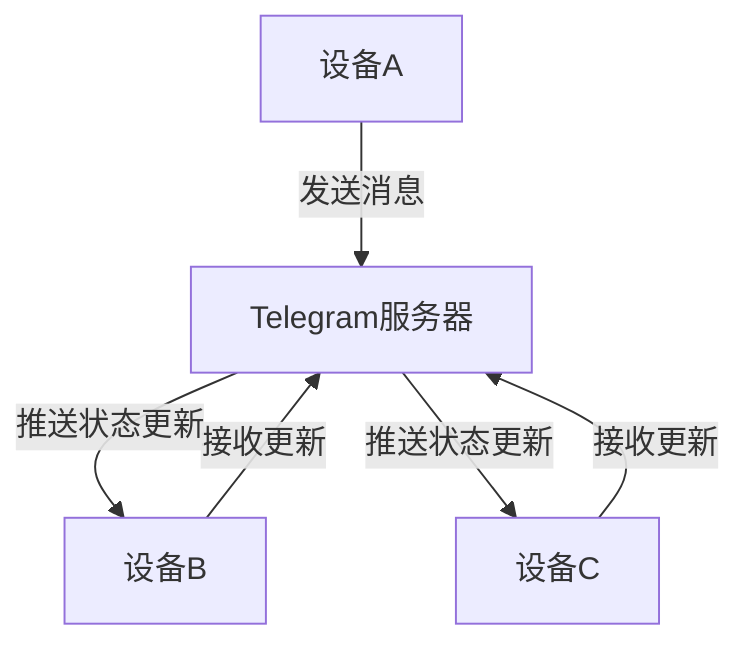
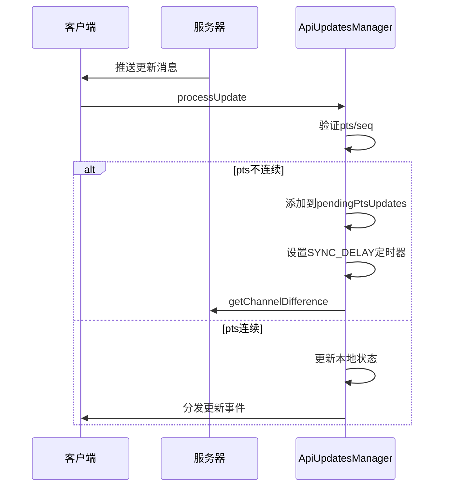
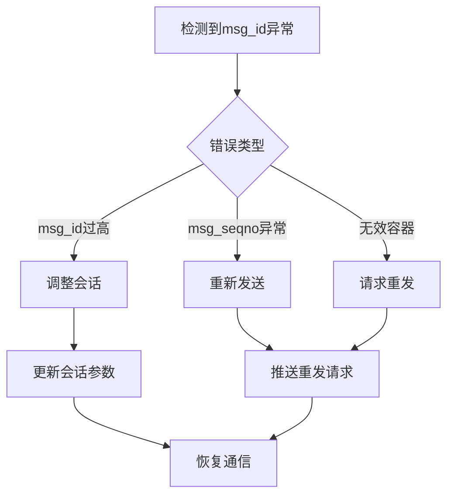
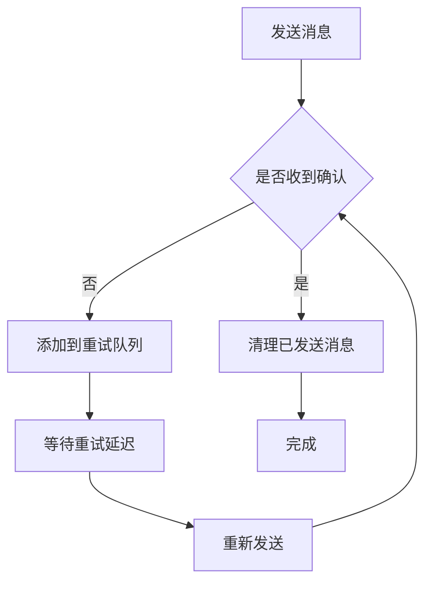
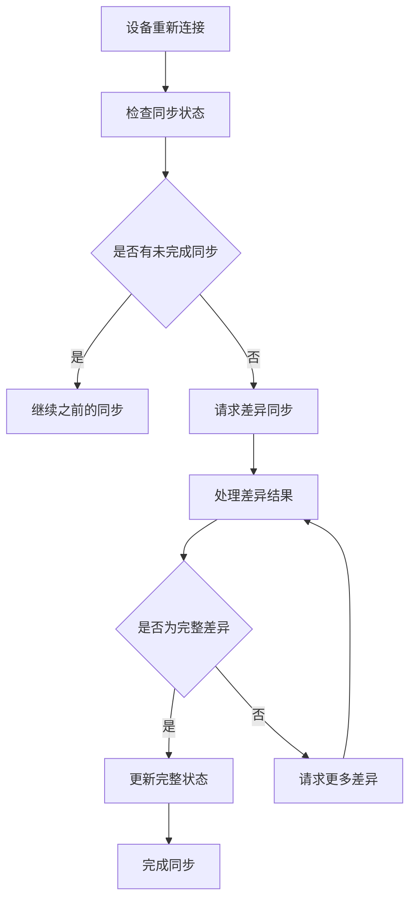

# 消息状态同步

<cite>
**本文档中引用的文件**  
- [networker.ts](file://src/lib/mtproto/networker.ts)
- [apiUpdatesManager.ts](file://src/lib/appManagers/apiUpdatesManager.ts)
- [appMessagesManager.ts](file://src/lib/appManagers/appMessagesManager.ts)
- [appMessagesIdsManager.ts](file://src/lib/appManagers/appMessagesIdsManager.ts)
</cite>

## 目录
1. [简介](#简介)
2. [多设备间消息状态同步机制](#多设备间消息状态同步机制)
3. [MTProto协议状态更新接收](#mtproto协议状态更新接收)
4. [冲突解决策略与数据一致性](#冲突解决策略与数据一致性)
5. [错误处理与重试机制](#错误处理与重试机制)
6. [离线状态同步策略](#离线状态同步策略)
7. [性能监控指标](#性能监控指标)
8. [同步延迟与带宽优化](#同步延迟与带宽优化)
9. [结论](#结论)

## 简介
本文档详细描述了Telegram Web客户端中消息状态同步的实现机制。系统通过MTProto协议实现多设备间的消息状态同步，确保用户在不同设备上查看消息时状态一致。同步机制包括消息确认、状态更新推送、冲突解决、错误重试等核心功能，同时针对离线场景和性能优化进行了专门设计。

## 多设备间消息状态同步机制

消息状态同步是Telegram Web客户端的核心功能之一，确保用户在多个设备间切换时消息状态保持一致。系统通过维护全局更新状态（Updates State）来跟踪消息的处理进度，包括`pts`（部分更新序列号）、`seq`（完整更新序列号）和`date`（时间戳）等关键参数。

当用户在一个设备上执行操作（如阅读消息、发送消息）时，该操作会通过MTProto协议发送到服务器，服务器随后将状态更新推送到所有其他在线设备。每个设备维护自己的更新状态，通过比较`pts`和`seq`值来确定是否需要获取增量更新或完整同步。

**图表来源**  
- [apiUpdatesManager.ts](file://src/lib/appManagers/apiUpdatesManager.ts#L77-L82)

**本节来源**  
- [apiUpdatesManager.ts](file://src/lib/appManagers/apiUpdatesManager.ts#L77-L82)

## MTProto协议状态更新接收

系统通过MTProto协议接收服务器推送的状态更新。`ApiUpdatesManager`负责处理所有更新消息，包括新消息、消息编辑、消息删除等。当接收到更新时，系统会验证更新的完整性，检查`pts`和`seq`值是否连续，若发现不连续则触发差异同步（difference sync）。

对于频道（channel）更新，系统使用独立的`pts`状态管理，通过`addChannelState`和`getChannelState`方法维护每个频道的更新状态。当检测到`pts`空洞（pts hole）时，系统会延迟一段时间后请求频道差异，确保不会因网络抖动而频繁请求同步。

**图表来源**  
- [apiUpdatesManager.ts](file://src/lib/appManagers/apiUpdatesManager.ts#L574-L596)

**本节来源**  
- [apiUpdatesManager.ts](file://src/lib/appManagers/apiUpdatesManager.ts#L496-L596)
- [networker.ts](file://src/lib/mtproto/networker.ts#L1735-L1839)

## 冲突解决策略与数据一致性

在并发操作场景下，系统通过序列号和时间戳机制确保数据一致性。每个消息ID包含时间戳信息，系统通过`applyServerTime`方法校准客户端时间与服务器时间的偏差。当检测到`msg_id`过高或过低时，系统会自动调整会话并重新发送消息。

对于消息编辑和删除等操作，系统采用"最后写入获胜"（last write wins）策略，但通过`pts`和`seq`的严格递增保证操作顺序。当多个设备同时编辑同一消息时，服务器会按接收顺序处理，确保最终状态一致。

**图表来源**  
- [networker.ts](file://src/lib/mtproto/networker.ts#L1797-L1814)

**本节来源**  
- [networker.ts](file://src/lib/mtproto/networker.ts#L1797-L1814)
- [appMessagesManager.ts](file://src/lib/appManagers/appMessagesManager.ts#L9574-L9602)

## 错误处理与重试机制

系统实现了完善的错误处理和重试机制。当消息发送失败时，系统会根据错误类型采取不同策略：

- 对于`msg_id`过高或时间偏移问题，调用`applyServerTime`校准时间并更新会话
- 对于消息确认丢失，使用`reqResend`请求重发
- 对于RPC错误，记录错误信息并根据类型决定是否重新登录

重试机制采用指数退避策略，避免在网络不稳定时过度重试。系统维护`pendingResendReq`队列，定期调度重试请求，并在成功接收确认后清理已处理的消息。

**图表来源**  
- [networker.ts](file://src/lib/mtproto/networker.ts#L1632-L1634)

**本节来源**  
- [networker.ts](file://src/lib/mtproto/networker.ts#L1632-L1634)
- [networker.ts](file://src/lib/mtproto/networker.ts#L1934-L1953)

## 离线状态同步策略

当设备离线后重新连接时，系统会执行差异同步以获取丢失的更新。`getDifference`方法请求自上次同步以来的所有更新，包括消息、用户信息、聊天设置等。对于频道，使用`getChannelDifference`获取频道特定的更新。

系统通过`syncPending`和`syncLoading`状态标志管理同步过程，避免重复请求。当检测到长时间未同步时，可能收到`updates.differenceTooLong`响应，此时需要重新获取完整状态。

**图表来源**  
- [apiUpdatesManager.ts](file://src/lib/appManagers/apiUpdatesManager.ts#L342-L362)

**本节来源**  
- [apiUpdatesManager.ts](file://src/lib/appManagers/apiUpdatesManager.ts#L342-L362)
- [apiUpdatesManager.ts](file://src/lib/appManagers/apiUpdatesManager.ts#L718-L726)

## 性能监控指标

系统提供多种性能监控指标用于评估同步效率：

- **同步延迟**：从消息发送到收到确认的时间
- **消息处理速率**：单位时间内处理的更新数量
- **重试率**：需要重试的消息占总发送消息的比例
- **同步频率**：设备请求差异同步的频率

这些指标可用于诊断网络问题、优化同步策略和提升用户体验。系统通过`timeManager`管理时间相关指标，确保跨设备时间一致性。

**本节来源**  
- [networker.ts](file://src/lib/mtproto/networker.ts#L1750-L1752)
- [apiUpdatesManager.ts](file://src/lib/appManagers/apiUpdatesManager.ts#L608-L609)

## 同步延迟与带宽优化

为优化同步延迟和带宽消耗，系统采用多种策略：

1. **批量处理**：使用`msg_container`将多个消息打包发送，减少网络往返次数
2. **智能确认**：仅对关键消息请求确认，非关键消息使用`notContentRelated`标记
3. **增量同步**：优先使用`pts`差异同步而非完整状态同步
4. **连接复用**：保持长连接，避免频繁建立和断开连接的开销

系统还实现了ACK机制，通过`pendingAcks`队列批量发送确认，减少确认消息的数量。对于不活跃的频道，降低同步频率以节省带宽。

**本节来源**  
- [networker.ts](file://src/lib/mtproto/networker.ts#L1611-L1612)
- [networker.ts](file://src/lib/mtproto/networker.ts#L1867-L1872)

## 结论
Telegram Web客户端的消息状态同步机制通过MTProto协议实现了高效、可靠的数据同步。系统采用`pts`/`seq`双序列号机制确保更新顺序，通过差异同步和重试机制处理网络异常，并针对离线场景和性能优化进行了专门设计。该机制在保证数据一致性的同时，最大限度地减少了带宽消耗和同步延迟，为用户提供流畅的跨设备体验。