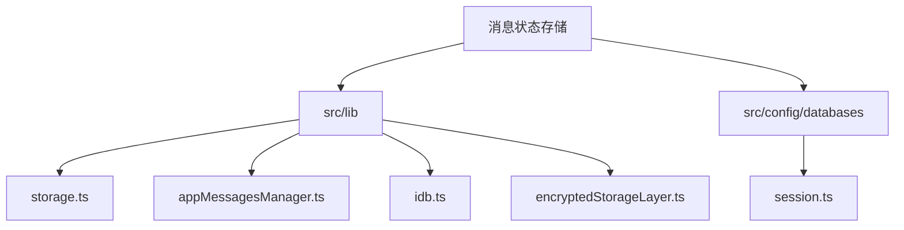
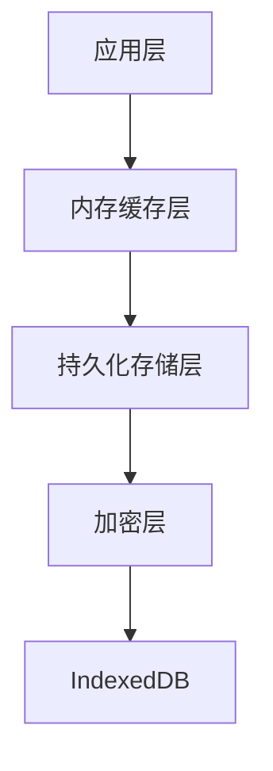
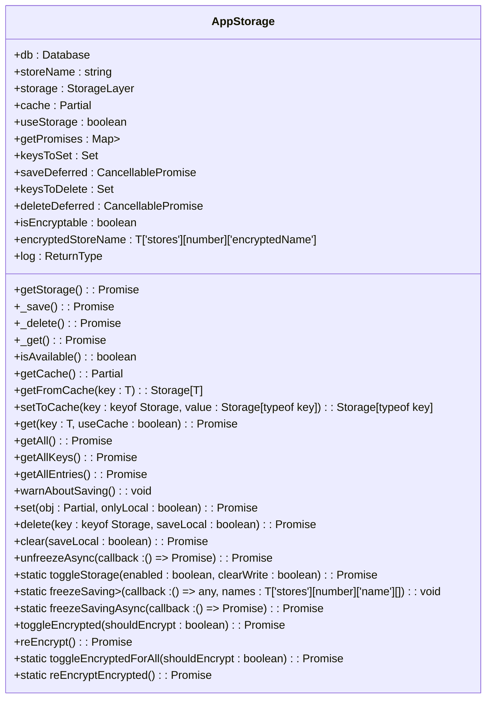
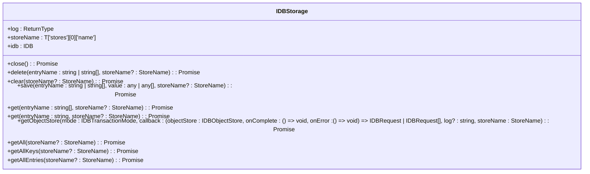
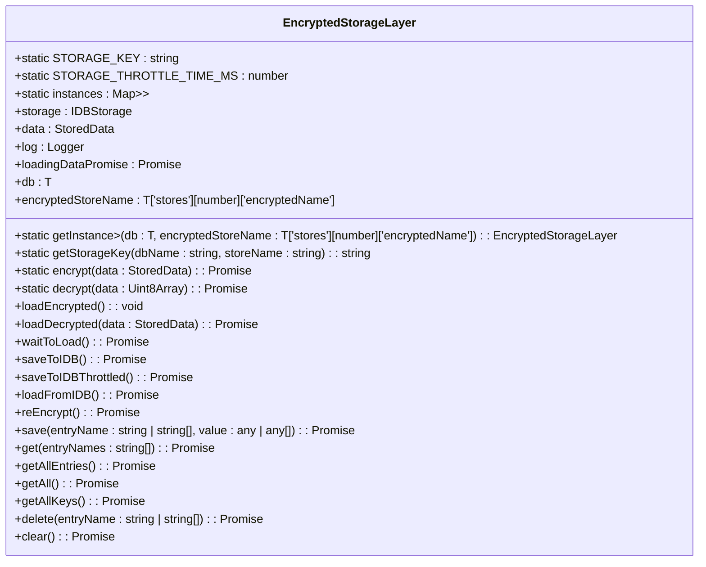
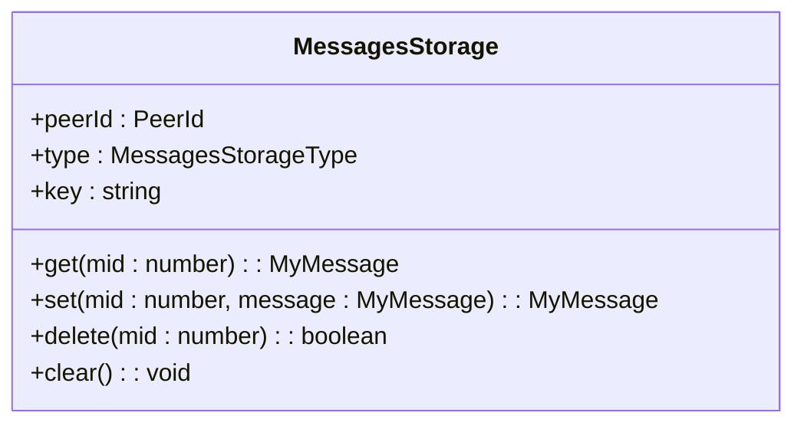
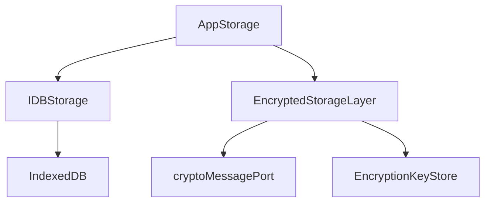

# 消息状态存储

<cite>
**本文档引用的文件**   
- [storage.ts](file://src/lib/storage.ts)
- [appMessagesManager.ts](file://src/lib/appManagers/appMessagesManager.ts)
- [idb.ts](file://src/lib/files/idb.ts)
- [encryptedStorageLayer.ts](file://src/lib/encryptedStorageLayer.ts)
- [session.ts](file://src/config/databases/session.ts)
- [getHistoryStorageKey.ts](file://src/lib/appManagers/utils/messages/getHistoryStorageKey.ts)
</cite>

## 目录
1. [简介](#简介)
2. [项目结构](#项目结构)
3. [核心组件](#核心组件)
4. [架构概述](#架构概述)
5. [详细组件分析](#详细组件分析)
6. [依赖分析](#依赖分析)
7. [性能考虑](#性能考虑)
8. [故障排除指南](#故障排除指南)
9. [结论](#结论)

## 简介
本文档详细描述了消息状态存储系统的实现，包括内存中的存储结构、持久化机制、缓存与IndexedDB之间的同步策略、存储分片策略、读写接口以及性能优化建议。系统采用分层架构，结合内存缓存和IndexedDB持久化存储，确保消息状态的高效管理和数据持久性。

## 项目结构
项目结构清晰地组织了消息状态存储相关的组件和配置文件。核心存储逻辑位于`src/lib`目录下，包括`storage.ts`、`appMessagesManager.ts`等文件。数据库配置位于`src/config/databases`目录下，定义了数据库的名称、版本和存储对象。

**图表来源**
- [storage.ts](file://src/lib/storage.ts)
- [appMessagesManager.ts](file://src/lib/appManagers/appMessagesManager.ts)
- [idb.ts](file://src/lib/files/idb.ts)
- [encryptedStorageLayer.ts](file://src/lib/encryptedStorageLayer.ts)
- [session.ts](file://src/config/databases/session.ts)

**章节来源**
- [storage.ts](file://src/lib/storage.ts)
- [appMessagesManager.ts](file://src/lib/appManagers/appMessagesManager.ts)
- [idb.ts](file://src/lib/files/idb.ts)
- [encryptedStorageLayer.ts](file://src/lib/encryptedStorageLayer.ts)
- [session.ts](file://src/config/databases/session.ts)

## 核心组件
消息状态存储的核心组件包括`AppStorage`、`IDBStorage`、`EncryptedStorageLayer`和`MessagesStorage`。这些组件共同实现了消息状态的内存缓存、持久化存储和加密功能。

**章节来源**
- [storage.ts](file://src/lib/storage.ts)
- [appMessagesManager.ts](file://src/lib/appManagers/appMessagesManager.ts)
- [idb.ts](file://src/lib/files/idb.ts)
- [encryptedStorageLayer.ts](file://src/lib/encryptedStorageLayer.ts)

## 架构概述
消息状态存储系统采用分层架构，分为内存缓存层、持久化存储层和加密层。内存缓存层使用`Map`对象存储消息状态，提供快速访问。持久化存储层使用IndexedDB存储消息状态，确保数据持久性。加密层使用`EncryptedStorageLayer`类对敏感数据进行加密存储。

**图表来源**
- [storage.ts](file://src/lib/storage.ts)
- [idb.ts](file://src/lib/files/idb.ts)
- [encryptedStorageLayer.ts](file://src/lib/encryptedStorageLayer.ts)

## 详细组件分析

### AppStorage 分析
`AppStorage`类是消息状态存储的核心，负责管理内存缓存和持久化存储之间的同步。它使用`Map`对象存储消息状态，并通过`IDBStorage`类与IndexedDB进行交互。

#### 类图

**图表来源**
- [storage.ts](file://src/lib/storage.ts#L46-L489)

### IDBStorage 分析
`IDBStorage`类负责与IndexedDB进行交互，提供数据的持久化存储功能。它封装了IndexedDB的API，提供了简洁的接口供上层组件使用。

#### 类图

**图表来源**
- [idb.ts](file://src/lib/files/idb.ts#L266-L579)

### EncryptedStorageLayer 分析
`EncryptedStorageLayer`类负责对敏感数据进行加密存储。它使用`cryptoMessagePort`进行加密和解密操作，确保数据的安全性。

#### 类图

**图表来源**
- [encryptedStorageLayer.ts](file://src/lib/encryptedStorageLayer.ts#L29-L229)

### MessagesStorage 分析
`MessagesStorage`类负责管理消息的存储，包括历史消息、日志消息等。它使用`Map`对象存储消息，并提供相应的增删改查接口。

#### 类图

**图表来源**
- [appMessagesManager.ts](file://src/lib/appManagers/appMessagesManager.ts#L3764-L3786)

## 依赖分析
消息状态存储系统依赖于多个组件和库，包括`IDBStorage`、`EncryptedStorageLayer`、`AppStorage`等。这些组件通过接口和抽象类进行解耦，确保系统的可扩展性和可维护性。

**图表来源**
- [storage.ts](file://src/lib/storage.ts)
- [idb.ts](file://src/lib/files/idb.ts)
- [encryptedStorageLayer.ts](file://src/lib/encryptedStorageLayer.ts)

## 性能考虑
为了提高消息状态存储的性能，系统采用了多种优化策略，包括批量操作、内存管理、索引设计等。批量操作减少了与IndexedDB的交互次数，内存管理确保了内存的高效使用，索引设计提高了查询效率。

**章节来源**
- [storage.ts](file://src/lib/storage.ts)
- [idb.ts](file://src/lib/files/idb.ts)
- [encryptedStorageLayer.ts](file://src/lib/encryptedStorageLayer.ts)

## 故障排除指南
在使用消息状态存储系统时，可能会遇到一些常见问题，如数据同步失败、加密解密错误等。以下是一些常见的故障排除建议：

1. **数据同步失败**：检查`AppStorage`的`useStorage`属性是否为`true`，确保持久化存储已启用。
2. **加密解密错误**：检查`EncryptedStorageLayer`的`loadingDataPromise`是否已正确加载，确保加密密钥已正确获取。
3. **性能问题**：检查批量操作是否已正确使用，确保内存管理策略已正确实施。

**章节来源**
- [storage.ts](file://src/lib/storage.ts)
- [idb.ts](file://src/lib/files/idb.ts)
- [encryptedStorageLayer.ts](file://src/lib/encryptedStorageLayer.ts)

## 结论
消息状态存储系统通过分层架构和多种优化策略，实现了高效、安全的消息状态管理。系统结合内存缓存和IndexedDB持久化存储，确保了数据的快速访问和持久性。通过加密层，系统还提供了数据的安全性保障。未来可以进一步优化索引设计和内存管理策略，提高系统的整体性能。