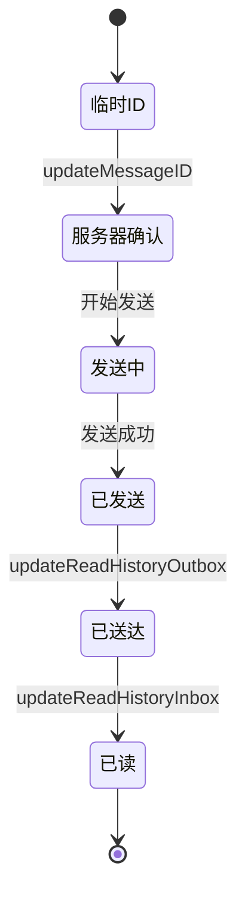

# 消息状态定义

<cite>
**本文档引用的文件**
- [appMessagesManager.ts](file://src/lib/appManagers/appMessagesManager.ts)
- [mtproto_config.ts](file://src/lib/mtproto/mtproto_config.ts)
- [types.d.ts](file://src/types.d.ts)
- [messageId.ts](file://src/lib/appManagers/utils/messageId/getServerMessageId.ts)
- [messages.ts](file://src/lib/appManagers/utils/messages/isMentionUnread.ts)
</cite>

## 目录
1. [简介](#简介)
2. [消息状态概述](#消息状态概述)
3. [消息状态定义](#消息状态定义)
4. [状态转换规则](#状态转换规则)
5. [状态机图示](#状态机图示)
6. [数据结构与字段定义](#数据结构与字段定义)
7. [临时ID与服务器ID](#临时id与服务器id)
8. [状态相关功能实现](#状态相关功能实现)
9. [结论](#结论)

## 简介
本文档详细定义了Telegram Web客户端中消息的各种状态，包括临时ID状态、服务器确认状态、发送中、已发送、已送达、已读等。文档解释了每种状态的含义和业务场景，说明了状态标识的实现方式，描述了状态转换的条件和规则，并提供了状态机图示。同时，文档记录了状态相关的数据结构和字段定义，说明了状态信息如何与消息实体关联。

## 消息状态概述
在Telegram Web客户端中，消息状态是消息生命周期的核心组成部分。消息状态不仅反映了消息的传输进度，还影响着用户界面的显示和用户交互。消息状态的管理涉及到客户端与服务器之间的复杂交互，包括消息的发送、确认、接收和阅读等过程。

消息状态的实现主要依赖于`appMessagesManager.ts`中的`AppMessagesManager`类，该类负责管理消息的整个生命周期。消息状态的转换由各种更新事件触发，如`updateMessageID`、`updateReadHistoryInbox`等。

**Section sources**
- [appMessagesManager.ts](file://src/lib/appManagers/appMessagesManager.ts#L398-L800)

## 消息状态定义
消息状态定义了消息在其生命周期中的不同阶段。以下是主要的消息状态及其含义：

### 临时ID状态
当用户发送消息时，客户端会为消息分配一个临时ID。这个临时ID仅在客户端本地有效，用于在消息发送到服务器之前标识消息。临时ID状态表示消息尚未被服务器确认。

### 服务器确认状态
当服务器接收到消息并分配了永久ID后，消息进入服务器确认状态。此时，客户端会收到`updateMessageID`事件，将临时ID替换为服务器分配的永久ID。

### 发送中状态
发送中状态表示消息正在从客户端发送到服务器的过程中。在此状态下，消息的传输状态由客户端的网络层管理。

### 已发送状态
已发送状态表示消息已经成功发送到服务器，但尚未被接收方接收。此状态通常通过消息的`pFlags.outgoing`标志来标识。

### 已送达状态
已送达状态表示消息已经被接收方的设备接收，但尚未被用户阅读。此状态通过`updateReadHistoryOutbox`事件来更新。

### 已读状态
已读状态表示消息已经被用户阅读。此状态通过`updateReadHistoryInbox`事件来更新，是消息生命周期的最终状态之一。

**Section sources**
- [appMessagesManager.ts](file://src/lib/appManagers/appMessagesManager.ts#L525-L546)
- [mtproto_config.ts](file://src/lib/mtproto/mtproto_config.ts#L31-L32)

## 状态转换规则
消息状态的转换遵循严格的规则，确保消息状态的一致性和可靠性。以下是主要的状态转换规则：

1. **临时ID → 服务器确认**：当服务器为消息分配永久ID时，通过`updateMessageID`事件触发转换。
2. **发送中 → 已发送**：当消息成功发送到服务器时，通过网络层的确认机制触发转换。
3. **已发送 → 已送达**：当接收方设备接收到消息时，通过`updateReadHistoryOutbox`事件触发转换。
4. **已送达 → 已读**：当用户阅读消息时，通过`updateReadHistoryInbox`事件触发转换。

状态转换可能受到网络状况、服务器响应时间等因素的影响。在某些情况下，状态转换可能会延迟或失败，需要客户端进行适当的错误处理和重试机制。

**Section sources**
- [appMessagesManager.ts](file://src/lib/appManagers/appMessagesManager.ts#L525-L546)
- [appMessagesManager.ts](file://src/lib/appManagers/appMessagesManager.ts#L724-L750)

## 状态机图示
以下是消息状态的状态机图示，展示了消息在其生命周期中的状态转换：



**Diagram sources**
- [appMessagesManager.ts](file://src/lib/appManagers/appMessagesManager.ts#L525-L546)
- [appMessagesManager.ts](file://src/lib/appManagers/appMessagesManager.ts#L724-L750)

## 数据结构与字段定义
消息状态的相关数据结构和字段定义主要在`appMessagesManager.ts`和`types.d.ts`中定义。以下是关键的数据结构和字段：

### MyMessage
`MyMessage`类型定义了消息的基本结构，包括消息ID、发送者ID、接收者ID、消息内容等。

```typescript
export type MyMessage = Message.message | Message.messageService;
```

### HistoryStorage
`HistoryStorage`类型定义了消息历史的存储结构，包括最大ID、计数、历史记录等。

```typescript
export type HistoryStorage = {
  _maxId: number,
  count: number | null,
  history?: SlicedArray<number>,
  searchHistory?: SlicedArray<`${PeerId}_${number}`>,
  readonly maxId?: number,
  readPromise?: Promise<void>,
  readMaxId?: number,
  readOutboxMaxId?: number,
  triedToReadMaxId?: number,
  maxOutId?: number,
  replyMarkup?: Exclude<ReplyMarkup, ReplyMarkup.replyInlineMarkup>,
  readonly type: 'history' | 'replies' | 'search',
  key: HistoryStorageKey,
  wasFetched?: boolean;
};
```

### PFlags
`pFlags`是消息的一个重要字段，用于存储消息的各种标志，如是否为 outgoing、是否已读等。

**Section sources**
- [appMessagesManager.ts](file://src/lib/appManagers/appMessagesManager.ts#L180-L181)
- [appMessagesManager.ts](file://src/lib/appManagers/appMessagesManager.ts#L138-L159)
- [types.d.ts](file://src/types.d.ts#L1-L506)

## 临时ID与服务器ID
临时ID与服务器ID的区别是消息状态管理中的一个关键概念。临时ID是客户端在发送消息时分配的本地ID，仅在客户端有效。服务器ID是服务器在接收到消息后分配的永久ID，全局唯一。

### 临时ID
- 由客户端生成
- 仅在客户端本地有效
- 用于在消息发送到服务器之前标识消息

### 服务器ID
- 由服务器分配
- 全局唯一
- 用于在客户端和服务器之间同步消息状态

`getServerMessageId`函数用于从消息ID中提取服务器ID，忽略 outgoing 偏移。

```typescript
export default function getServerMessageId(messageId: number) {
  return clearMessageId(messageId, true);
}
```

**Section sources**
- [getServerMessageId.ts](file://src/lib/appManagers/utils/messageId/getServerMessageId.ts#L12-L14)
- [clearMessageId.ts](file://src/lib/appManagers/utils/messageId/clearMessageId.ts#L9-L20)
- [isLegacyMessageId.ts](file://src/lib/appManagers/utils/messageId/isLegacyMessageId.ts#L3-L5)

## 状态相关功能实现
消息状态的实现涉及到多个功能模块的协同工作。以下是主要的功能实现：

### 消息发送
消息发送功能由`AppMessagesManager`类的`sendText`方法实现。在发送消息时，客户端会为消息分配一个临时ID，并将其添加到消息存储中。

### 状态更新
状态更新功能由`AppMessagesManager`类的事件监听器实现。当收到`updateMessageID`、`updateReadHistoryInbox`等事件时，客户端会更新消息的状态。

### 错误处理
错误处理功能确保在状态转换失败时能够进行适当的处理。例如，当网络连接失败时，客户端会重试发送消息。

**Section sources**
- [appMessagesManager.ts](file://src/lib/appManagers/appMessagesManager.ts#L778-L800)
- [appMessagesManager.ts](file://src/lib/appManagers/appMessagesManager.ts#L525-L546)

## 结论
本文档详细定义了Telegram Web客户端中消息的各种状态，包括临时ID状态、服务器确认状态、发送中、已发送、已送达、已读等。文档解释了每种状态的含义和业务场景，说明了状态标识的实现方式，描述了状态转换的条件和规则，并提供了状态机图示。同时，文档记录了状态相关的数据结构和字段定义，说明了状态信息如何与消息实体关联。这些信息对于理解和实现消息状态管理功能至关重要。