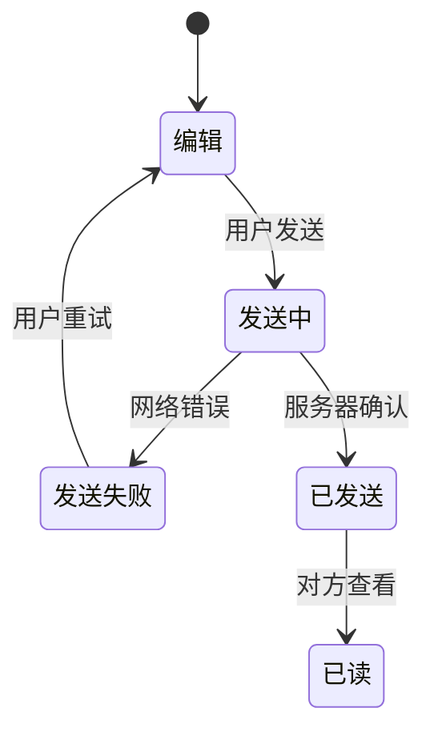
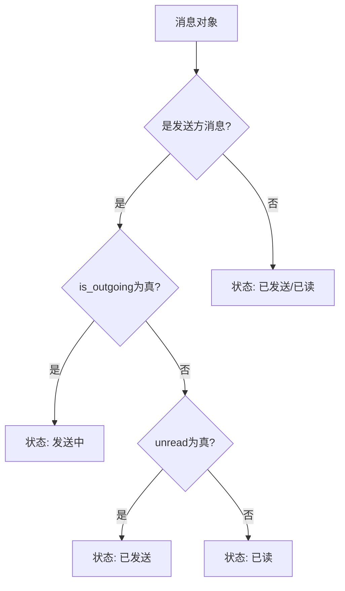
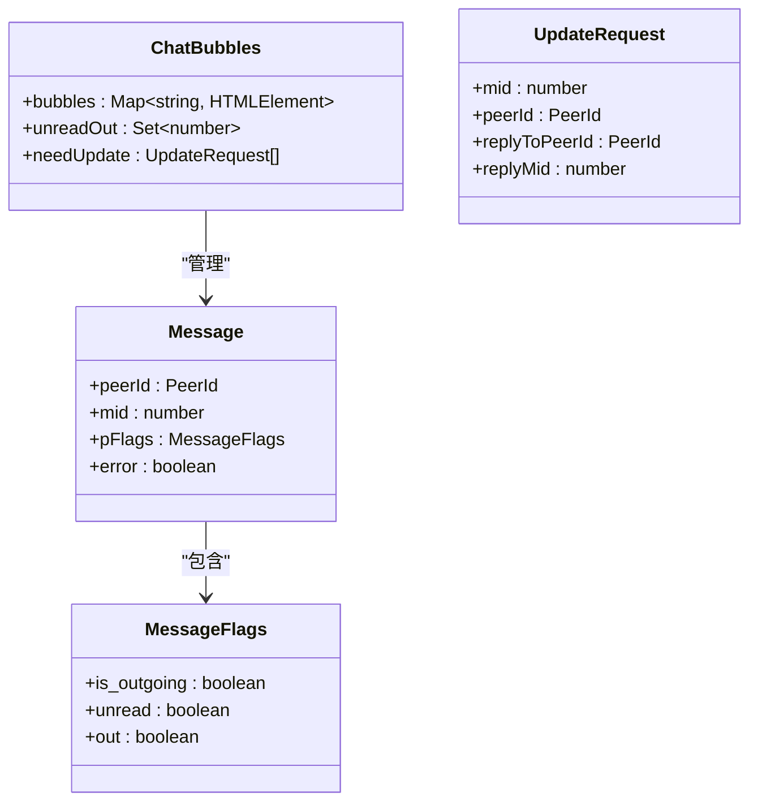
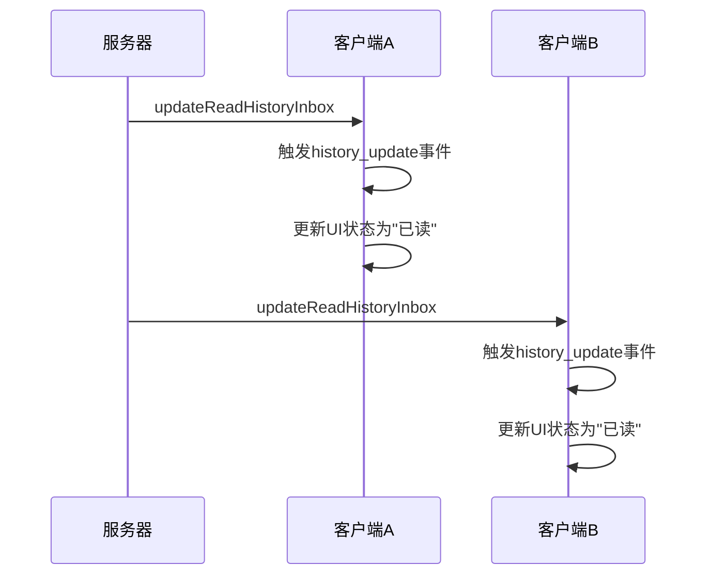
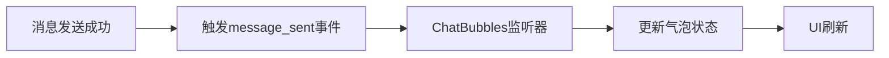
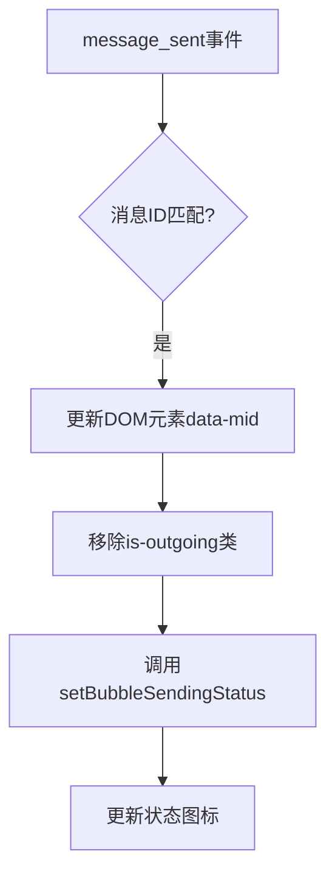
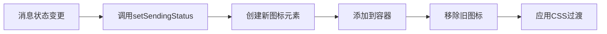

# 消息状态管理

<cite>
**本文档引用的文件**
- [sendingStatus.ts](file://src/components/sendingStatus.ts)
- [appDialogsManager.ts](file://src/lib/appManagers/appDialogsManager.ts)
- [bubbles.ts](file://src/components/chat/bubbles.ts)
- [bubbleGroups.ts](file://src/components/chat/bubbleGroups.ts)
- [messageRender.ts](file://src/components/chat/messageRender.ts)
</cite>

## 目录
1. [简介](#简介)
2. [消息状态生命周期](#消息状态生命周期)
3. [状态存储结构](#状态存储结构)
4. [状态同步策略](#状态同步策略)
5. [状态变更触发与处理](#状态变更触发与处理)
6. [状态查询API](#状态查询api)
7. [状态可视化](#状态可视化)
8. [结论](#结论)

## 简介

本文档详细阐述了Telegram Web客户端中消息状态管理的实现机制。系统通过一套完整的状态机来跟踪消息从创建到最终确认的全生命周期，确保用户能够准确了解每条消息的当前状态。消息状态管理是即时通讯系统的核心功能之一，它直接影响用户体验和系统可靠性。

消息状态管理主要涉及以下几个方面：消息在不同阶段的状态表示（如编辑、发送、送达、已读等）、状态信息在内存和持久化存储中的结构、多设备间状态同步的策略、状态变更的触发条件和处理流程、状态查询接口的设计，以及UI层如何直观地反映这些状态。

**Section sources**
- [sendingStatus.ts](file://src/components/sendingStatus.ts#L1-L92)
- [appDialogsManager.ts](file://src/lib/appManagers/appDialogsManager.ts#L1-L800)

## 消息状态生命周期

消息状态生命周期涵盖了从消息创建到最终确认的全过程。系统定义了四种核心状态，通过枚举`SENDING_STATUS`进行管理：



- **编辑 (Editing)**: 消息处于草稿状态，尚未发送。此时消息仅存在于客户端内存中。
- **发送中 (Pending)**: 消息已提交给服务器，但尚未收到确认。在UI上通常显示为时钟图标。
- **已发送 (Sent)**: 消息已成功送达服务器，并被存储。如果消息是发给自己的（Saved Messages），则此状态表示消息已送达。
- **已读 (Read)**: 消息已被接收方查看。这是消息生命周期的最终确认状态。

状态转换由`getSendingStatus`函数实现，该函数根据消息对象的标志位（`pFlags`）来判断当前状态。对于发送方的消息，`is_outgoing`标志表示消息正在发送中；对于接收方的消息，`unread`标志为`false`时表示消息已被读取。



**Diagram sources**
- [sendingStatus.ts](file://src/components/sendingStatus.ts#L14-L27)

**Section sources**
- [sendingStatus.ts](file://src/components/sendingStatus.ts#L14-L27)
- [bubbles.ts](file://src/components/chat/bubbles.ts#L764-L777)

## 状态存储结构

消息状态信息在系统中以两种形式存在：内存中的实时状态和持久化存储中的持久状态。

### 内存存储结构

在内存中，消息状态主要通过`Message`对象的`pFlags`属性进行管理。`pFlags`是一个包含多个布尔标志的结构，其中`is_outgoing`和`unread`是决定消息状态的关键字段。

此外，系统使用`ChatBubbles`类中的`bubbles`映射来维护消息ID与DOM元素的关联。每个消息气泡（bubble）的DOM元素都通过`data-mid`属性存储消息ID，并通过`setBubbleSendingStatus`方法动态更新其状态指示器。



### 持久化存储结构

持久化存储主要依赖于IndexedDB和服务器端的同步机制。客户端通过`appMessagesManager`与服务器通信，获取和更新消息状态。消息状态的持久化是通过将`Message`对象序列化并存储在本地数据库中实现的。

当消息状态发生变化时，系统会通过`message_sent`事件通知所有监听者，确保状态变更能够被正确记录和同步。

**Diagram sources**
- [bubbles.ts](file://src/components/chat/bubbles.ts#L455-L458)
- [appDialogsManager.ts](file://src/lib/appManagers/appDialogsManager.ts#L121-L144)

**Section sources**
- [bubbles.ts](file://src/components/chat/bubbles.ts#L455-L458)
- [appDialogsManager.ts](file://src/lib/appManagers/appDialogsManager.ts#L121-L144)

## 状态同步策略

为了确保多设备间消息状态的一致性，系统采用了一套基于事件驱动的同步策略。

### 服务器推送同步

当消息状态在服务器端发生变化时（例如，接收方阅读了消息），服务器会通过长连接推送`updateReadHistoryInbox`或`updateReadHistoryOutbox`更新。客户端接收到这些更新后，会触发`history_update`事件，从而更新本地状态。



### 客户端事件广播

在单个客户端内部，状态变更通过`rootScope`事件总线进行广播。例如，当一条消息被成功发送时，会触发`message_sent`事件，通知所有相关的UI组件更新状态。



### 状态冲突解决

在多设备场景下，可能会出现状态冲突。系统通过消息ID（`mid`）和时间戳来解决冲突，确保最终状态的一致性。当客户端从服务器获取到最新的消息历史时，会用服务器状态覆盖本地状态，保证数据的最终一致性。

**Diagram sources**
- [bubbles.ts](file://src/components/chat/bubbles.ts#L616-L724)
- [appDialogsManager.ts](file://src/lib/appManagers/appDialogsManager.ts#L726-L730)

**Section sources**
- [bubbles.ts](file://src/components/chat/bubbles.ts#L616-L724)
- [appDialogsManager.ts](file://src/lib/appManagers/appDialogsManager.ts#L726-L730)

## 状态变更触发与处理

消息状态的变更由多种因素触发，包括用户操作、网络事件和服务器推送。

### 用户操作触发

- **发送消息**: 用户点击发送按钮，触发消息发送流程，状态从"编辑"变为"发送中"。
- **阅读消息**: 用户滚动到消息位置或点击消息，触发阅读确认，状态从"已发送"变为"已读"。

### 网络事件触发

- **网络连接恢复**: 当网络中断后恢复时，系统会重新发送未成功发送的消息，触发状态更新。
- **超时**: 如果消息发送超时，状态会变为"发送失败"。

### 服务器推送触发

- **送达确认**: 服务器确认消息已存储，推送更新，状态变为"已发送"。
- **阅读确认**: 接收方阅读消息后，服务器推送阅读状态更新。

状态变更的处理主要在`ChatBubbles`类的事件监听器中完成。例如，`message_sent`事件监听器会更新消息气泡的状态指示器：



**Section sources**
- [bubbles.ts](file://src/components/chat/bubbles.ts#L733-L798)
- [sendingStatus.ts](file://src/components/sendingStatus.ts#L31-L67)

## 状态查询API

系统提供了多种方式来查询消息状态，主要通过`getSendingStatus`函数和`ChatBubbles`类的方法实现。

### getSendingStatus函数

这是最核心的状态查询API，接受一个`Message`对象作为参数，返回其当前的`SENDING_STATUS`。

```typescript
function getSendingStatus(message: Message.message | Message.messageService): SENDING_STATUS
```

该函数的实现逻辑简单高效，通过检查消息的标志位直接返回状态，时间复杂度为O(1)。

### ChatBubbles状态查询

`ChatBubbles`类提供了更高级的状态查询方法，如`getBubble`用于根据消息ID获取对应的DOM元素，从而可以检查其当前的CSS类来确定状态。

此外，系统还维护了`unreadOut`集合，用于快速查询哪些发送出去的消息尚未被对方阅读。

**Section sources**
- [sendingStatus.ts](file://src/components/sendingStatus.ts#L21-L28)
- [bubbles.ts](file://src/components/chat/bubbles.ts#L452-L454)

## 状态可视化

UI层通过多种方式直观地反映消息的不同状态。

### 状态图标

- **发送中**: 时钟图标 (`tgico-clock`)
- **已发送**: 单勾图标 (`tgico-check`)
- **已读**: 双勾图标 (`tgico-checks`)
- **发送失败**: 错误图标 (`tgico-sendingerror`)

这些图标通过`setSendingStatus`函数动态设置到消息气泡的`statusSpan`元素中。

### CSS类管理

系统使用一系列CSS类来管理状态的视觉表现：

- `is-outgoing`: 表示消息正在发送中
- `is-out`: 表示消息已发送
- `hide`: 隐藏状态指示器

状态变更时，系统会通过`SetTransition`函数平滑地切换这些CSS类，提供流畅的用户体验。



**Diagram sources**
- [sendingStatus.ts](file://src/components/sendingStatus.ts#L31-L67)
- [bubbles.ts](file://src/components/chat/bubbles.ts#L774-L778)

**Section sources**
- [sendingStatus.ts](file://src/components/sendingStatus.ts#L31-L67)
- [bubbles.ts](file://src/components/chat/bubbles.ts#L774-L778)

## 结论

Telegram Web客户端的消息状态管理系统设计精巧，通过清晰的状态机、高效的存储结构和可靠的同步策略，确保了消息状态的准确性和一致性。系统充分利用了事件驱动架构，实现了状态变更的实时响应和多设备同步。UI层的状态可视化设计直观明了，为用户提供了良好的使用体验。整体架构体现了高内聚、低耦合的设计原则，具有良好的可维护性和扩展性。