# 一致性维护

<cite>
**本文档引用的文件**   
- [appMessagesManager.ts](file://src/lib/appManagers/appMessagesManager.ts)
- [apiUpdatesManager.ts](file://src/lib/appManagers/apiUpdatesManager.ts)
- [mtprotoworker.ts](file://src/lib/mtproto/mtprotoworker.ts)
- [mtprotoMessagePort.ts](file://src/lib/mtproto/mtprotoMessagePort.ts)
- [storage.ts](file://src/lib/storage.ts)
- [createHistoryStorage.ts](file://src/lib/appManagers/utils/messages/createHistoryStorage.ts)
- [getHistoryStorageKey.ts](file://src/lib/appManagers/utils/messages/getHistoryStorageKey.ts)
</cite>

## 目录
1. [引言](#引言)
2. [消息缓存架构](#消息缓存架构)
3. [同步策略](#同步策略)
4. [冲突解决机制](#冲突解决机制)
5. [数据验证机制](#数据验证机制)
6. [同步触发条件](#同步触发条件)
7. [离线场景处理](#离线场景处理)
8. [结论](#结论)

## 引言

本文档详细阐述了消息缓存一致性维护机制，重点分析了本地缓存与服务器数据的同步策略、冲突解决机制、数据验证机制以及在不同场景下的处理方案。系统通过多层缓存架构和消息同步机制，确保用户在各种网络条件下都能获得一致且可靠的消息体验。

**Section sources**
- [appMessagesManager.ts](file://src/lib/appManagers/appMessagesManager.ts#L1-L100)

## 消息缓存架构

系统采用分层缓存架构，将消息数据存储在多个层级中，以提高访问效率和数据一致性。主要包含消息存储（MessagesStorage）和历史存储（HistoryStorage）两种类型。

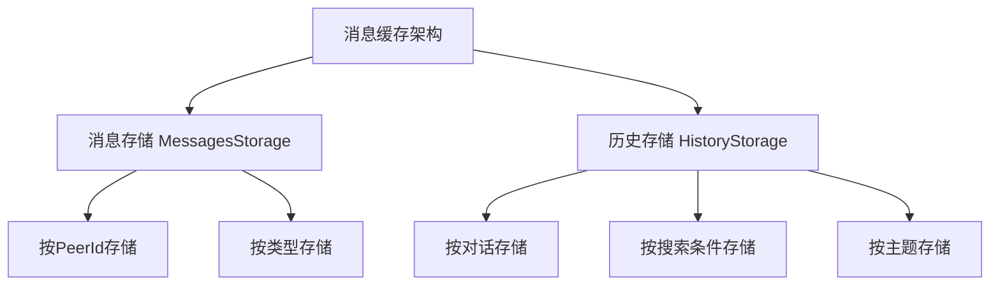

**Diagram sources **
- [appMessagesManager.ts](file://src/lib/appManagers/appMessagesManager.ts#L200-L203)
- [createHistoryStorage.ts](file://src/lib/appManagers/utils/messages/createHistoryStorage.ts#L1-L50)

## 同步策略

系统实现了增量更新和全量同步两种机制，确保本地缓存与服务器数据保持一致。

### 增量更新机制

增量更新通过监听服务器推送的更新消息来实现。当服务器有新的消息或消息状态变更时，会通过更新通道推送更新信息，客户端接收到后立即更新本地缓存。

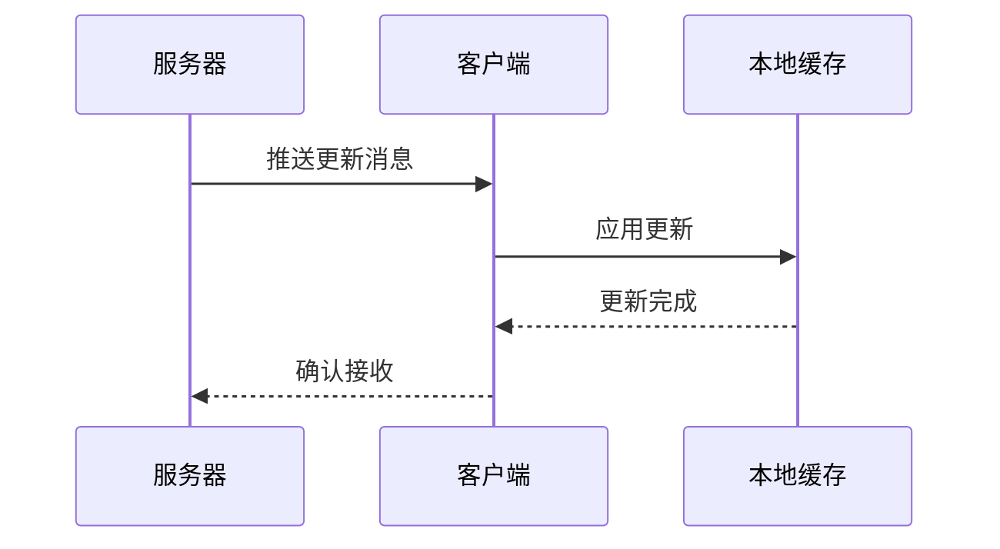

**Diagram sources **
- [apiUpdatesManager.ts](file://src/lib/appManagers/apiUpdatesManager.ts#L182-L253)
- [appMessagesManager.ts](file://src/lib/appManagers/appMessagesManager.ts#L524-L575)

### 全量同步机制

全量同步在应用启动、网络恢复或手动刷新时触发，通过获取服务器的完整状态来确保本地缓存的完整性。

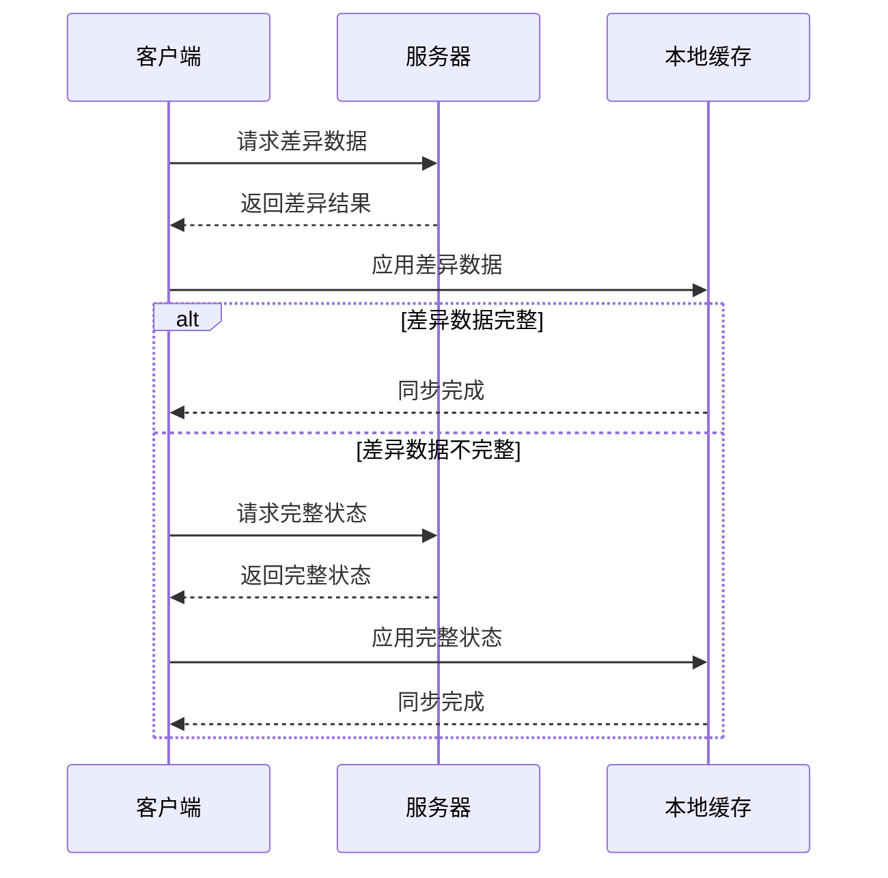

**Diagram sources **
- [apiUpdatesManager.ts](file://src/lib/appManagers/apiUpdatesManager.ts#L279-L372)
- [appMessagesManager.ts](file://src/lib/appManagers/appMessagesManager.ts#L3663-L3697)

## 冲突解决机制

当本地缓存与服务器数据不一致时，系统采用多种策略来解决冲突，确保数据的一致性和完整性。

### 消息ID冲突处理

系统通过消息ID（mid）来识别和处理消息冲突。对于旧版消息ID（小于MESSAGE_ID_OFFSET），系统会使用全局历史存储进行镜像同步。

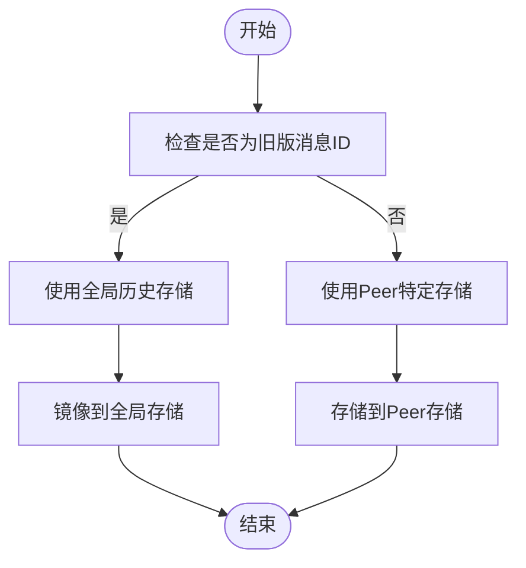

**Diagram sources **
- [appMessagesManager.ts](file://src/lib/appManagers/appMessagesManager.ts#L3722-L3729)
- [isLegacyMessageId.ts](file://src/lib/appManagers/utils/messageId/isLegacyMessageId.ts#L1-L5)

### Pts和Seq冲突处理

系统使用Pts（消息点）和Seq（序列号）来检测和处理更新序列的不一致。当检测到Pts或Seq的不连续时，系统会触发差异同步。

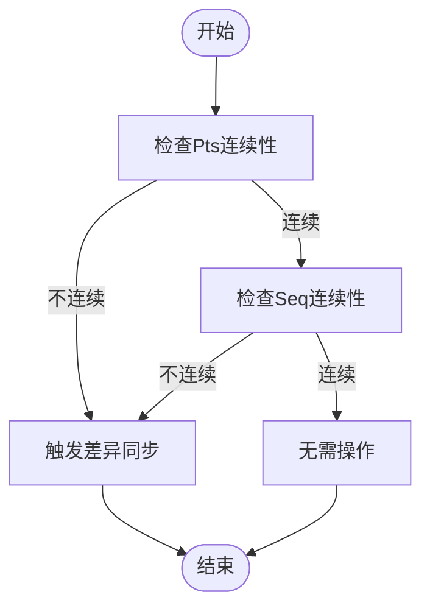

**Diagram sources **
- [apiUpdatesManager.ts](file://src/lib/appManagers/apiUpdatesManager.ts#L574-L602)
- [apiUpdatesManager.ts](file://src/lib/appManagers/apiUpdatesManager.ts#L617-L647)

## 数据验证机制

系统通过多种机制确保缓存数据的完整性和正确性。

### 数据完整性验证

系统在存储和读取数据时都会进行完整性验证，确保数据没有损坏或丢失。

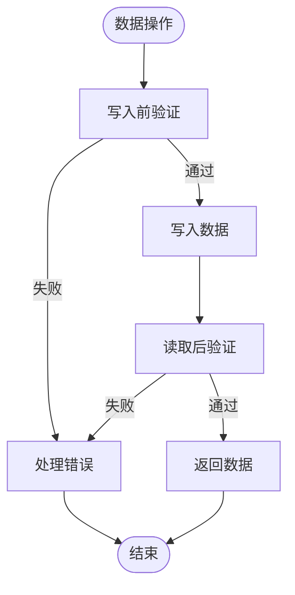

**Diagram sources **
- [storage.ts](file://src/lib/storage.ts#L202-L233)
- [appMessagesManager.ts](file://src/lib/appManagers/appMessagesManager.ts#L3718-L3741)

### 数据一致性验证

系统通过定期同步和状态检查来验证数据的一致性，确保本地缓存与服务器状态保持一致。

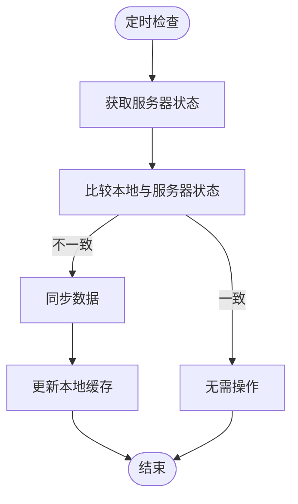

**Diagram sources **
- [apiUpdatesManager.ts](file://src/lib/appManagers/apiUpdatesManager.ts#L709-L757)
- [appMessagesManager.ts](file://src/lib/appManagers/appMessagesManager.ts#L3663-L3697)

## 同步触发条件

系统在多种场景下会触发同步机制，确保数据的及时更新。

### 应用启动同步

当应用启动时，系统会自动触发全量同步，确保本地缓存与服务器状态一致。

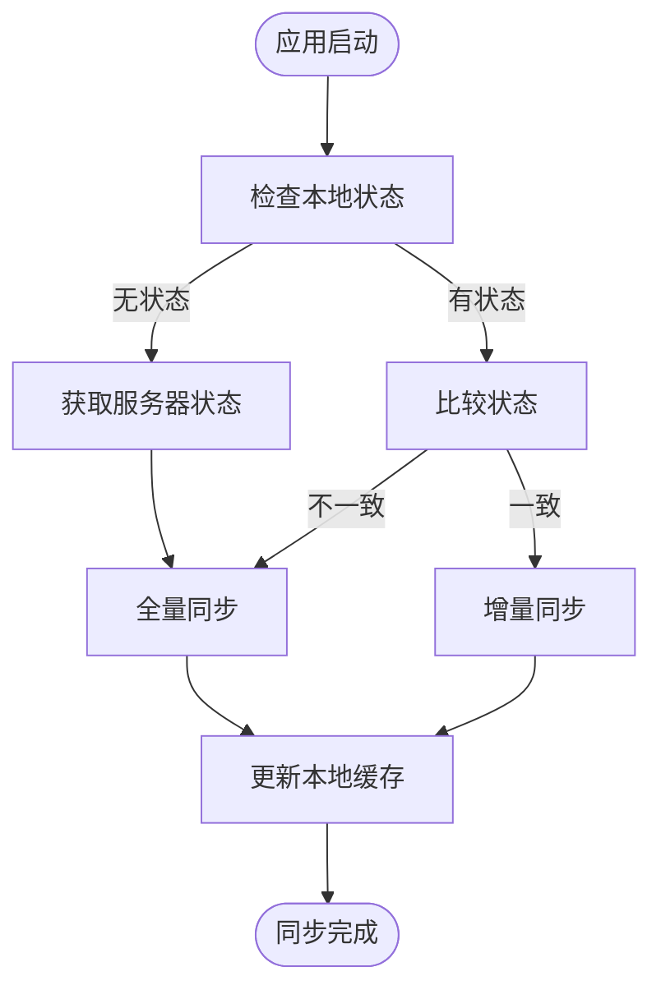

**Diagram sources **
- [apiUpdatesManager.ts](file://src/lib/appManagers/apiUpdatesManager.ts#L709-L757)
- [appMessagesManager.ts](file://src/lib/appManagers/appMessagesManager.ts#L717-L721)

### 网络恢复同步

当网络从断开状态恢复时，系统会自动触发同步，确保在离线期间错过的更新能够及时应用。

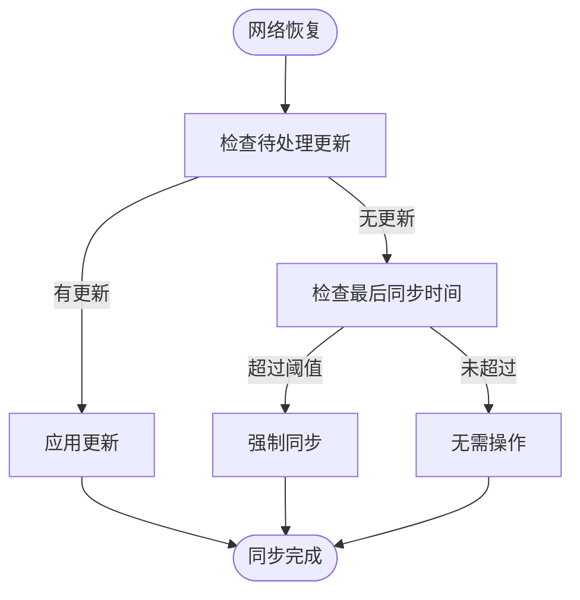

**Diagram sources **
- [connectionStatus.ts](file://src/components/connectionStatus.ts#L117-L122)
- [apiUpdatesManager.ts](file://src/lib/appManagers/apiUpdatesManager.ts#L166-L170)

### 手动刷新同步

用户可以通过手动刷新操作触发同步，强制更新本地缓存。

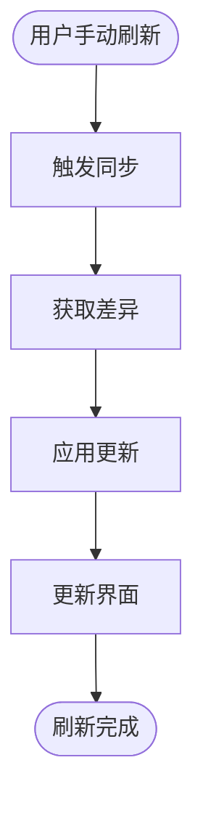

**Diagram sources **
- [apiUpdatesManager.ts](file://src/lib/appManagers/apiUpdatesManager.ts#L166-L170)
- [appMessagesManager.ts](file://src/lib/appManagers/appMessagesManager.ts#L3663-L3697)

## 离线场景处理

系统为离线场景提供了完善的处理方案，确保用户体验的连续性。

### 离线消息缓存

在离线状态下，系统会将用户发送的消息暂存于本地，待网络恢复后自动重发。

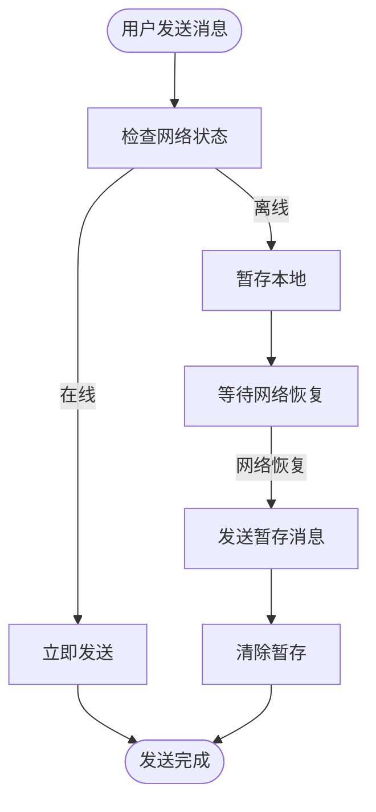

**Diagram sources **
- [appMessagesManager.ts](file://src/lib/appManagers/appMessagesManager.ts#L769-L776)
- [apiUpdatesManager.ts](file://src/lib/appManagers/apiUpdatesManager.ts#L182-L186)

### 离线数据访问

在离线状态下，用户仍然可以访问本地缓存的消息数据，确保基本功能的可用性。

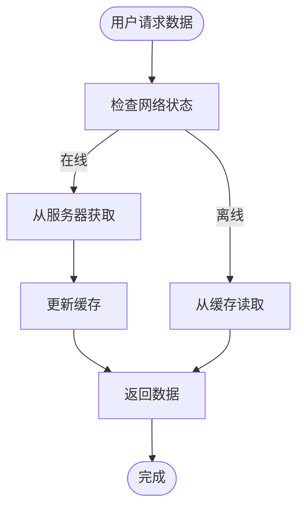

**Diagram sources **
- [appMessagesManager.ts](file://src/lib/appManagers/appMessagesManager.ts#L3706-L3715)
- [storage.ts](file://src/lib/storage.ts#L252-L265)

## 结论

本消息缓存一致性维护机制通过多层次的缓存架构、灵活的同步策略、完善的冲突解决机制和全面的数据验证体系，确保了本地缓存与服务器数据的高度一致性。系统在各种网络条件下都能提供稳定可靠的消息服务，为用户带来连续流畅的使用体验。

[无来源，此部分为总结性内容]