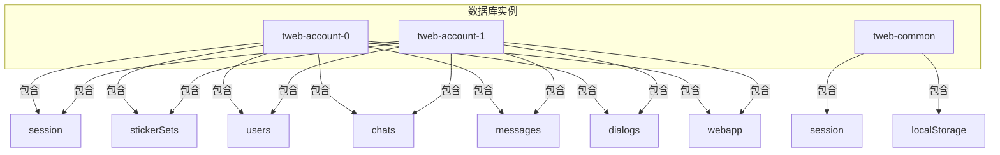
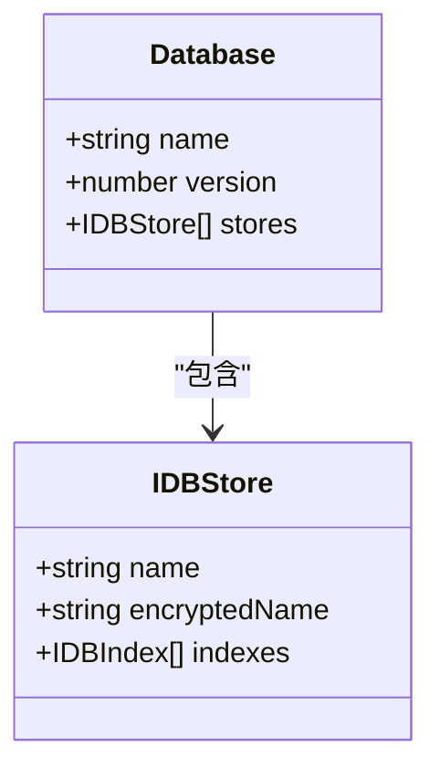
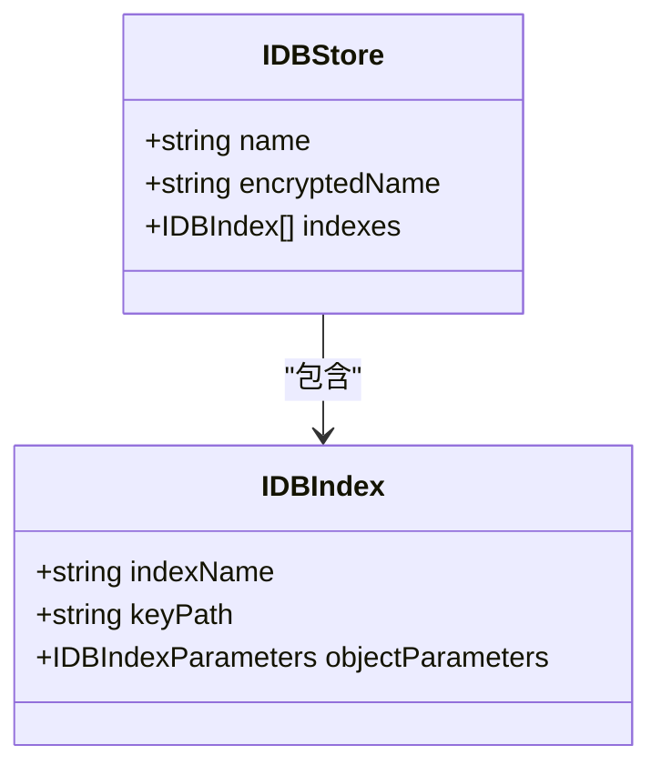
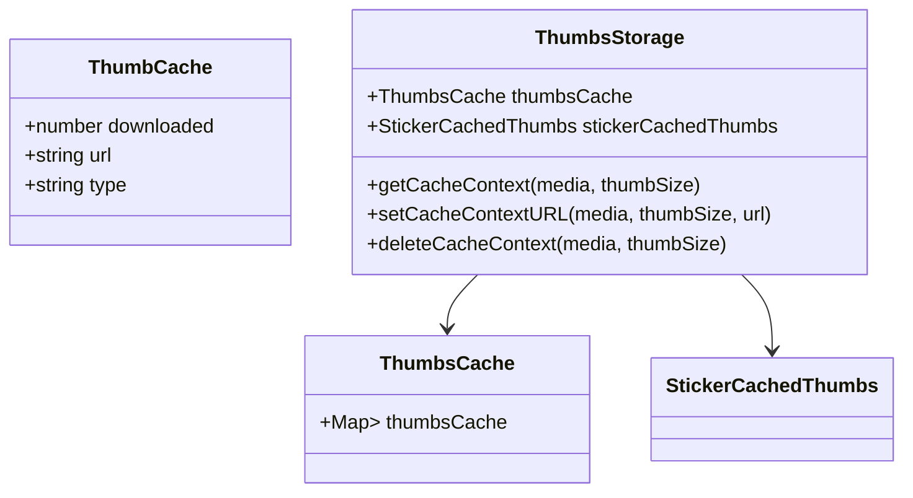
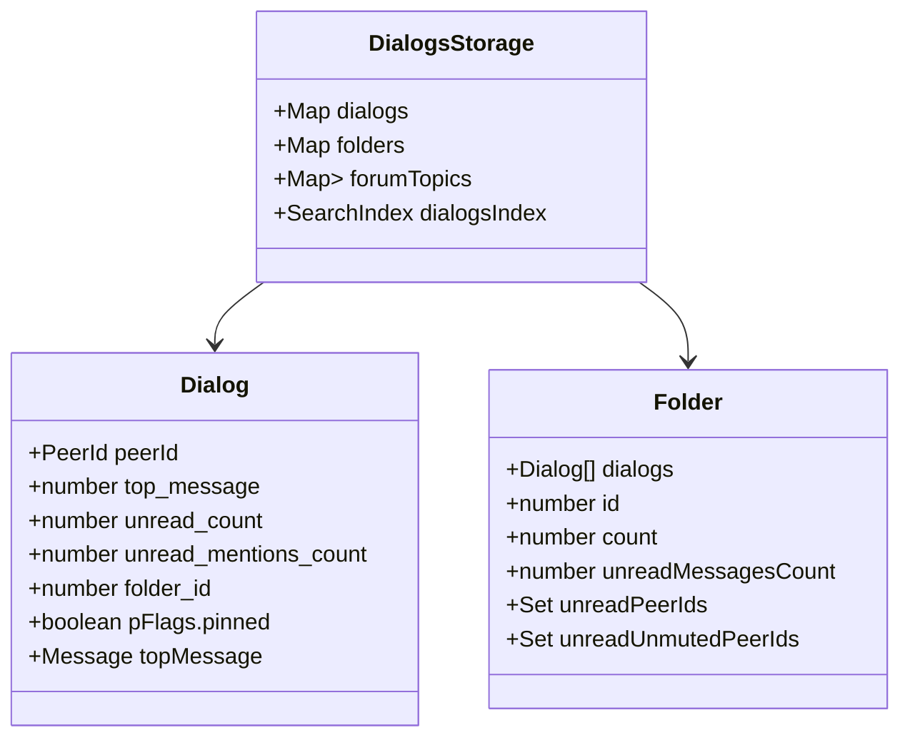
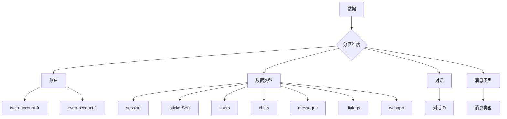
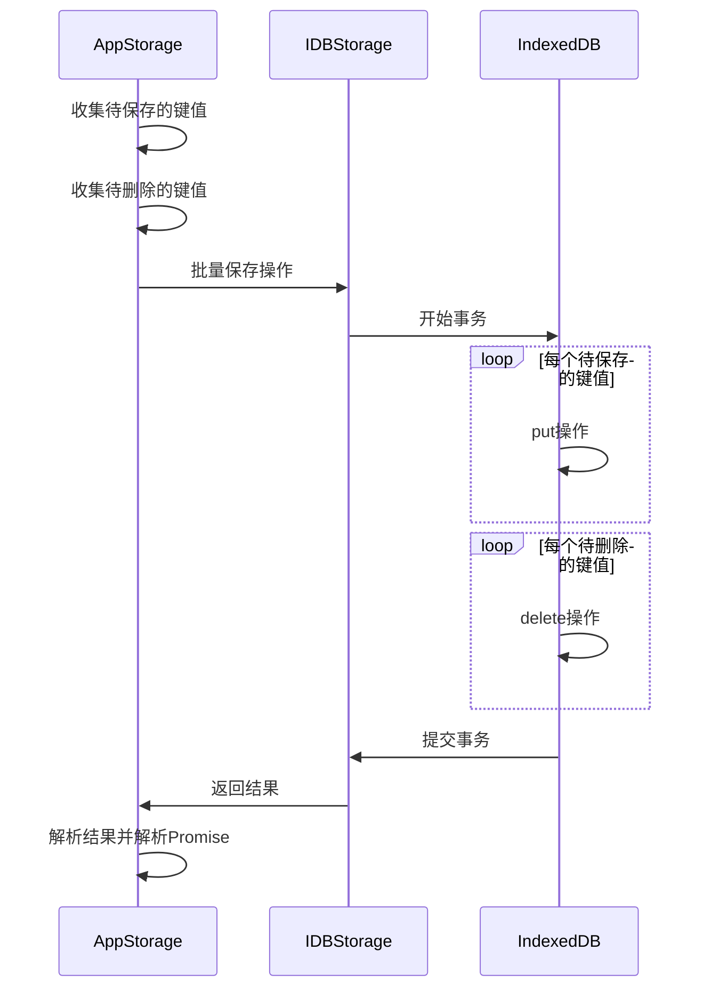
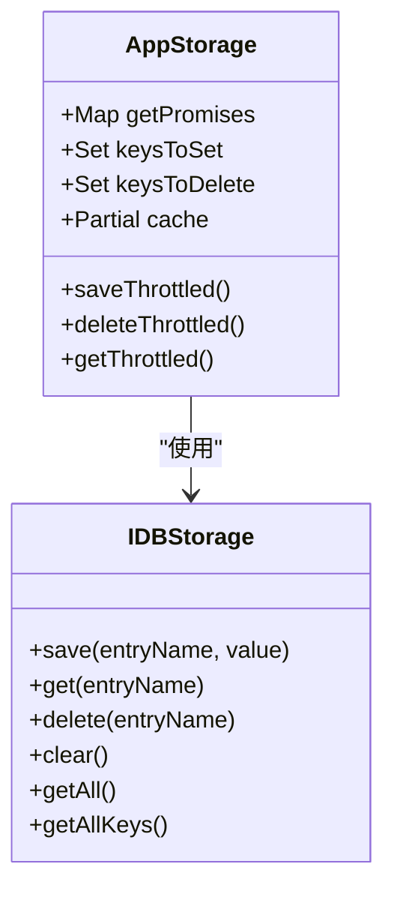
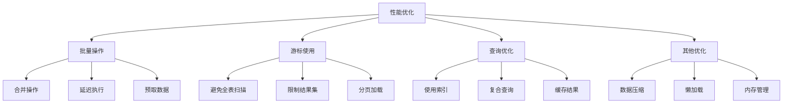

# 存储设计

<cite>
**本文档引用的文件**
- [storage.ts](file://src\lib\storage.ts)
- [idb.ts](file://src\lib\files\idb.ts)
- [state.ts](file://src\config\databases\state.ts)
- [dialogs.ts](file://src\lib\storages\dialogs.ts)
- [thumbs.ts](file://src\lib\storages\thumbs.ts)
- [encryptedStorageLayer.ts](file://src\lib\encryptedStorageLayer.ts)
</cite>

## 目录
1. [简介](#简介)
2. [数据库架构设计](#数据库架构设计)
3. [对象存储设计](#对象存储设计)
4. [索引策略](#索引策略)
5. [数据存储结构](#数据存储结构)
6. [存储分区策略](#存储分区策略)
7. [事务管理机制](#事务管理机制)
8. [性能优化建议](#性能优化建议)

## 简介
本项目采用IndexedDB作为主要的客户端存储解决方案，为消息、缩略图和对话历史等数据提供持久化存储。存储系统设计旨在实现高效的数据访问、可靠的数据一致性和良好的性能表现。通过分层架构和模块化设计，系统能够灵活地处理不同类型的数据，并支持加密存储以保护用户隐私。

## 数据库架构设计
系统采用多数据库架构，根据账户和数据类型进行分离存储。每个账户拥有独立的数据库实例，确保数据隔离和安全性。

**图表来源**
- [state.ts](file://src\config\databases\state.ts#L53-L88)

**本节来源**
- [state.ts](file://src\config\databases\state.ts#L1-L91)

## 对象存储设计
系统定义了多个对象存储（Object Store）来组织不同类型的数据。每个对象存储都有明确的职责和数据结构。

### 核心对象存储
| 对象存储名称 | 用途 | 加密支持 |
|-------------|------|---------|
| "session" | 存储会话信息 | 是 |
| "stickerSets" | 存储贴纸集数据 | 是 |
| "users" | 存储用户信息 | 是 |
| "chats" | 存储聊天信息 | 是 |
| "messages" | 存储消息数据 | 是 |
| "dialogs" | 存储对话列表 | 是 |
| "webapp" | 存储Web应用相关数据 | 是 |

**图表来源**
- [state.ts](file://src\config\databases\state.ts#L11-L88)
- [idb.ts](file://src\lib\files\idb.ts#L27-L31)

**本节来源**
- [state.ts](file://src\config\databases\state.ts#L11-L88)
- [idb.ts](file://src\lib\files\idb.ts#L27-L31)

## 索引策略
系统通过索引策略优化数据查询性能。每个对象存储可以定义多个索引，以支持不同的查询模式。

### 索引设计

索引策略包括：
- **主键索引**：每个记录都有唯一的键，用于快速定位
- **复合索引**：支持多字段组合查询
- **唯一索引**：确保特定字段的值唯一性

系统在数据库升级时会自动创建和更新索引，确保索引结构与数据模型保持同步。

**图表来源**
- [idb.ts](file://src\lib\files\idb.ts#L21-L25)

**本节来源**
- [idb.ts](file://src\lib\files\idb.ts#L77-L94)

## 数据存储结构
系统针对不同类型的数据设计了专门的存储结构，以优化存储效率和访问性能。

### 消息存储结构
消息数据存储在"messages"对象存储中，采用键值对的形式进行存储。每个消息记录包含完整的消息对象，包括消息内容、发送者、时间戳等信息。

### 缩略图存储结构
缩略图数据采用两级缓存结构：
1. **内存缓存**：存储最近访问的缩略图信息
2. **持久化存储**：通过IndexedDB存储缩略图URL和元数据

**图表来源**
- [thumbs.ts](file://src\lib\storages\thumbs.ts#L18-L43)

### 对话历史存储结构
对话历史数据存储在"dialogs"对象存储中，采用对话ID作为键。每个对话记录包含最新的消息摘要、未读计数、置顶状态等信息。

**图表来源**
- [dialogs.ts](file://src\lib\storages\dialogs.ts#L74-L800)

**本节来源**
- [thumbs.ts](file://src\lib\storages\thumbs.ts#L18-L152)
- [dialogs.ts](file://src\lib\storages\dialogs.ts#L74-L800)

## 存储分区策略
系统采用多维度的存储分区策略，以提高数据组织的效率和查询性能。

### 分区维度
1. **按账户分区**：每个账户拥有独立的数据库实例
2. **按数据类型分区**：不同类型的数据显示在不同的对象存储中
3. **按对话分区**：对话数据按对话ID进行组织
4. **按消息类型分区**：特殊类型的消息（如论坛主题）有专门的存储结构

### 分区实现
系统通过以下方式实现存储分区：
- **数据库命名**：使用账户编号作为数据库名称的一部分
- **对象存储分离**：不同类型的数据存储在不同的对象存储中
- **键值设计**：使用复合键来标识特定的数据记录
- **内存索引**：在内存中维护搜索索引，提高查询效率

**本节来源**
- [state.ts](file://src\config\databases\state.ts#L53-L88)
- [storage.ts](file://src\lib\storage.ts#L46-L489)

## 事务管理机制
系统通过事务管理机制确保数据操作的原子性和一致性。

### 事务处理流程

### 原子性保证
系统通过以下机制保证数据操作的原子性：
- **批量操作**：将多个操作合并为一个事务
- **错误处理**：在操作失败时记录错误并继续处理其他操作
- **缓存同步**：在内存缓存中维护数据状态，确保一致性

### 一致性维护
系统通过以下方式维护数据一致性：
- **缓存层**：在内存中维护数据缓存，减少数据库访问
- **延迟保存**：使用节流（throttle）机制延迟保存操作，合并多个操作
- **事务隔离**：确保每个事务的独立性，避免数据竞争

**图表来源**
- [storage.ts](file://src\lib\storage.ts#L46-L489)
- [idb.ts](file://src\lib\files\idb.ts#L266-L579)

**本节来源**
- [storage.ts](file://src\lib\storage.ts#L46-L489)
- [idb.ts](file://src\lib\files\idb.ts#L266-L579)

## 性能优化建议
基于系统架构和实现，提出以下性能优化建议：

### 批量操作
- **合并操作**：将多个小的操作合并为批量操作，减少事务开销
- **延迟执行**：使用节流机制延迟操作执行，合并短时间内发生的多个操作
- **预取数据**：提前加载可能需要的数据，减少用户等待时间

### 游标使用
- **避免全表扫描**：使用索引和范围查询替代全表扫描
- **限制结果集**：使用游标的limit参数限制返回的结果数量
- **分页加载**：对于大量数据，采用分页方式逐步加载

### 查询优化技巧
- **使用索引**：确保常用查询字段都有相应的索引
- **复合查询**：合理设计复合索引，支持多字段查询
- **缓存结果**：在内存中缓存常用查询结果，避免重复查询

### 其他优化建议
- **数据压缩**：对于大对象数据，考虑使用压缩算法减少存储空间
- **懒加载**：对于不常用的数据，采用懒加载策略，按需加载
- **内存管理**：及时清理不再使用的缓存数据，避免内存泄漏

**本节来源**
- [storage.ts](file://src\lib\storage.ts#L121-L161)
- [idb.ts](file://src\lib\files\idb.ts#L395-L415)
- [storage.ts](file://src\lib\storage.ts#L270-L283)