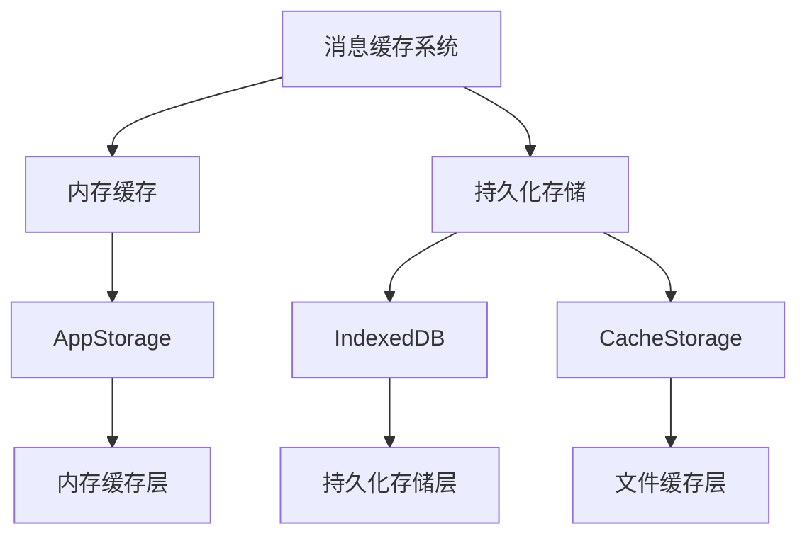
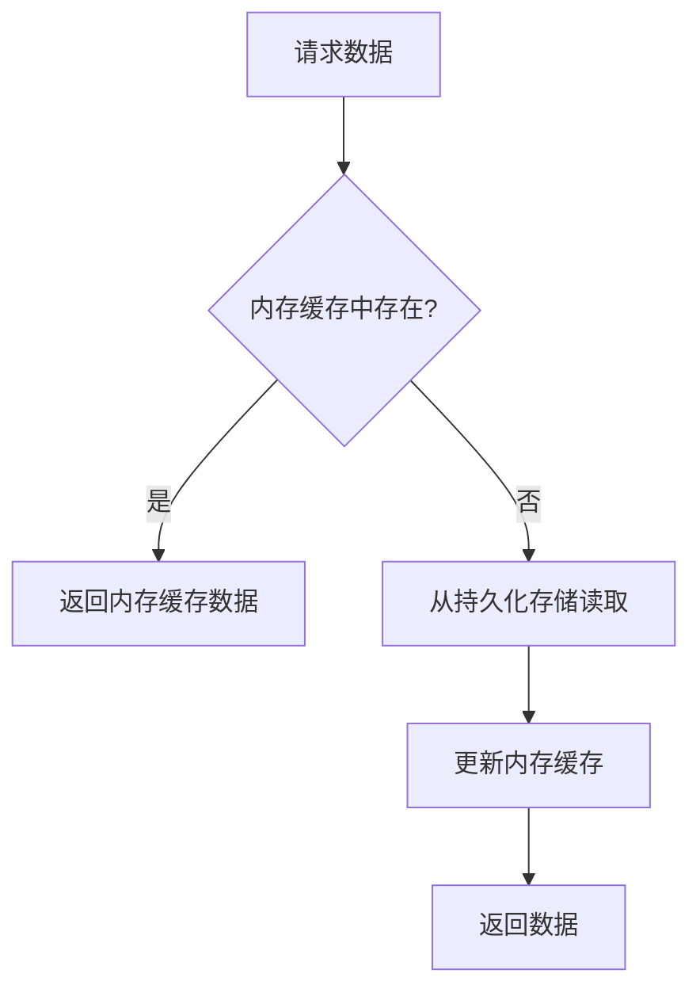
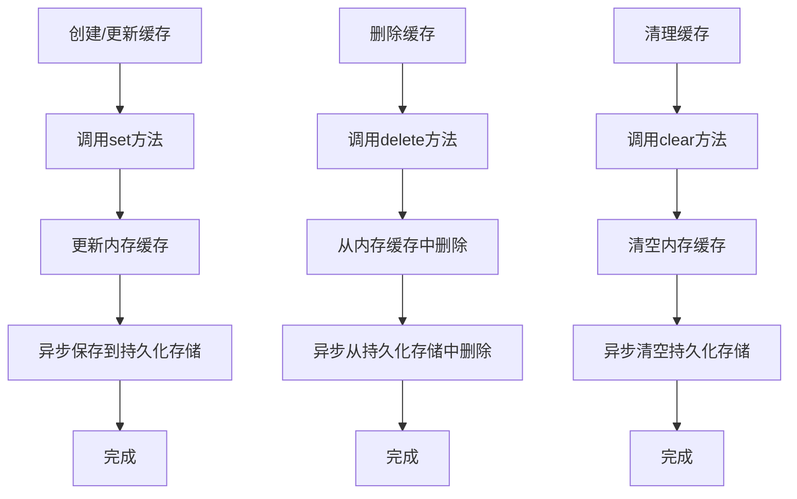
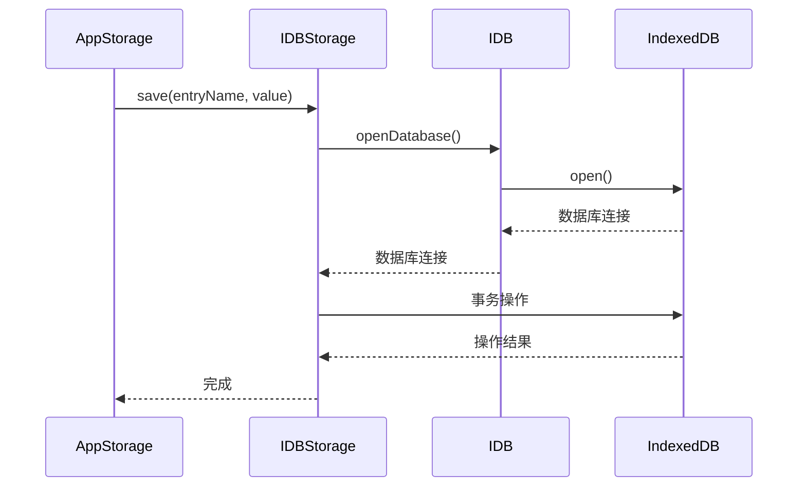
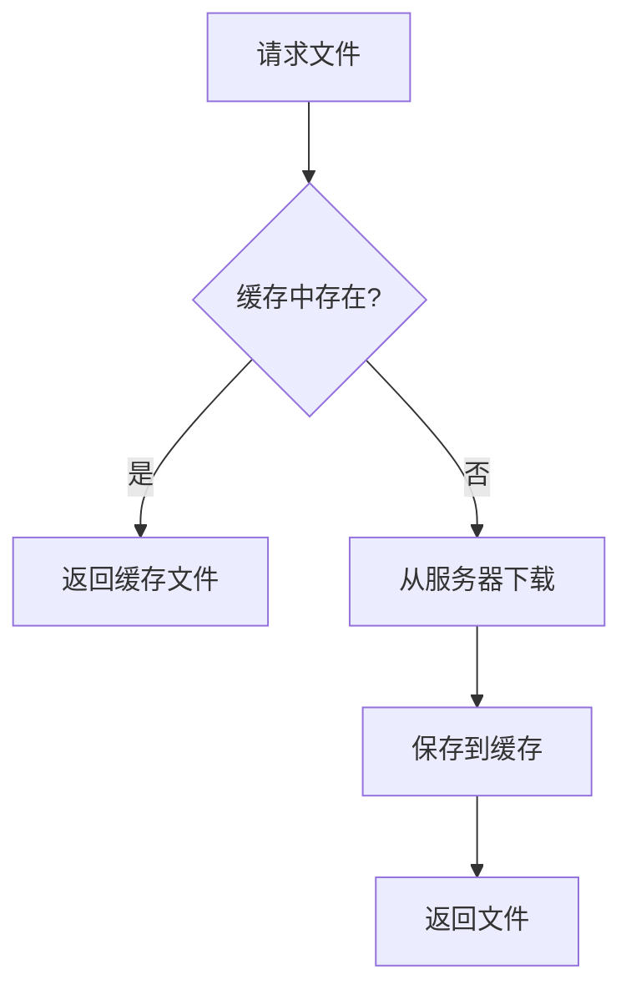
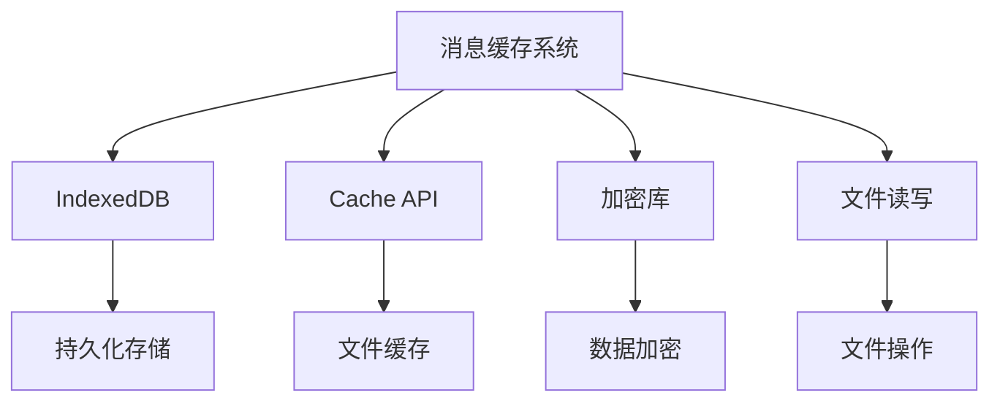

# 消息缓存

<cite>
**本文档中引用的文件**  
- [storage.ts](file://src/lib/storage.ts)
- [dialogs.ts](file://src/lib/storages/dialogs.ts)
- [thumbs.ts](file://src/lib/storages/thumbs.ts)
- [cacheStorage.ts](file://src/lib/files/cacheStorage.ts)
- [idb.ts](file://src/lib/files/idb.ts)
- [state.ts](file://src/config/databases/state.ts)
</cite>

## 目录
1. [简介](#简介)
2. [项目结构](#项目结构)
3. [核心组件](#核心组件)
4. [架构概述](#架构概述)
5. [详细组件分析](#详细组件分析)
6. [依赖分析](#依赖分析)
7. [性能考虑](#性能考虑)
8. [故障排除指南](#故障排除指南)
9. [结论](#结论)

## 简介
本文档详细描述了消息缓存机制的实现策略，包括本地消息缓存的实现方式、IndexedDB的使用、数据结构设计、缓存层级架构、缓存生命周期管理、缓存一致性维护机制、缓存查询优化以及存储空间管理。

## 项目结构
该项目采用模块化设计，主要分为以下几个部分：
- `src/components`：包含各种UI组件
- `src/lib`：包含核心逻辑和管理器
- `src/stores`：包含状态管理
- `src/config`：包含配置文件
- `public`：包含静态资源

消息缓存相关的代码主要位于`src/lib`目录下，特别是`src/lib/storages`和`src/lib/files`目录。



**Diagram sources**
- [storage.ts](file://src/lib/storage.ts)
- [idb.ts](file://src/lib/files/idb.ts)
- [cacheStorage.ts](file://src/lib/files/cacheStorage.ts)

**Section sources**
- [storage.ts](file://src/lib/storage.ts)
- [idb.ts](file://src/lib/files/idb.ts)
- [cacheStorage.ts](file://src/lib/files/cacheStorage.ts)

## 核心组件
消息缓存系统的核心组件包括`AppStorage`、`IDBStorage`和`CacheStorageController`。这些组件共同实现了消息的本地缓存和持久化存储。

**Section sources**
- [storage.ts](file://src/lib/storage.ts)
- [idb.ts](file://src/lib/files/idb.ts)
- [cacheStorage.ts](file://src/lib/files/cacheStorage.ts)

## 架构概述
消息缓存系统采用分层架构，包括内存缓存层和持久化存储层。内存缓存层用于快速访问最近使用的数据，而持久化存储层用于长期保存数据。

```mermaid
classDiagram
class AppStorage {
+storage : StorageLayer
+cache : Partial<Storage>
+useStorage : boolean
+savingFreezed : boolean
+getPromises : Map<keyof Storage, CancellablePromise<Storage[keyof Storage]>>
+getThrottled : () => void
+keysToSet : Set<keyof Storage>
+saveThrottled : () => void
+saveDeferred : CancellablePromise<void>
+keysToDelete : Set<keyof Storage>
+deleteThrottled : () => void
+deleteDeferred : CancellablePromise<void>
+isEncryptable : boolean
+encryptedStoreName? : T['stores'][number]['encryptedName']
+log : ReturnType<typeof logger>
+constructor(db : T, storeName : T['stores'][number]['name'])
+getStorage() : Promise<StorageLayer>
+_save() : Promise<void>
+_delete() : Promise<void>
+_get() : Promise<void>
+isAvailable() : boolean
+getCache() : Partial<Storage>
+getFromCache<T extends keyof Storage>(key : T) : Storage[T]
+setToCache(key : keyof Storage, value : Storage[typeof key]) : Storage[typeof key]
+get<T extends keyof Storage>(key : T, useCache : boolean) : Promise<Storage[T]>
+getAll() : Promise<any[]>
+getAllKeys() : Promise<IDBValidKey[]>
+getAllEntries() : Promise<IDBStorage.Entries>
+warnAboutSaving() : void
+set(obj : Partial<Storage>, onlyLocal : boolean) : Promise<void>
+delete(key : keyof Storage, saveLocal : boolean) : Promise<void>
+clear(saveLocal : boolean) : Promise<void>
+unfreezeAsync(callback : () => Promise<unknown>) : Promise<void>
+static toggleStorage(enabled : boolean, clearWrite : boolean) : Promise<void>
+static freezeSaving<T extends Database<any>>(callback : () => any, names : T['stores'][number]['name'][]) : void
+static freezeSavingAsync(callback : () => Promise<unknown>) : Promise<void>
+toggleEncrypted(shouldEncrypt : boolean) : Promise<void>
+reEncrypt() : Promise<void>
+static toggleEncryptedForAll(shouldEncrypt : boolean) : Promise<void>
+static reEncryptEncrypted() : Promise<void>
}
class IDBStorage {
+log : ReturnType<typeof logger>
+storeName : T['stores'][0]['name']
+idb : IDB
+constructor(db : T, storeName : T['stores'][0]['name' | 'encryptedName'])
+close() : Promise<void>
+delete(entryName : string | string[], storeName? : StoreName) : Promise<void>
+clear(storeName? : StoreName) : Promise<void>
+save(entryName : string | string[], value : any | any[], storeName? : StoreName) : Promise<void>
+get<T>(entryName : string | string[], storeName? : StoreName) : Promise<T> | Promise<T[]>
+getObjectStore<T>(mode : IDBTransactionMode, callback : (objectStore : IDBObjectStore, onComplete : () => void, onError : () => void) => IDBRequest | IDBRequest[], log? : string, storeName? : StoreName) : Promise<T>
+getAll<T>(storeName? : StoreName) : Promise<T[]>
+getAllKeys(storeName? : StoreName) : Promise<IDBValidKey[]>
+getAllEntries(storeName? : StoreName) : Promise<IDBStorage.Entries>
}
class CacheStorageController {
+static STORAGES : CacheStorageController[]
+openDbPromise : Promise<Cache>
+config : CacheStorageDbConfigEntry
+useStorage : boolean
+static disabledPromise : CancellablePromise<void>
+dbName : CacheStorageDbName
+constructor(dbName : CacheStorageDbName)
+isEncryptable : boolean
+static encrypt(blob : Blob) : Promise<Blob>
+static decrypt(blob : Blob) : Promise<Blob>
+waitToEnable() : Promise<void>
+openDatabase() : Promise<Cache>
+delete(entryName : string) : Promise<boolean>
+deleteAll() : Promise<boolean>
+reset() : void
+has(entryName : string) : Promise<boolean>
+get(entryName : string) : Promise<Response | undefined>
+save(entryName : string, response : Response) : Promise<void>
+getFile(fileName : string, method : 'blob' | 'json' | 'text') : Promise<any>
+saveFile(fileName : string, blob : Blob | Uint8Array) : Promise<Blob>
+timeoutOperation<T>(callback : (cache : Cache) => Promise<T>) : Promise<T>
+prepareWriting(fileName : string, fileSize : number, mimeType : string) : {deferred : CancellablePromise<Blob>, getWriter : () => MemoryWriter}
+static toggleStorage(enabled : boolean, _clearWrite : boolean) : Promise<void>
+static deleteAllStorages() : Promise<void>
+static temporarilyToggle(enabled : boolean) : void
+static clearEncryptableStorages() : Promise<void>
+static getOpenEncryptableStorages() : CacheStorageController[]
+static resetOpenEncryptableCacheStorages() : void
}
AppStorage --> IDBStorage : "使用"
AppStorage --> CacheStorageController : "使用"
```

**Diagram sources**
- [storage.ts](file://src/lib/storage.ts)
- [idb.ts](file://src/lib/files/idb.ts)
- [cacheStorage.ts](file://src/lib/files/cacheStorage.ts)

## 详细组件分析

### AppStorage 分析
`AppStorage`是消息缓存系统的核心组件，负责管理内存缓存和持久化存储之间的交互。

#### 内存缓存与持久化存储的配合使用
`AppStorage`通过`cache`属性维护内存缓存，并通过`storage`属性与持久化存储（如IndexedDB）进行交互。当数据被读取时，首先检查内存缓存，如果存在则直接返回；否则从持久化存储中读取并更新内存缓存。



**Diagram sources**
- [storage.ts](file://src/lib/storage.ts)

#### 缓存生命周期管理
`AppStorage`通过`set`、`delete`和`clear`方法管理缓存的创建、更新、过期和清理。



**Diagram sources**
- [storage.ts](file://src/lib/storage.ts)

### IDBStorage 分析
`IDBStorage`是基于IndexedDB的持久化存储实现，负责将数据持久化到浏览器的IndexedDB中。

#### IndexedDB的使用方式
`IDBStorage`通过`IDB`类管理IndexedDB的连接和事务，提供了`save`、`get`、`delete`等方法来操作数据。



**Diagram sources**
- [idb.ts](file://src/lib/files/idb.ts)

### CacheStorageController 分析
`CacheStorageController`是基于Cache API的文件缓存实现，负责缓存文件数据。

#### 文件缓存的实现
`CacheStorageController`通过`caches.open`方法打开缓存，并使用`cache.put`和`cache.match`方法来保存和读取文件。



**Diagram sources**
- [cacheStorage.ts](file://src/lib/files/cacheStorage.ts)

## 依赖分析
消息缓存系统依赖于多个组件和库，包括IndexedDB、Cache API、加密库等。



**Diagram sources**
- [storage.ts](file://src/lib/storage.ts)
- [idb.ts](file://src/lib/files/idb.ts)
- [cacheStorage.ts](file://src/lib/files/cacheStorage.ts)

**Section sources**
- [storage.ts](file://src/lib/storage.ts)
- [idb.ts](file://src/lib/files/idb.ts)
- [cacheStorage.ts](file://src/lib/files/cacheStorage.ts)

## 性能考虑
消息缓存系统通过以下方式优化性能：
- 使用内存缓存减少对持久化存储的访问
- 使用异步操作避免阻塞主线程
- 使用节流和防抖技术减少频繁的存储操作

## 故障排除指南
在使用消息缓存系统时，可能会遇到以下问题：
- 缓存数据不一致：检查内存缓存和持久化存储的数据是否同步
- 存储空间不足：检查浏览器的存储配额并清理不必要的数据
- 加密失败：检查加密密钥是否正确

**Section sources**
- [storage.ts](file://src/lib/storage.ts)
- [idb.ts](file://src/lib/files/idb.ts)
- [cacheStorage.ts](file://src/lib/files/cacheStorage.ts)

## 结论
消息缓存系统通过内存缓存和持久化存储的结合，实现了高效的消息缓存机制。通过合理的架构设计和性能优化，确保了数据的一致性和系统的稳定性。