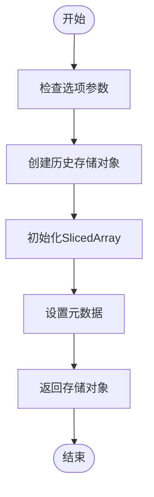
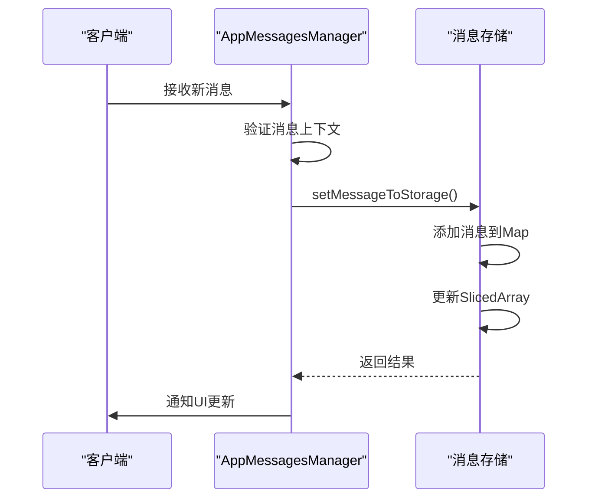
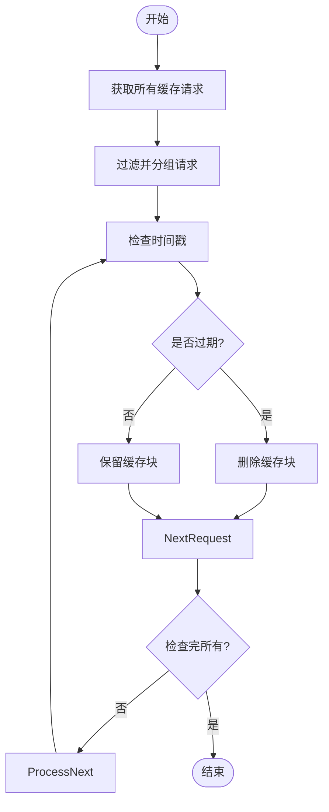
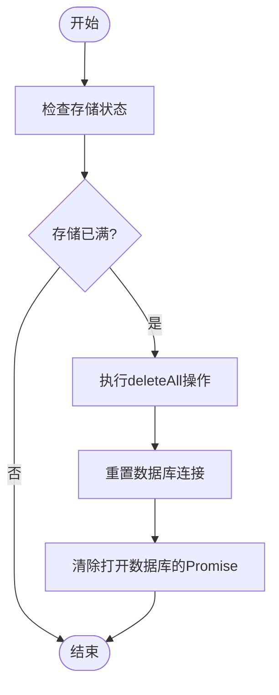
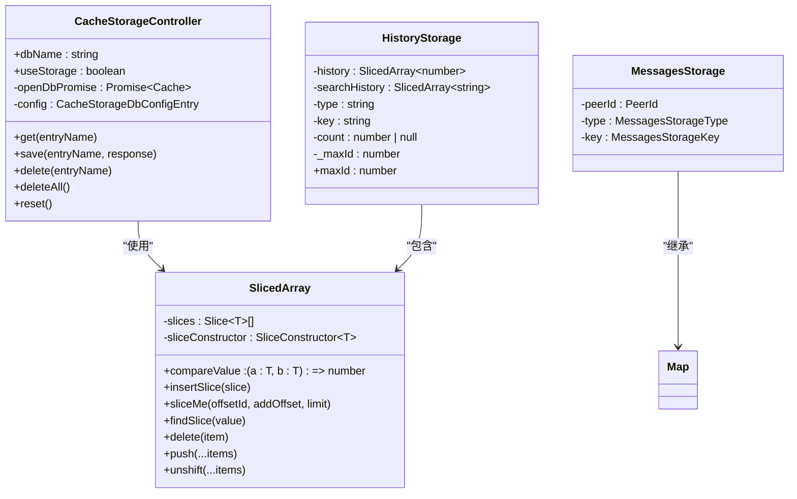

# 生命周期管理

<cite>
**本文档引用的文件**   
- [appMessagesManager.ts](file://src/lib/appManagers/appMessagesManager.ts)
- [createHistoryStorage.ts](file://src/lib/appManagers/utils/messages/createHistoryStorage.ts)
- [getHistoryStorageKey.ts](file://src/lib/appManagers/utils/messages/getHistoryStorageKey.ts)
- [slicedArray.ts](file://src/helpers/slicedArray.ts)
- [cacheStorage.ts](file://src/lib/files/cacheStorage.ts)
- [networker.ts](file://src/lib/mtproto/networker.ts)
- [stream.ts](file://src/lib/serviceWorker/stream.ts)
</cite>

## 目录
1. [消息缓存生命周期管理](#消息缓存生命周期管理)
2. [缓存创建机制](#缓存创建机制)
3. [缓存更新策略](#缓存更新策略)
4. [缓存过期机制](#缓存过期机制)
5. [自动清理流程](#自动清理流程)
6. [缓存架构设计](#缓存架构设计)

## 消息缓存生命周期管理

本节详细阐述消息缓存的生命周期管理机制，包括缓存的创建、更新、过期和清理等核心流程。系统通过多层缓存架构实现高效的消息管理，确保用户体验的流畅性和数据的一致性。

**Section sources**
- [appMessagesManager.ts](file://src/lib/appManagers/appMessagesManager.ts#L1-L200)
- [createHistoryStorage.ts](file://src/lib/appManagers/utils/messages/createHistoryStorage.ts#L1-L50)

## 缓存创建机制

### 触发条件与初始化流程

消息缓存的创建主要在以下场景中触发：
1. **首次加载**：当用户首次进入应用时，系统会初始化全局历史存储和消息存储
2. **新对话创建**：当用户开始新的对话或切换到不同聊天时，创建相应的消息存储
3. **搜索操作**：执行消息搜索时创建专门的搜索缓存存储

缓存初始化通过`createHistoryStorage`函数实现，该函数根据传入的选项参数创建具有特定类型的历史存储。每个历史存储包含一个`SlicedArray`实例用于存储消息ID序列，并维护相关的元数据如计数、最大ID等。

**Diagram sources **
- [createHistoryStorage.ts](file://src/lib/appManagers/utils/messages/createHistoryStorage.ts#L1-L50)
- [slicedArray.ts](file://src/helpers/slicedArray.ts#L55-L68)

### 存储键生成

系统使用`getHistoryStorageKey`函数生成唯一的存储键，该键由以下部分组成：
- 存储类型（history、replies、search）
- 对等体ID（peerId）
- 过滤器信息
- 线程ID或单论坛线程ID

这种键生成策略确保了不同上下文中的消息存储能够被正确区分和管理。

**Section sources**
- [getHistoryStorageKey.ts](file://src/lib/appManagers/utils/messages/getHistoryStorageKey.ts#L1-L33)
- [createHistoryStorage.ts](file://src/lib/appManagers/utils/messages/createHistoryStorage.ts#L1-L50)

## 缓存更新策略

### 新消息接收处理

当接收到新消息时，系统通过`setMessageToStorage`方法将消息添加到相应的存储中。该过程包括：
1. 获取或创建目标消息存储
2. 将消息存入存储映射
3. 更新相关的历史存储
4. 同步到其他工作线程（通过MTProtoMessagePort）

对于历史消息存储，系统还会维护一个全局历史存储的镜像，确保跨会话的一致性。

### 消息编辑与删除

消息编辑和删除操作通过`updateMessageContext`系列方法处理：
- **消息删除**：调用`updateMessageContextForDeletion`方法，从所有相关的搜索存储中移除消息引用
- **消息插入**：调用`updateMessageContextForInserting`方法，将消息添加到适当的搜索存储中

这些操作确保了消息在不同视图和搜索结果中的一致性。

**Diagram sources **
- [appMessagesManager.ts](file://src/lib/appManagers/appMessagesManager.ts#L3527-L3762)
- [slicedArray.ts](file://src/helpers/slicedArray.ts#L408-L419)

**Section sources**
- [appMessagesManager.ts](file://src/lib/appManagers/appMessagesManager.ts#L3527-L3762)
- [slicedArray.ts](file://src/helpers/slicedArray.ts#L408-L419)

## 缓存过期机制

### 时间基础过期策略

系统实现了基于时间的缓存过期机制，主要通过以下方式实现：
1. **流媒体块清理**：在`stream.ts`中定义了`CHUNK_TTL = 86400`（24小时）的过期时间
2. **定期清理**：通过`setInterval(clearOldChunks, 1800e3)`每30分钟执行一次清理任务
3. **时间戳验证**：检查响应头中的`Time-Cached`时间戳，超过TTL的块将被删除

**Diagram sources **
- [stream.ts](file://src/lib/serviceWorker/stream.ts#L26-L58)

### 使用频率基础淘汰策略

虽然代码中没有明确的LRU（最近最少使用）算法实现，但系统通过以下机制间接实现了使用频率基础的淘汰：
1. **按需加载**：只加载当前视图所需的消息，减少内存占用
2. **存储分片**：使用`SlicedArray`将消息分片存储，便于管理和清理
3. **引用计数**：通过上下文引用管理消息的生命周期

**Section sources**
- [stream.ts](file://src/lib/serviceWorker/stream.ts#L26-L68)
- [slicedArray.ts](file://src/helpers/slicedArray.ts#L55-L450)

## 自动清理流程

### 存储空间不足处理

当存储空间不足时，系统通过以下流程进行数据清理和回收：
1. **检测存储状态**：通过`useStorage`标志跟踪存储可用性
2. **执行清理操作**：调用`deleteAll`方法清除整个数据库
3. **重置连接**：清理后需要重新连接以恢复磁盘存储

**Diagram sources **
- [cacheStorage.ts](file://src/lib/files/cacheStorage.ts#L129-L136)

### 消息发送清理

系统定期清理已发送的消息，通过`cleanupSent`方法实现：
1. 遍历所有已发送消息
2. 检查消息是否可以清理（`canCleanup`标志）
3. 确认没有待处理的请求
4. 从`sentMessages`映射中删除消息

此机制确保了内存中不会积累过多的已发送消息对象。

**Section sources**
- [cacheStorage.ts](file://src/lib/files/cacheStorage.ts#L129-L136)
- [networker.ts](file://src/lib/mtproto/networker.ts#L1637-L1669)

## 缓存架构设计

### 核心组件关系

系统采用分层的缓存架构设计，主要组件包括：
- **CacheStorageController**：基于浏览器Cache API的缓存控制器
- **SlicedArray**：用于高效管理有序消息ID序列的数据结构
- **HistoryStorage**：封装历史消息存储的容器对象
- **MessagesStorage**：基于Map的消息存储，用于快速查找

**Diagram sources **
- [cacheStorage.ts](file://src/lib/files/cacheStorage.ts#L48-L247)
- [slicedArray.ts](file://src/helpers/slicedArray.ts#L55-L450)
- [appMessagesManager.ts](file://src/lib/appManagers/appMessagesManager.ts#L200-L200)

**Section sources**
- [cacheStorage.ts](file://src/lib/files/cacheStorage.ts#L48-L247)
- [slicedArray.ts](file://src/helpers/slicedArray.ts#L55-L450)
- [appMessagesManager.ts](file://src/lib/appManagers/appMessagesManager.ts#L200-L200)