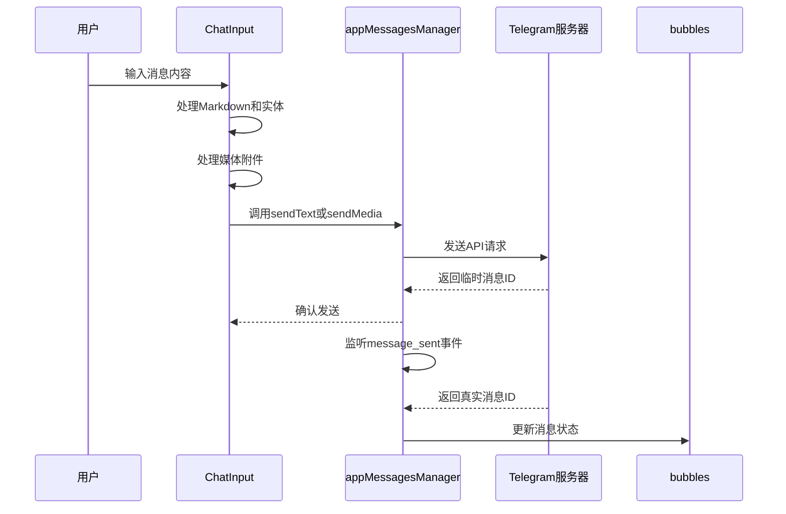
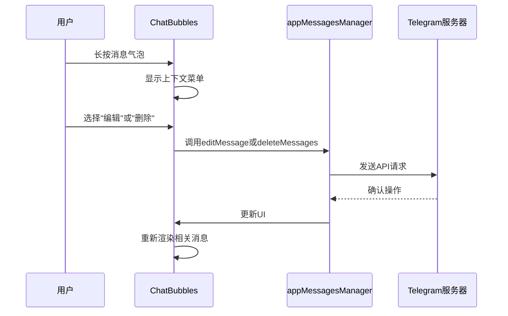
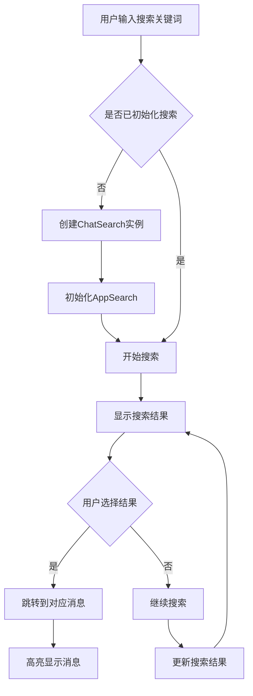
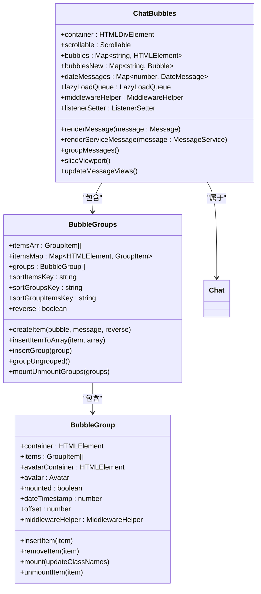
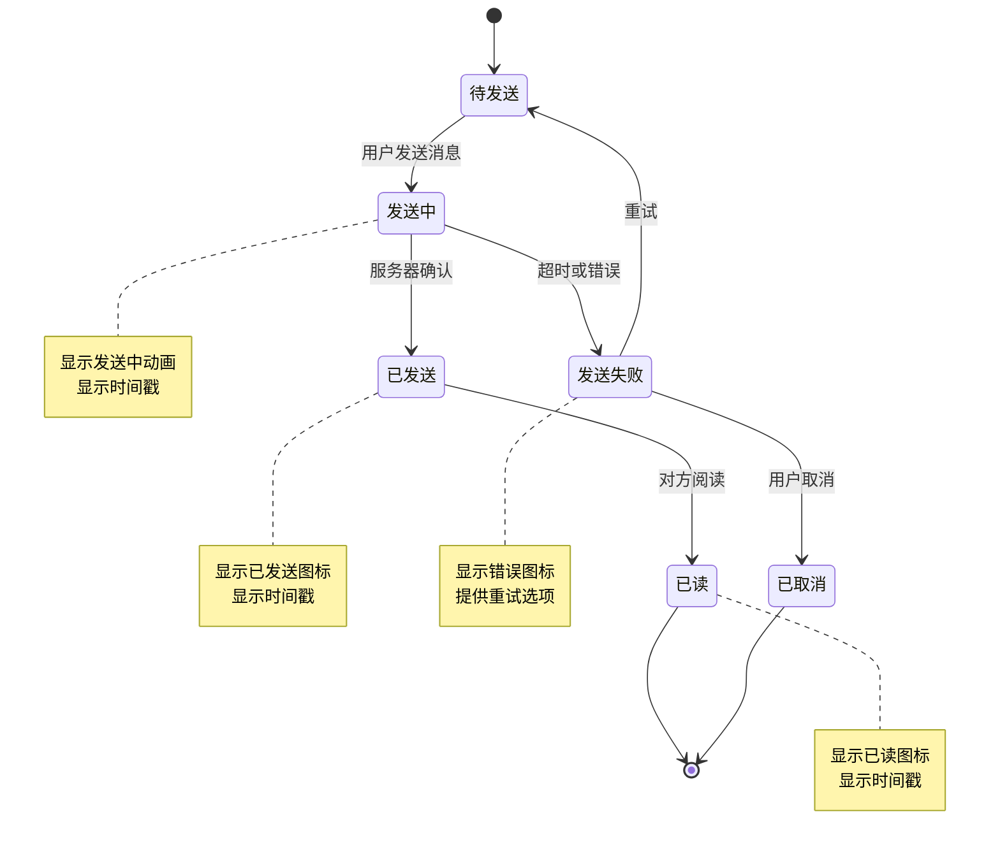
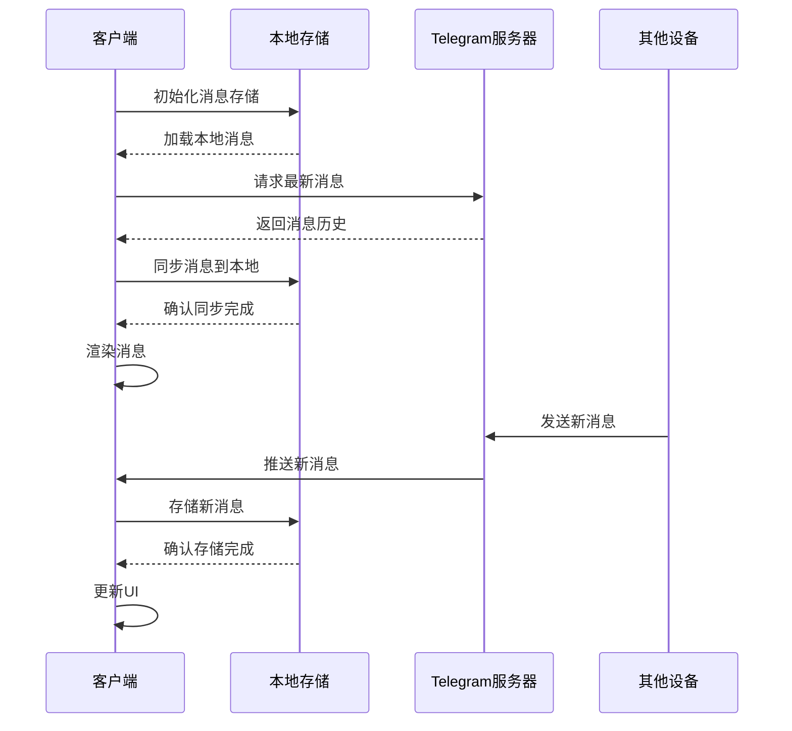
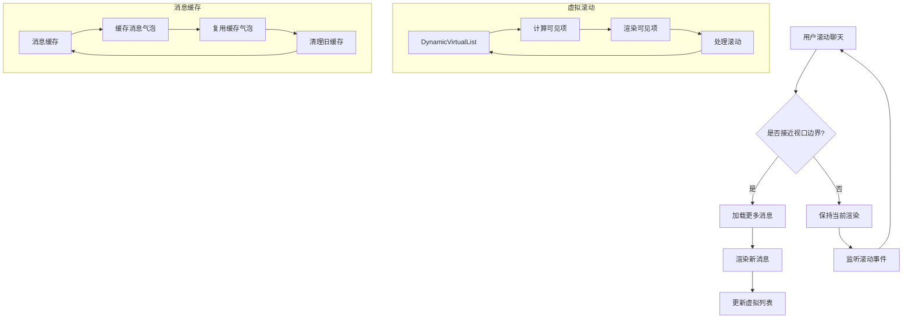
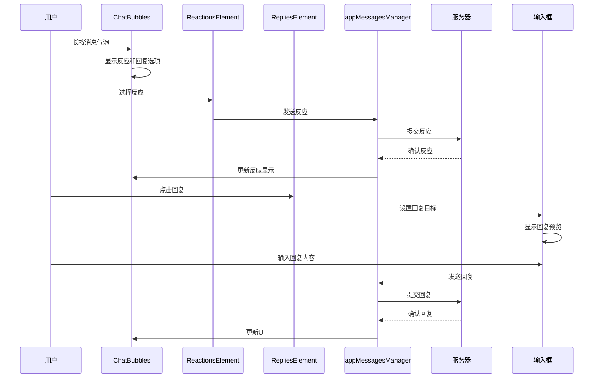

# 聊天功能

<cite>
**本文档引用的文件**
- [chat.ts](file://src/components/chat/chat.ts)
- [input.ts](file://src/components/chat/input.ts)
- [bubbles.ts](file://src/components/chat/bubbles.ts)
- [messageRender.ts](file://src/components/chat/messageRender.ts)
- [reactions.ts](file://src/components/chat/reactions.ts)
- [replies.ts](file://src/components/chat/replies.ts)
- [search.ts](file://src/components/chat/search.ts)
- [bubbleGroups.ts](file://src/components/chat/bubbleGroups.ts)
- [topbar.ts](file://src/components/chat/topbar.ts)
- [appMessagesManager.ts](file://src/lib/appManagers/appMessagesManager.ts)
- [dynamicVirtualList/index.tsx](file://src/components/dynamicVirtualList/index.tsx)
</cite>

## 目录
1. [简介](#简介)
2. [消息收发机制](#消息收发机制)
3. [消息编辑与删除](#消息编辑与删除)
4. [消息搜索功能](#消息搜索功能)
5. [消息气泡渲染](#消息气泡渲染)
6. [富文本与媒体消息](#富文本与媒体消息)
7. [消息状态管理](#消息状态管理)
8. [消息同步与离线支持](#消息同步与离线支持)
9. [性能优化策略](#性能优化策略)
10. [消息反应与回复](#消息反应与回复)

## 简介
本文档详细阐述了聊天功能的实现机制，涵盖消息收发、编辑、删除、搜索等核心功能。文档深入分析了消息气泡的渲染逻辑、交互行为，以及富文本输入和媒体消息的处理流程。同时，文档记录了消息状态管理（包括已读、发送中、失败等状态）、消息同步和离线支持的实现细节，并包含性能优化策略如虚拟滚动和消息缓存。最后，文档解释了消息反应和回复功能的实现。

## 消息收发机制
聊天功能的消息收发机制通过 `ChatInput` 组件实现，该组件负责处理用户输入并发送消息。消息发送过程包括富文本处理、实体解析、媒体附件处理等步骤。



**Diagram sources**
- [input.ts](file://src/components/chat/input.ts#L100-L200)
- [appMessagesManager.ts](file://src/lib/appManagers/appMessagesManager.ts#L1000-L1200)

**Section sources**
- [input.ts](file://src/components/chat/input.ts#L100-L800)
- [appMessagesManager.ts](file://src/lib/appManagers/appMessagesManager.ts#L1000-L1500)

## 消息编辑与删除
消息编辑和删除功能通过聊天气泡组件实现。编辑功能允许用户修改已发送的消息，而删除功能提供单条或批量删除消息的能力。



**Diagram sources**
- [bubbles.ts](file://src/components/chat/bubbles.ts#L500-L700)
- [appMessagesManager.ts](file://src/lib/appManagers/appMessagesManager.ts#L2000-L2500)

**Section sources**
- [bubbles.ts](file://src/components/chat/bubbles.ts#L500-L1000)
- [appMessagesManager.ts](file://src/lib/appManagers/appMessagesManager.ts#L2000-L3000)

## 消息搜索功能
消息搜索功能通过 `ChatSearch` 组件实现，提供在聊天记录中搜索特定内容的能力。搜索功能支持文本搜索、日期筛选和高级过滤选项。



**Diagram sources**
- [search.ts](file://src/components/chat/search.ts#L1-L200)
- [appSearch.ts](file://src/components/appSearch.ts#L1-L100)

**Section sources**
- [search.ts](file://src/components/chat/search.ts#L1-L244)
- [appSearch.ts](file://src/components/appSearch.ts#L1-L500)

## 消息气泡渲染
消息气泡的渲染逻辑由 `ChatBubbles` 组件管理，该组件负责将消息数据转换为可视化的UI元素。渲染过程包括消息分组、时间戳显示、头像管理等。



**Diagram sources**
- [bubbles.ts](file://src/components/chat/bubbles.ts#L400-L800)
- [bubbleGroups.ts](file://src/components/chat/bubbleGroups.ts#L1-L100)

**Section sources**
- [bubbles.ts](file://src/components/chat/bubbles.ts#L1-L800)
- [bubbleGroups.ts](file://src/components/chat/bubbleGroups.ts#L1-L882)

## 富文本与媒体消息
富文本和媒体消息的处理通过一系列组件和工具实现，包括实体解析、Markdown处理、媒体附件管理等。

```mermaid
flowchart LR
A[用户输入] --> B{包含富文本或媒体?}
B --> |是| C[解析实体和Markdown]
C --> D[处理媒体附件]
D --> E[生成消息内容]
B --> |否| E
E --> F[发送消息]
F --> G[服务器处理]
G --> H[返回消息ID]
H --> I[渲染消息气泡]
I --> J[显示富文本和媒体]
subgraph 富文本处理
C1[解析URL]
C2[解析@提及]
C3[解析#话题]
C4[解析Emoji]
C5[解析Markdown]
C1 --> C6[生成富文本]
C2 --> C6
C3 --> C6
C4 --> C6
C5 --> C6
end
subgraph 媒体处理
D1[图片]
D2[视频]
D3[音频]
D4[文件]
D1 --> D5[生成缩略图]
D2 --> D5
D3 --> D6[生成波形图]
D4 --> D7[生成文件图标]
D5 --> D8[生成媒体消息]
D6 --> D8
D7 --> D8
end
```

**Diagram sources**
- [input.ts](file://src/components/chat/input.ts#L50-L100)
- [messageRender.ts](file://src/components/chat/messageRender.ts#L1-L50)
- [appMessagesManager.ts](file://src/lib/appManagers/appMessagesManager.ts#L50-L100)

**Section sources**
- [input.ts](file://src/components/chat/input.ts#L1-L800)
- [messageRender.ts](file://src/components/chat/messageRender.ts#L1-L519)
- [appMessagesManager.ts](file://src/lib/appManagers/appMessagesManager.ts#L1-L200)

## 消息状态管理
消息状态管理包括已读、发送中、失败等状态的跟踪和显示。状态管理通过消息气泡组件和消息管理器协同工作实现。



**Diagram sources**
- [bubbles.ts](file://src/components/chat/bubbles.ts#L700-L750)
- [appMessagesManager.ts](file://src/lib/appManagers/appMessagesManager.ts#L3000-L3500)

**Section sources**
- [bubbles.ts](file://src/components/chat/bubbles.ts#L700-L800)
- [appMessagesManager.ts](file://src/lib/appManagers/appMessagesManager.ts#L3000-L4000)

## 消息同步与离线支持
消息同步和离线支持通过消息存储和同步机制实现，确保用户在不同设备间的消息一致性，并支持离线消息访问。



**Diagram sources**
- [appMessagesManager.ts](file://src/lib/appManagers/appMessagesManager.ts#L5000-L5500)
- [chat.ts](file://src/components/chat/chat.ts#L100-L150)

**Section sources**
- [appMessagesManager.ts](file://src/lib/appManagers/appMessagesManager.ts#L5000-L6000)
- [chat.ts](file://src/components/chat/chat.ts#L100-L200)

## 性能优化策略
性能优化策略包括虚拟滚动和消息缓存，旨在提高大型聊天记录的渲染性能和用户体验。



**Diagram sources**
- [dynamicVirtualList/index.tsx](file://src/components/dynamicVirtualList/index.tsx#L1-L100)
- [bubbles.ts](file://src/components/chat/bubbles.ts#L300-L350)

**Section sources**
- [dynamicVirtualList/index.tsx](file://src/components/dynamicVirtualList/index.tsx#L1-L388)
- [bubbles.ts](file://src/components/chat/bubbles.ts#L300-L800)

## 消息反应与回复
消息反应和回复功能通过专门的组件实现，允许用户对消息进行反应和回复，增强聊天互动性。



**Diagram sources**
- [reactions.ts](file://src/components/chat/reactions.ts#L1-L100)
- [replies.ts](file://src/components/chat/replies.ts#L1-L50)
- [bubbles.ts](file://src/components/chat/bubbles.ts#L300-L350)

**Section sources**
- [reactions.ts](file://src/components/chat/reactions.ts#L1-L399)
- [replies.ts](file://src/components/chat/replies.ts#L1-L157)
- [bubbles.ts](file://src/components/chat/bubbles.ts#L300-L800)