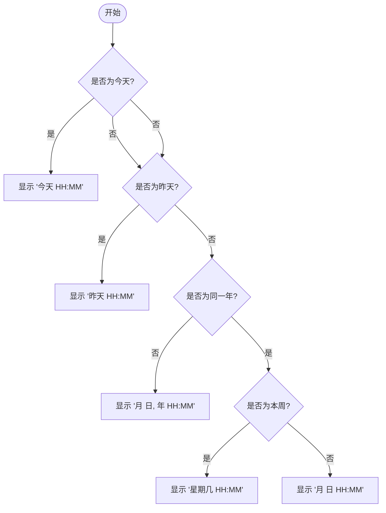
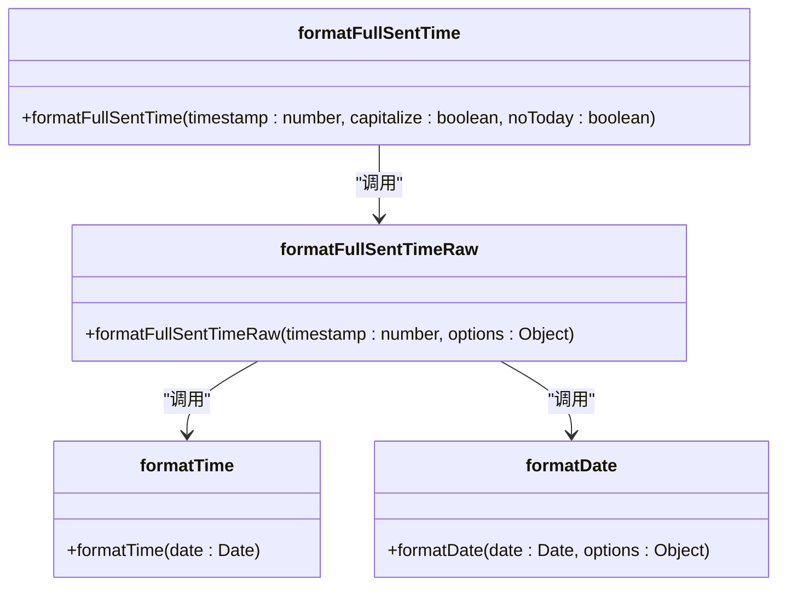
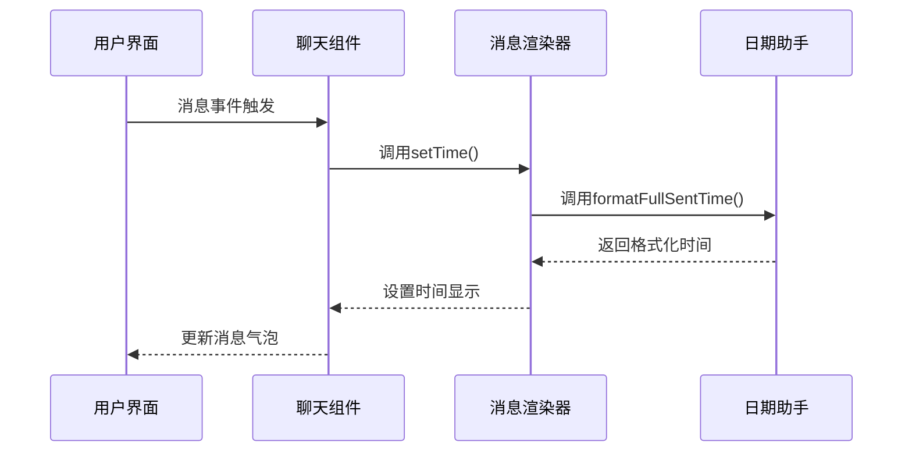

# 时间戳显示

<cite>
**本文档引用的文件**  
- [date.ts](file://src/helpers/date.ts#L1-L577)
- [messageRender.ts](file://src/components/chat/messageRender.ts#L1-L519)
- [utils.ts](file://src/components/chat/utils.ts#L1-L65)
- [common.ts](file://src/helpers/date/common.ts#L1-L3)
</cite>

## 目录
1. [简介](#简介)
2. [时间戳格式化规则](#时间戳格式化规则)
3. [相对时间与绝对时间显示逻辑](#相对时间与绝对时间显示逻辑)
4. [时区处理与本地化适配](#时区处理与本地化适配)
5. [时间戳更新机制](#时间戳更新机制)
6. [特殊时间点显示规则](#特殊时间点显示规则)
7. [可访问性优化方案](#可访问性优化方案)

## 简介
本文件详细描述了消息时间戳的显示机制，包括相对时间（如“2分钟前”）和绝对时间的格式化规则。文档涵盖了时间戳的更新机制、时区处理、本地化支持以及针对不同时间范围的显示策略。系统通过 `formatFullSentTime` 和 `formatFullSentTimeRaw` 等核心函数实现智能时间显示，并结合国际化（i18n）系统提供多语言支持。

**Section sources**
- [date.ts](file://src/helpers/date.ts#L1-L577)

## 时间戳格式化规则
时间戳格式化由 `formatFullSentTimeRaw` 函数主导，根据消息时间与当前时间的差异动态选择显示格式。该函数返回包含日期和时间元素的结构化对象，用于构建最终的时间显示。

### 核心格式化逻辑
- **同一天消息**：显示“今天” + 具体时间（如“今天 14:30”）
- **昨天消息**：显示“昨天” + 具体时间（如“昨天 09:15”）
- **本周内消息**：显示星期几 + 具体时间（如“周一 18:45”）
- **今年内消息**：显示“月 日”格式（如“3月15日”）
- **跨年消息**：显示“月 日, 年”格式（如“3月15日, 2023”）

### 时间格式常量
系统定义了以下时间常量用于计算：
- `ONE_DAY = 86400` 秒（一天的秒数）
- `ONE_WEEK = 604800` 秒（一周的秒数）

这些常量用于判断时间间隔，决定使用相对还是绝对时间格式。

**Section sources**
- [date.ts](file://src/helpers/date.ts#L123-L172)

## 相对时间与绝对时间显示逻辑
系统通过 `formatFullSentTime` 函数实现相对与绝对时间的智能切换。该函数基于当前时间与消息时间的差值，自动选择最合适的显示方式。

### 判断逻辑流程


**Diagram sources**
- [date.ts](file://src/helpers/date.ts#L123-L172)

### 格式化函数调用链


**Diagram sources**
- [date.ts](file://src/helpers/date.ts#L174-L182)

## 时区处理与本地化适配
系统通过 `I18n.IntlDateElement` 和 `Intl.DateTimeFormat` 实现时区和本地化支持，确保时间显示符合用户所在地区的习惯。

### 本地化配置
- **月份名称**：支持12个月份的本地化显示
- **星期名称**：支持7天的本地化显示
- **语言包**：通过 `i18n` 函数从语言包中获取本地化字符串

### 本地化数据结构
```json
{
  "months": ["January", "February", "March", "April", "May", "June", "July", "August", "September", "October", "November", "December"],
  "days": ["Sunday", "Monday", "Tuesday", "Wednesday", "Thursday", "Friday", "Saturday"]
}
```

系统会根据当前语言环境动态替换这些值，实现真正的本地化显示。

**Section sources**
- [common.ts](file://src/helpers/date/common.ts#L1-L3)
- [date.ts](file://src/helpers/date.ts#L9-L13)

## 时间戳更新机制
虽然当前代码中未发现显式的定时刷新机制，但系统通过以下方式确保时间戳的实时性：

### 页面加载时更新
每次页面加载或组件渲染时，都会重新计算时间戳显示。`messageRender.ts` 中的 `setTime` 函数在消息气泡渲染时被调用，确保显示最新时间。

### 事件驱动更新
当发生以下事件时，相关消息的时间戳会被重新计算：
- 消息发送或接收
- 消息编辑
- 转发消息
- 消息状态变更

### 更新触发点


**Diagram sources**
- [messageRender.ts](file://src/components/chat/messageRender.ts#L175-L319)

## 特殊时间点显示规则
系统对特定时间点有专门的处理规则，确保用户体验的一致性。

### 特殊时间点处理
| 时间点 | 显示格式 | 示例 |
|-------|--------|------|
| 今天 | "今天 HH:MM" | 今天 14:30 |
| 昨天 | "昨天 HH:MM" | 昨天 09:15 |
| 本周 | "星期几 HH:MM" | 周一 18:45 |
| 本月 | "月 日 HH:MM" | 3月15日 10:20 |
| 本年 | "月 日 HH:MM" | 3月15日 10:20 |
| 跨年 | "月 日, 年 HH:MM" | 3月15日, 2023 10:20 |

### 特殊处理逻辑
- **今天判断**：检查 `now - timestamp < ONE_DAY` 且日期相同
- **昨天判断**：检查 `now - timestamp < (ONE_DAY * 2)` 且日期为昨天
- **本周判断**：使用 `getWeekNumber` 函数判断是否为同一周

这些规则确保了时间显示的自然性和可读性。

**Section sources**
- [date.ts](file://src/helpers/date.ts#L140-L143)

## 可访问性优化方案
系统通过多种方式提升时间戳的可访问性，确保所有用户都能轻松理解时间信息。

### 无障碍特性
- **标题属性**：为时间元素添加 `title` 属性，提供完整的时间信息
- **语义化标签**：使用适当的HTML标签增强可访问性
- **屏幕阅读器支持**：通过 `i18n` 函数确保时间描述对屏幕阅读器友好

### 可访问性实现
在 `messageRender.ts` 中，时间戳元素会设置 `title` 属性，包含完整的时间信息：
```typescript
const title = getFullDate(new Date(message.date * 1000));
if(title) inner.title = title;
```

这确保了即使视觉上显示的是“2分钟前”，辅助技术也能获取到完整的日期和时间信息。

**Section sources**
- [messageRender.ts](file://src/components/chat/messageRender.ts#L269-L273)