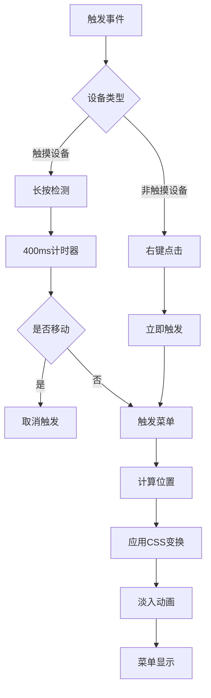

# 上下文菜单

<cite>
**本文档引用的文件**   
- [contextMenu.ts](file://src/components/chat/contextMenu.ts)
- [sendContextMenu.ts](file://src/components/chat/sendContextMenu.ts)
- [contextMenuController.ts](file://src/helpers/contextMenuController.ts)
- [attachContextMenuListener.ts](file://src/helpers/dom/attachContextMenuListener.ts)
- [positionMenu.ts](file://src/helpers/positionMenu.ts)
- [_button.scss](file://src/scss/partials/_button.scss)
</cite>

## 目录
1. [简介](#简介)
2. [触发机制](#触发机制)
3. [动态菜单项生成](#动态菜单项生成)
4. [发送上下文菜单功能](#发送上下文菜单功能)
5. [UI布局与动画效果](#ui布局与动画效果)
6. [权限控制实现](#权限控制实现)
7. [性能优化建议](#性能优化建议)

## 简介
上下文菜单是应用程序中的重要交互组件，通过右键点击或长按操作触发，为用户提供针对特定消息或元素的快捷操作。该功能支持多种操作选项，包括复制、转发、删除等，并根据消息类型和用户权限动态调整可用选项。菜单还包含特殊功能，如定时发送和作为机器人发送，同时具备响应式设计和流畅的动画效果。

## 触发机制
上下文菜单通过右键点击或长按操作触发。在触摸设备上，系统通过监听触摸事件来检测长按操作，并在满足条件时触发菜单显示。对于非触摸设备，系统监听鼠标右键点击事件。触发逻辑由`attachContextMenuListener`函数处理，该函数根据设备类型和事件特性决定如何响应用户交互。当检测到有效触发时，系统会调用`onContextMenu`方法，该方法负责准备菜单数据并调用`contextMenuController.openBtnMenu`打开菜单。

**Section sources**
- [contextMenu.ts](file://src/components/chat/contextMenu.ts#L234-L307)
- [attachContextMenuListener.ts](file://src/helpers/dom/attachContextMenuListener.ts#L27-L98)

## 动态菜单项生成
上下文菜单的选项根据消息类型、用户权限和当前上下文动态生成。`ChatContextMenu`类中的`setButtons`方法负责构建菜单项数组，每个菜单项包含图标、文本、点击回调和验证函数。验证函数决定该选项是否应在当前上下文中显示。例如，复制选项仅在消息包含文本且未禁用转发时显示，而删除选项仅在用户有权限删除消息时显示。菜单项还包括`withSelection`属性，用于标识该选项是否需要在选择模式下显示。

**Section sources**
- [contextMenu.ts](file://src/components/chat/contextMenu.ts#L531-L800)

## 发送上下文菜单功能
发送上下文菜单提供与消息发送相关的特殊功能，包括静音发送、定时发送、在线时发送和效果移除。这些功能通过`SendMenu`类实现，该类根据当前聊天对象和用户权限动态调整可用选项。例如，定时发送选项仅在非付费用户与非个人聊天中显示。菜单还支持效果选择，允许用户为消息添加视觉效果。当用户选择效果时，系统会验证用户是否具有使用该效果的权限，对于非付费用户会提示升级。

**Section sources**
- [sendContextMenu.ts](file://src/components/chat/sendContextMenu.ts#L1-L158)

## UI布局与动画效果
上下文菜单的UI布局由CSS类和样式表定义，主要样式定义在`_button.scss`文件中。菜单采用绝对定位，根据触发位置自动调整显示方向，确保在视口内完全可见。菜单具有圆角边框、阴影效果和适当的内边距，提供良好的视觉层次。动画效果包括淡入淡出和缩放变换，通过CSS过渡实现。菜单打开时从0.8倍缩放平滑过渡到1倍，同时透明度从0增加到1，创建流畅的出现效果。在移动设备上，菜单样式会自动调整以适应触摸操作。

**Diagram sources **
- [_button.scss](file://src/scss/partials/_button.scss#L103-L362)
- [positionMenu.ts](file://src/helpers/positionMenu.ts#L22-L148)

## 权限控制实现
上下文菜单的权限控制通过验证函数实现，每个菜单项都有一个`verify`函数，用于检查当前上下文是否满足显示条件。权限检查包括消息类型检查、用户角色检查和功能可用性检查。例如，管理员权限相关的选项会检查当前用户是否具有相应管理权限，而付费功能相关的选项会检查用户是否为付费用户。系统还支持嵌套权限检查，通过`createSubmenuTrigger`函数创建子菜单，子菜单的可见性由父菜单项的验证结果决定。

**Section sources**
- [contextMenu.ts](file://src/components/chat/contextMenu.ts#L510-L528)
- [contextMenu.ts](file://src/components/chat/contextMenu.ts#L690-L695)

## 性能优化建议
为优化上下文菜单的性能，建议实施以下措施：首先，使用延迟加载技术，仅在菜单即将显示时才加载必要的资源，如表情包列表或效果库。其次，实现内存管理，通过`middleware`系统在菜单关闭时清理相关资源，防止内存泄漏。对于频繁使用的菜单项，可以实施缓存机制，存储已验证的结果，避免重复计算。此外，应优化事件监听器的管理，确保在组件销毁时正确移除所有监听器。最后，对于复杂的菜单结构，建议使用虚拟化技术，仅渲染可见的菜单项，减少DOM操作开销。

**Section sources**
- [contextMenuController.ts](file://src/helpers/contextMenuController.ts#L117-L119)
- [sendContextMenu.ts](file://src/components/chat/sendContextMenu.ts#L77-L84)