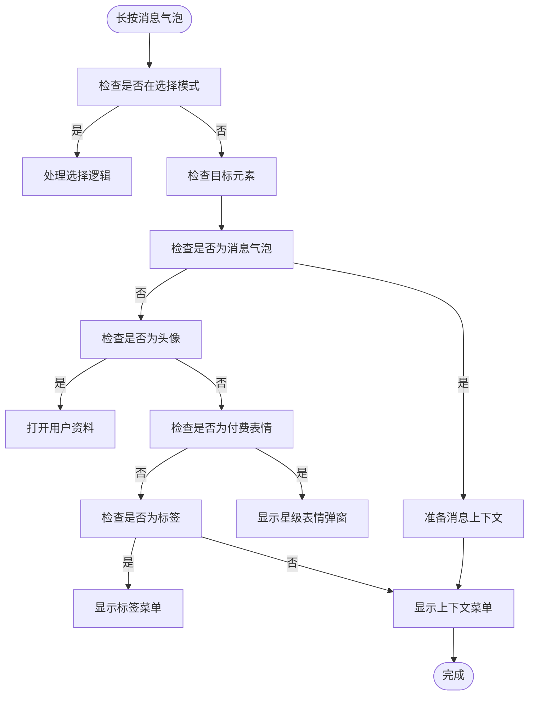
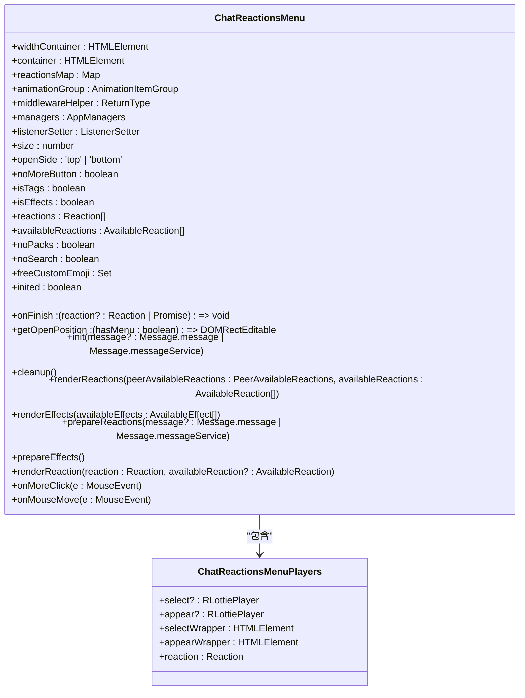
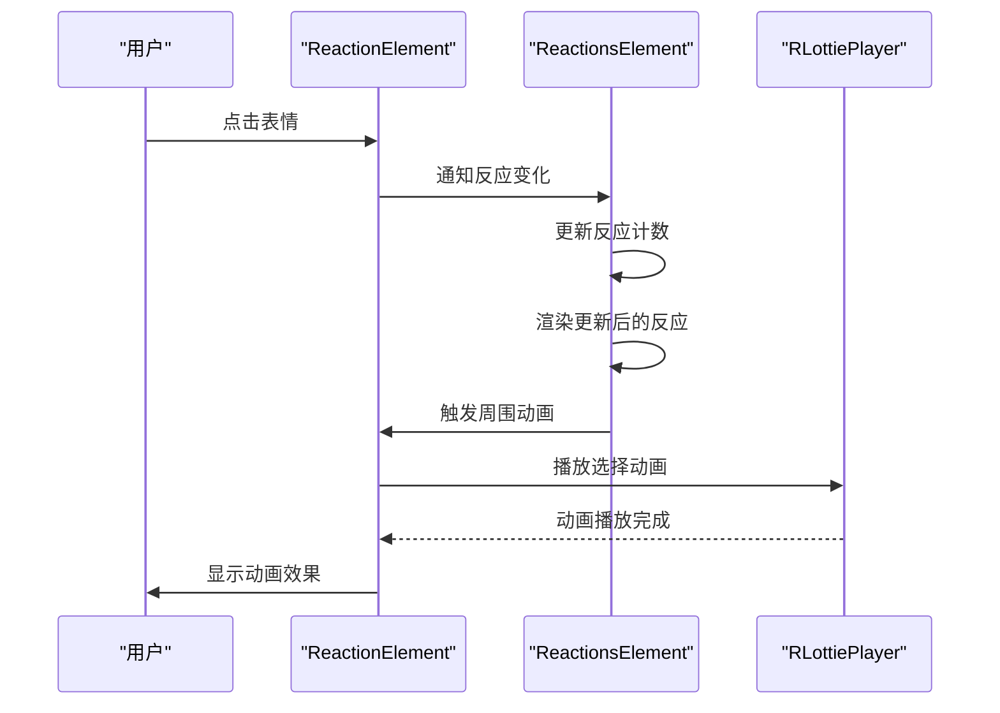
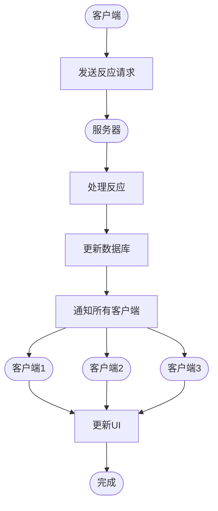
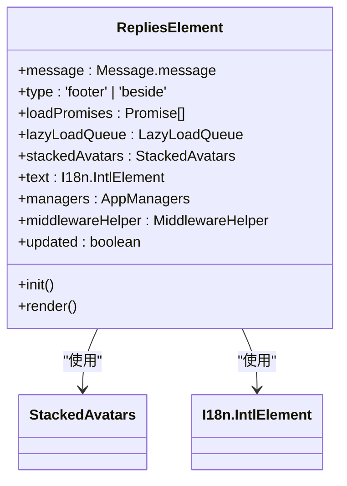
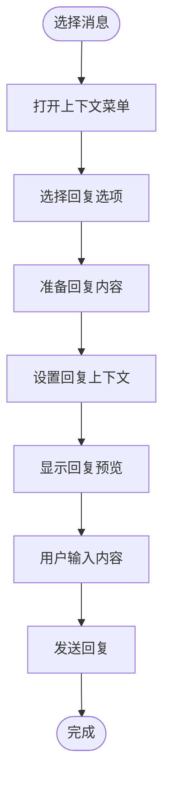
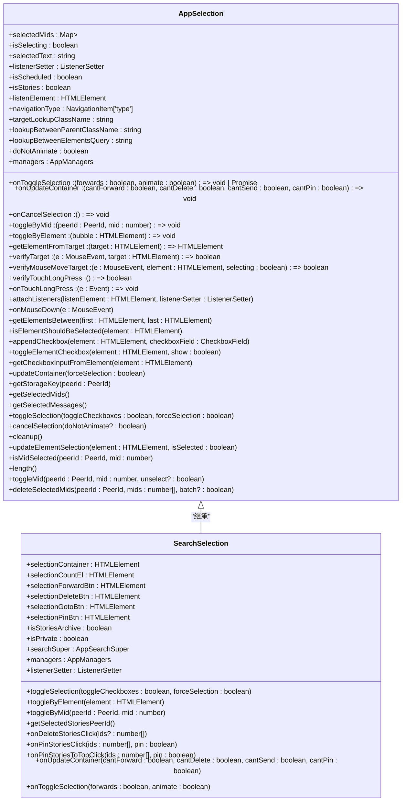
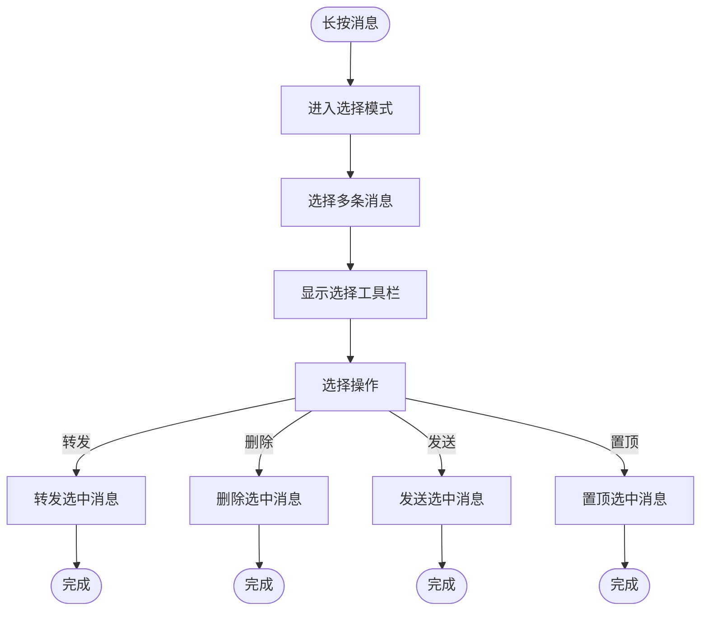
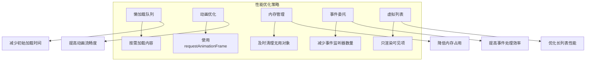
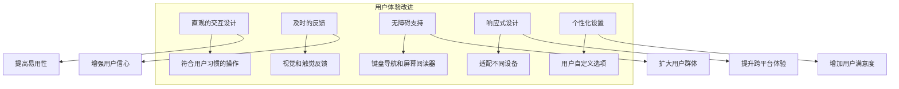

# 消息交互

<cite>
**本文档引用的文件**
- [contextMenu.ts](file://src/components/chat/contextMenu.ts)
- [reactions.ts](file://src/components/chat/reactions.ts)
- [reaction.ts](file://src/components/chat/reaction.ts)
- [reactionsMenu.ts](file://src/components/chat/reactionsMenu.ts)
- [replies.ts](file://src/components/chat/replies.ts)
- [selection.ts](file://src/components/chat/selection.ts)
- [bubbles.ts](file://src/components/chat/bubbles.ts)
- [input.ts](file://src/components/chat/input.ts)
</cite>

## 目录
1. [简介](#简介)
2. [消息交互行为](#消息交互行为)
3. [消息反应系统](#消息反应系统)
4. [回复与引用消息](#回复与引用消息)
5. [消息选择与批量操作](#消息选择与批量操作)
6. [性能优化与用户体验](#性能优化与用户体验)

## 简介
本文档详细描述了Telegram Web客户端中消息交互的实现机制。涵盖了消息的各种交互行为，包括点击打开上下文菜单、长按选择、双击点赞等。详细解释了消息反应（reactions）系统的实现，包括表情选择器、动画效果和同步机制。说明了回复和引用消息的功能实现，并记录了消息选择和批量操作的逻辑。最后提供了交互事件的性能优化和用户体验改进方案。

## 消息交互行为

消息交互行为是Telegram Web客户端用户体验的核心部分。系统通过上下文菜单、长按操作和双击反馈等多种方式，为用户提供丰富的消息操作功能。

### 上下文菜单交互
上下文菜单是消息交互的主要入口，通过右键点击或长按消息气泡触发。系统通过`ChatContextMenu`类管理上下文菜单的显示和交互逻辑。

```mermaid
classDiagram
class ChatContextMenu {
+buttons : ChatContextMenuButton[]
+element : HTMLElement
+isSelectable : boolean
+isSelected : boolean
+target : HTMLElement
+isTextSelected : boolean
+isTextFromMultipleMessagesSelected : boolean
+isAnchorTarget : boolean
+isUsernameTarget : boolean
+isEmailTarget : boolean
+isSponsored : boolean
+isOverBubble : boolean
+isTag : boolean
+reactionElement : ReactionElement
+peerId : PeerId
+mid : number
+message : Message.message | Message.messageService
+messageFromLog : Message.message | Message.messageService
+mainMessage : Message.message | Message.messageService
+sponsoredMessage : SponsoredMessage
+noForwards : boolean
+checklistItem : {item : TodoItem, completion? : TodoCompletion}
+reactionsMenu : ChatReactionsMenu
+listenerSetter : ListenerSetter
+attachListenerSetter : ListenerSetter
+viewerPeerId : PeerId
+middleware : ReturnType<typeof getMiddleware>
+canOpenReactedList : boolean
+emojiInputsPromise : CancellablePromise<InputStickerSet.inputStickerSetID[]>
+groupedMessages : Message.message[]
+linkToMessage : Awaited<ReturnType<ChatContextMenu['getUrlToMessage']>>
+selectedMessagesText : PartialByKeys<Awaited<ReturnType<ChatContextMenu['getSelectedMessagesText']>>, 'html'>
+selectedMessages : MyMessage[]
+avatarPeerId : number
+isLegacy : boolean
+messagePeerId : number
+canViewReadTime : boolean
+messageLanguage : TranslatableLanguageISO
+attachTo(element : HTMLElement)
+onContextMenu(e : MouseEvent | Touch | TouchEvent)
+cleanup()
+destroy()
+filterButtons(buttons : ChatContextMenu['buttons'])
+setButtons()
}
class ChatContextMenuButton {
+icon : string
+text : string
+onClick : () => void
+verify : () => boolean | Promise<boolean>
+notDirect? : () => boolean
+withSelection? : true
+isSponsored? : true
+localName? : 'views' | 'emojis' | 'sponsorInfo' | 'sponsorAdditionalInfo'
}
ChatContextMenu --> ChatContextMenuButton : "包含"
```

**Diagram sources**
- [contextMenu.ts](file://src/components/chat/contextMenu.ts#L178-L497)

**Section sources**
- [contextMenu.ts](file://src/components/chat/contextMenu.ts#L1-L800)

### 长按与双击交互
长按和双击是移动设备上重要的交互方式。系统通过`attachContextMenuListener`监听长按事件，并根据不同的目标元素触发相应的操作。



**Diagram sources**
- [contextMenu.ts](file://src/components/chat/contextMenu.ts#L306-L497)

## 消息反应系统

消息反应系统是Telegram中重要的社交互动功能，允许用户通过表情符号快速表达对消息的感受。

### 表情选择器实现
表情选择器通过`ChatReactionsMenu`类实现，提供了一个水平或垂直排列的表情选择界面。



**Diagram sources**
- [reactionsMenu.ts](file://src/components/chat/reactionsMenu.ts#L60-L700)

### 反应动画效果
反应动画效果通过Lottie动画和自定义渲染实现，提供了流畅的视觉反馈。



**Diagram sources**
- [reaction.ts](file://src/components/chat/reaction.ts#L513-L536)
- [reactions.ts](file://src/components/chat/reactions.ts#L378-L395)

### 同步机制
反应系统的同步机制确保了多设备间的状态一致性。



**Diagram sources**
- [reactions.ts](file://src/components/chat/reactions.ts#L210-L213)

## 回复与引用消息

回复与引用消息功能允许用户对特定消息进行回应，增强了对话的上下文关联性。

### 回复功能实现
回复功能通过`RepliesElement`类实现，显示消息的回复数量和最近回复者。



**Diagram sources**
- [replies.ts](file://src/components/chat/replies.ts#L30-L157)

### 引用消息逻辑
引用消息逻辑通过`ChatInput`类中的`replyElements`管理，允许用户引用消息内容进行回复。



**Diagram sources**
- [input.ts](file://src/components/chat/input.ts#L200-L300)

## 消息选择与批量操作

消息选择与批量操作功能允许用户同时处理多条消息，提高了操作效率。

### 选择逻辑实现
选择逻辑通过`AppSelection`基类和`SearchSelection`子类实现，提供了灵活的选择机制。



**Diagram sources**
- [selection.ts](file://src/components/chat/selection.ts#L54-L592)

### 批量操作流程
批量操作流程通过选择多个消息后触发相应的操作按钮来实现。



**Diagram sources**
- [selection.ts](file://src/components/chat/selection.ts#L714-L780)

## 性能优化与用户体验

为了提供流畅的用户体验，系统在多个方面进行了性能优化。

### 性能优化策略
系统采用了多种性能优化策略，包括懒加载、动画优化和内存管理。



**Diagram sources**
- [bubbles.ts](file://src/components/chat/bubbles.ts#L21-L28)

### 用户体验改进
用户体验改进方案包括直观的交互设计、及时的反馈和无障碍支持。



**Diagram sources**
- [input.ts](file://src/components/chat/input.ts#L166-L167)