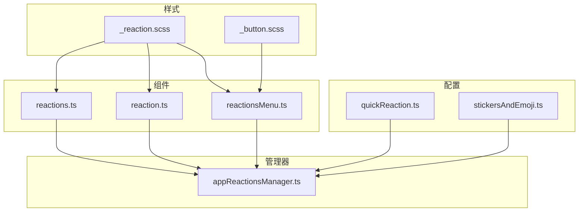
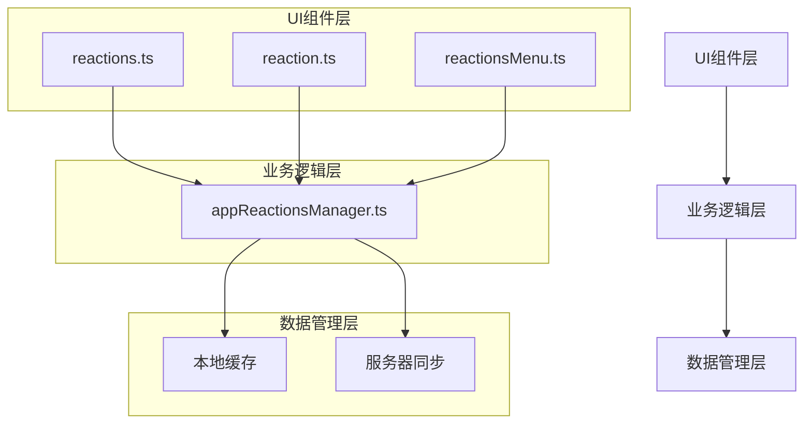
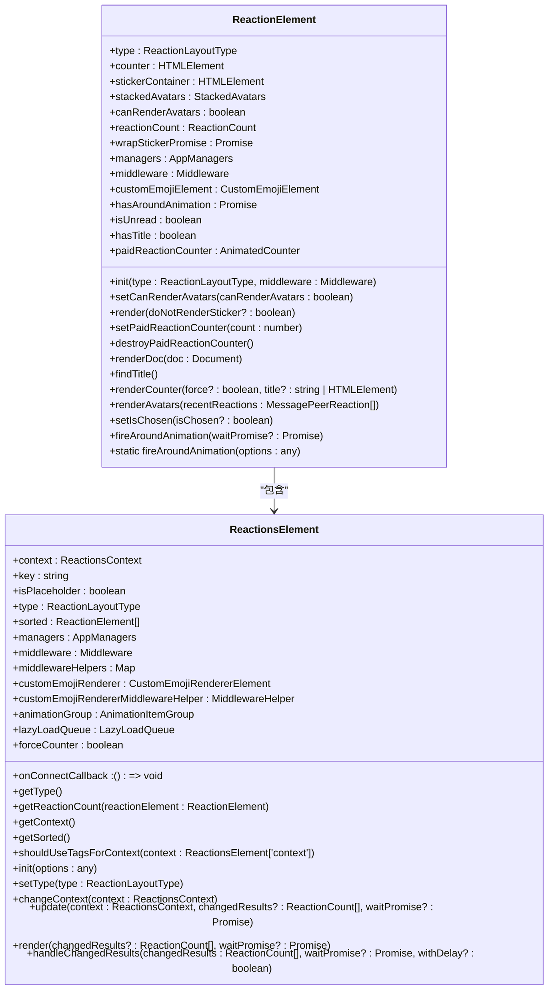
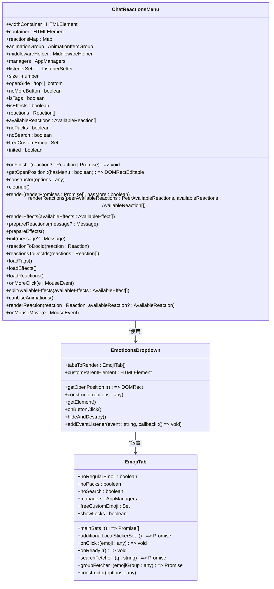
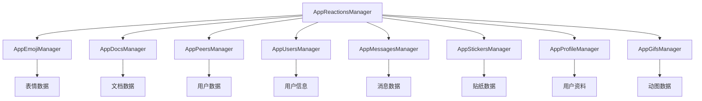

# 消息反应

<cite>
**本文档引用的文件**   
- [reactions.ts](file://src/components/chat/reactions.ts)
- [reaction.ts](file://src/components/chat/reaction.ts)
- [reactionsMenu.ts](file://src/components/chat/reactionsMenu.ts)
- [appReactionsManager.ts](file://src/lib/appManagers/appReactionsManager.ts)
- [quickReaction.ts](file://src/components/sidebarLeft/tabs/quickReaction.ts)
- [stickersAndEmoji.ts](file://src/components/sidebarLeft/tabs/stickersAndEmoji.ts)
- [_reaction.scss](file://src/scss/partials/_reaction.scss)
- [_button.scss](file://src/scss/partials/_button.scss)
</cite>

## 目录
1. [简介](#简介)
2. [项目结构](#项目结构)
3. [核心组件](#核心组件)
4. [架构概述](#架构概述)
5. [详细组件分析](#详细组件分析)
6. [依赖分析](#依赖分析)
7. [性能考虑](#性能考虑)
8. [故障排除指南](#故障排除指南)
9. [结论](#结论)

## 简介
本项目实现了一套完整的消息反应系统，支持用户通过表情选择器、双击点赞快捷操作等方式对消息进行反应。系统包含复杂的动画播放效果、服务器同步流程、本地缓存策略和冲突解决机制。反应数据的存储和同步通过高效的缓存策略实现，同时提供了反应表情的推荐算法和性能优化方案。

## 项目结构
项目结构清晰地组织了消息反应系统相关的组件和管理器。核心功能分布在`src/components/chat`目录下的`reactions.ts`、`reaction.ts`和`reactionsMenu.ts`文件中，而业务逻辑由`src/lib/appManagers`目录下的`appReactionsManager.ts`管理。用户界面配置位于`src/components/sidebarLeft/tabs`目录下的`quickReaction.ts`和`stickersAndEmoji.ts`文件中。样式定义在`src/scss/partials`目录下的`_reaction.scss`和`_button.scss`文件中。



**Diagram sources**
- [reactions.ts](file://src/components/chat/reactions.ts)
- [reaction.ts](file://src/components/chat/reaction.ts)
- [reactionsMenu.ts](file://src/components/chat/reactionsMenu.ts)
- [appReactionsManager.ts](file://src/lib/appManagers/appReactionsManager.ts)
- [quickReaction.ts](file://src/components/sidebarLeft/tabs/quickReaction.ts)
- [stickersAndEmoji.ts](file://src/components/sidebarLeft/tabs/stickersAndEmoji.ts)
- [_reaction.scss](file://src/scss/partials/_reaction.scss)
- [_button.scss](file://src/scss/partials/_button.scss)

**Section sources**
- [reactions.ts](file://src/components/chat/reactions.ts)
- [reaction.ts](file://src/components/chat/reaction.ts)
- [reactionsMenu.ts](file://src/components/chat/reactionsMenu.ts)
- [appReactionsManager.ts](file://src/lib/appManagers/appReactionsManager.ts)
- [quickReaction.ts](file://src/components/sidebarLeft/tabs/quickReaction.ts)
- [stickersAndEmoji.ts](file://src/components/sidebarLeft/tabs/stickersAndEmoji.ts)
- [_reaction.scss](file://src/scss/partials/_reaction.scss)
- [_button.scss](file://src/scss/partials/_button.scss)

## 核心组件
消息反应系统的核心组件包括反应元素、反应菜单和反应管理器。反应元素负责显示单个反应的表情和计数，反应菜单提供用户选择反应的界面，反应管理器处理所有与反应相关的业务逻辑，包括服务器同步、缓存管理和冲突解决。

**Section sources**
- [reactions.ts](file://src/components/chat/reactions.ts)
- [reaction.ts](file://src/components/chat/reaction.ts)
- [reactionsMenu.ts](file://src/components/chat/reactionsMenu.ts)
- [appReactionsManager.ts](file://src/lib/appManagers/appReactionsManager.ts)

## 架构概述
消息反应系统采用分层架构设计，分为UI组件层、业务逻辑层和数据管理层。UI组件层负责用户界面的展示和交互，业务逻辑层处理反应的发送、接收和同步，数据管理层负责本地缓存和服务器数据的同步。



**Diagram sources**
- [reactions.ts](file://src/components/chat/reactions.ts)
- [reaction.ts](file://src/components/chat/reaction.ts)
- [reactionsMenu.ts](file://src/components/chat/reactionsMenu.ts)
- [appReactionsManager.ts](file://src/lib/appManagers/appReactionsManager.ts)

## 详细组件分析

### 反应元素分析
反应元素是消息反应系统的基本显示单元，负责渲染单个反应的表情、计数和用户头像。它支持多种布局类型，包括内联、块状和标签。



**Diagram sources**
- [reaction.ts](file://src/components/chat/reaction.ts)
- [reactions.ts](file://src/components/chat/reactions.ts)

**Section sources**
- [reaction.ts](file://src/components/chat/reaction.ts)
- [reactions.ts](file://src/components/chat/reactions.ts)

### 反应菜单分析
反应菜单提供用户选择反应的界面，支持水平和垂直两种布局。它集成了表情选择器，允许用户从可用的反应中进行选择。



**Diagram sources**
- [reactionsMenu.ts](file://src/components/chat/reactionsMenu.ts)

**Section sources**
- [reactionsMenu.ts](file://src/components/chat/reactionsMenu.ts)

### 反应管理器分析
反应管理器是消息反应系统的核心业务逻辑组件，负责处理所有与反应相关的操作，包括获取可用反应、发送反应、处理服务器更新和管理本地缓存。

```mermaid
classDiagram
class AppReactionsManager {
+availableReactions : AvailableReaction[]
+availableEffects : MaybePromise
+sendReactionPromises : Map
+reactions : {[key in 'recent' | 'top' | 'tags']? : Reaction[]}
+savedReactionsTags : Map
+paidReactionPrivacy? : PaidReactionPrivacy
+after()
+clear(init? : boolean)
+resetAvailableReactions()
+getAvailableReactions()
+getActiveAvailableReactions()
+getAvailableReactionsForPeer(peerId : PeerId, unshiftQuickReaction? : boolean)
+getReactions(type : 'recent' | 'top' | 'tags')
+getTopReactions()
+getRecentReactions()
+getTagReactions(peerId? : PeerId)
+unshiftQuickReactionInner(peerAvailableReactions : PeerAvailableReactions, quickReaction : Reaction | AvailableReaction)
+getAvailableReactionsByMessage(message? : Message, unshiftQuickReaction? : boolean)
+getQuickReaction()
+getReactionCached(reaction : string)
+getReaction(reaction : string)
+getMessagesReactions(peerId : PeerId, mids : number[])
+getMessageReactionsList(peerId : PeerId, mid : number, limit : number, reaction? : Reaction, offset? : string)
+setDefaultReaction(reaction : Reaction)
+sendReaction(options : SendReactionOptions)
+getRandomGenericAnimation()
+setSavedReactionTags(savedPeerId : PeerId, tags : SavedReactionTag[])
+getSavedReactionTags(savedPeerId? : PeerId, overwrite? : boolean)
+updateSavedReactionTag(reaction : Reaction, title? : string)
+getAvailableEffects(overwrite? : boolean)
+getAvailableEffect(effect : DocId)
+searchAvailableEffects({q, emoticon} : {q? : string, emoticon? : string[]})
+processMessageReactionsChanges({message, changedResults, removedResults, savedPeerId})
+getPaidReactionPrivacy()
+peerIdToPaidReactionPrivacy(peerId : PeerId)
+togglePaidReactionPrivacy(peerId : PeerId, mid : number, sendAsPeerId : PeerId)
+onUpdatePaidReactionPrivacy(update : Update.updatePaidReactionPrivacy)
}
class AppManagers {
+appReactionsManager : AppReactionsManager
+appEmojiManager : AppEmojiManager
+appDocsManager : AppDocsManager
+appPeersManager : AppPeersManager
+appUsersManager : AppUsersManager
+appMessagesManager : AppMessagesManager
+appStickersManager : AppStickersManager
+appProfileManager : AppProfileManager
+appGifsManager : AppGifsManager
}
AppReactionsManager --> AppManagers : "依赖"
```

**Diagram sources**
- [appReactionsManager.ts](file://src/lib/appManagers/appReactionsManager.ts)

**Section sources**
- [appReactionsManager.ts](file://src/lib/appManagers/appReactionsManager.ts)

## 依赖分析
消息反应系统依赖于多个核心组件和管理器，包括表情管理器、文档管理器、用户管理器和消息管理器。这些依赖关系确保了反应系统的完整功能和数据一致性。



**Diagram sources**
- [appReactionsManager.ts](file://src/lib/appManagers/appReactionsManager.ts)

**Section sources**
- [appReactionsManager.ts](file://src/lib/appManagers/appReactionsManager.ts)

## 性能考虑
消息反应系统通过多种方式优化性能，包括懒加载、内存释放和动画优化。反应元素和菜单组件都实现了懒加载机制，确保只有在需要时才加载和渲染内容。动画播放效果经过优化，避免在移动设备上消耗过多资源。

**Section sources**
- [reactions.ts](file://src/components/chat/reactions.ts)
- [reaction.ts](file://src/components/chat/reaction.ts)
- [reactionsMenu.ts](file://src/components/chat/reactionsMenu.ts)

## 故障排除指南
当遇到反应不同步或显示异常的问题时，可以按照以下步骤进行排查：

1. 检查网络连接是否正常
2. 清除本地缓存并重新加载应用
3. 检查服务器同步状态
4. 验证反应数据的完整性
5. 确认用户权限和设置

**Section sources**
- [appReactionsManager.ts](file://src/lib/appManagers/appReactionsManager.ts)

## 结论
消息反应系统通过精心设计的架构和高效的实现，提供了流畅的用户体验和可靠的数据同步。系统的核心组件分工明确，依赖关系清晰，便于维护和扩展。通过合理的性能优化和错误处理机制，确保了在各种设备和网络条件下的稳定运行。