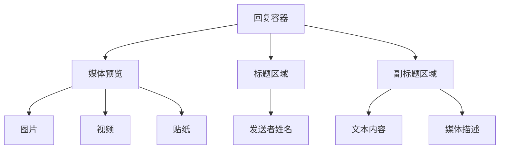
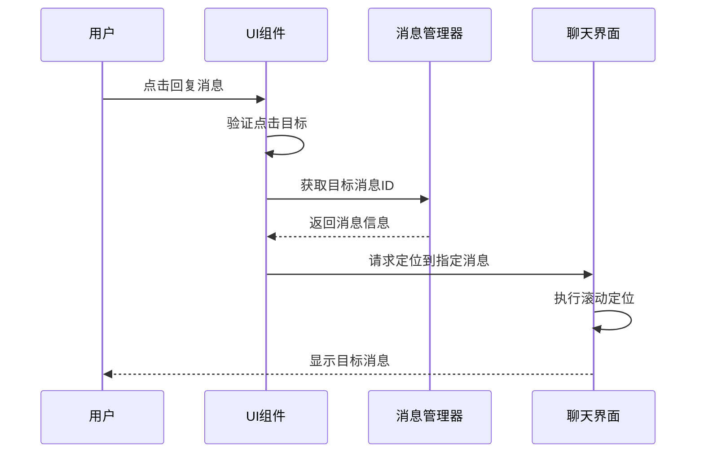
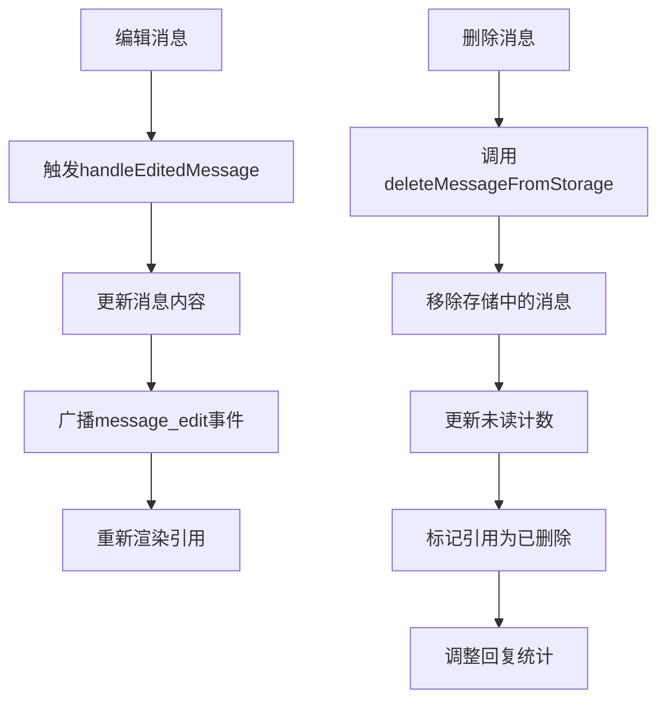
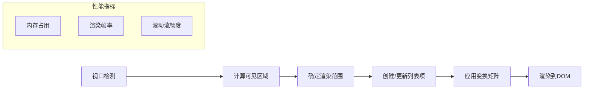
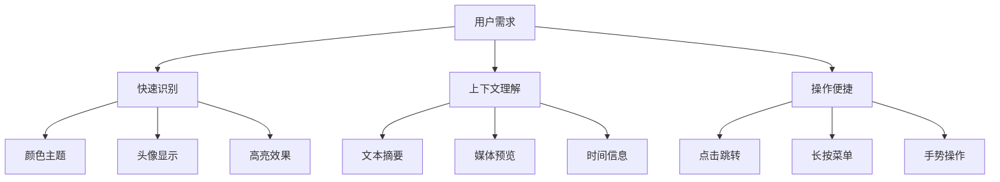

# 消息回复

<cite>
**本文档中引用的文件**  
- [replyContainer.ts](file://src/components/chat/replyContainer.ts)
- [reply.ts](file://src/components/wrappers/reply.ts)
- [replies.ts](file://src/components/chat/replies.ts)
- [messageRender.ts](file://src/components/chat/messageRender.ts)
- [bubbles.ts](file://src/components/chat/bubbles.ts)
- [appMessagesManager.ts](file://src/lib/appManagers/appMessagesManager.ts)
- [dynamicVirtualList/index.tsx](file://src/components/dynamicVirtualList/index.tsx)
</cite>

## 目录
1. [引言](#引言)
2. [核心组件](#核心组件)
3. [UI显示与交互逻辑](#ui显示与交互逻辑)
4. [引用链渲染机制](#引用链渲染机制)
5. [编辑与删除行为的影响](#编辑与删除行为的影响)
6. [性能优化措施](#性能优化措施)
7. [扩展性设计](#扩展性设计)
8. [用户体验改进](#用户体验改进)
9. [结论](#结论)

## 引言

消息回复功能是现代即时通讯应用中的核心交互特性之一。本技术文档详细阐述了该功能的实现机制，涵盖从UI渲染、交互逻辑到性能优化的各个方面。系统通过组件化架构实现了高内聚低耦合的设计，确保了功能的可维护性和可扩展性。文档将深入分析回复容器、引用渲染、虚拟滚动等关键技术实现，为开发者提供全面的技术参考。

## 核心组件

消息回复功能由多个核心组件协同工作实现。`ReplyContainer`类负责管理回复消息的容器元素，通过继承`DivAndCaption`基类实现标题和副标题的动态更新。`wrapReply`函数作为主要的包装器，整合了颜色主题、高亮显示和涟漪效果等视觉特性。`RepliesElement`自定义元素用于显示回复统计信息，支持底部和侧边两种布局模式。这些组件通过中间件模式实现生命周期管理，确保资源的正确释放和状态同步。

**Section sources**
- [replyContainer.ts](file://src/components/chat/replyContainer.ts#L1-L234)
- [reply.ts](file://src/components/wrappers/reply.ts#L1-L123)
- [replies.ts](file://src/components/chat/replies.ts#L1-L157)

## UI显示与交互逻辑

### 显示效果

回复消息的UI显示采用分层设计，包含媒体预览、标题和副标题三个主要部分。媒体预览区域支持图片、视频、贴纸等多种媒体类型，通过`wrapPhoto`、`wrapVideo`和`wrapSticker`等包装函数实现。标题显示发送者姓名，支持自定义颜色主题和高亮效果。副标题根据消息类型显示不同内容：纯文本消息显示截断的文本内容，媒体消息显示媒体类型描述。



**Diagram sources**
- [replyContainer.ts](file://src/components/chat/replyContainer.ts#L29-L234)

### 点击跳转逻辑

点击回复消息会触发跳转到原始消息的逻辑。系统通过`bubbles.ts`中的事件处理器监听点击事件，当检测到回复区域点击时，获取目标消息的完整ID（fullMid），然后调用`setInnerPeer`方法将聊天界面定位到目标消息位置。该过程包含消息存在性验证和滚动定位，确保用户体验的流畅性。



**Diagram sources**
- [bubbles.ts](file://src/components/chat/bubbles.ts#L2870-L2903)

## 引用链渲染机制

引用链的渲染通过递归处理实现，支持多层嵌套引用。系统使用`wrapRichText`函数处理引用文本的富文本格式，包括表情符号、链接和代码块等。对于包含引用的回复，系统会创建多行显示模式，通过添加`reply-multiline`CSS类来调整布局。引用文本的长度限制为200个字符，超出部分自动截断并添加省略号。

```mermaid
classDiagram
class ReplyContainer {
+titleEl : HTMLElement
+subtitleEl : HTMLElement
+mediaEl : HTMLElement
+fill(options) : Promise~void~
}
class WrapReplyOptions {
+setColorPeerId : PeerId
+useHighlightingColor : boolean
+colorAsOut : boolean
+isStoryExpired : boolean
+isQuote : boolean
+noBorder : boolean
+replyHeader : MessageReplyHeader
+quote : {text : string, entities? : MessageEntity[]}
}
class wrapReply {
+replyContainer : ReplyContainer
+fillPromise : Promise~void~
+container : HTMLElement
}
ReplyContainer --> wrapReply : "被包装"
wrapReply --> WrapReplyOptions : "接收配置"
```

**Diagram sources**
- [replyContainer.ts](file://src/components/chat/replyContainer.ts#L29-L234)
- [reply.ts](file://src/components/wrappers/reply.ts#L21-L31)

## 编辑与删除行为的影响

### 编辑行为

当原始消息被编辑时，系统会触发`handleEditedMessage`事件，更新所有引用该消息的回复显示。消息管理器通过`appMessagesManager`的`modifyMessage`方法同步更新消息内容，并广播`message_edit`事件通知相关组件重新渲染。对于包含引用文本的消息，编辑操作会重新计算引用内容的截断和格式化。

### 删除行为

消息删除会触发引用关系的级联更新。系统通过`deleteMessageFromStorage`方法从存储中移除消息，并更新相关对话的未读计数。对于被删除消息的回复，系统会将其显示为"消息已删除"状态，保持引用链的完整性。删除操作还会影响回复统计，通过`incrementMessageReplies`方法调整回复计数。



**Diagram sources**
- [appMessagesManager.ts](file://src/lib/appManagers/appMessagesManager.ts#L6969-L9468)

## 性能优化措施

### 虚拟滚动

系统采用动态虚拟列表实现长消息列表的高效渲染。`DynamicVirtualList`组件通过`createListItemStates`和`createListHeight`函数管理列表项的状态和高度计算。虚拟滚动基于视口阈值（viewportThreshold）和客户端高度动态计算需要渲染的项目，仅在视口附近渲染元素，大幅减少DOM节点数量。



**Diagram sources**
- [dynamicVirtualList/index.tsx](file://src/components/dynamicVirtualList/index.tsx#L1-L200)

### 按需加载

媒体内容采用懒加载策略，通过`LazyLoadQueue`管理加载优先级。系统根据消息的可见性状态决定加载时机，仅当消息进入视口或接近视口时才开始加载媒体资源。对于高分辨率图片和视频，系统优先加载缩略图，待用户点击查看时再加载完整内容，有效降低初始加载时间和带宽消耗。

## 扩展性设计

### 模块化架构

系统采用模块化设计，各功能组件高度解耦。`ReplyContainer`、`wrapReply`和`RepliesElement`等组件通过明确的接口定义进行交互，便于独立开发和测试。中间件模式的使用使得组件生命周期管理更加灵活，支持在不修改核心逻辑的情况下添加新的功能钩子。

### API设计

回复功能提供清晰的API接口，支持外部系统集成。`wrapReplyDivAndCaption`函数接受标准化的选项对象，包含标题、副标题、媒体元素和消息对象等参数。这种设计使得新功能的添加只需扩展选项类型，而无需修改现有代码，符合开闭原则。

```mermaid
classDiagram
class ReplyContainer {
+fill(options) : Promise~void~
}
class ReplyAPI {
+wrapReply(options) : {container, fillPromise}
+wrapReplyDivAndCaption(options) : Promise~boolean~
}
class ExtensionPoint {
+middleware : Middleware
+loadPromises : Promise~any~[]
+animationGroup : AnimationGroup
}
ReplyAPI --> ReplyContainer : "组合"
ReplyAPI --> ExtensionPoint : "依赖"
ExtensionPoint --> ReplyContainer : "注入"
```

**Diagram sources**
- [replyContainer.ts](file://src/components/chat/replyContainer.ts#L29-L234)
- [reply.ts](file://src/components/wrappers/reply.ts#L21-L31)

## 用户体验改进

### 引用高亮

系统支持引用高亮显示，通过`useHighlightingColor`选项启用。高亮效果基于发送者的颜色主题，使用`getPeerColorsByPeer`函数获取配色方案。对于收藏品颜色（collectible color），系统还会渲染背景表情符号图案和收藏品徽章，增强视觉识别度。

### 上下文展示

回复消息提供丰富的上下文信息，包括发送者姓名、时间戳和媒体预览。对于长文本引用，系统显示前200个字符的摘要，帮助用户快速理解引用内容。在窄屏设备上，系统自动调整布局，优先显示关键信息，确保可用性。



**Diagram sources**
- [reply.ts](file://src/components/wrappers/reply.ts#L52-L119)

## 结论

消息回复功能通过精心设计的组件架构和优化策略，实现了高性能、高可用的用户体验。系统在保持代码简洁性的同时，提供了丰富的扩展点，为未来功能迭代奠定了坚实基础。虚拟滚动和按需加载等性能优化措施确保了在大规模消息场景下的流畅运行。建议后续开发中进一步完善引用链的可视化展示，增加回复线程的折叠/展开功能，提升复杂对话场景下的可读性。