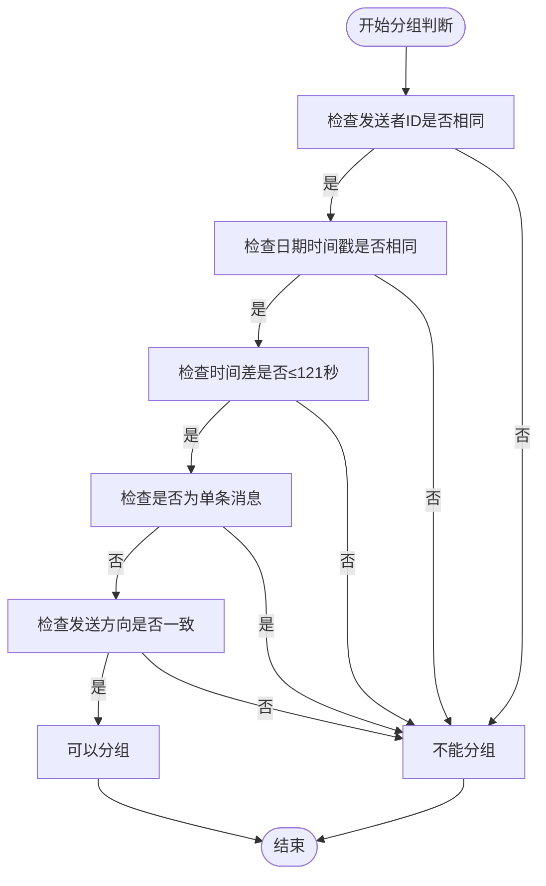
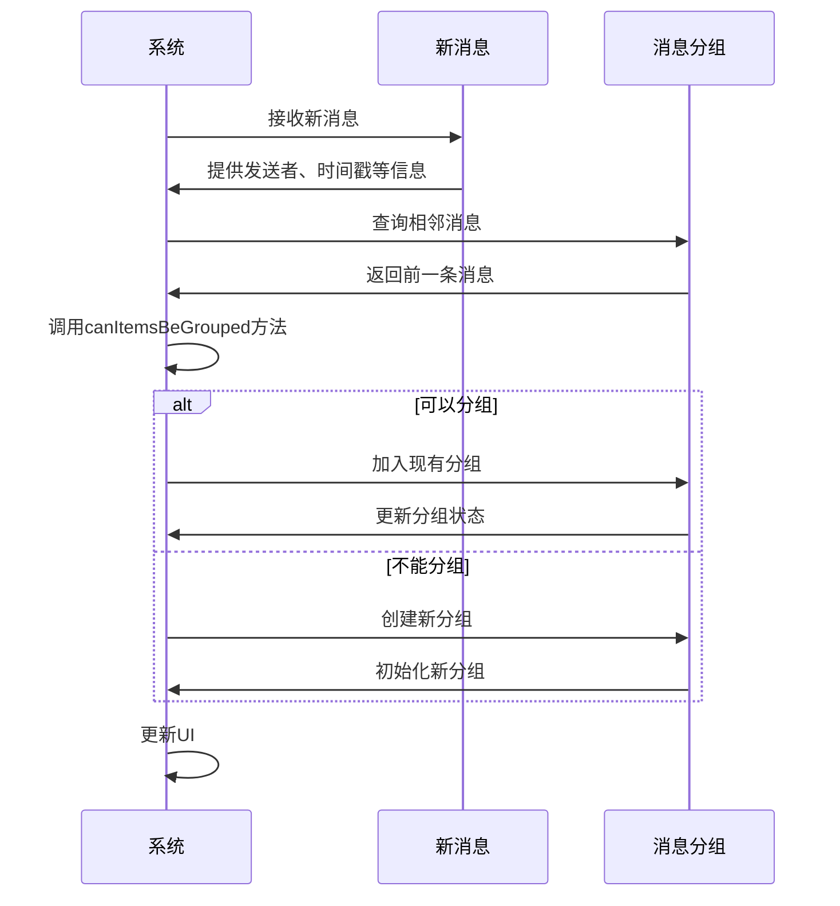
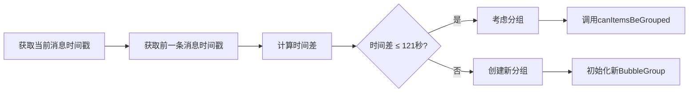
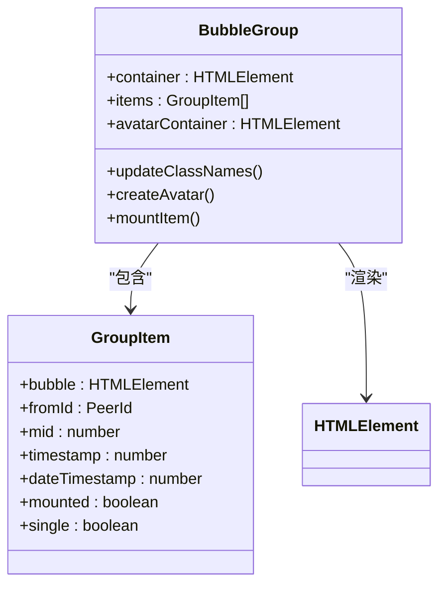
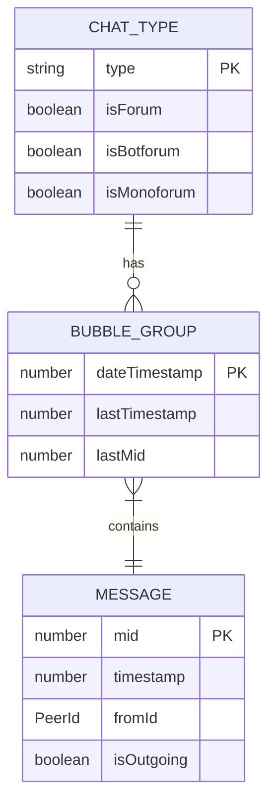
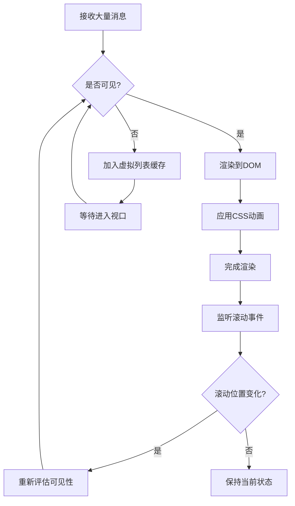

# 消息分组

<cite>
**本文档引用的文件**   
- [bubbleGroups.ts](file://src/components/chat/bubbleGroups.ts)
- [bubbles.ts](file://src/components/chat/bubbles.ts)
- [chatThreadSeparator.tsx](file://src/components/chat/bubbleParts/chatThreadSeparator.tsx)
- [suggestedPostReplyMarkup.ts](file://src/components/chat/bubbleParts/suggestedPostReplyMarkup.ts)
- [types.ts](file://src/components/chat/types.ts)
- [chat.ts](file://src/components/chat/chat.ts)
</cite>

## 目录
1. [引言](#引言)
2. [消息分组算法](#消息分组算法)
3. [分组边界检测逻辑](#分组边界检测逻辑)
4. [分组间隔计算方法](#分组间隔计算方法)
5. [视觉呈现规则](#视觉呈现规则)
6. [不同聊天类型的处理差异](#不同聊天类型的处理差异)
7. [性能优化方案](#性能优化方案)
8. [结论](#结论)

## 引言

消息分组是聊天界面中的一项重要功能，它通过将连续的消息按发送者、时间和消息类型进行分组，提升用户体验和界面整洁度。本文档深入探讨了消息分组的实现细节，包括分组算法、边界检测、视觉呈现以及在不同聊天类型中的处理差异，并提供了性能优化方案。

## 消息分组算法

消息分组算法基于发送者、时间戳和消息类型来决定是否将消息分组。核心逻辑在 `bubbleGroups.ts` 文件中实现，通过 `BubbleGroups` 类管理消息气泡的分组。每个消息气泡由 `BubbleGroup` 类表示，包含消息的详细信息如发送者ID、时间戳和消息内容。

分组的关键在于 `canItemsBeGrouped` 方法，该方法检查两个消息是否可以被分组。条件包括：
- 发送者ID相同
- 日期时间戳相同
- 时间差不超过预设阈值（默认121秒）
- 消息类型允许分组（非单条消息）
- 发送方向一致（同为发送或接收）

**图表来源**
- [bubbleGroups.ts](file://src/components/chat/bubbleGroups.ts#L575-L597)

**章节来源**
- [bubbleGroups.ts](file://src/components/chat/bubbleGroups.ts#L64-L800)

## 分组边界检测逻辑

分组边界检测逻辑确保消息在适当的位置分组。当新消息到达时，系统会检查其与前一条消息的关系，以决定是否创建新的分组或加入现有分组。`BubbleGroups` 类中的 `groupUngrouped` 方法负责处理未分组的消息，通过遍历消息列表并应用分组规则来重新组织消息。

边界检测的关键步骤包括：
1. 获取当前消息的前后消息
2. 使用 `canItemsBeGrouped` 方法判断是否可以与相邻消息分组
3. 如果可以分组，则将其加入相应的 `BubbleGroup`
4. 更新分组的视觉状态，如头像和边框

**图表来源**
- [bubbleGroups.ts](file://src/components/chat/bubbleGroups.ts#L750-L780)
- [bubbles.ts](file://src/components/chat/bubbles.ts#L445-L446)

**章节来源**
- [bubbleGroups.ts](file://src/components/chat/bubbleGroups.ts#L750-L780)

## 分组间隔计算方法

分组间隔的计算基于消息的时间戳和预设的分组阈值。`BubbleGroups` 类中的 `newGroupDiff` 属性定义了时间差的上限，通常设置为121秒。当两条消息的时间差超过此值时，即使其他条件满足，也不会被分组。

计算方法如下：
- 获取当前消息和前一条消息的时间戳
- 计算时间差
- 比较时间差与 `newGroupDiff`
- 如果时间差小于等于 `newGroupDiff`，则考虑分组；否则创建新分组

**图表来源**
- [bubbleGroups.ts](file://src/components/chat/bubbleGroups.ts#L363-L364)
- [bubbleGroups.ts](file://src/components/chat/bubbleGroups.ts#L588-L589)

**章节来源**
- [bubbleGroups.ts](file://src/components/chat/bubbleGroups.ts#L363-L364)

## 视觉呈现规则

分组消息的视觉呈现包括头像、时间戳和消息边框的显示规则。头像仅在分组的第一条消息显示，时间戳则在分组的最后一条消息显示。消息边框通过CSS类动态添加，以区分分组的开始和结束。

视觉规则的具体实现：
- `BubbleGroup` 类中的 `updateClassNames` 方法负责更新消息气泡的CSS类
- 头像通过 `createAvatar` 方法创建，并根据消息内容调整样式
- 时间戳通过 `appendBubbleTime` 方法添加到消息气泡中

**图表来源**
- [bubbleGroups.ts](file://src/components/chat/bubbleGroups.ts#L204-L243)
- [bubbles.ts](file://src/components/chat/bubbles.ts#L396-L399)

**章节来源**
- [bubbleGroups.ts](file://src/components/chat/bubbleGroups.ts#L204-L243)

## 不同聊天类型的处理差异

消息分组策略在不同聊天类型（单聊、群聊、频道）中有所差异。主要区别体现在分组条件和特殊处理上：

- **单聊**：最简单的分组逻辑，主要基于发送者和时间
- **群聊**：需要考虑更多的上下文信息，如话题ID和管理员日志
- **频道**：可能包含更多服务消息，需要特殊处理以避免干扰用户消息流

在 `chat.ts` 文件中，`ChatType` 枚举定义了不同的聊天类型，而 `BubbleGroups` 类根据聊天类型调整分组行为。例如，在论坛或机器人论坛中，会额外检查话题ID是否一致。

**图表来源**
- [chat.ts](file://src/components/chat/chat.ts#L81-L91)
- [bubbleGroups.ts](file://src/components/chat/bubbleGroups.ts#L592-L594)

**章节来源**
- [chat.ts](file://src/components/chat/chat.ts#L81-L91)

## 性能优化方案

为了确保在大量消息场景下的流畅性，系统采用了多种性能优化方案：

1. **虚拟列表**：使用 `dynamicVirtualList` 组件实现虚拟滚动，只渲染可见区域的消息，减少DOM操作。
2. **懒加载**：通过 `LazyLoadQueue` 类延迟加载非关键资源，如图片和视频缩略图。
3. **批处理**：利用 `BatchProcessor` 类批量处理消息渲染，减少重绘次数。
4. **缓存机制**：使用 `itemsMap` 和 `itemsArr` 缓存消息项，加快查找速度。

这些优化措施显著提升了聊天界面的响应速度和用户体验，特别是在处理历史消息和快速滚动时。

**图表来源**
- [dynamicVirtualList/index.tsx](file://src/components/dynamicVirtualList/index.tsx#L1-L388)
- [bubbleGroups.ts](file://src/components/chat/bubbleGroups.ts#L361-L362)

**章节来源**
- [dynamicVirtualList/index.tsx](file://src/components/dynamicVirtualList/index.tsx#L1-L388)

## 结论

消息分组功能通过智能算法和高效的性能优化，为用户提供了一个清晰、流畅的聊天体验。通过对发送者、时间和消息类型的综合判断，系统能够准确地将连续消息分组，同时根据不同聊天类型调整策略。未来的工作可以进一步优化分组算法，以适应更复杂的聊天场景和更高的性能要求。