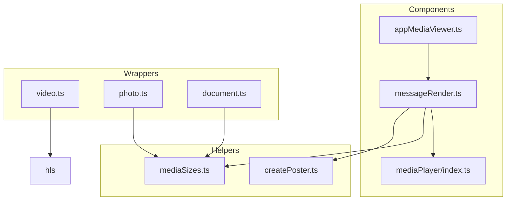
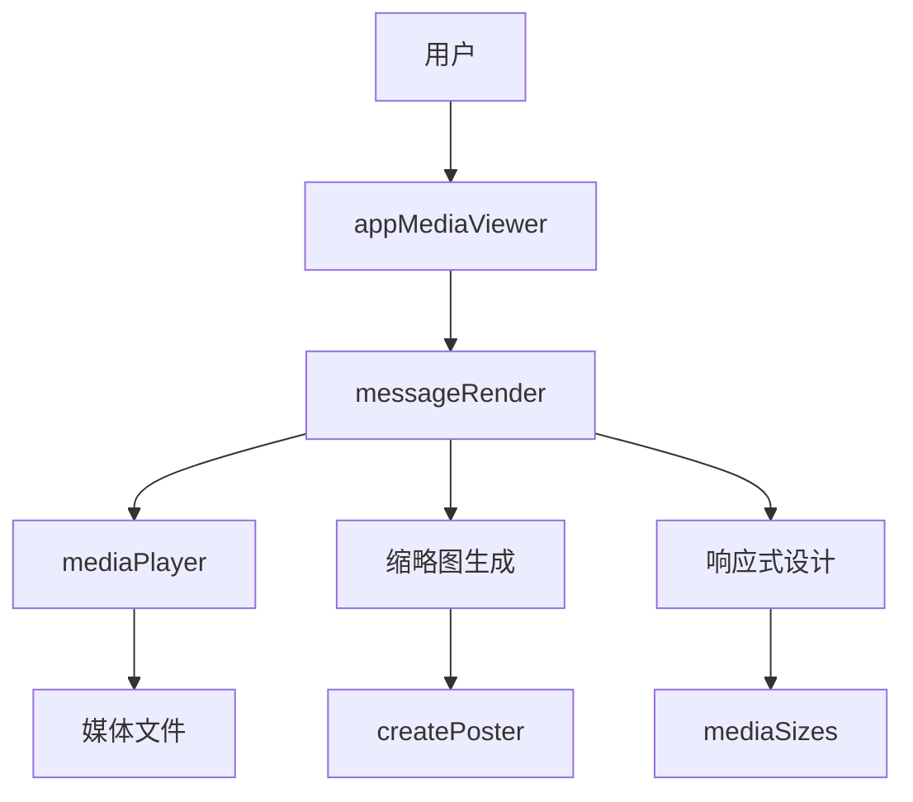
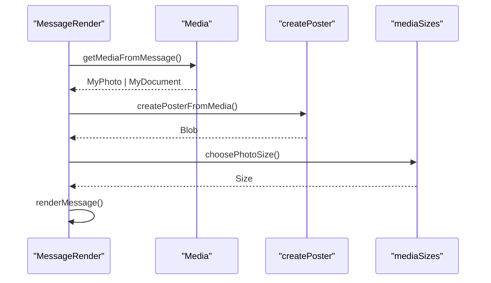
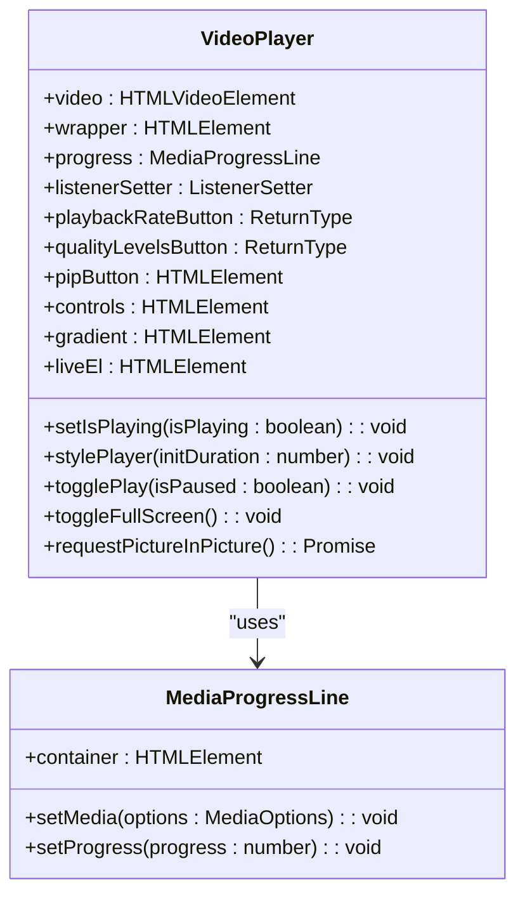
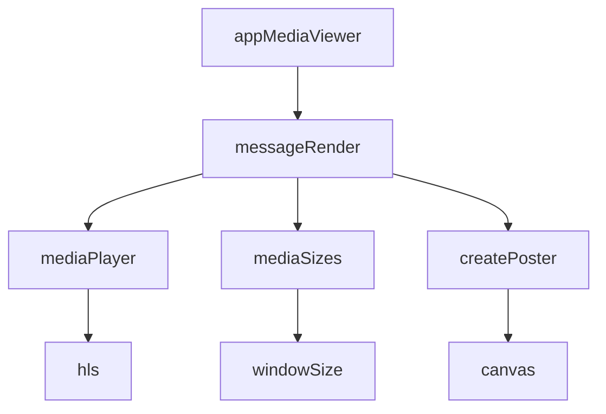

# 媒体消息渲染

<cite>
**本文档引用的文件**   
- [appMediaViewer.ts](file://src/components/appMediaViewer.ts)
- [appMediaViewerBase.ts](file://src/components/appMediaViewerBase.ts)
- [messageRender.ts](file://src/components/chat/messageRender.ts)
- [mediaPlayer/index.ts](file://src/lib/mediaPlayer/index.ts)
- [hls/initVideoHls.ts](file://src/lib/hls/initVideoHls.ts)
- [mediaSizes.ts](file://src/helpers/mediaSizes.ts)
- [createPoster.ts](file://src/helpers/createPoster.ts)
- [video.ts](file://src/components/wrappers/video.ts)
- [photo.ts](file://src/components/wrappers/photo.ts)
- [document.ts](file://src/components/wrappers/document.ts)
</cite>

## 目录
1. [简介](#简介)
2. [项目结构](#项目结构)
3. [核心组件](#核心组件)
4. [架构概述](#架构概述)
5. [详细组件分析](#详细组件分析)
6. [依赖分析](#依赖分析)
7. [性能考虑](#性能考虑)
8. [故障排除指南](#故障排除指南)
9. [结论](#结论)

## 简介
本文档详细说明了媒体消息渲染机制，包括图片、视频、音频和文件消息的渲染，涵盖缩略图生成、媒体预览、播放控件集成和加载状态管理。文档还解释了媒体消息的响应式设计、视频消息的HLS流处理、音频消息的播放策略以及性能优化方案。

## 项目结构
项目结构显示了媒体消息渲染相关的组件和工具，主要位于`src/components`和`src/lib`目录下。关键组件包括`appMediaViewer`、`messageRender`和`mediaPlayer`，这些组件负责媒体消息的渲染和播放。



**Diagram sources**
- [appMediaViewer.ts](file://src/components/appMediaViewer.ts)
- [messageRender.ts](file://src/components/chat/messageRender.ts)
- [mediaPlayer/index.ts](file://src/lib/mediaPlayer/index.ts)
- [mediaSizes.ts](file://src/helpers/mediaSizes.ts)
- [createPoster.ts](file://src/helpers/createPoster.ts)
- [video.ts](file://src/components/wrappers/video.ts)
- [photo.ts](file://src/components/wrappers/photo.ts)
- [document.ts](file://src/components/wrappers/document.ts)

**Section sources**
- [appMediaViewer.ts](file://src/components/appMediaViewer.ts)
- [messageRender.ts](file://src/components/chat/messageRender.ts)
- [mediaPlayer/index.ts](file://src/lib/mediaPlayer/index.ts)

## 核心组件
核心组件包括`appMediaViewer`、`messageRender`和`mediaPlayer`，它们分别负责媒体查看器的管理、消息渲染和媒体播放。

**Section sources**
- [appMediaViewer.ts](file://src/components/appMediaViewer.ts)
- [messageRender.ts](file://src/components/chat/messageRender.ts)
- [mediaPlayer/index.ts](file://src/lib/mediaPlayer/index.ts)

## 架构概述
系统架构展示了媒体消息渲染的各个组件如何协同工作。`appMediaViewer`负责管理媒体查看器，`messageRender`处理消息的渲染，而`mediaPlayer`则负责媒体的播放。



**Diagram sources**
- [appMediaViewer.ts](file://src/components/appMediaViewer.ts)
- [messageRender.ts](file://src/components/chat/messageRender.ts)
- [mediaPlayer/index.ts](file://src/lib/mediaPlayer/index.ts)
- [createPoster.ts](file://src/helpers/createPoster.ts)
- [mediaSizes.ts](file://src/helpers/mediaSizes.ts)

## 详细组件分析
### appMediaViewer 分析
`appMediaViewer`组件负责管理媒体查看器的打开和关闭，以及媒体的加载和显示。

#### 类图
```mermaid
classDiagram
class AppMediaViewer {
+listLoader : SearchListLoader
+buttons : {[k in 'download' | 'close' | 'prev' | 'next' | 'mobile-close' | 'delete' | 'forward'] : HTMLElement}
+author : {[k in 'container' | 'avatarEl' | 'nameEl' | 'date'] : HTMLElement}
+content : {[k in 'main' | 'container' | 'media' | 'mover' | 'caption'] : HTMLElement}
+setSearchContext(context : MediaSearchContext) : AppMediaViewer
+openMedia(options : OpenMediaOptions) : Promise<void>
+close(e? : MouseEvent) : Promise<void>
}
class AppMediaViewerBase {
+wholeDiv : HTMLElement
+overlaysDiv : HTMLElement
+author : {[k in 'container' | 'avatarEl' | 'nameEl' | 'date'] : HTMLElement}
+content : {[k in 'main' | 'container' | 'media' | 'mover'] : HTMLElement}
+buttons : {[k in 'download' | 'close' | 'prev' | 'next' | 'mobile-close' | 'zoomin'] : HTMLElement}
+setMoverPromise : Promise<void>
+setMoverAnimationPromise : Promise<void>
+lazyLoadQueue : LazyLoadQueueBase
+setListeners() : void
+setNewMover() : void
+setTransform(transform : Transform) : void
+close(e? : MouseEvent) : Promise<void>
}
AppMediaViewer --> AppMediaViewerBase : "extends"
```

**Diagram sources**
- [appMediaViewer.ts](file://src/components/appMediaViewer.ts)
- [appMediaViewerBase.ts](file://src/components/appMediaViewerBase.ts)

### messageRender 分析
`messageRender`组件负责渲染消息，包括文本、媒体和时间戳。

#### 序列图


**Diagram sources**
- [messageRender.ts](file://src/components/chat/messageRender.ts)
- [createPoster.ts](file://src/helpers/createPoster.ts)
- [mediaSizes.ts](file://src/helpers/mediaSizes.ts)

### mediaPlayer 分析
`mediaPlayer`组件负责媒体的播放，包括视频和音频。

#### 类图


**Diagram sources**
- [mediaPlayer/index.ts](file://src/lib/mediaPlayer/index.ts)

## 依赖分析
### 组件依赖关系


**Diagram sources**
- [appMediaViewer.ts](file://src/components/appMediaViewer.ts)
- [messageRender.ts](file://src/components/chat/messageRender.ts)
- [mediaPlayer/index.ts](file://src/lib/mediaPlayer/index.ts)
- [mediaSizes.ts](file://src/helpers/mediaSizes.ts)
- [createPoster.ts](file://src/helpers/createPoster.ts)
- [hls/initVideoHls.ts](file://src/lib/hls/initVideoHls.ts)

**Section sources**
- [appMediaViewer.ts](file://src/components/appMediaViewer.ts)
- [messageRender.ts](file://src/components/chat/messageRender.ts)
- [mediaPlayer/index.ts](file://src/lib/mediaPlayer/index.ts)
- [mediaSizes.ts](file://src/helpers/mediaSizes.ts)
- [createPoster.ts](file://src/helpers/createPoster.ts)
- [hls/initVideoHls.ts](file://src/lib/hls/initVideoHls.ts)

## 性能考虑
### 懒加载和缓存策略
- **懒加载**: 使用`LazyLoadQueue`和`VisibilityIntersector`来延迟加载媒体内容，直到它们进入视口。
- **缓存策略**: 使用`mediaSizes`和`createPoster`来生成和缓存缩略图，减少重复计算。

### 带宽自适应
- **HLS流处理**: 使用`hls.js`库来处理HLS流，根据网络带宽动态调整视频质量。
- **响应式设计**: 根据屏幕尺寸调整布局，确保在不同设备上都能提供良好的用户体验。

## 故障排除指南
### 常见问题
- **媒体无法加载**: 检查网络连接和媒体URL是否正确。
- **播放控件不显示**: 确保`mediaPlayer`组件正确初始化，并且`video`元素已正确附加到DOM。
- **缩略图生成失败**: 检查`createPoster`函数的输入参数，确保媒体元素已正确加载。

**Section sources**
- [appMediaViewer.ts](file://src/components/appMediaViewer.ts)
- [messageRender.ts](file://src/components/chat/messageRender.ts)
- [mediaPlayer/index.ts](file://src/lib/mediaPlayer/index.ts)
- [createPoster.ts](file://src/helpers/createPoster.ts)

## 结论
本文档详细介绍了媒体消息渲染的各个方面，包括核心组件、架构、依赖关系和性能优化方案。通过这些信息，开发者可以更好地理解和优化媒体消息的渲染和播放。