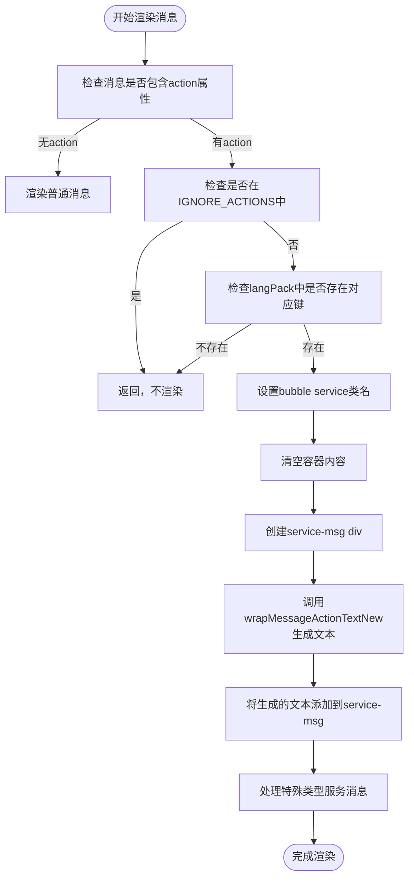
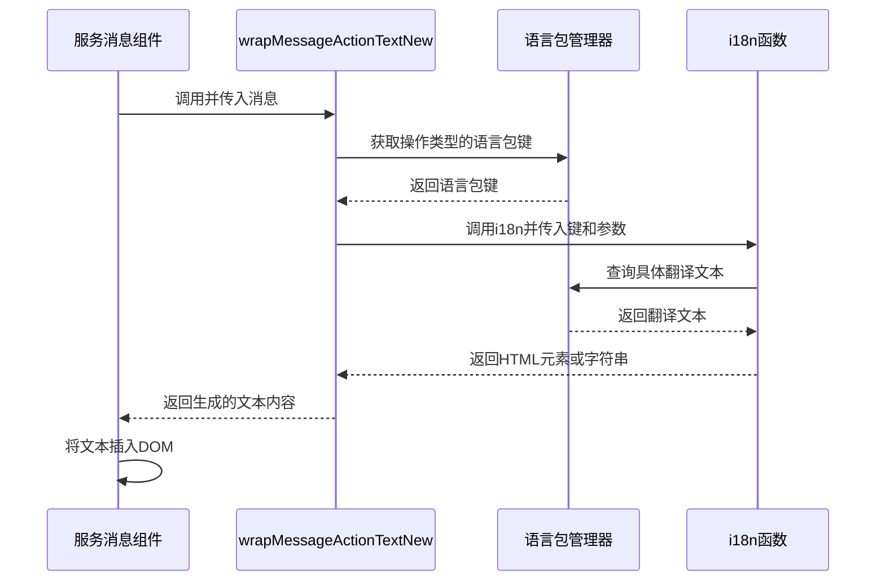
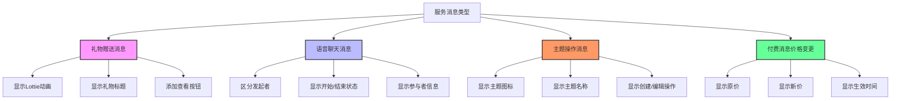

# 服务消息渲染

<cite>
**本文档引用的文件**
- [service.tsx](file://src/components/chat/bubbles/service.tsx)
- [service.module.scss](file://src/components/chat/bubbles/service.module.scss)
- [bubbles.ts](file://src/components/chat/bubbles.ts)
- [messageActionTextNew.ts](file://src/components/wrappers/messageActionTextNew.ts)
- [messageActionTextNewUnsafe.ts](file://src/components/wrappers/messageActionTextNewUnsafe.ts)
- [langPack.ts](file://src/lib/langPack.ts)
- [premiumGift.tsx](file://src/components/chat/bubbles/premiumGift.tsx)
- [_chatBubble.scss](file://src/scss/partials/_chatBubble.scss)
</cite>

## 目录
1. [介绍](#介绍)
2. [服务消息渲染逻辑](#服务消息渲染逻辑)
3. [视觉设计与布局策略](#视觉设计与布局策略)
4. [多语言支持与本地化处理](#多语言支持与本地化处理)
5. [可访问性优化方案](#可访问性优化方案)
6. [特殊服务消息类型](#特殊服务消息类型)
7. [结论](#结论)

## 介绍

服务消息是Telegram Web客户端中用于通知用户系统事件、用户加入/退出、消息编辑和删除等重要操作的关键功能。这些消息通过特殊的视觉样式与普通消息区分开来，确保用户能够清晰地识别系统通知。本文档深入分析服务消息的渲染逻辑、视觉设计、多语言支持和可访问性优化，为开发者提供全面的技术指导。

**本文档引用的文件**
- [service.tsx](file://src/components/chat/bubbles/service.tsx)
- [service.module.scss](file://src/components/chat/bubbles/service.module.scss)

## 服务消息渲染逻辑

服务消息的渲染逻辑主要在`bubbles.ts`文件中实现，通过检查消息的`action`属性来确定是否为服务消息。当检测到服务消息时，系统会创建一个带有`bubble service`类名的容器元素，并使用`wrapMessageActionTextNew`函数生成相应的文本内容。

服务消息的处理流程包括：
1. 检查消息的`action`属性是否存在且不为空
2. 验证是否需要忽略该类型的操作（通过`IGNORE_ACTIONS`映射）
3. 确认语言包中存在对应的翻译键
4. 设置正确的CSS类名以应用服务消息样式
5. 使用`wrapMessageActionTextNew`函数异步生成消息内容

对于特定类型的服务消息（如礼物赠送、语音聊天开始/结束等），系统会执行额外的逻辑处理，包括创建特殊的UI组件和添加交互按钮。



**Diagram sources**
- [bubbles.ts](file://src/components/chat/bubbles.ts#L5715-L5752)

**Section sources**
- [bubbles.ts](file://src/components/chat/bubbles.ts#L5700-L5899)

## 视觉设计与布局策略

服务消息的视觉设计旨在使其在聊天界面中突出显示，同时保持简洁和清晰。主要设计特点包括：

- **居中对齐**：服务消息始终在聊天窗口中水平居中显示
- **圆角背景**：使用高圆角的背景色块，通常为强调色（`var(--message-highlighting-color)`）
- **白色文字**：在深色背景上使用白色文字以确保高可读性
- **紧凑布局**：采用紧凑的内边距和行高，使消息内容集中

CSS类`.service-msg`定义了服务消息的核心样式，包括：
- `background-color: var(--message-highlighting-color)` - 使用主题强调色作为背景
- `color: #fff` - 白色文字
- `border-radius: 9999px` - 极高圆角，接近胶囊形状
- `padding: 0.28125rem 0.625rem` - 适当的内边距
- `display: flex` - 弹性布局，确保内容居中

对于包含附加内容（如礼物动画）的服务消息，系统使用`has-service-before`类来调整布局间距，确保主消息和附加内容之间有足够的视觉分离。

```mermaid
classDiagram
class ServiceBubble {
+class? : string
+message : Message.messageService
+children? : JSX.Element
+render() : JSX.Element
}
class ServiceStyles {
+wrap : CSS类
+text : CSS类
+addon : CSS类
}
ServiceBubble --> ServiceStyles : "使用"
ServiceBubble --> wrapMessageActionTextNew : "调用"
note right of ServiceBubble
服务消息气泡组件
- 接收消息对象作为属性
- 使用资源加载器异步获取文本内容
- 返回带有样式的JSX元素
end
note left of ServiceStyles
服务消息SCSS样式
- wrap : 容器样式，flex布局
- text : 文本样式，胶囊形状
- addon : 附加内容样式
end
```

**Diagram sources**
- [service.tsx](file://src/components/chat/bubbles/service.tsx#L8-L26)
- [service.module.scss](file://src/components/chat/bubbles/service.module.scss#L1-L53)

**Section sources**
- [service.module.scss](file://src/components/chat/bubbles/service.module.scss#L1-L53)
- [_chatBubble.scss](file://src/scss/partials/_chatBubble.scss#L3214-L3280)

## 多语言支持与本地化处理

服务消息的多语言支持通过`langPack.ts`和相关包装器函数实现。系统使用`langPack`映射将消息操作类型转换为对应的语言包键名，然后通过`i18n`函数获取本地化文本。

主要的多语言处理机制包括：

1. **操作类型映射**：`langPack`对象将消息操作类型（如`messageActionChatCreate`）映射到语言包键名（如`ActionCreateGroup`）
2. **异步文本生成**：`wrapMessageActionTextNew`函数异步生成本地化文本，支持HTML元素返回
3. **参数化消息**：支持包含动态参数的消息，如用户名称、时间等
4. **错误处理**：在翻译失败时提供默认的空字符串或占位元素

对于复杂的本地化场景（如复数形式、性别相关变化），系统依赖于`Intl.PluralRules`等浏览器API来确保正确的语言处理。



**Diagram sources**
- [messageActionTextNew.ts](file://src/components/wrappers/messageActionTextNew.ts#L17-L28)
- [langPack.ts](file://src/lib/langPack.ts#L27-L74)
- [messageActionTextNewUnsafe.ts](file://src/components/wrappers/messageActionTextNewUnsafe.ts#L187-L200)

**Section sources**
- [langPack.ts](file://src/lib/langPack.ts#L1-L200)
- [messageActionTextNew.ts](file://src/components/wrappers/messageActionTextNew.ts#L1-L29)

## 可访问性优化方案

为了确保屏幕阅读器用户能够正确理解服务消息的上下文变化，系统实施了多项可访问性优化措施：

1. **语义化HTML结构**：使用适当的HTML元素和ARIA属性来传达消息的语义信息
2. **文本替代方案**：为所有图标和视觉元素提供文本替代，确保屏幕阅读器可以读取
3. **焦点管理**：确保服务消息中的交互元素（如按钮）可以通过键盘访问
4. **上下文提示**：在关键操作（如用户加入/退出）时提供明确的上下文信息

特别地，系统通过以下方式增强可访问性：
- 使用`user-select: none`防止意外选择服务消息文本
- 为链接和可点击元素添加`:hover`状态的视觉反馈
- 确保颜色对比度符合WCAG标准
- 为动态生成的内容提供适当的ARIA实时区域

这些优化确保了即使在没有视觉辅助的情况下，用户也能准确理解聊天中的系统事件和状态变化。

**Section sources**
- [service.module.scss](file://src/components/chat/bubbles/service.module.scss#L18-L24)
- [_chatBubble.scss](file://src/scss/partials/_chatBubble.scss#L3260-L3272)

## 特殊服务消息类型

除了基本的服务消息外，系统还支持几种特殊类型的服务消息，每种都有独特的渲染逻辑和UI设计：

### 礼物赠送消息

礼物赠送消息（`messageActionGiftPremium`、`messageActionGiftStars`）使用`PremiumGiftBubble`组件渲染，包含：
- Lottie动画效果
- 礼物标题和描述
- "查看"按钮
- 根据礼物价值选择不同的动画资源

### 语音聊天消息

语音聊天相关的服务消息（`messageActionGroupCall.started`、`messageActionGroupCall.ended`）会根据是否由当前用户发起来显示不同的文本，并可能包含参与者信息。

### 主题创建/编辑消息

在论坛中，主题创建（`messageActionTopicCreate`）和编辑消息会显示主题图标和名称，使用`wrapMessageActionTopicIconAndName`函数生成复合内容。

### 付费消息价格变更

当频道的付费消息价格发生变化时，系统会显示`messageActionPaidMessagesPrice`类型的服务消息，详细说明价格变更情况。

这些特殊类型的消息通过在`bubbles.ts`中的条件判断来处理，确保每种消息类型都能以最合适的方式呈现给用户。



**Diagram sources**
- [bubbles.ts](file://src/components/chat/bubbles.ts#L5737-L5881)
- [premiumGift.tsx](file://src/components/chat/bubbles/premiumGift.tsx#L35-L65)

**Section sources**
- [bubbles.ts](file://src/components/chat/bubbles.ts#L5700-L5899)
- [premiumGift.tsx](file://src/components/chat/bubbles/premiumGift.tsx#L1-L65)

## 结论

服务消息渲染系统通过精心设计的架构实现了高效、可访问且本地化的用户体验。核心组件`ServiceBubble`结合SCSS样式和`wrapMessageActionTextNew`包装器函数，创建了一个灵活且可扩展的消息渲染框架。多语言支持通过`langPack`映射和`i18n`函数实现，确保全球用户都能获得本地化的体验。可访问性优化措施保证了所有用户，包括使用辅助技术的用户，都能理解聊天中的系统事件。未来可以进一步优化的方向包括增强动画效果的性能、扩展对更多语言特性的支持，以及改进特殊消息类型的视觉设计一致性。