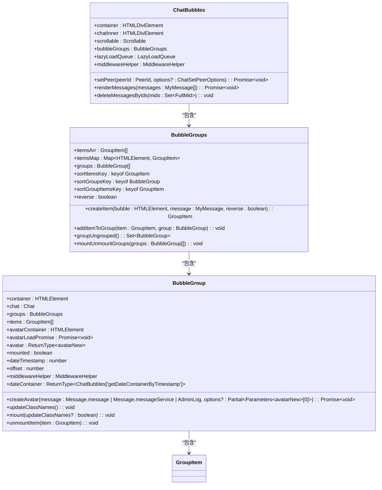
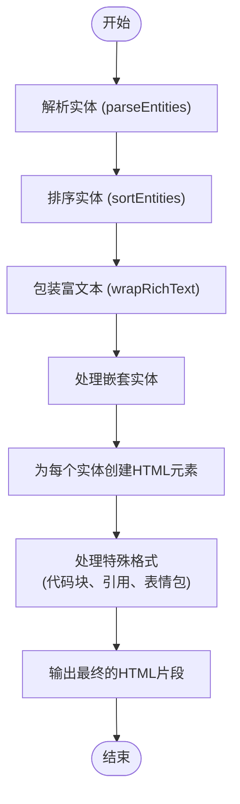
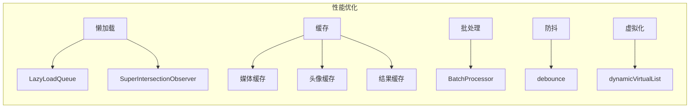

# 消息渲染

<cite>
**本文档引用的文件**   
- [messageRender.ts](file://src/components/chat/messageRender.ts)
- [bubbles.ts](file://src/components/chat/bubbles.ts)
- [bubbleGroups.ts](file://src/components/chat/bubbleGroups.ts)
- [wrapRichText.ts](file://src/lib/richTextProcessor/wrapRichText.ts)
- [parseEntities.ts](file://src/lib/richTextProcessor/parseEntities.ts)
- [wrapEmojiText.ts](file://src/lib/richTextProcessor/wrapEmojiText.ts)
- [paidServiceMessage.ts](file://src/components/chat/bubbleParts/paidServiceMessage.ts)
- [chatBackground-DT3l-EOo.css](file://public/chatBackground-DT3l-EOo.css)
</cite>

## 目录
1. [简介](#简介)
2. [消息类型与渲染逻辑](#消息类型与渲染逻辑)
3. [消息气泡样式系统](#消息气泡样式系统)
4. [消息内容解析流程](#消息内容解析流程)
5. [媒体消息预览生成与加载策略](#媒体消息预览生成与加载策略)
6. [性能优化方案](#性能优化方案)
7. [结论](#结论)

## 简介
本文档详细阐述了Telegram Web客户端中消息渲染的实现机制。重点分析了不同类型消息（文本、媒体、服务消息、表情包等）的渲染逻辑和组件结构，描述了消息气泡的样式系统（包括主题适配和自定义聊天背景），说明了消息内容的解析流程（如何处理富文本、实体、表情符号和链接），记录了媒体消息的预览生成和加载策略，并提供了消息渲染的性能优化方案（包括懒加载和缓存机制）。

## 消息类型与渲染逻辑
消息渲染系统根据消息类型（`Message.message` 或 `Message.messageService`）和内容，动态生成相应的UI组件。核心逻辑由 `ChatBubbles` 类管理，它负责将消息分组、排序并渲染到聊天容器中。

### 文本消息
文本消息的渲染由 `wrapRichText` 函数处理，该函数根据消息中的实体（entities）将纯文本转换为包含HTML标签的富文本。实体包括加粗、斜体、删除线、下划线、代码、超链接、提及、话题标签等。

### 媒体消息
媒体消息（如照片、视频、文件）通过 `wrapPhoto`、`wrapVideo`、`wrapDocument` 等包装函数进行渲染。这些函数会生成带有缩略图、文件名、大小和播放控件的预览组件。

### 服务消息
服务消息（如“用户加入了群组”、“消息已删除”）通常不包含用户输入的文本，而是由系统生成。它们的渲染逻辑在 `ChatBubbles` 类中通过 `SERVICE_AS_REGULAR` 集合和 `IGNORE_ACTIONS` 映射进行控制。某些服务消息（如电话通话）被视为常规消息渲染，而其他消息（如历史记录已清除）则被忽略。

### 表情包消息
表情包消息的渲染由 `wrapSticker` 和 `wrapStickerAnimation` 函数处理。对于静态表情包，直接显示图片；对于动画表情包，则使用 `RLottiePlayer` 播放Lottie动画。

**Section sources**
- [bubbles.ts](file://src/components/chat/bubbles.ts#L222-L235)
- [messageRender.ts](file://src/components/chat/messageRender.ts#L169-L170)

## 消息气泡样式系统
消息气泡的样式系统高度可定制，支持主题适配和自定义聊天背景。

### 主题适配
系统通过 `themeController` 和 `useIsNightTheme` 等工具实现主题适配。消息气泡的颜色、边框和阴影会根据当前主题（日间/夜间）自动调整。

### 自定义聊天背景
自定义聊天背景通过 `chatBackgroundStore` 和 `chatBackground-DT3l-EOo.css` 文件实现。用户可以选择预设背景或上传自定义图片，系统会将背景应用到聊天窗口。

**Diagram sources **
- [bubbles.ts](file://src/components/chat/bubbles.ts#L442-L800)
- [bubbleGroups.ts](file://src/components/chat/bubbleGroups.ts#L359-L800)

## 消息内容解析流程
消息内容的解析是一个多步骤的过程，从原始文本到最终的富文本HTML。

### 实体解析
`parseEntities` 函数是解析流程的起点。它使用正则表达式 `FULL_REG_EXP` 扫描消息文本，识别并提取所有实体（如链接、提及、话题标签、表情符号等），并返回一个实体数组。

### 富文本包装
`wrapRichText` 函数接收原始文本和实体数组，遍历实体并为每个实体创建相应的HTML元素（如 `<strong>` 用于加粗，`<a>` 用于链接）。它还处理嵌套实体和特殊格式（如代码块、引用）。

### 表情符号处理
`wrapEmojiText` 函数专门处理表情符号。它首先调用 `parseEntities` 提取表情符号实体，然后调用 `wrapRichText` 进行包装。对于不支持的emoji，系统会回退到使用PNG图片。

**Diagram sources **
- [parseEntities.ts](file://src/lib/richTextProcessor/parseEntities.ts#L1-L129)
- [wrapRichText.ts](file://src/lib/richTextProcessor/wrapRichText.ts#L1-L800)
- [wrapEmojiText.ts](file://src/lib/richTextProcessor/wrapEmojiText.ts#L1-L34)

## 媒体消息预览生成与加载策略
媒体消息的预览生成和加载采用了懒加载和缓存策略，以优化性能和用户体验。

### 预览生成
当消息包含媒体时，系统会调用相应的包装函数（如 `wrapPhoto`）。这些函数会立即生成一个低分辨率的缩略图作为预览，并显示加载指示器。

### 加载策略
系统使用 `LazyLoadQueue` 类来管理媒体的加载。只有当媒体预览进入或即将进入视口时，高分辨率的完整媒体才会被下载和解码。这避免了在用户滚动聊天记录时加载大量不必要的数据。

### 缓存机制
已加载的媒体（包括缩略图和完整媒体）会被缓存在 `appDownloadManager` 中。当用户再次查看同一消息时，可以直接从缓存中获取，无需重新下载。

**Section sources**
- [bubbles.ts](file://src/components/chat/bubbles.ts#L493-L494)
- [bubbles.ts](file://src/components/chat/bubbles.ts#L606-L607)

## 性能优化方案
消息渲染系统采用了多种性能优化技术。

### 懒加载
如上所述，`LazyLoadQueue` 是核心的懒加载机制。它与 `SuperIntersectionObserver` 结合使用，高效地检测元素的可见性。

### 缓存
系统对多个层面进行了缓存：
- **媒体缓存**：通过 `appDownloadManager` 缓存已下载的媒体文件。
- **头像缓存**：通过 `avatarNew` 组件缓存用户头像。
- **中间结果缓存**：使用 `cacheFunctionPolyfill` 等工具缓存计算结果。

### 批处理与防抖
`ChatBubbles` 类使用 `BatchProcessor` 来批处理消息渲染操作，避免频繁的DOM更新。同时，使用 `debounce` 函数对滚动事件等高频操作进行防抖处理。

### 虚拟化
对于包含大量消息的聊天，系统可能使用 `dynamicVirtualList` 组件来实现虚拟滚动，只渲染视口内的消息，从而大幅减少DOM节点数量。

**Diagram sources **
- [bubbles.ts](file://src/components/chat/bubbles.ts#L493-L494)
- [bubbles.ts](file://src/components/chat/bubbles.ts#L606-L607)
- [bubbles.ts](file://src/components/chat/bubbles.ts#L598-L602)

## 结论
Telegram Web客户端的消息渲染系统是一个复杂而高效的架构。它通过模块化的设计，将消息解析、内容包装、UI渲染和性能优化等职责清晰地分离。系统充分利用了现代Web技术（如Intersection Observer、Resize Observer）和设计模式（如批处理、防抖、虚拟化），在保证功能丰富性的同时，提供了流畅的用户体验。其核心组件 `ChatBubbles` 和 `BubbleGroups` 有效地管理了消息的分组、排序和生命周期，而 `wrapRichText` 等工具函数则确保了富文本内容的准确和安全渲染。