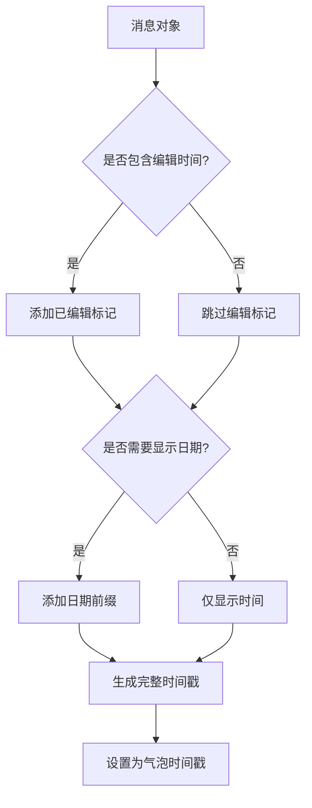
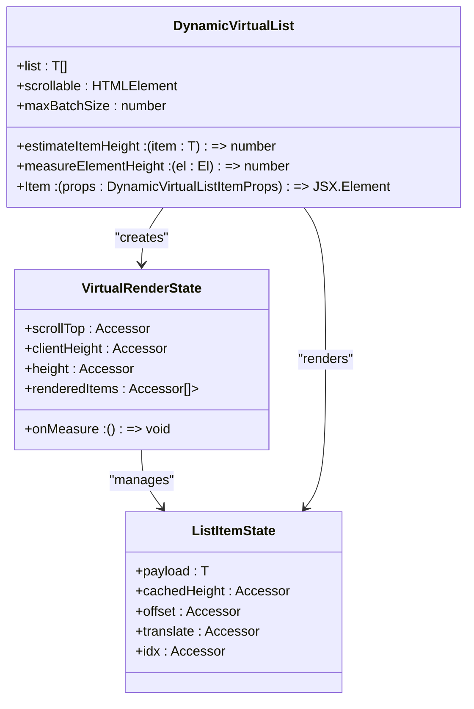

# 聊天界面

<cite>
**本文档引用的文件**   
- [bubbleGroups.ts](file://src/components/chat/bubbleGroups.ts)
- [bubbles.ts](file://src/components/chat/bubbles.ts)
- [messageRender.ts](file://src/components/chat/messageRender.ts)
- [bubbleLayout.tsx](file://src/components/chat/bubbles/bubbleLayout.tsx)
- [service.tsx](file://src/components/chat/bubbles/service.tsx)
- [utils.ts](file://src/components/chat/utils.ts)
- [dynamicVirtualList/index.tsx](file://src/components/dynamicVirtualList/index.tsx)
</cite>

## 目录
1. [引言](#引言)
2. [消息气泡渲染逻辑](#消息气泡渲染逻辑)
3. [消息分组策略](#消息分组策略)
4. [消息时间戳显示规则](#消息时间戳显示规则)
5. [消息气泡交互行为](#消息气泡交互行为)
6. [消息列表虚拟滚动实现](#消息列表虚拟滚动实现)
7. [界面性能优化策略](#界面性能优化策略)
8. [结论](#结论)

## 引言
聊天界面是现代即时通讯应用的核心组成部分，它不仅承载着用户之间的信息交流，还体现了应用的用户体验设计水平。本文档深入分析了聊天界面的实现细节，重点关注消息气泡的渲染逻辑、消息分组策略、时间戳显示规则、交互行为处理、虚拟滚动实现以及性能优化策略。通过本指南，开发者可以全面理解聊天界面的技术架构和实现原理，为开发和优化聊天功能提供指导。

## 消息气泡渲染逻辑
消息气泡是聊天界面中最基本的视觉元素，用于展示用户发送和接收的各种类型消息。系统通过`ChatBubbles`类管理所有消息气泡的生命周期和渲染过程。

消息气泡的渲染逻辑根据消息类型进行差异化处理，主要分为文本消息、媒体消息和服务消息等类型。对于文本消息，系统使用`wrapRichText`函数处理消息内容，支持表情符号、链接和格式化文本的渲染。媒体消息则通过专门的包装器如`wrapPhoto`、`wrapVideo`和`wrapDocument`进行处理，确保不同类型媒体内容的正确显示。

服务消息（如系统通知、用户加入/退出群组等）采用特殊的渲染方式，通过`ServiceBubble`组件实现。该组件使用居中的圆角矩形容器显示消息内容，具有独特的视觉样式，使其与普通消息区分开来。

消息气泡的布局由`BubbleLayout`组件控制，该组件定义了气泡的基本结构，包括内容区域、附件区域、回复标记和尾部三角形等元素。气泡的外观通过CSS类动态调整，以反映消息的发送状态（已发送、已读、错误等）和交互状态（选中、悬停等）。

**Section sources**
- [bubbles.ts](file://src/components/chat/bubbles.ts#L442-L10306)
- [bubbleLayout.tsx](file://src/components/chat/bubbles/bubbleLayout.tsx#L1-L132)
- [service.tsx](file://src/components/chat/bubbles/service.tsx#L1-L27)

## 消息分组策略
消息分组是提升聊天界面可读性和用户体验的重要机制。系统通过`BubbleGroups`类实现消息分组功能，将连续发送的消息按特定规则组合在一起。

消息分组的主要策略包括：
- **发送者一致性**：来自同一发送者的消息在一定时间间隔内会被分组
- **时间间隔**：消息之间的时间差不超过121秒（可配置）的消息会被视为同一组
- **消息类型**：普通消息和特定类型的服务消息可以被分组，而系统通知类服务消息则单独显示
- **方向一致性**：同一方向（发送或接收）的消息才能被分组

分组算法通过`canItemsBeGrouped`方法实现，该方法检查两个消息是否满足分组条件。当新消息到达时，系统会检查其与前一条消息的关联性，决定是否将其添加到现有组或创建新组。

分组的视觉表现通过气泡的CSS类控制，如`is-group-first`、`is-group-last`和`is-group-single`等类名，用于调整气泡的圆角样式，形成连贯的对话流。分组的首条消息显示发送者头像，而后续消息则隐藏头像，减少视觉干扰。

**Section sources**
- [bubbleGroups.ts](file://src/components/chat/bubbleGroups.ts#L1-L882)
- [bubbles.ts](file://src/components/chat/bubbles.ts#L483-L484)

## 消息时间戳显示规则
消息时间戳的显示是聊天界面的重要组成部分，它帮助用户理解消息的时间顺序和上下文。系统通过`MessageRender.setTime`方法实现时间戳的生成和格式化。

时间戳的显示规则如下：
- **时间格式**：使用`formatTime`函数将时间戳转换为可读的时间格式（如"14:30"）
- **日期显示**：当消息跨越不同日期时，在时间戳前添加日期信息（如"昨天 14:30"）
- **编辑标记**：对于已编辑的消息，在时间戳前添加"已编辑"图标
- **特殊状态**：对于置顶消息、已支付消息等特殊状态，在时间戳区域显示相应的图标

时间戳的完整信息通过`title`属性提供，当用户悬停在时间戳上时，会显示更详细的时间信息，包括原始发送时间、编辑时间和转发时间（如果存在）。

时间戳的格式化方法考虑了多种因素，包括时区、语言设置和用户偏好。系统使用`formatFullSentTimeRaw`函数生成完整的时间字符串，并根据上下文决定显示哪些部分。

**Diagram sources **
- [messageRender.ts](file://src/components/chat/messageRender.ts#L175-L319)
- [utils.ts](file://src/components/chat/utils.ts#L27-L29)

## 消息气泡交互行为
消息气泡支持多种交互行为，包括点击、长按和选择等，这些行为通过事件监听器和上下文菜单系统实现。

### 点击事件
点击消息气泡会触发不同的行为，具体取决于点击位置和消息类型：
- 点击消息内容：复制文本或打开链接
- 点击时间戳：显示消息详细信息
- 双击消息（桌面端）：回复该消息
- 手势滑动（移动端）：快速回复

系统通过`attachClickEvent`函数为消息容器绑定点击事件监听器，并使用`findUpClassName`等辅助函数确定点击的具体元素。

### 长按事件
长按消息气泡会弹出上下文菜单，提供更多操作选项，如：
- 复制消息内容
- 转发消息
- 回复消息
- 删除消息
- 引用消息

上下文菜单由`ChatContextMenu`类管理，通过`contextMenuController`协调多个菜单实例的显示和隐藏。

### 选择模式
长按多条消息进入选择模式，用户可以批量操作选中的消息。选择模式由`ChatSelection`类实现，支持以下功能：
- 单选和多选
- 全选和取消全选
- 批量转发和删除
- 批量标记为已读

选择状态通过CSS类`is-selected`控制，选中的消息会显示特殊的视觉反馈。

**Section sources**
- [bubbles.ts](file://src/components/chat/bubbles.ts#L1175-L1224)
- [contextMenu.ts](file://src/components/chat/contextMenu.ts#L1-L100)
- [selection.ts](file://src/components/chat/selection.ts#L1-L200)

## 消息列表虚拟滚动实现
为了高效渲染大量消息，系统采用虚拟滚动技术，只渲染当前可见区域的消息，显著提升性能和内存使用效率。

虚拟滚动实现基于`DynamicVirtualList`组件，该组件使用SolidJS的响应式系统管理列表的渲染状态。核心原理包括：

### 渲染窗口管理
系统维护一个渲染窗口，只包含视口内及附近的消息项。通过`lowerBound`函数快速定位需要渲染的第一条消息，避免遍历整个消息列表。

### 批量渲染
使用`maxBatchSize`参数控制每帧渲染的消息数量，防止一次性渲染过多元素导致界面卡顿。渲染过程分批进行，确保界面流畅。

### 高度估算
为每条消息维护一个高度缓存，首次渲染时使用估算高度，测量后更新为实际高度。这避免了布局抖动，确保滚动位置的准确性。

### 滚动同步
当消息高度变化时，自动调整滚动位置，保持用户视觉焦点不变。通过`scrollTopAdjustment`机制处理高度变化带来的滚动偏移。

**Diagram sources **
- [dynamicVirtualList/index.tsx](file://src/components/dynamicVirtualList/index.tsx#L1-L388)
- [bubbles.ts](file://src/components/chat/bubbles.ts#L445-L446)

## 界面性能优化策略
聊天界面的性能优化是确保流畅用户体验的关键。系统采用多种策略减少重绘和重排，提升渲染效率。

### 减少重绘
- **CSS变换优化**：使用`transform`和`opacity`属性进行动画，避免触发布局重排
- **硬件加速**：为关键元素启用GPU加速，提升动画性能
- **批量更新**：使用`fastRaf`和`doubleRaf`函数批量处理DOM更新，减少重绘次数

### 减少重排
- **虚拟滚动**：只渲染可见消息，大幅减少DOM节点数量
- **懒加载**：通过`LazyLoadQueue`类延迟加载非关键资源，如图片和视频缩略图
- **尺寸预估**：为消息项预估高度，避免测量时的布局重排

### 内存管理
- **对象池**：重用已删除的消息气泡元素，减少垃圾回收压力
- **事件清理**：使用`MiddlewareHelper`确保组件销毁时清理所有事件监听器
- **资源释放**：及时释放不再使用的媒体资源，防止内存泄漏

### 渲染优化
- **防抖处理**：对频繁触发的操作（如滚动）使用`debounce`函数进行防抖
- **条件渲染**：根据设备性能和用户设置动态调整渲染质量
- **渐进式加载**：使用`ProgressivePreloader`组件实现内容的渐进式显示

这些优化策略共同作用，确保聊天界面在各种设备和网络条件下都能提供流畅的用户体验。

**Section sources**
- [bubbles.ts](file://src/components/chat/bubbles.ts#L493-L494)
- [lazyLoadQueue.ts](file://src/components/lazyLoadQueue.ts#L1-L100)
- [useHeavyAnimationCheck.ts](file://src/hooks/useHeavyAnimationCheck.ts#L1-L50)

## 结论
本文档详细分析了聊天界面的各个技术方面，从消息气泡的渲染逻辑到性能优化策略。通过深入理解这些实现细节，开发者可以更好地维护和扩展聊天功能，为用户提供高质量的通信体验。消息分组、虚拟滚动和性能优化等关键技术的应用，不仅提升了界面的美观性和可用性，也确保了系统在处理大量消息时的稳定性和响应速度。