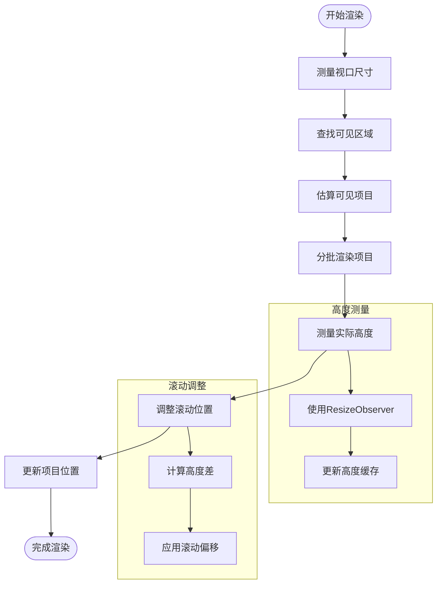
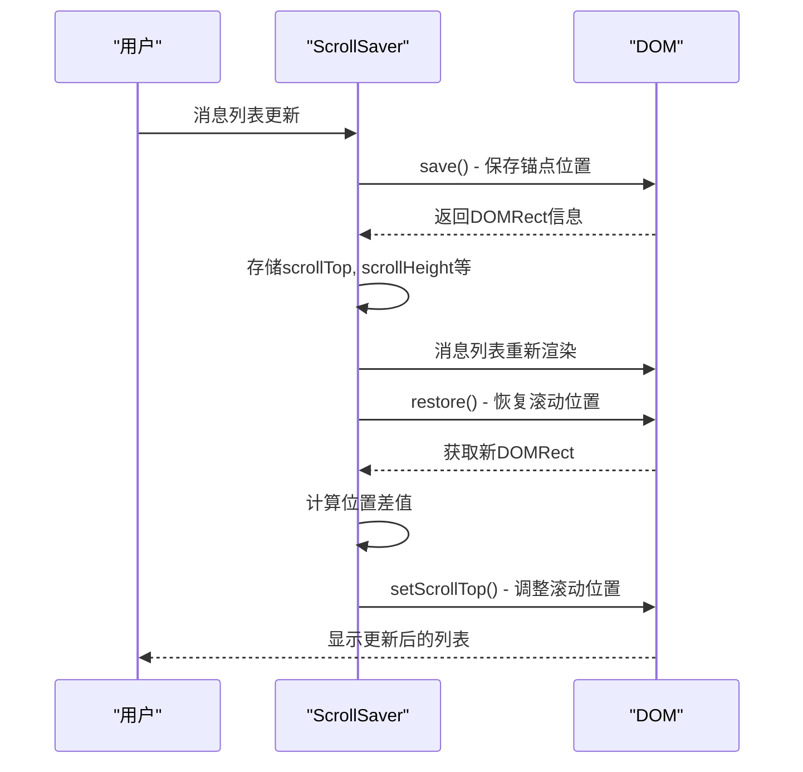
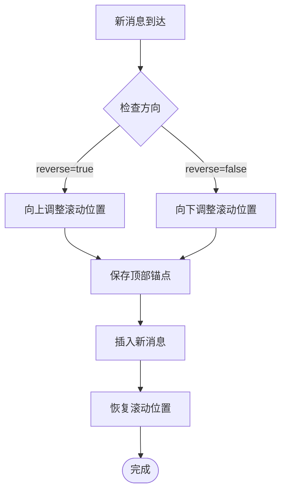
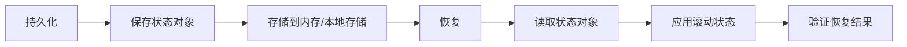

# 滚动位置管理

<cite>
**本文档引用的文件**   
- [scrollSaver.ts](file://src\helpers\scrollSaver.ts)
- [scrollable.ts](file://src\components\scrollable.ts)
- [scrollable2.tsx](file://src\components\scrollable2.tsx)
- [bubbles.ts](file://src\components\chat\bubbles.ts)
- [dynamicVirtualList\index.tsx](file://src\components\dynamicVirtualList\index.tsx)
</cite>

## 目录
1. [简介](#简介)
2. [滚动位置保持机制](#滚动位置保持机制)
3. [虚拟滚动中的位置同步策略](#虚拟滚动中的位置同步策略)
4. [滚动偏移量计算方法](#滚动偏移量计算方法)
5. [消息动态更新时的位置维护](#消息动态更新时的位置维护)
6. [滚动位置持久化与恢复](#滚动位置持久化与恢复)
7. [消息ID与滚动位置映射](#消息id与滚动位置映射)
8. [不同消息密度场景优化](#不同消息密度场景优化)
9. [结论](#结论)

## 简介

滚动位置管理是消息列表组件中的核心功能，确保用户在浏览消息时能够保持视觉位置的连续性。本系统通过`ScrollSaver`类和`Scrollable`组件实现复杂的滚动位置管理，支持虚拟滚动、动态消息更新和页面刷新后的状态恢复。系统需要处理新消息到达、消息删除、消息编辑等多种动态场景，同时在不同设备和浏览器环境下保持一致的用户体验。

**Section sources**
- [bubbles.ts](file://src\components\chat\bubbles.ts#L1857-L1861)
- [scrollSaver.ts](file://src\helpers\scrollSaver.ts#L25-L231)

## 滚动位置保持机制

滚动位置保持机制的核心是`ScrollSaver`类，它通过锚点元素来维持用户的视觉位置。当消息列表发生动态变化时，系统会保存一个或多个可见消息元素的DOM矩形信息，然后在更新后重新计算滚动位置。

`ScrollSaver`的构造函数接受三个参数：滚动容器、查询选择器和方向标志。查询选择器`.bubble:not(.is-date)`用于定位消息气泡元素，排除日期分隔符。方向标志`reverse`指示滚动方向，true表示向上滚动。

```mermaid
classDiagram
class ScrollSaver {
-scrollHeight : number
-scrollHeightMinusTop : number
-scrollTop : number
-clientHeight : number
-elements : {element : HTMLElement, rect : DOMRect}[]
+constructor(scrollable, query, reverse)
+save()
+restore(useReflow)
+findElements()
+getSaved()
+replaceSaved(from, to)
}
class Scrollable {
+container : HTMLElement
+scrollPosition : number
+scrollSize : number
+clientSize : number
+setScrollPositionSilently(value)
+onSizeChange()
}
ScrollSaver --> Scrollable : "依赖"
```

**Diagram sources **
- [scrollSaver.ts](file://src\helpers\scrollSaver.ts#L25-L231)
- [scrollable.ts](file://src\components\scrollable.ts#L70-L483)

## 虚拟滚动中的位置同步策略

虚拟滚动中的位置同步策略通过`dynamicVirtualList`组件实现。该组件采用分批渲染和动态高度测量的策略，在保证性能的同时维持滚动位置的准确性。

系统使用`createVirtualRenderState`函数创建虚拟渲染状态，其中包含滚动位置、客户端高度、总高度和渲染项目等关键状态。渲染过程分为多个批次，每批处理固定数量的项目（由`maxBatchSize`控制），避免一次性渲染大量项目导致的性能问题。



**Diagram sources **
- [dynamicVirtualList\index.tsx](file://src\components\dynamicVirtualList\index.tsx#L68-L256)
- [bubbles.ts](file://src\components\chat\bubbles.ts#L8525-L8555)

## 滚动偏移量计算方法

滚动偏移量的计算方法基于锚点元素的相对位置变化。系统首先保存锚点元素的原始位置，然后在DOM更新后重新获取其位置，通过位置差值调整滚动位置。

核心计算逻辑在`restore`方法中实现：
1. 获取当前滚动容器的滚动高度和滚动位置
2. 查找保存的锚点元素
3. 计算锚点元素的新旧位置差值
4. 调整滚动位置以补偿差值



**Diagram sources **
- [scrollSaver.ts](file://src\helpers\scrollSaver.ts#L150-L186)
- [scrollable.ts](file://src\components\scrollable.ts#L346-L351)

## 消息动态更新时的位置维护

在消息动态更新场景下，系统需要处理新消息到达、消息删除和消息编辑等操作，同时保持用户的视觉位置。

### 新消息到达

当新消息到达时，系统根据`reverse`标志决定滚动行为。如果`reverse`为true（向上滚动），新消息会添加到列表顶部，系统需要调整滚动位置以保持视觉连续性。



### 消息删除

消息删除时，系统需要重新计算受影响区域的高度变化，并相应调整滚动位置。`replaceSaved`方法用于更新被替换的DOM元素引用。

### 消息编辑

消息编辑可能改变消息气泡的高度，系统通过`ResizeObserver`检测高度变化，并触发滚动位置调整。

**Section sources**
- [bubbles.ts](file://src\components\chat\bubbles.ts#L8525-L8555)
- [scrollSaver.ts](file://src\helpers\scrollSaver.ts#L85-L94)

## 滚动位置持久化与恢复

滚动位置的持久化与恢复机制确保在页面刷新或组件重新挂载后能够恢复到之前的状态。

系统通过以下步骤实现持久化：
1. 在组件卸载前保存滚动状态
2. 将状态存储在内存或持久化存储中
3. 在组件重新挂载时读取并恢复状态

恢复过程特别处理了Safari浏览器的兼容性问题，通过`fastRaf`确保滚动位置设置的可靠性。



**Section sources**
- [scrollSaver.ts](file://src\helpers\scrollSaver.ts#L150-L228)
- [bubbles.ts](file://src\components\chat\bubbles.ts#L8688-L8724)

## 消息ID与滚动位置映射

消息ID与滚动位置的映射关系通过`createScrollSaver`方法建立。每个消息气泡元素都有唯一的ID，系统通过查询选择器`.bubble:not(.is-date)`定位这些元素。

映射关系的维护包括：
- 消息插入时更新映射
- 消息删除时清理映射
- 消息编辑时验证映射有效性

系统使用`getBubble`方法通过消息ID查找对应的DOM元素，确保映射关系的准确性。

**Section sources**
- [bubbles.ts](file://src\components\chat\bubbles.ts#L1857-L1861)
- [scrollSaver.ts](file://src\helpers\scrollSaver.ts#L57-L83)

## 不同消息密度场景优化

系统针对不同消息密度场景进行了优化，确保在各种情况下都能提供流畅的用户体验。

### 高密度场景

在高密度消息场景下，系统采用以下优化策略：
- 增加`maxBatchSize`以减少渲染批次
- 使用`viewportThreshold`优化可见区域检测
- 启用`stableResizeTimeout`防止频繁重排

### 低密度场景

在低密度消息场景下，系统优化重点在于：
- 减少不必要的高度测量
- 优化锚点选择策略
- 简化滚动位置计算

系统还针对Safari浏览器进行了特殊优化，通过`IS_SAFARI`标志启用额外的滚动同步机制。

**Section sources**
- [dynamicVirtualList\index.tsx](file://src\components\dynamicVirtualList\index.tsx#L64-L66)
- [scrollSaver.ts](file://src\helpers\scrollSaver.ts#L139-L145)

## 结论

滚动位置管理系统通过`ScrollSaver`和`Scrollable`组件的协同工作，实现了复杂消息列表的流畅滚动体验。系统采用锚点元素跟踪、分批渲染和动态高度测量等技术，在保证性能的同时提供了精确的滚动位置控制。

关键优势包括：
- 跨浏览器兼容性，特别针对Safari进行了优化
- 支持虚拟滚动，处理大量消息的高效渲染
- 完善的动态更新处理，保持视觉位置连续性
- 可配置的优化参数，适应不同场景需求

该系统为消息应用提供了可靠的滚动位置管理解决方案，确保用户在各种操作场景下都能获得一致的浏览体验。