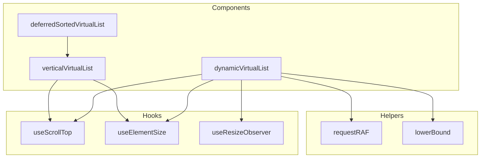
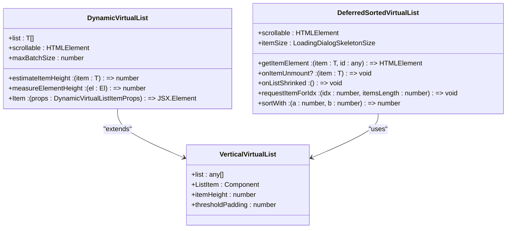
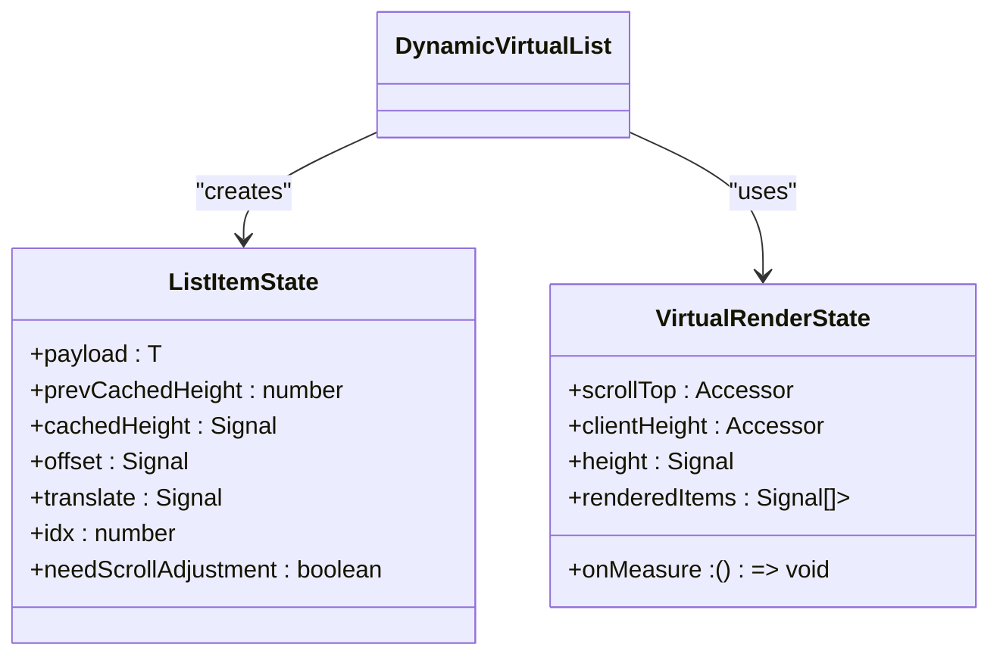
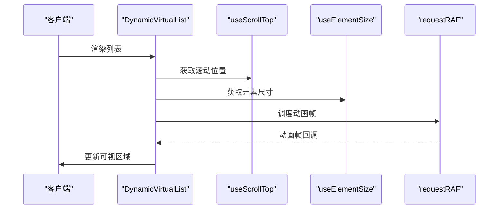
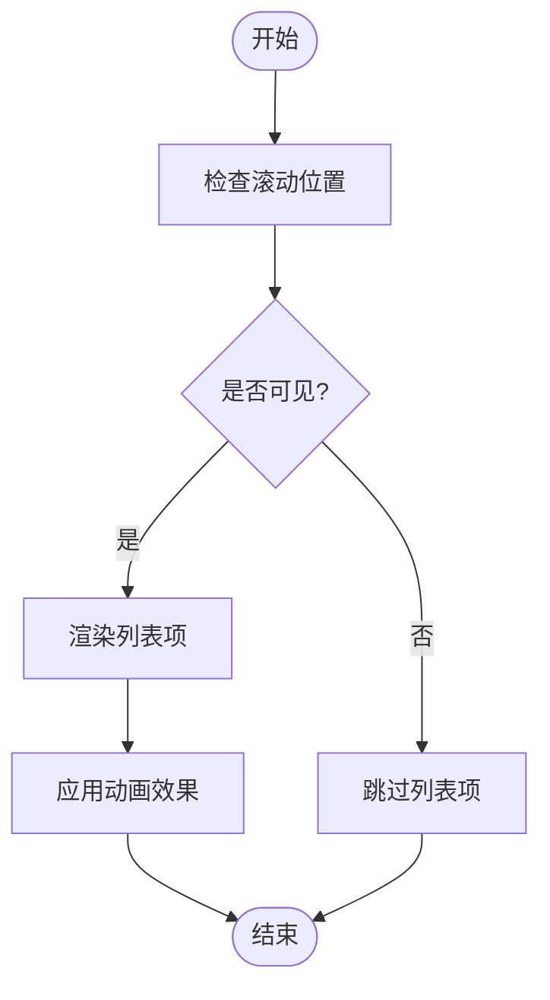
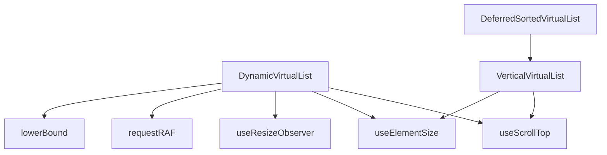

# 虚拟滚动

<cite>
**本文档引用的文件**   
- [dynamicVirtualList.tsx](file://src/components/dynamicVirtualList/index.tsx)
- [verticalVirtualList.tsx](file://src/components/verticalVirtualList.tsx)
- [deferredSortedVirtualList.tsx](file://src/components/deferredSortedVirtualList.tsx)
- [useScrollTop.ts](file://src/hooks/useScrollTop.ts)
- [useElementSize.ts](file://src/hooks/useElementSize.ts)
- [useResizeObserver.ts](file://src/hooks/useResizeObserver.ts)
- [requestRAF.ts](file://src/helpers/solid/requestRAF.ts)
- [lowerBound.ts](file://src/components/dynamicVirtualList/lowerBound.ts)
- [bubbleGroups.ts](file://src/components/chat/bubbleGroups.ts)
- [bubbles.ts](file://src/components/chat/bubbles.ts)
</cite>

## 目录
1. [引言](#引言)
2. [项目结构](#项目结构)
3. [核心组件](#核心组件)
4. [架构概述](#架构概述)
5. [详细组件分析](#详细组件分析)
6. [依赖分析](#依赖分析)
7. [性能考虑](#性能考虑)
8. [故障排除指南](#故障排除指南)
9. [结论](#结论)

## 引言
本文档详细阐述了消息列表中虚拟滚动的实现原理。虚拟滚动是一种优化技术，用于高效渲染大量数据项，通过仅渲染可视区域内的元素来提升性能。文档深入探讨了可视区域检测、元素复用、位置计算等核心机制，并说明了滚动位置保持、滚动事件处理和惯性滚动的实现策略。

## 项目结构
项目结构中，虚拟滚动相关组件位于 `src/components` 目录下，主要包括 `dynamicVirtualList`、`verticalVirtualList` 和 `deferredSortedVirtualList`。这些组件利用 SolidJS 框架的响应式特性，结合自定义钩子和辅助函数，实现了高效的虚拟滚动功能。

**Diagram sources**
- [dynamicVirtualList.tsx](file://src/components/dynamicVirtualList/index.tsx)
- [verticalVirtualList.tsx](file://src/components/verticalVirtualList.tsx)
- [deferredSortedVirtualList.tsx](file://src/components/deferredSortedVirtualList.tsx)
- [useScrollTop.ts](file://src/hooks/useScrollTop.ts)
- [useElementSize.ts](file://src/hooks/useElementSize.ts)
- [useResizeObserver.ts](file://src/hooks/useResizeObserver.ts)
- [requestRAF.ts](file://src/helpers/solid/requestRAF.ts)
- [lowerBound.ts](file://src/components/dynamicVirtualList/lowerBound.ts)

**Section sources**
- [dynamicVirtualList.tsx](file://src/components/dynamicVirtualList/index.tsx)
- [verticalVirtualList.tsx](file://src/components/verticalVirtualList.tsx)
- [deferredSortedVirtualList.tsx](file://src/components/deferredSortedVirtualList.tsx)

## 核心组件
核心组件包括 `DynamicVirtualList`、`VerticalVirtualList` 和 `DeferredSortedVirtualList`。`DynamicVirtualList` 是主要的虚拟滚动实现，支持动态高度的列表项。`VerticalVirtualList` 提供了固定高度列表项的虚拟滚动。`DeferredSortedVirtualList` 则用于延迟排序和加载的虚拟列表。

**Section sources**
- [dynamicVirtualList.tsx](file://src/components/dynamicVirtualList/index.tsx)
- [verticalVirtualList.tsx](file://src/components/verticalVirtualList.tsx)
- [deferredSortedVirtualList.tsx](file://src/components/deferredSortedVirtualList.tsx)

## 架构概述
虚拟滚动的架构基于 SolidJS 的响应式系统，通过 `createSignal`、`createMemo` 和 `createEffect` 等函数实现数据的响应式更新。组件通过 `useScrollTop` 和 `useElementSize` 钩子获取滚动位置和元素尺寸，利用 `requestRAF` 进行动画帧的调度，确保滚动的流畅性。

**Diagram sources**
- [dynamicVirtualList.tsx](file://src/components/dynamicVirtualList/index.tsx)
- [verticalVirtualList.tsx](file://src/components/verticalVirtualList.tsx)
- [deferredSortedVirtualList.tsx](file://src/components/deferredSortedVirtualList.tsx)

## 详细组件分析
### DynamicVirtualList 分析
`DynamicVirtualList` 组件通过 `createVirtualRenderState` 函数计算可视区域内的列表项，并利用 `createItemComponent` 函数创建可复用的列表项组件。组件通过 `lowerBound` 函数进行二分查找，快速定位可视区域的起始索引。

#### 对象导向组件

**Diagram sources**
- [dynamicVirtualList.tsx](file://src/components/dynamicVirtualList/index.tsx)

#### API/服务组件

**Diagram sources**
- [dynamicVirtualList.tsx](file://src/components/dynamicVirtualList/index.tsx)
- [useScrollTop.ts](file://src/hooks/useScrollTop.ts)
- [useElementSize.ts](file://src/hooks/useElementSize.ts)
- [requestRAF.ts](file://src/helpers/solid/requestRAF.ts)

**Section sources**
- [dynamicVirtualList.tsx](file://src/components/dynamicVirtualList/index.tsx)

### VerticalVirtualList 分析
`VerticalVirtualList` 组件通过 `createSelector` 函数判断列表项是否在可视区域内，并利用 `createAnimatedValue` 函数实现列表项的平滑动画效果。

#### 复杂逻辑组件

**Diagram sources**
- [verticalVirtualList.tsx](file://src/components/verticalVirtualList.tsx)

**Section sources**
- [verticalVirtualList.tsx](file://src/components/verticalVirtualList.tsx)

## 依赖分析
虚拟滚动组件依赖于多个自定义钩子和辅助函数，如 `useScrollTop`、`useElementSize`、`useResizeObserver` 和 `requestRAF`。这些依赖项共同协作，确保虚拟滚动的高效和流畅。

**Diagram sources**
- [dynamicVirtualList.tsx](file://src/components/dynamicVirtualList/index.tsx)
- [verticalVirtualList.tsx](file://src/components/verticalVirtualList.tsx)
- [deferredSortedVirtualList.tsx](file://src/components/deferredSortedVirtualList.tsx)
- [useScrollTop.ts](file://src/hooks/useScrollTop.ts)
- [useElementSize.ts](file://src/hooks/useElementSize.ts)
- [useResizeObserver.ts](file://src/hooks/useResizeObserver.ts)
- [requestRAF.ts](file://src/helpers/solid/requestRAF.ts)
- [lowerBound.ts](file://src/components/dynamicVirtualList/lowerBound.ts)

**Section sources**
- [dynamicVirtualList.tsx](file://src/components/dynamicVirtualList/index.tsx)
- [verticalVirtualList.tsx](file://src/components/verticalVirtualList.tsx)
- [deferredSortedVirtualList.tsx](file://src/components/deferredSortedVirtualList.tsx)

## 性能考虑
虚拟滚动通过仅渲染可视区域内的元素来优化性能。组件利用 `requestRAF` 进行动画帧的调度，避免不必要的重绘和重排。此外，通过 `useResizeObserver` 监听元素尺寸变化，确保布局的正确性。

## 故障排除指南
常见问题包括滚动卡顿、元素错位和动画不流畅。解决方案包括检查依赖项的正确性、确保 `requestRAF` 的正确使用，以及优化列表项的渲染逻辑。

**Section sources**
- [dynamicVirtualList.tsx](file://src/components/dynamicVirtualList/index.tsx)
- [verticalVirtualList.tsx](file://src/components/verticalVirtualList.tsx)
- [deferredSortedVirtualList.tsx](file://src/components/deferredSortedVirtualList.tsx)

## 结论
虚拟滚动是一种高效的列表渲染技术，通过仅渲染可视区域内的元素来提升性能。本文档详细阐述了其实现原理和优化策略，为开发者提供了全面的参考。