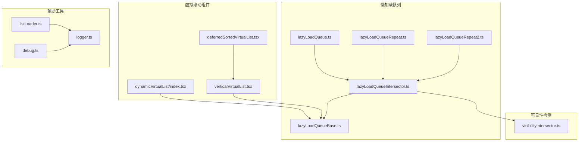
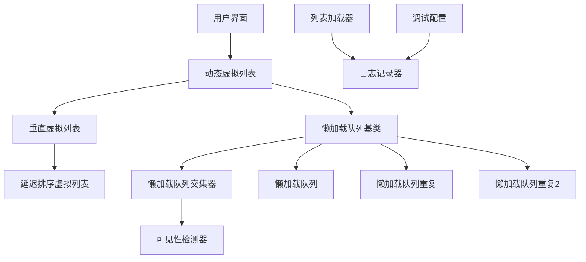
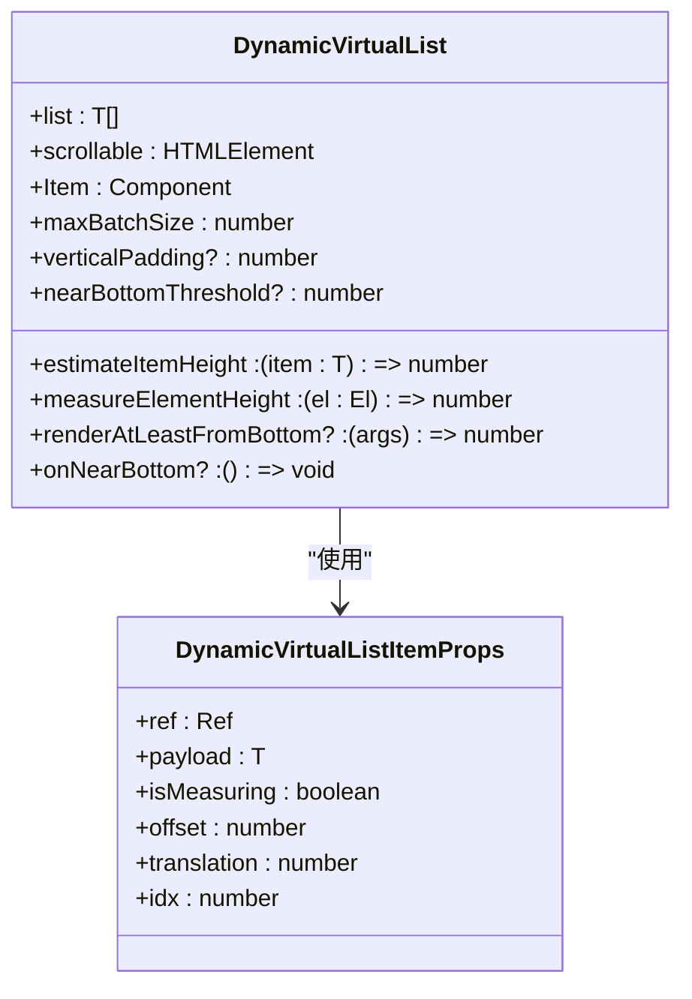
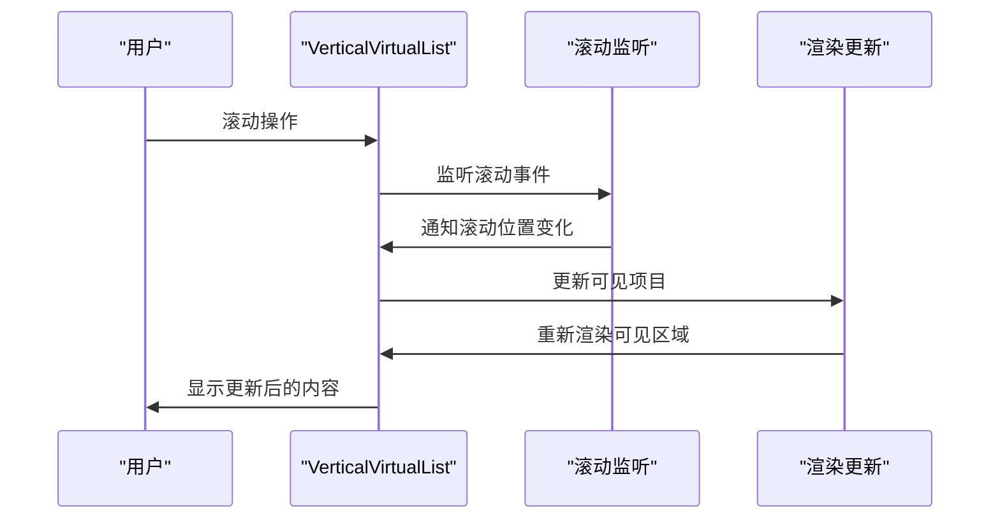
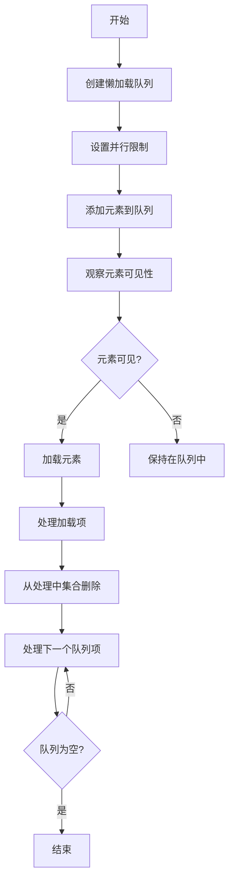
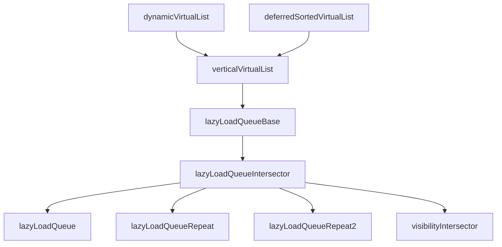

# 虚拟滚动性能优化

<cite>
**本文档引用的文件**   
- [dynamicVirtualList/index.tsx](file://src/components/dynamicVirtualList/index.tsx)
- [verticalVirtualList.tsx](file://src/components/verticalVirtualList.tsx)
- [deferredSortedVirtualList.tsx](file://src/components/deferredSortedVirtualList.tsx)
- [lazyLoadQueueBase.ts](file://src/components/lazyLoadQueueBase.ts)
- [lazyLoadQueueIntersector.ts](file://src/components/lazyLoadQueueIntersector.ts)
- [lazyLoadQueue.ts](file://src/components/lazyLoadQueue.ts)
- [lazyLoadQueueRepeat.ts](file://src/components/lazyLoadQueueRepeat.ts)
- [lazyLoadQueueRepeat2.ts](file://src/components/lazyLoadQueueRepeat2.ts)
- [visibilityIntersector.ts](file://src/components/visibilityIntersector.ts)
- [listLoader.ts](file://src/helpers/listLoader.ts)
- [logger.ts](file://src/lib/logger.ts)
- [debug.ts](file://src/config/debug.ts)
</cite>

## 目录
1. [引言](#引言)
2. [项目结构](#项目结构)
3. [核心组件](#核心组件)
4. [架构概述](#架构概述)
5. [详细组件分析](#详细组件分析)
6. [依赖分析](#依赖分析)
7. [性能考虑](#性能考虑)
8. [故障排除指南](#故障排除指南)
9. [结论](#结论)

## 引言
本文档深入分析了动态虚拟列表的性能优化机制，重点关注渲染频率、内存占用和滚动流畅度等性能瓶颈。文档详细说明了懒加载队列的实现机制，包括延迟加载和预加载策略如何优化性能。同时，描述了元素复用池的设计原理和内存管理策略，提供了性能监控指标和调试工具的使用方法。最后，记录了在不同设备（尤其是低端设备）上的性能调优方案，包括帧率优化、内存泄漏预防和垃圾回收策略。

## 项目结构
项目中的虚拟滚动和性能优化功能主要分布在`src/components`目录下的多个组件中。核心的虚拟滚动实现位于`dynamicVirtualList`和`verticalVirtualList`组件中，而懒加载和队列管理功能则分布在`lazyLoadQueue`系列组件中。性能监控和调试工具则通过`logger`和`debug`配置文件实现。

**图源**
- [dynamicVirtualList/index.tsx](file://src/components/dynamicVirtualList/index.tsx)
- [verticalVirtualList.tsx](file://src/components/verticalVirtualList.tsx)
- [deferredSortedVirtualList.tsx](file://src/components/deferredSortedVirtualList.tsx)
- [lazyLoadQueueBase.ts](file://src/components/lazyLoadQueueBase.ts)
- [lazyLoadQueueIntersector.ts](file://src/components/lazyLoadQueueIntersector.ts)
- [lazyLoadQueue.ts](file://src/components/lazyLoadQueue.ts)
- [lazyLoadQueueRepeat.ts](file://src/components/lazyLoadQueueRepeat.ts)
- [lazyLoadQueueRepeat2.ts](file://src/components/lazyLoadQueueRepeat2.ts)
- [visibilityIntersector.ts](file://src/components/visibilityIntersector.ts)
- [listLoader.ts](file://src/helpers/listLoader.ts)
- [logger.ts](file://src/lib/logger.ts)
- [debug.ts](file://src/config/debug.ts)

**节源**
- [dynamicVirtualList/index.tsx](file://src/components/dynamicVirtualList/index.tsx)
- [verticalVirtualList.tsx](file://src/components/verticalVirtualList.tsx)
- [deferredSortedVirtualList.tsx](file://src/components/deferredSortedVirtualList.tsx)
- [lazyLoadQueueBase.ts](file://src/components/lazyLoadQueueBase.ts)
- [lazyLoadQueueIntersector.ts](file://src/components/lazyLoadQueueIntersector.ts)
- [lazyLoadQueue.ts](file://src/components/lazyLoadQueue.ts)
- [lazyLoadQueueRepeat.ts](file://src/components/lazyLoadQueueRepeat.ts)
- [lazyLoadQueueRepeat2.ts](file://src/components/lazyLoadQueueRepeat2.ts)
- [visibilityIntersector.ts](file://src/components/visibilityIntersector.ts)
- [listLoader.ts](file://src/helpers/listLoader.ts)
- [logger.ts](file://src/lib/logger.ts)
- [debug.ts](file://src/config/debug.ts)

## 核心组件
核心组件包括动态虚拟列表（DynamicVirtualList）、垂直虚拟列表（VerticalVirtualList）和延迟排序虚拟列表（DeferredSortedVirtualList）。这些组件通过懒加载队列和可见性检测机制协同工作，实现高效的虚拟滚动性能。

**节源**
- [dynamicVirtualList/index.tsx](file://src/components/dynamicVirtualList/index.tsx)
- [verticalVirtualList.tsx](file://src/components/verticalVirtualList.tsx)
- [deferredSortedVirtualList.tsx](file://src/components/deferredSortedVirtualList.tsx)

## 架构概述
系统架构基于SolidJS响应式框架，采用虚拟滚动技术来优化大量数据的渲染性能。通过懒加载队列和可见性检测器，系统能够智能地加载和卸载可见区域内的元素，从而减少内存占用和提高渲染效率。

**图源**
- [dynamicVirtualList/index.tsx](file://src/components/dynamicVirtualList/index.tsx)
- [verticalVirtualList.tsx](file://src/components/verticalVirtualList.tsx)
- [deferredSortedVirtualList.tsx](file://src/components/deferredSortedVirtualList.tsx)
- [lazyLoadQueueBase.ts](file://src/components/lazyLoadQueueBase.ts)
- [lazyLoadQueueIntersector.ts](file://src/components/lazyLoadQueueIntersector.ts)
- [lazyLoadQueue.ts](file://src/components/lazyLoadQueue.ts)
- [lazyLoadQueueRepeat.ts](file://src/components/lazyLoadQueueRepeat.ts)
- [lazyLoadQueueRepeat2.ts](file://src/components/lazyLoadQueueRepeat2.ts)
- [visibilityIntersector.ts](file://src/components/visibilityIntersector.ts)
- [listLoader.ts](file://src/helpers/listLoader.ts)
- [logger.ts](file://src/lib/logger.ts)
- [debug.ts](file://src/config/debug.ts)

## 详细组件分析

### 动态虚拟列表分析
动态虚拟列表组件实现了基于可见性的动态渲染，通过精确计算元素高度和位置，确保只有可见区域内的元素被渲染，从而优化性能。

#### 对于对象导向组件：

**图源**
- [dynamicVirtualList/index.tsx](file://src/components/dynamicVirtualList/index.tsx)

**节源**
- [dynamicVirtualList/index.tsx](file://src/components/dynamicVirtualList/index.tsx)

### 垂直虚拟列表分析
垂直虚拟列表组件提供了基础的虚拟滚动功能，通过固定高度的项目实现高效的滚动性能。

#### 对于API/服务组件：

**图源**
- [verticalVirtualList.tsx](file://src/components/verticalVirtualList.tsx)

**节源**
- [verticalVirtualList.tsx](file://src/components/verticalVirtualList.tsx)

### 懒加载队列分析
懒加载队列组件实现了基于可见性的资源加载机制，通过并行限制和队列管理优化资源加载性能。

#### 对于复杂逻辑组件：

**图源**
- [lazyLoadQueueBase.ts](file://src/components/lazyLoadQueueBase.ts)
- [lazyLoadQueueIntersector.ts](file://src/components/lazyLoadQueueIntersector.ts)

**节源**
- [lazyLoadQueueBase.ts](file://src/components/lazyLoadQueueBase.ts)
- [lazyLoadQueueIntersector.ts](file://src/components/lazyLoadQueueIntersector.ts)

## 依赖分析
系统组件之间存在明确的依赖关系，从基础的懒加载队列基类到具体的实现类，再到虚拟列表组件，形成了清晰的层次结构。

**图源**
- [lazyLoadQueueBase.ts](file://src/components/lazyLoadQueueBase.ts)
- [lazyLoadQueueIntersector.ts](file://src/components/lazyLoadQueueIntersector.ts)
- [lazyLoadQueue.ts](file://src/components/lazyLoadQueue.ts)
- [lazyLoadQueueRepeat.ts](file://src/components/lazyLoadQueueRepeat.ts)
- [lazyLoadQueueRepeat2.ts](file://src/components/lazyLoadQueueRepeat2.ts)
- [visibilityIntersector.ts](file://src/components/visibilityIntersector.ts)
- [verticalVirtualList.tsx](file://src/components/verticalVirtualList.tsx)
- [dynamicVirtualList/index.tsx](file://src/components/dynamicVirtualList/index.tsx)
- [deferredSortedVirtualList.tsx](file://src/components/deferredSortedVirtualList.tsx)

**节源**
- [lazyLoadQueueBase.ts](file://src/components/lazyLoadQueueBase.ts)
- [lazyLoadQueueIntersector.ts](file://src/components/lazyLoadQueueIntersector.ts)
- [lazyLoadQueue.ts](file://src/components/lazyLoadQueue.ts)
- [lazyLoadQueueRepeat.ts](file://src/components/lazyLoadQueueRepeat.ts)
- [lazyLoadQueueRepeat2.ts](file://src/components/lazyLoadQueueRepeat2.ts)
- [visibilityIntersector.ts](file://src/components/visibilityIntersector.ts)
- [verticalVirtualList.tsx](file://src/components/verticalVirtualList.tsx)
- [dynamicVirtualList/index.tsx](file://src/components/dynamicVirtualList/index.tsx)
- [deferredSortedVirtualList.tsx](file://src/components/deferredSortedVirtualList.tsx)

## 性能考虑
系统通过多种机制优化性能，包括：
- 使用`requestAnimationFrame`进行动画帧控制
- 通过`throttle`函数限制处理频率
- 实现并行加载限制防止资源过载
- 使用可见性检测器避免不必要的渲染
- 通过元素复用减少DOM操作

这些优化措施共同确保了在各种设备上都能提供流畅的用户体验，特别是在低端设备上表现良好。

## 故障排除指南
当遇到性能问题时，可以使用以下方法进行诊断：
1. 启用调试模式查看详细的日志输出
2. 使用浏览器开发者工具分析渲染性能
3. 检查懒加载队列的状态和处理情况
4. 监控内存使用情况，防止内存泄漏
5. 调整并行加载限制以适应不同设备的性能

**节源**
- [logger.ts](file://src/lib/logger.ts)
- [debug.ts](file://src/config/debug.ts)

## 结论
本文档详细分析了虚拟滚动性能优化的各个方面，从核心组件到架构设计，再到具体的实现细节。通过懒加载队列、可见性检测和元素复用等技术，系统实现了高效的虚拟滚动性能。在不同设备上，特别是低端设备上，这些优化措施能够显著提升用户体验，确保应用的流畅运行。