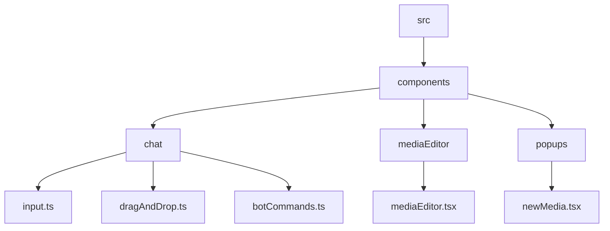
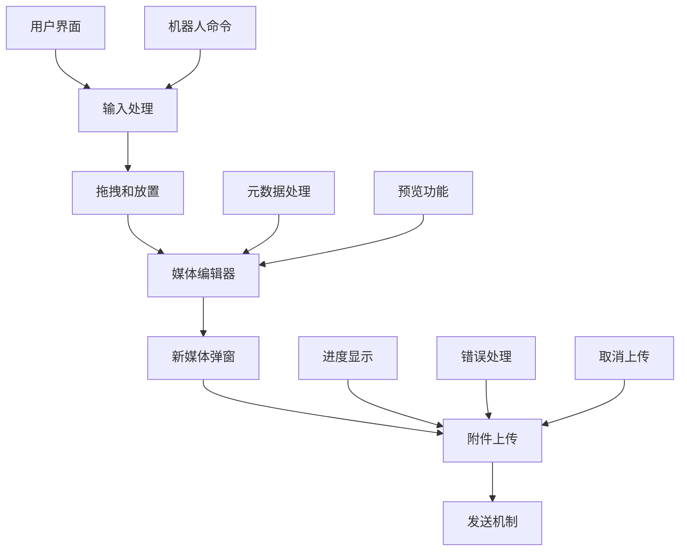
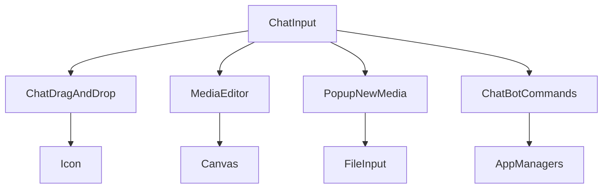

# 媒体附件

<cite>
**本文档中引用的文件**  
- [input.ts](file://src/components/chat/input.ts)
- [dragAndDrop.ts](file://src/components/chat/dragAndDrop.ts)
- [mediaEditor.tsx](file://src/components/mediaEditor/mediaEditor.tsx)
- [newMedia.tsx](file://src/components/popups/newMedia.tsx)
- [botCommands.ts](file://src/components/chat/botCommands.ts)
</cite>

## 目录
1. [介绍](#介绍)
2. [项目结构](#项目结构)
3. [核心组件](#核心组件)
4. [架构概述](#架构概述)
5. [详细组件分析](#详细组件分析)
6. [依赖分析](#依赖分析)
7. [性能考虑](#性能考虑)
8. [故障排除指南](#故障排除指南)
9. [结论](#结论)

## 介绍
本文档详细说明了Telegram Web客户端中媒体附件处理功能的实现。涵盖了从本地选择文件或拖拽文件到输入区域的完整流程，媒体预览功能的实现，附件元数据的收集和处理，附件上传和发送机制，与机器人命令的集成，以及大文件处理的最佳实践和性能优化建议。

## 项目结构
项目结构显示了媒体附件处理功能分布在多个组件和模块中。主要功能集中在`src/components/chat`和`src/components/mediaEditor`目录下。



**Diagram sources**
- [input.ts](file://src/components/chat/input.ts)
- [dragAndDrop.ts](file://src/components/chat/dragAndDrop.ts)
- [mediaEditor.tsx](file://src/components/mediaEditor/mediaEditor.tsx)
- [newMedia.tsx](file://src/components/popups/newMedia.tsx)
- [botCommands.ts](file://src/components/chat/botCommands.ts)

**Section sources**
- [input.ts](file://src/components/chat/input.ts)
- [dragAndDrop.ts](file://src/components/chat/dragAndDrop.ts)

## 核心组件
核心组件包括输入处理、拖拽和放置功能、媒体编辑器、新媒体弹窗和机器人命令处理。

**Section sources**
- [input.ts](file://src/components/chat/input.ts)
- [dragAndDrop.ts](file://src/components/chat/dragAndDrop.ts)
- [mediaEditor.tsx](file://src/components/mediaEditor/mediaEditor.tsx)
- [newMedia.tsx](file://src/components/popups/newMedia.tsx)
- [botCommands.ts](file://src/components/chat/botCommands.ts)

## 架构概述
系统架构展示了媒体附件处理功能的各个组件如何协同工作。



**Diagram sources**
- [input.ts](file://src/components/chat/input.ts)
- [dragAndDrop.ts](file://src/components/chat/dragAndDrop.ts)
- [mediaEditor.tsx](file://src/components/mediaEditor/mediaEditor.tsx)
- [newMedia.tsx](file://src/components/popups/newMedia.tsx)

## 详细组件分析

### 输入处理分析
输入处理组件负责处理用户输入和附件选择。

```mermaid
classDiagram
class ChatInput {
+messageInput : HTMLElement
+messageInputField : InputFieldAnimated
+fileInput : HTMLInputElement
+inputMessageContainer : HTMLDivElement
+btnSend : HTMLButtonElement
+btnCancelRecord : HTMLButtonElement
+btnReaction : HTMLButtonElement
+lastUrl : string
+lastTimeType : number
+noRipple : boolean
+chatInput : HTMLElement
+inputContainer : HTMLElement
+rowsWrapper : HTMLDivElement
+newMessageWrapper : HTMLDivElement
+btnToggleEmoticons : HTMLButtonElement
+btnToggleReplyMarkup : HTMLButtonElement
+btnSendContainer : HTMLDivElement
+replyKeyboard : ReplyKeyboard
+attachMenu : HTMLElement
+attachMenuButtons : ButtonMenuItemOptionsVerifiable[]
+btnSuggestPost : HTMLElement
+sendMenu : SendMenu
+replyElements : {container : HTMLElement, cancelBtn : HTMLButtonElement, iconBtn : HTMLButtonElement, menuContainer : HTMLElement, replyInAnother : ButtonMenuItemOptions, doNotReply : ButtonMenuItemOptions, doNotQuote : ButtonMenuItemOptions}
+forwardElements : {changePeer : ButtonMenuItemOptions, showSender : ButtonMenuItemOptions, hideSender : ButtonMenuItemOptions, showCaption : ButtonMenuItemOptions, hideCaption : ButtonMenuItemOptions, container : HTMLElement, modifyArgs? : ButtonMenuItemOptions[]}
+webPageElements : {above : ButtonMenuItemOptions, below : ButtonMenuItemOptions, larger : ButtonMenuItemOptions, smaller : ButtonMenuItemOptions, container : HTMLElement}
+forwardHover : DropdownHover
+webPageHover : DropdownHover
+replyHover : DropdownHover
+currentHover : DropdownHover
+forwardWasDroppingAuthor : boolean
+getWebPagePromise : Promise<void>
+willSendWebPage : WebPage
+webPageOptions : Parameters<AppMessagesManager['sendText']>[0]['webPageOptions']
+forwarding : {[fromPeerId : PeerId] : number[]}
+replyToMsgId : MessageSendingParams['replyToMsgId']
+replyToStoryId : MessageSendingParams['replyToStoryId']
+replyToQuote : MessageSendingParams['replyToQuote']
+replyToPeerId : MessageSendingParams['replyToPeerId']
+replyToMonoforumPeerId : MessageSendingParams['replyToMonoforumPeerId']
+editMsgId : number
+editMessage : Message.message
+noWebPage : true
+scheduleDate : number
+sendSilent : true
+startParam : string
+invertMedia : boolean
+effect : Accessor<DocId>
+setEffect : Setter<DocId>
+recorder : any
+recording : boolean
+recordCanceled : boolean
+recordTimeEl : HTMLElement
+recordRippleEl : HTMLElement
+recordStartTime : number
+recordingOverlayListener : Listener
+recordingNavigationItem : NavigationItem
+helperType : Exclude<ChatInputHelperType, 'webpage'>
+helperFunc : () => void | Promise<void>
+helperWaitingForward : boolean
+helperWaitingReply : boolean
+willAttachType : 'document' | 'media'
+autocompleteHelperController : AutocompleteHelperController
+stickersHelper : StickersHelper
+emojiHelper : EmojiHelper
+commandsHelper : CommandsHelper
+mentionsHelper : MentionsHelper
+inlineHelper : InlineHelper
+listenerSetter : ListenerSetter
+hoverListenerSetter : ListenerSetter
+pinnedControlBtn : HTMLButtonElement
+openChatBtn : HTMLButtonElement
+goDownBtn : HTMLButtonElement
+goDownUnreadBadge : HTMLElement
+goMentionBtn : HTMLButtonElement
+goMentionUnreadBadge : HTMLSpanElement
+goReactionBtn : HTMLButtonElement
+goReactionUnreadBadge : HTMLElement
+btnScheduled : HTMLButtonElement
+btnPreloader : HTMLButtonElement
+saveDraftDebounced : () => void
+fakeRowsWrapper : HTMLDivElement
+previousQuery : string
+releaseMediaPlayback : () => void
+botStartBtn : HTMLButtonElement
+unblockBtn : HTMLButtonElement
+onlyPremiumBtn : HTMLButtonElement
+onlyPremiumBtnText : I18n.IntlElement
+frozenBtn : HTMLButtonElement
+joinBtn : HTMLButtonElement
+rowsWrapperWrapper : HTMLDivElement
+controlContainer : HTMLElement
+fakeSelectionWrapper : HTMLDivElement
+starsBadge : HTMLElement
+starsBadgeStars : HTMLElement
+fakeWrapperTo : HTMLElement
+toggleControlButtonDisability : () => void
+botCommandsToggle : HTMLElement
+botCommands : ChatBotCommands
+botCommandsIcon : HTMLElement
+botCommandsView : HTMLElement
+botMenuButton : BotMenuButton.botMenuButton
+hasBotCommands : boolean
+sendAs : ChatSendAs
+sendAsPeerId : PeerId
+replyInTopicOverlay : HTMLDivElement
+restoreInputLock : () => void
+isFocused : boolean
+freezedFocused : boolean
+onFocusChange : (isFocused : boolean) => void
+onMenuToggle : (isOpen : boolean) => void
+onRecording : (isRecording : boolean) => void
+onUpdateSendBtn : (icon : ChatSendBtnIcon) => void
+onMessageSent2 : () => void
+forwardStoryCallback : (e : MouseEvent) => void
+emoticonsDropdown : EmoticonsDropdown
+excludeParts : Partial<{scheduled : boolean, replyMarkup : boolean, downButton : boolean, reply : boolean, forwardOptions : boolean, mentionButton : boolean, botCommands : boolean, attachMenu : boolean, commandsHelper : boolean, emoticons : boolean}>
+globalMentions : boolean
+onFileSelection : (promise : Promise<File[]>) => void
+hasOffset : {type : 'commands' | 'as', forwards : boolean}
+canForwardStory : boolean
+processingDraftMessage : DraftMessage.draftMessage
+fileSelectionPromise : CancellablePromise<File[]>
+paidMessageInterceptor : PaidMessagesInterceptor
+starsState : ReturnType<ChatInput['createStarsState']>
+directMessagesHandler : ReturnType<ChatInput['createDirectMessagesHandler']>
+suggestedPost : SuggestedPostPayload
+constructor(chat : Chat, appImManager : AppImManager, managers : AppManagers, className : string)
+freezeFocused(focused : boolean)
+createButtonIcon(...args : Parameters<typeof ButtonIcon>)
+construct()
+constructGoDownButton()
+constructReplyElements()
+constructForwardElements()
+constructWebPageElements()
+constructMentionButton(isReaction? : boolean)
+constructScheduledButton()
+constructReplyMarkup()
+destroy()
+onHelperCancel()
+onHelperClick()
+changeReplyRecipient()
+changeForwardRecipient()
+canToggleHideAuthor()
+getMiddleware()
+updateSendBtn()
+onMessageSent()
+onMessageSent2()
+onRecording()
+onUpdateSendBtn()
+onFocusChange()
+onMenuToggle()
+onFileSelection()
+createStarsState()
+createDirectMessagesHandler()
}
```

**Diagram sources**
- [input.ts](file://src/components/chat/input.ts)

**Section sources**
- [input.ts](file://src/components/chat/input.ts)

### 拖拽和放置分析
拖拽和放置组件负责处理用户拖拽文件到输入区域的功能。

```mermaid
classDiagram
class ChatDragAndDrop {
+container : HTMLDivElement
+svg : SVGSVGElement
+outlineWrapper : HTMLDivElement
+path : SVGPathElement
+constructor(appendTo : HTMLElement, options : {icon? : Icon, header : LangPackKey, headerArgs? : FormatterArguments, subtitle? : LangPackKey, onDrop : (e : DragEvent) => void})
+onDragOver(e : DragEvent)
+onDragLeave(e : DragEvent)
+onDrop(e : DragEvent)
+destroy()
+setPath()
}
```

**Diagram sources**
- [dragAndDrop.ts](file://src/components/chat/dragAndDrop.ts)

**Section sources**
- [dragAndDrop.ts](file://src/components/chat/dragAndDrop.ts)

### 媒体编辑器分析
媒体编辑器组件负责处理媒体文件的编辑和预览。

```mermaid
classDiagram
class MediaEditor {
+canvas : HTMLCanvasElement
+context : CanvasRenderingContext2D
+image : HTMLImageElement
+video : HTMLVideoElement
+audio : HTMLAudioElement
+constructor(appendTo : HTMLElement, options : {onSave : (blob : Blob) => void, onCancel : () => void})
+loadImage(file : File)
+loadVideo(file : File)
+loadAudio(file : File)
+save()
+cancel()
+destroy()
}
```

**Diagram sources**
- [mediaEditor.tsx](file://src/components/mediaEditor/mediaEditor.tsx)

**Section sources**
- [mediaEditor.tsx](file://src/components/mediaEditor/mediaEditor.tsx)

### 新媒体弹窗分析
新媒体弹窗组件负责处理用户选择和上传新附件的功能。

```mermaid
classDiagram
class PopupNewMedia {
+container : HTMLElement
+fileInput : HTMLInputElement
+constructor(appendTo : HTMLElement, options : {onSelect : (files : File[]) => void, onCancel : () => void})
+show()
+hide()
+destroy()
}
```

**Diagram sources**
- [newMedia.tsx](file://src/components/popups/newMedia.tsx)

**Section sources**
- [newMedia.tsx](file://src/components/popups/newMedia.tsx)

### 机器人命令分析
机器人命令组件负责处理与机器人命令的集成。

```mermaid
classDiagram
class ChatBotCommands {
+userId : UserId
+constructor(appendTo : HTMLElement, chatInput : ChatInput, managers : AppManagers)
+setUserId(userId : UserId, middleware : Middleware)
+toggle(open? : boolean)
+render(commands : {command : string, description : string}[], middleware : Middleware)
}
```

**Diagram sources**
- [botCommands.ts](file://src/components/chat/botCommands.ts)

**Section sources**
- [botCommands.ts](file://src/components/chat/botCommands.ts)

## 依赖分析
依赖分析展示了各个组件之间的依赖关系。



**Diagram sources**
- [input.ts](file://src/components/chat/input.ts)
- [dragAndDrop.ts](file://src/components/chat/dragAndDrop.ts)
- [mediaEditor.tsx](file://src/components/mediaEditor/mediaEditor.tsx)
- [newMedia.tsx](file://src/components/popups/newMedia.tsx)
- [botCommands.ts](file://src/components/chat/botCommands.ts)

**Section sources**
- [input.ts](file://src/components/chat/input.ts)
- [dragAndDrop.ts](file://src/components/chat/dragAndDrop.ts)
- [mediaEditor.tsx](file://src/components/mediaEditor/mediaEditor.tsx)
- [newMedia.tsx](file://src/components/popups/newMedia.tsx)
- [botCommands.ts](file://src/components/chat/botCommands.ts)

## 性能考虑
在处理大文件时，应考虑以下性能优化建议：
- 使用流式上传以减少内存占用
- 在上传过程中显示进度条以提高用户体验
- 实现断点续传功能以应对网络中断
- 对大文件进行分块处理以提高上传效率
- 使用Web Workers进行后台处理以避免阻塞UI线程

## 故障排除指南
常见问题及解决方案：
- **文件无法上传**：检查网络连接，确保服务器正常运行
- **预览无法显示**：确保文件格式受支持，检查媒体编辑器是否正确初始化
- **上传进度不更新**：检查进度事件监听器是否正确设置
- **大文件上传失败**：尝试分块上传或使用流式上传
- **机器人命令无法执行**：检查机器人是否在线，确保命令格式正确

**Section sources**
- [input.ts](file://src/components/chat/input.ts)
- [dragAndDrop.ts](file://src/components/chat/dragAndDrop.ts)
- [mediaEditor.tsx](file://src/components/mediaEditor/mediaEditor.tsx)
- [newMedia.tsx](file://src/components/popups/newMedia.tsx)
- [botCommands.ts](file://src/components/chat/botCommands.ts)

## 结论
本文档详细介绍了Telegram Web客户端中媒体附件处理功能的实现。通过分析核心组件、架构、依赖关系和性能考虑，为开发人员提供了全面的指导。建议在实际开发中遵循最佳实践，确保功能的稳定性和用户体验。