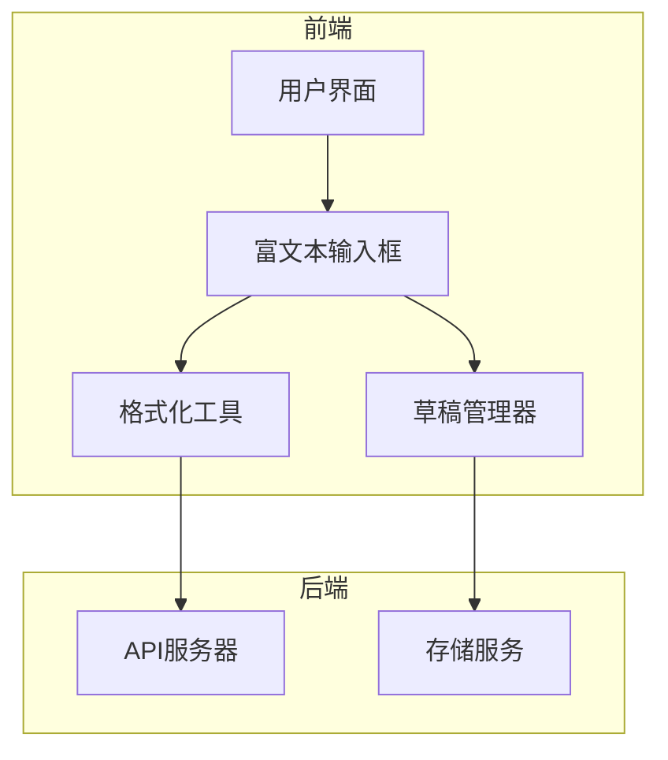
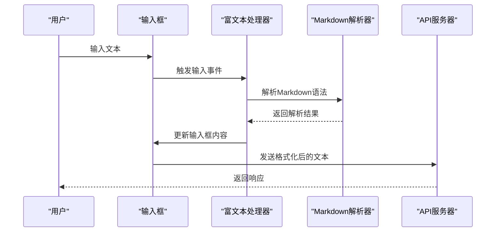
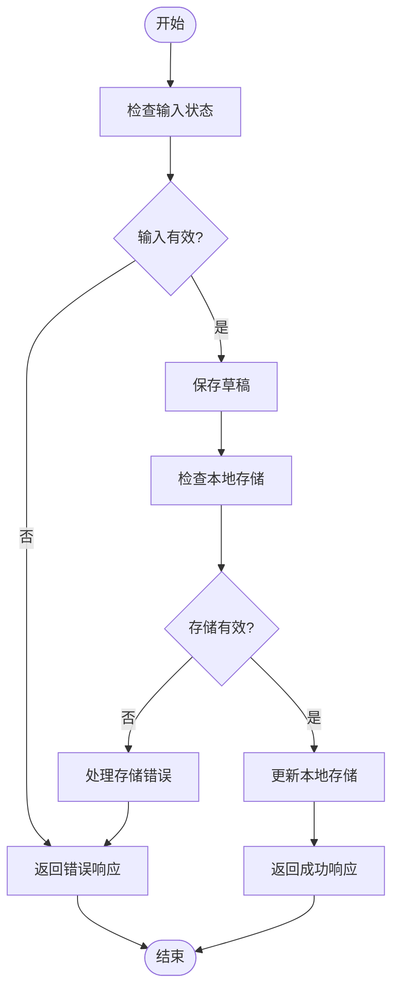
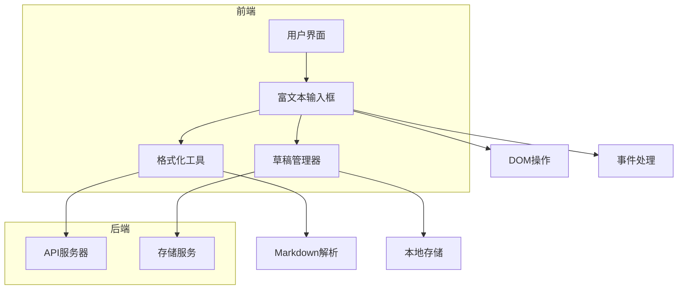

# 文本输入

<cite>
**本文档引用的文件**   
- [input.ts](file://src/components/chat/input.ts)
- [richInputHandler.ts](file://src/helpers/dom/richInputHandler.ts)
- [inputField.ts](file://src/components/inputField.ts)
- [parseMarkdown.ts](file://src/lib/richTextProcessor/parseMarkdown.ts)
- [parseEntities.ts](file://src/lib/richTextProcessor/parseEntities.ts)
- [appDraftsManager.ts](file://src/lib/appManagers/appDraftsManager.ts)
</cite>

## 目录
1. [简介](#简介)
2. [项目结构](#项目结构)
3. [核心组件](#核心组件)
4. [架构概述](#架构概述)
5. [详细组件分析](#详细组件分析)
6. [依赖分析](#依赖分析)
7. [性能考虑](#性能考虑)
8. [故障排除指南](#故障排除指南)
9. [结论](#结论)

## 简介
本文档详细介绍了Telegram Web客户端中富文本输入框的实现机制。文档深入探讨了内容编辑、格式化和渲染流程，描述了支持的文本格式类型（如粗体、斜体、代码块、引用等）及其对应的Markdown语法实现。同时，文档还说明了输入内容的解析和处理过程，从用户输入到消息发送的完整链条。此外，文档记录了草稿保存和恢复机制，确保用户在切换聊天或刷新页面后能恢复未发送的内容。最后，文档提供了输入性能优化策略，包括事件处理优化、DOM操作最小化和内存管理，以确保在大量内容下的流畅输入体验。

## 项目结构
项目结构清晰地组织了各个功能模块，主要分为以下几个部分：
- `handlebarsHelpers`：包含Handlebars模板辅助函数。
- `public`：包含静态资源文件，如图片、CSS、JavaScript等。
- `snapshot-server`：快照服务器相关文件。
- `src`：源代码目录，包含组件、配置、环境、帮助函数、钩子、库、模拟数据、页面、脚本、SCSS、存储、测试等子目录。

**Section sources**
- [src/components/chat/input.ts](file://src/components/chat/input.ts#L1-L4468)
- [src/helpers/dom/richInputHandler.ts](file://src/helpers/dom/richInputHandler.ts#L1-L902)

## 核心组件
文本输入功能的核心组件包括富文本输入框、格式化工具、草稿管理器等。这些组件协同工作，提供了一个高效、用户友好的输入体验。

**Section sources**
- [src/components/chat/input.ts](file://src/components/chat/input.ts#L1-L4468)
- [src/components/inputField.ts](file://src/components/inputField.ts#L1-L803)

## 架构概述
文本输入功能的架构设计旨在提供一个灵活、可扩展的解决方案。主要组件包括：
- **富文本输入框**：支持多种文本格式和富文本编辑。
- **格式化工具**：支持Markdown语法，允许用户快速格式化文本。
- **草稿管理器**：自动保存和恢复用户输入的草稿，确保数据不丢失。



**Diagram sources **
- [src/components/chat/input.ts](file://src/components/chat/input.ts#L1-L4468)
- [src/components/inputField.ts](file://src/components/inputField.ts#L1-L803)

## 详细组件分析

### 富文本输入框分析
富文本输入框是文本输入功能的核心，支持多种文本格式和富文本编辑。它通过`contenteditable`属性实现，允许用户直接在HTML元素中编辑内容。

#### 对象导向组件
```mermaid
classDiagram
class RichInputHandler {
+input : HTMLElement
+lastNode : Node
+lastOffset : number
+savedRanges : WeakMap<HTMLElement, Range>
+log : ReturnType<typeof logger>
+inputCaptureCallbacks : Function[]
+constructor()
+get input() : HTMLElement
+saveRangeForElement(element : HTMLElement) : void
+saveSelectionOnChange(e : Event) : void
+onFocusOut(e : FocusEvent) : void
+findPreviousSmthIndex(input : HTMLElement, node : ChildNode, something? : NodeListOf<Element>) : number
+superMove(input : HTMLElement, caret : ReturnType<RichInputHandler['getCaretPosN']>, toLeft : boolean, fromSelectionChange : boolean) : void
+onSelectionChange(e : Event) : void
+restoreSavedRange(input : HTMLElement) : boolean
+getSavedRange(input : HTMLElement) : Range
+makeFocused(input : HTMLElement) : void
+fixInsertedLineBreaks(input : HTMLElement) : void
+fixBuggedCaret() : void
+onBeforeInput(e : Pick<InputEvent, 'inputType'>) : void
+onKeyDown(e : KeyboardEvent) : void
+addInputCallback(input : HTMLElement, callback : () => void, capture : boolean) : void
+removeExtraBOMs(input : HTMLElement) : void
+getFiller(node : Node) : HTMLElement
+getCaretPosN() : {node : Node, offset : number, selection : Selection, move : (left : boolean) => void}
+removeEmptyTextNodes(input : HTMLElement) : void
+removePossibleBOMSiblings(previousSibling : ChildNode, nextSibling : ChildNode) : void
+removePossibleBOMSiblingsByNode(node : ChildNode) : void
+processEmptiedFillers(input : HTMLElement) : void
+processFilledFillers(input : HTMLElement) : void
+setSelectionClassName(selection : Selection, input? : HTMLElement) : void
+move(selection : Selection, left : boolean) : void
+prepareApplyingMarkdown() : () => void
+static getInstance() : RichInputHandler
}
class InputField {
+container : HTMLElement
+input : HTMLElement
+label : HTMLLabelElement
+placeholder : HTMLElement
+originalValue : string
+required : boolean
+validate : () => boolean
+allowStartingSpace : boolean
+isInputHidden : boolean
+options : InputFieldOptions
+constructor(options : InputFieldOptions)
+select() : void
+setLabel() : void
+get value() : string
+set value(value : Parameters<typeof replaceContent>[1])
+simulateInputEvent() : void
+setValueSilently(value : Parameters<typeof replaceContent>[1], fromSet? : boolean) : void
+setEmpty(empty? : boolean) : void
+setHidden(hidden : boolean) : void
+isEmpty() : boolean
+isChanged() : boolean
+isValid() : boolean
+isValidToChange() : boolean
+setDraftValue(value? : string, silent? : boolean) : void
+setOriginalValue(value? : string, silent? : boolean) : void
+setState(state : InputState, label? : LangPackKey, labelOptions? : any[]) : void
+setError(label? : LangPackKey, labelOptions? : any[]) : void
+toggleForceFocus(enabled : boolean) : void
}
RichInputHandler --> InputField : "使用"
```

**Diagram sources **
- [src/helpers/dom/richInputHandler.ts](file://src/helpers/dom/richInputHandler.ts#L1-L902)
- [src/components/inputField.ts](file://src/components/inputField.ts#L1-L803)

### 格式化工具分析
格式化工具支持Markdown语法，允许用户快速格式化文本。它通过解析用户输入的Markdown语法，将其转换为相应的HTML标签。

#### API/服务组件


**Diagram sources **
- [src/components/inputField.ts](file://src/components/inputField.ts#L1-L803)
- [src/lib/richTextProcessor/parseMarkdown.ts](file://src/lib/richTextProcessor/parseMarkdown.ts#L1-L223)

### 草稿管理器分析
草稿管理器负责自动保存和恢复用户输入的草稿，确保数据不丢失。它通过监听用户输入事件，定期将草稿保存到本地存储中。

#### 复杂逻辑组件


**Diagram sources **
- [src/lib/appManagers/appDraftsManager.ts](file://src/lib/appManagers/appDraftsManager.ts#L1-L390)

**Section sources**
- [src/components/chat/input.ts](file://src/components/chat/input.ts#L1-L4468)
- [src/components/inputField.ts](file://src/components/inputField.ts#L1-L803)
- [src/lib/richTextProcessor/parseMarkdown.ts](file://src/lib/richTextProcessor/parseMarkdown.ts#L1-L223)
- [src/lib/richTextProcessor/parseEntities.ts](file://src/lib/richTextProcessor/parseEntities.ts#L1-L129)
- [src/lib/appManagers/appDraftsManager.ts](file://src/lib/appManagers/appDraftsManager.ts#L1-L390)

## 依赖分析
文本输入功能依赖于多个组件和库，包括DOM操作、事件处理、富文本处理等。这些依赖关系确保了功能的完整性和稳定性。



**Diagram sources **
- [src/components/chat/input.ts](file://src/components/chat/input.ts#L1-L4468)
- [src/components/inputField.ts](file://src/components/inputField.ts#L1-L803)
- [src/lib/richTextProcessor/parseMarkdown.ts](file://src/lib/richTextProcessor/parseMarkdown.ts#L1-L223)
- [src/lib/richTextProcessor/parseEntities.ts](file://src/lib/richTextProcessor/parseEntities.ts#L1-L129)
- [src/lib/appManagers/appDraftsManager.ts](file://src/lib/appManagers/appDraftsManager.ts#L1-L390)

**Section sources**
- [src/components/chat/input.ts](file://src/components/chat/input.ts#L1-L4468)
- [src/components/inputField.ts](file://src/components/inputField.ts#L1-L803)
- [src/lib/richTextProcessor/parseMarkdown.ts](file://src/lib/richTextProcessor/parseMarkdown.ts#L1-L223)
- [src/lib/richTextProcessor/parseEntities.ts](file://src/lib/richTextProcessor/parseEntities.ts#L1-L129)
- [src/lib/appManagers/appDraftsManager.ts](file://src/lib/appManagers/appDraftsManager.ts#L1-L390)

## 性能考虑
为了确保在大量内容下的流畅输入体验，文本输入功能采用了多种性能优化策略，包括事件处理优化、DOM操作最小化和内存管理。

### 事件处理优化
- **防抖**：使用`debounce`函数减少频繁的事件触发。
- **节流**：使用`asyncThrottle`函数控制事件处理频率。

### DOM操作最小化
- **批量更新**：尽量减少DOM操作次数，通过批量更新提高性能。
- **虚拟DOM**：使用虚拟DOM技术减少实际DOM操作。

### 内存管理
- **垃圾回收**：及时释放不再使用的对象，避免内存泄漏。
- **缓存机制**：合理使用缓存，减少重复计算。

**Section sources**
- [src/components/chat/input.ts](file://src/components/chat/input.ts#L1-L4468)
- [src/helpers/schedulers/debounce.ts](file://src/helpers/schedulers/debounce.ts)
- [src/helpers/schedulers/asyncThrottle.ts](file://src/helpers/schedulers/asyncThrottle.ts)

## 故障排除指南
### 常见问题
- **输入框无法编辑**：检查`contenteditable`属性是否正确设置。
- **格式化不生效**：确保Markdown语法正确，且解析器正常工作。
- **草稿未保存**：检查本地存储是否可用，确保草稿管理器正确配置。

### 调试工具
- **浏览器开发者工具**：使用浏览器的开发者工具检查DOM结构和事件监听。
- **日志输出**：在关键位置添加日志输出，帮助定位问题。

**Section sources**
- [src/components/chat/input.ts](file://src/components/chat/input.ts#L1-L4468)
- [src/components/inputField.ts](file://src/components/inputField.ts#L1-L803)
- [src/lib/richTextProcessor/parseMarkdown.ts](file://src/lib/richTextProcessor/parseMarkdown.ts#L1-L223)
- [src/lib/richTextProcessor/parseEntities.ts](file://src/lib/richTextProcessor/parseEntities.ts#L1-L129)
- [src/lib/appManagers/appDraftsManager.ts](file://src/lib/appManagers/appDraftsManager.ts#L1-L390)

## 结论
本文档详细介绍了Telegram Web客户端中富文本输入框的实现机制，涵盖了内容编辑、格式化、渲染、草稿管理等多个方面。通过合理的架构设计和性能优化策略，确保了用户在大量内容下的流畅输入体验。希望本文档能为开发者提供有价值的参考。