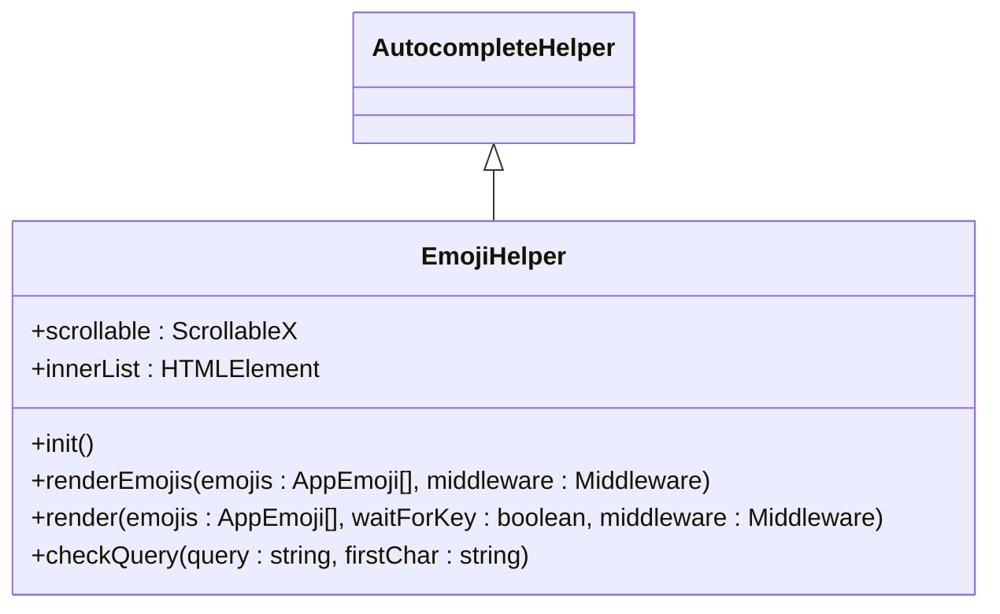
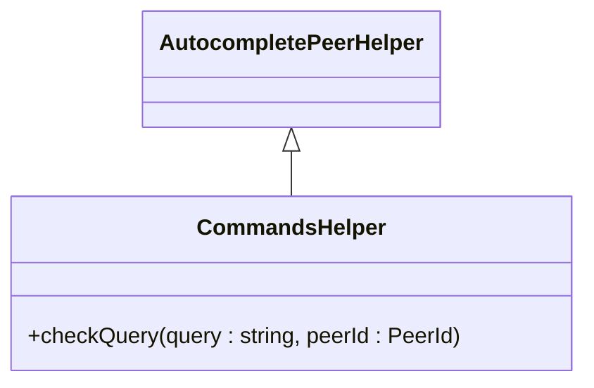
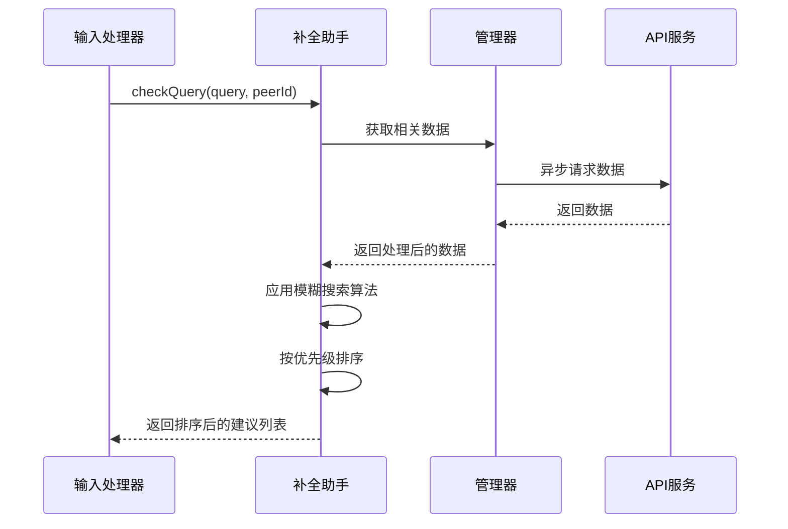
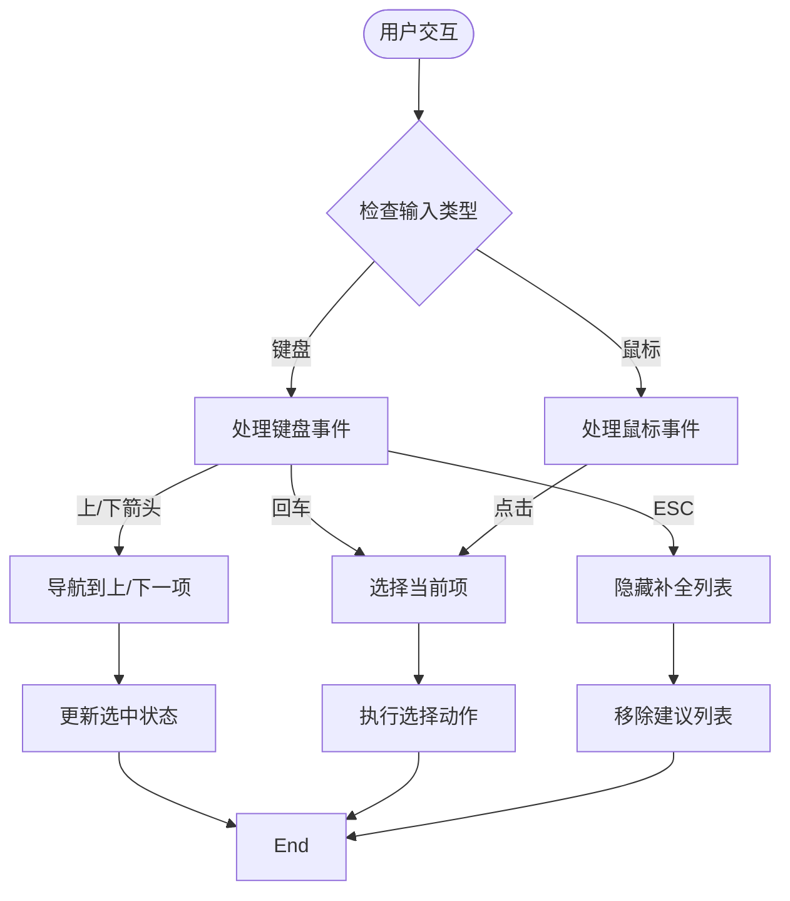
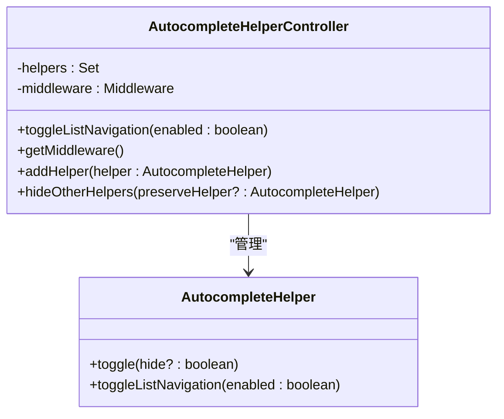
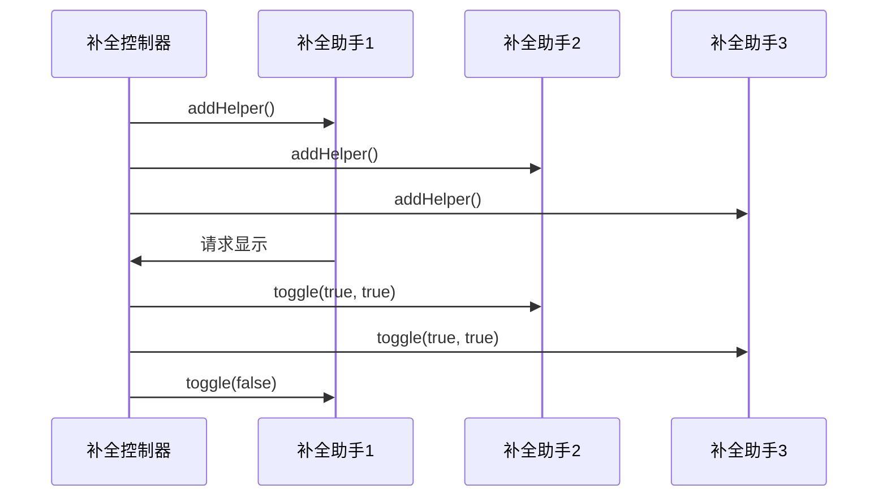
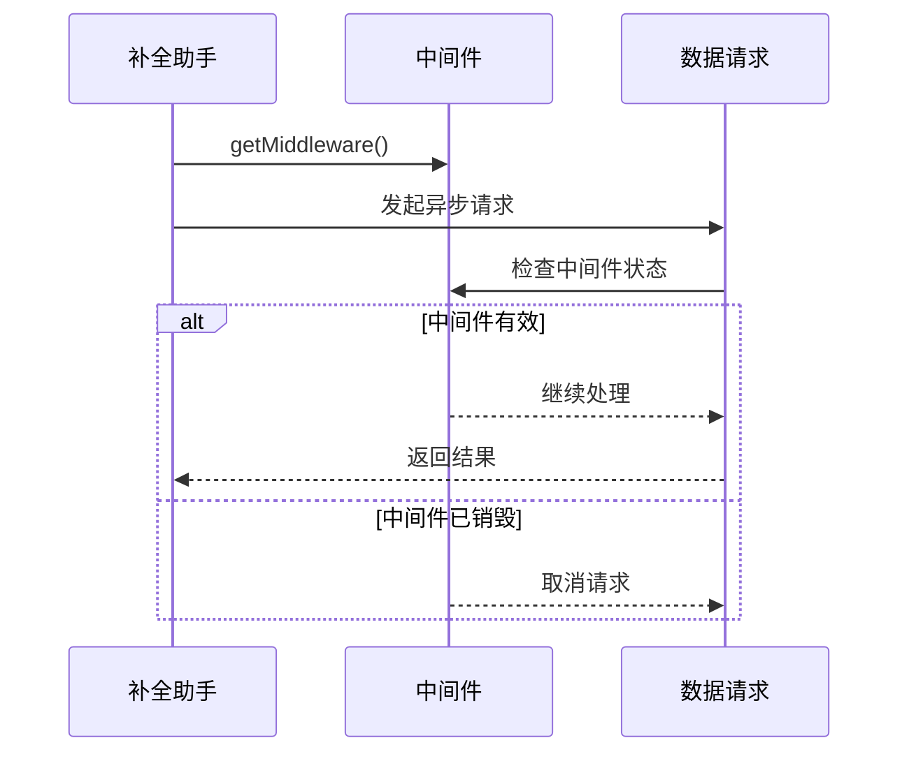
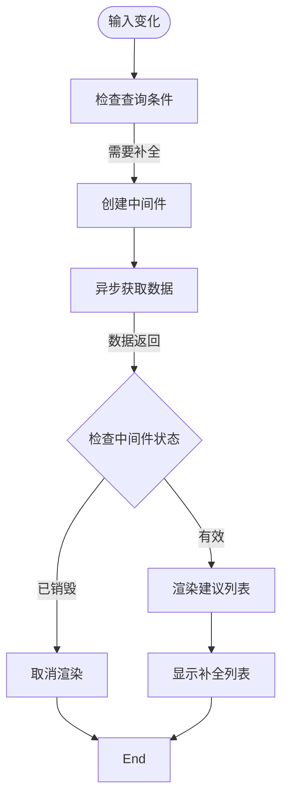
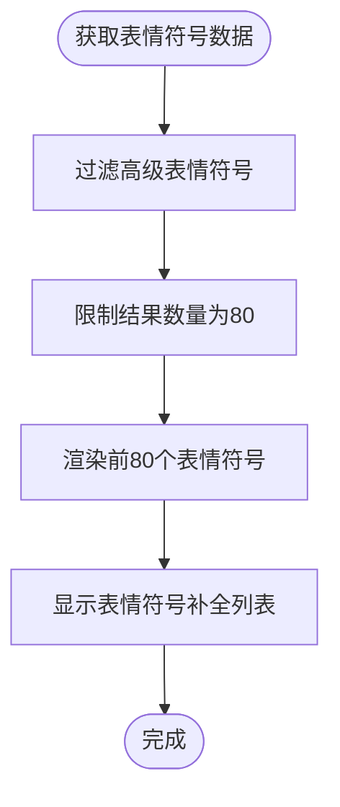

# 自动补全系统

<cite>
**本文档中引用的文件**  
- [autocompleteHelper.ts](file://src/components/chat/autocompleteHelper.ts)
- [autocompleteHelperController.ts](file://src/components/chat/autocompleteHelperController.ts)
- [mentionsHelper.ts](file://src/components/chat/mentionsHelper.ts)
- [emojiHelper.ts](file://src/components/chat/emojiHelper.ts)
- [commandsHelper.ts](file://src/components/chat/commandsHelper.ts)
- [input.ts](file://src/components/chat/input.ts)
- [autocompletePeerHelper.ts](file://src/components/chat/autocompletePeerHelper.ts)
- [inlineHelper.ts](file://src/components/chat/inlineHelper.ts)
</cite>

## 目录
1. [简介](#简介)
2. [核心组件](#核心组件)
3. [补全功能实现机制](#补全功能实现机制)
4. [补全触发与匹配算法](#补全触发与匹配算法)
5. [建议列表渲染与交互](#建议列表渲染与交互)
6. [上下文管理](#上下文管理)
7. [性能优化策略](#性能优化策略)
8. [结论](#结论)

## 简介
本系统为Telegram Web客户端实现了一套完整的自动补全功能，支持用户提及（@补全）、表情符号（:补全）和命令补全（/补全）三种主要功能。系统采用模块化设计，通过统一的补全控制器管理多个补全助手，确保在不同聊天场景下提供相关且高效的补全建议。系统实现了模糊搜索、优先级排序、异步加载和列表虚拟化等高级功能，确保在大型联系人列表下的快速响应。

## 核心组件

自动补全系统由多个核心组件构成，包括补全助手基类、补全控制器、具体补全实现类和输入处理器。这些组件协同工作，提供完整的补全功能。

**Section sources**
- [autocompleteHelper.ts](file://src/components/chat/autocompleteHelper.ts)
- [autocompleteHelperController.ts](file://src/components/chat/autocompleteHelperController.ts)
- [autocompletePeerHelper.ts](file://src/components/chat/autocompletePeerHelper.ts)

## 补全功能实现机制

### 用户提及补全（@补全）
用户提及补全功能通过`MentionsHelper`类实现，该类继承自`AutocompletePeerHelper`。当用户在输入框中输入@符号时，系统会触发提及补全，从当前聊天的成员列表中检索匹配的用户。

```mermaid
classDiagram
class AutocompleteHelper {
+hidden : boolean
+container : HTMLElement
+list : HTMLElement
+toggle(hide? : boolean)
+toggleListNavigation(enabled : boolean)
}
class AutocompletePeerHelper {
+static BASE_CLASS : string
+static BASE_CLASS_LIST_ELEMENT : string
+scrollable : Scrollable
+render(data : {peerId : PeerId, name? : string, description? : string}[], middleware : Middleware)
+static listElement(options : {className : string, peerId : PeerId, name? : string, description? : string, middleware : Middleware})
}
class MentionsHelper {
+checkQuery(query : string, peerId : PeerId, topMsgId : number, global? : boolean)
}
AutocompleteHelper <|-- AutocompletePeerHelper
AutocompletePeerHelper <|-- MentionsHelper
```

**Diagram sources**
- [autocompleteHelper.ts](file://src/components/chat/autocompleteHelper.ts)
- [autocompletePeerHelper.ts](file://src/components/chat/autocompletePeerHelper.ts)
- [mentionsHelper.ts](file://src/components/chat/mentionsHelper.ts)

### 表情符号补全（:补全）
表情符号补全功能通过`EmojiHelper`类实现，该类直接继承自`AutocompleteHelper`。当用户在输入框中输入:符号时，系统会触发表情符号补全，从表情符号数据库中检索匹配的表情符号。



**Diagram sources**
- [autocompleteHelper.ts](file://src/components/chat/autocompleteHelper.ts)
- [emojiHelper.ts](file://src/components/chat/emojiHelper.ts)

### 命令补全（/补全）
命令补全功能通过`CommandsHelper`类实现，该类继承自`AutocompletePeerHelper`。当用户在输入框中输入/符号时，系统会触发命令补全，从机器人命令列表中检索匹配的命令。



**Diagram sources**
- [autocompletePeerHelper.ts](file://src/components/chat/autocompletePeerHelper.ts)
- [commandsHelper.ts](file://src/components/chat/commandsHelper.ts)

## 补全触发与匹配算法

### 正则表达式匹配
系统使用正则表达式`/(\s|^)((?:(?:@|^\/)\S*)|(?::|^[^:@\/])(?!.*[:@\/]).*)$/`来识别补全触发条件。这个正则表达式能够准确识别@、/和:三种补全前缀，并提取查询字符串。

```mermaid
flowchart TD
Start([输入内容变化]) --> CheckRegExp["检查正则表达式匹配"]
CheckRegExp --> |匹配| ExtractQuery["提取查询字符串"]
ExtractQuery --> CheckFirstChar{"检查首字符"}
CheckFirstChar --> |@| TriggerMentions["触发提及补全"]
CheckFirstChar --> |/| TriggerCommands["触发命令补全"]
CheckFirstChar --> |:| TriggerEmoji["触发表情符号补全"]
CheckFirstChar --> |其他| CheckInline["检查内联机器人"]
TriggerMentions --> FetchMentions["获取提及建议"]
TriggerCommands --> FetchCommands["获取命令建议"]
TriggerEmoji --> FetchEmoji["获取表情符号建议"]
CheckInline --> |@username| TriggerInline["触发内联机器人补全"]
FetchMentions --> RenderSuggestions["渲染建议列表"]
FetchCommands --> RenderSuggestions
FetchEmoji --> RenderSuggestions
TriggerInline --> RenderSuggestions
RenderSuggestions --> End([完成])
```

**Diagram sources**
- [input.ts](file://src/components/chat/input.ts)

### 模糊搜索与优先级排序
系统实现了模糊搜索和优先级排序逻辑。对于提及补全，系统会过滤掉当前用户自己，并按相关性排序。对于命令补全，系统使用`SearchIndex`类实现模糊搜索，并按命令在机器人配置中的顺序排序。



**Diagram sources**
- [commandsHelper.ts](file://src/components/chat/commandsHelper.ts)
- [mentionsHelper.ts](file://src/components/chat/mentionsHelper.ts)

## 建议列表渲染与交互

### 渲染机制
补全建议列表的渲染由各个补全助手的`render`方法负责。系统会创建一个包含建议项的HTML元素列表，并将其插入到补全容器中。每个建议项都包含头像、名称和描述等信息。

```mermaid
classDiagram
class AutocompletePeerHelper {
+render(data : {peerId : PeerId, name? : string, description? : string}[], middleware : Middleware)
+static listElement(options : {className : string, peerId : PeerId, name? : string, description? : string, middleware : Middleware})
}
class AutocompleteHelper {
+toggle(hide? : boolean)
+toggleListNavigation(enabled : boolean)
}
AutocompleteHelper --> AutocompletePeerHelper : "渲染"
```

**Diagram sources**
- [autocompletePeerHelper.ts](file://src/components/chat/autocompletePeerHelper.ts)

### 交互机制
系统支持键盘导航和鼠标选择两种交互方式。通过`attachListNavigation`函数，系统为建议列表添加了键盘事件监听器，支持上下箭头键导航和回车键选择。同时，系统也为每个建议项添加了点击事件监听器，支持鼠标点击选择。



**Diagram sources**
- [autocompleteHelper.ts](file://src/components/chat/autocompleteHelper.ts)

## 上下文管理

### 补全控制器
系统通过`AutocompleteHelperController`类管理多个补全助手的上下文。控制器维护一个助手集合，并提供统一的接口来控制所有助手的显示和隐藏状态。



**Diagram sources**
- [autocompleteHelperController.ts](file://src/components/chat/autocompleteHelperController.ts)
- [autocompleteHelper.ts](file://src/components/chat/autocompleteHelper.ts)

### 上下文隔离
当一个补全助手被激活时，控制器会自动隐藏其他所有补全助手，确保同一时间只有一个补全列表显示。这种设计避免了多个补全列表同时显示造成的界面混乱。



**Diagram sources**
- [autocompleteHelperController.ts](file://src/components/chat/autocompleteHelperController.ts)

## 性能优化策略

### 结果缓存
系统使用中间件（Middleware）机制实现结果缓存。每个异步数据请求都会关联一个中间件，当补全助手被隐藏或销毁时，中间件会自动取消所有挂起的请求，避免不必要的网络请求和内存占用。



**Diagram sources**
- [autocompleteHelper.ts](file://src/components/chat/autocompleteHelper.ts)

### 异步加载
系统采用异步加载策略，确保UI线程不被阻塞。所有数据获取操作都在Promise中执行，补全列表的渲染也在数据获取完成后进行。



**Diagram sources**
- [emojiHelper.ts](file://src/components/chat/emojiHelper.ts)
- [mentionsHelper.ts](file://src/components/chat/mentionsHelper.ts)

### 列表虚拟化
对于表情符号补全，系统实现了列表虚拟化，只显示前80个匹配的表情符号，避免一次性渲染大量DOM元素导致的性能问题。



**Diagram sources**
- [emojiHelper.ts](file://src/components/chat/emojiHelper.ts)

## 结论
自动补全系统通过模块化设计和高效的算法实现，为用户提供流畅的输入体验。系统采用统一的架构处理三种主要补全功能，确保代码的可维护性和扩展性。通过正则表达式匹配、模糊搜索、优先级排序等技术，系统能够准确识别用户意图并提供相关建议。通过补全控制器、中间件机制和列表虚拟化等性能优化策略，系统在保证功能完整性的同时，也确保了高性能和低资源消耗。