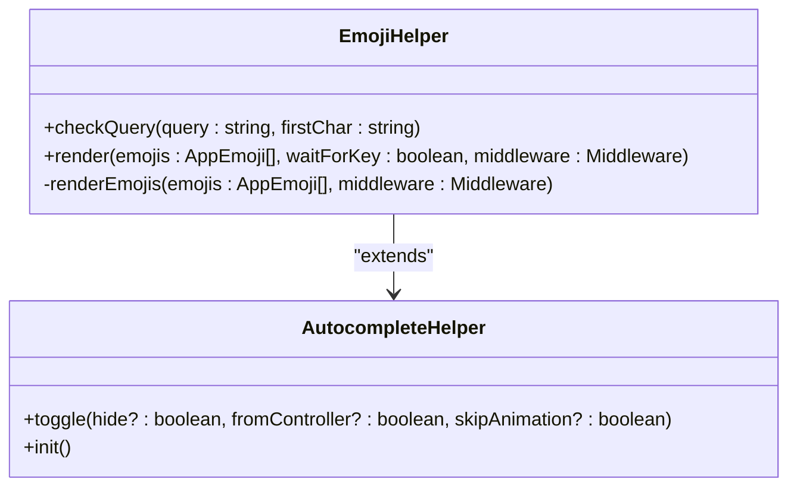
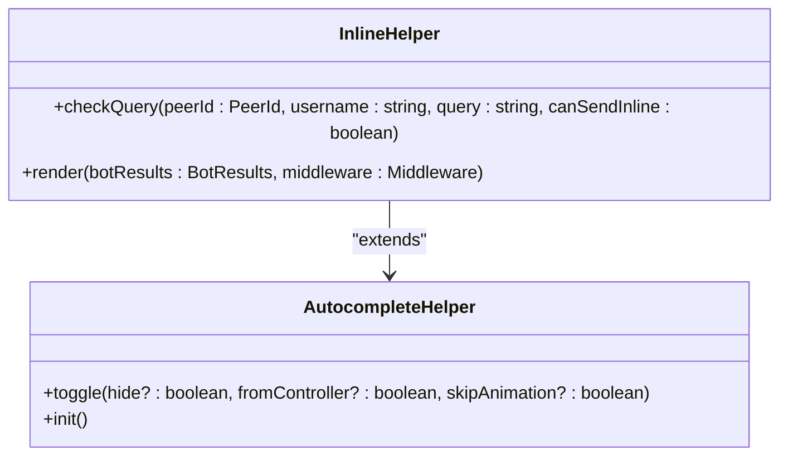
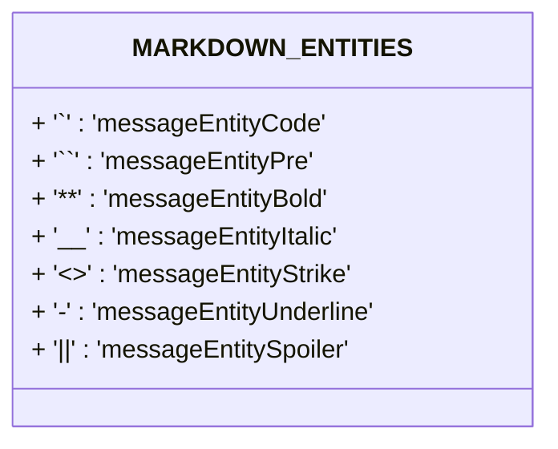
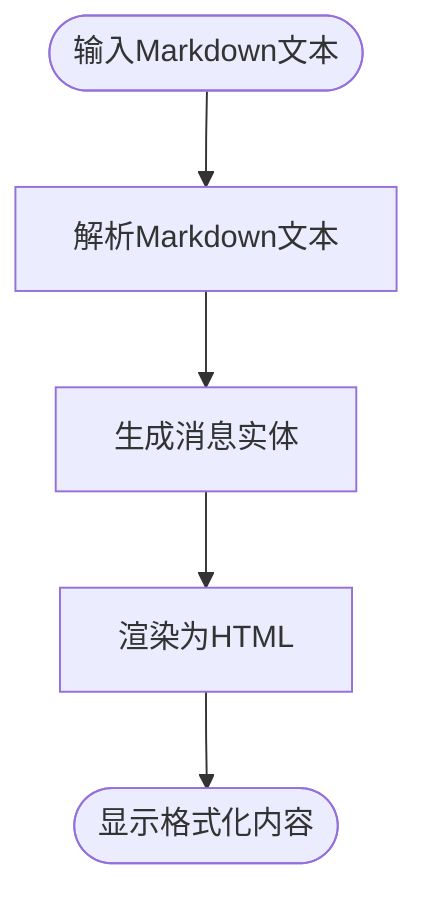
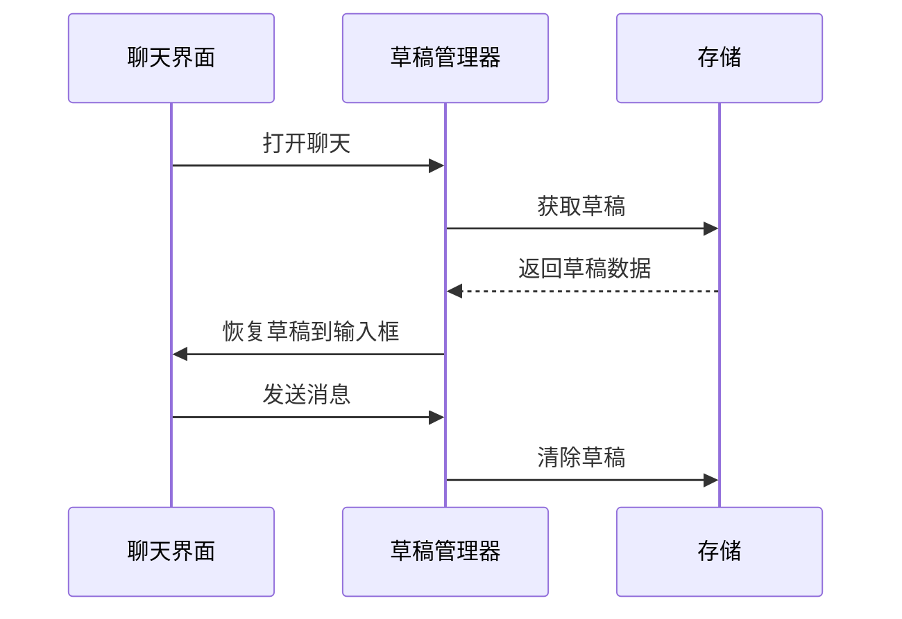
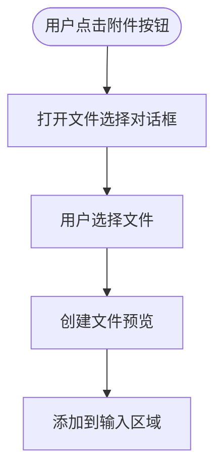
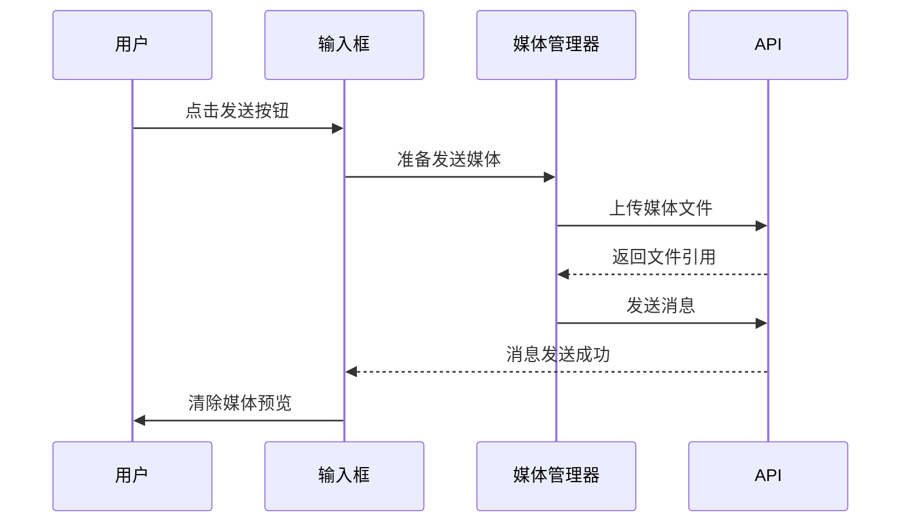
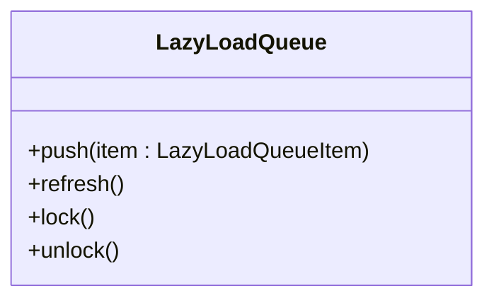
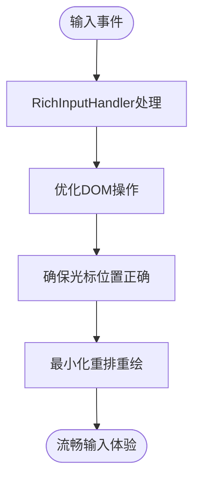

# 输入系统

<cite>
**本文档引用的文件**   
- [input.ts](file://src/components/chat/input.ts)
- [autocompleteHelper.ts](file://src/components/chat/autocompleteHelper.ts)
- [mentionsHelper.ts](file://src/components/chat/mentionsHelper.ts)
- [emojiHelper.ts](file://src/components/chat/emojiHelper.ts)
- [commandsHelper.ts](file://src/components/chat/commandsHelper.ts)
- [inlineHelper.ts](file://src/components/chat/inlineHelper.ts)
- [emoticonsDropdown/index.ts](file://src/components/emoticonsDropdown/index.ts)
- [richInputHandler.ts](file://src/helpers/dom/richInputHandler.ts)
- [appDraftsManager.ts](file://src/lib/appManagers/appDraftsManager.ts)
- [richTextProcessor/index.ts](file://src/lib/richTextProcessor/index.ts)
</cite>

## 目录
1. [简介](#简介)
2. [富文本输入框实现机制](#富文本输入框实现机制)
3. [自动补全功能](#自动补全功能)
4. [格式化功能](#格式化功能)
5. [输入状态管理](#输入状态管理)
6. [媒体附件处理流程](#媒体附件处理流程)
7. [输入性能优化策略](#输入性能优化策略)

## 简介
本系统实现了功能完整的输入解决方案，支持多种内容类型的输入和处理。系统基于富文本输入框构建，支持文本、表情、提及等多种内容类型。通过自动补全功能，用户可以方便地插入用户提及、表情符号和命令。系统还支持Markdown语法的格式化功能，包括粗体、斜体、代码块等。输入状态管理功能确保了草稿的保存和恢复。媒体附件处理流程从选择到预览再到发送提供了完整的用户体验。系统还包含多种性能优化策略，确保在大量内容下的流畅输入体验。

## 富文本输入框实现机制
输入系统的核心是富文本输入框，它基于contenteditable元素实现，支持多种内容类型的混合输入。系统通过RichInputHandler类处理输入事件，确保光标位置和内容的正确性。输入框支持文本、表情、提及等多种内容类型的插入和编辑。系统使用BOM（Byte Order Mark）字符来标记特殊内容的位置，确保光标在特殊内容周围的正确移动。输入框还处理各种输入事件，包括键盘输入、粘贴、删除等，确保内容的完整性和一致性。

**Section sources**
- [input.ts](file://src/components/chat/input.ts#L1-L800)
- [richInputHandler.ts](file://src/helpers/dom/richInputHandler.ts#L1-L800)

## 自动补全功能
系统实现了多种自动补全功能，包括用户提及、表情符号和命令的补全。

### 用户提及补全
用户提及补全功能通过MentionsHelper类实现。当用户输入@符号时，系统会显示一个包含可能提及用户的列表。系统通过getPeerActiveUsernames函数获取用户的活跃用户名，并根据输入的查询字符串过滤用户列表。补全列表显示用户的头像和用户名，用户点击后即可插入提及。

```mermaid
classDiagram
class MentionsHelper {
+checkQuery(query : string, peerId : PeerId, topMsgId : number, global? : boolean)
+render(peerIds : PeerId[], middleware : Middleware)
-onSelect(target : HTMLElement)
}
class AutocompletePeerHelper {
+render(items : {peerId : PeerId, description? : string}[], middleware : Middleware)
}
MentionsHelper --> AutocompletePeerHelper : "extends"
```

**Diagram sources**
- [mentionsHelper.ts](file://src/components/chat/mentionsHelper.ts#L1-L75)

### 表情符号补全
表情符号补全功能通过EmojiHelper类实现。当用户输入:符号后，系统会显示一个包含可能匹配的表情符号列表。系统通过appEmojiManager的prepareAndSearchEmojis方法搜索匹配的表情符号。补全列表以水平滚动的方式显示，用户可以通过键盘或鼠标选择表情符号。



**Diagram sources**
- [emojiHelper.ts](file://src/components/chat/emojiHelper.ts#L1-L166)

### 命令补全
命令补全功能通过CommandsHelper类实现。当用户与机器人聊天时，系统会显示该机器人支持的命令列表。系统通过processPeerFullForCommands函数处理机器人的完整信息，提取其支持的命令。补全列表显示命令名称和描述，用户点击后即可插入命令并发送。

```mermaid
classDiagram
class CommandsHelper {
+checkQuery(query : string, peerId : PeerId)
+render(commands : {peerId : PeerId, name : string, description : string, index : number}[], middleware : Middleware)
}
class AutocompletePeerHelper {
+render(items : {peerId : PeerId, description? : string}[], middleware : Middleware)
}
CommandsHelper --> AutocompletePeerHelper : "extends"
```

**Diagram sources**
- [commandsHelper.ts](file://src/components/chat/commandsHelper.ts#L1-L99)

### 内联机器人补全
内联机器人补全功能通过InlineHelper类实现。当用户输入@符号后跟机器人用户名时，系统会查询该机器人的内联结果。系统通过appInlineBotsManager的getInlineResults方法获取内联结果，并显示为可选择的列表。用户选择结果后，系统会发送内联结果消息。



**Diagram sources**
- [inlineHelper.ts](file://src/components/chat/inlineHelper.ts#L1-L339)

## 格式化功能
系统支持Markdown语法的格式化功能，包括粗体、斜体、代码块等。

### Markdown语法支持
系统通过richTextProcessor模块实现Markdown语法的支持。系统定义了MARKDOWN_ENTITIES常量，映射Markdown标记到消息实体类型。支持的格式包括：
- `**text**` 或 `__text__`：粗体
- `*text*` 或 `_text_`：斜体
- `` `text` ``：行内代码
- ```` ```text```` ``：代码块
- `~~text~~`：删除线
- `_-_text_-_`：下划线
- `||text||`：剧透



**Diagram sources**
- [index.ts](file://src/lib/richTextProcessor/index.ts#L92-L100)

### 格式化处理流程
格式化处理流程包括解析和渲染两个阶段。解析阶段将Markdown文本转换为带有实体的消息对象，渲染阶段将消息对象转换为HTML显示。系统通过parseMarkdown函数解析Markdown文本，通过wrapRichText函数渲染消息。



**Diagram sources**
- [index.ts](file://src/lib/richTextProcessor/index.ts#L77-L78)

## 输入状态管理
系统实现了完善的输入状态管理功能，包括草稿保存和恢复机制。

### 草稿保存机制
草稿保存机制通过AppDraftsManager类实现。系统在用户输入时定期保存草稿，确保内容不会丢失。草稿信息包括消息文本、格式实体、回复信息等。系统使用syncDraft方法同步本地草稿和服务器草稿，确保多设备间的一致性。

```mermaid
classDiagram
class AppDraftsManager {
+getDraft(peerId : PeerId, threadId? : number)
+saveDraft(args : {peerId : PeerId, threadId? : number, draft : DraftMessage})
+syncDraft(args : SyncDraftArgs)
+clearDraft(args : ClearDraftArgs)
}
```

**Diagram sources**
- [appDraftsManager.ts](file://src/lib/appManagers/appDraftsManager.ts#L38-L390)

### 草稿恢复机制
草稿恢复机制在用户打开聊天时自动加载之前的草稿。系统通过getDraft方法获取指定聊天的草稿，并将其恢复到输入框中。当用户发送消息后，系统会清除对应的草稿。



**Diagram sources**
- [appDraftsManager.ts](file://src/lib/appManagers/appDraftsManager.ts#L95-L97)

## 媒体附件处理流程
系统提供了完整的媒体附件处理流程，从选择到预览再到发送。

### 媒体选择
媒体选择通过文件输入元素实现。用户点击附件按钮后，系统打开文件选择对话框。系统支持图片、视频、文档等多种媒体类型。选择文件后，系统会创建文件预览并添加到输入区域。



### 媒体预览
媒体预览功能在输入区域显示所选媒体的缩略图。系统使用appMediaViewer组件显示媒体预览。预览包括媒体缩略图和文件信息，用户可以点击预览查看完整媒体或删除预览。

### 媒体发送
媒体发送流程在用户点击发送按钮时启动。系统将所选媒体与消息文本一起发送。发送过程中显示上传进度，发送完成后清除媒体预览。



## 输入性能优化策略
系统采用了多种性能优化策略，确保在大量内容下的流畅输入体验。

### 懒加载
系统使用LazyLoadQueue类实现懒加载，只加载可视区域内的内容。这减少了初始加载时间和内存占用，提高了滚动性能。



### 动画优化
系统使用animationIntersector优化动画性能。只有在可视区域内且用户不活跃时才播放动画，减少了CPU和GPU的负载。

### 输入处理优化
系统通过RichInputHandler类优化输入处理。该类处理各种输入事件，确保光标位置的正确性，同时最小化DOM操作，提高输入响应速度。



**Section sources**
- [richInputHandler.ts](file://src/helpers/dom/richInputHandler.ts#L21-L800)