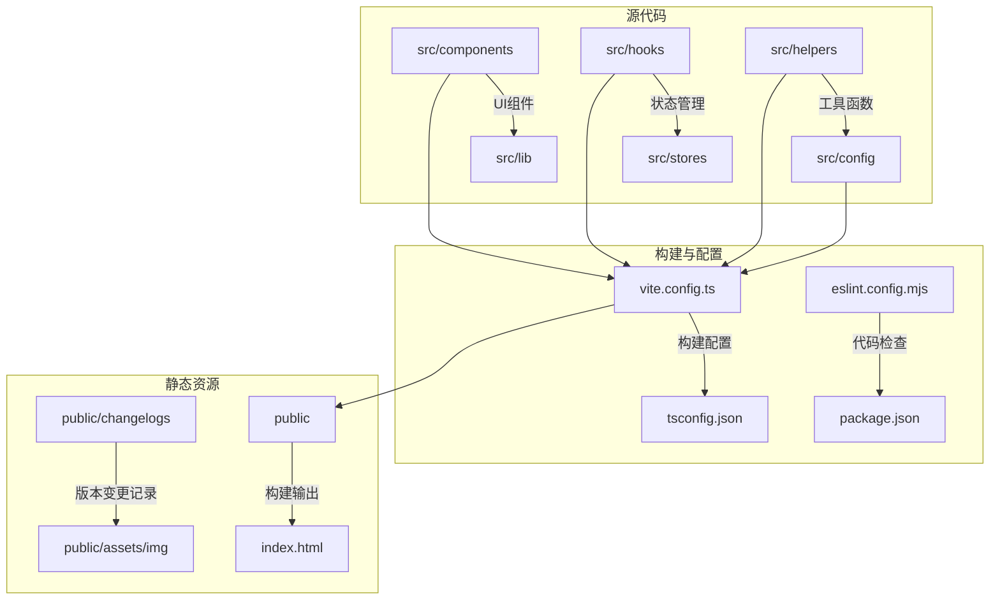
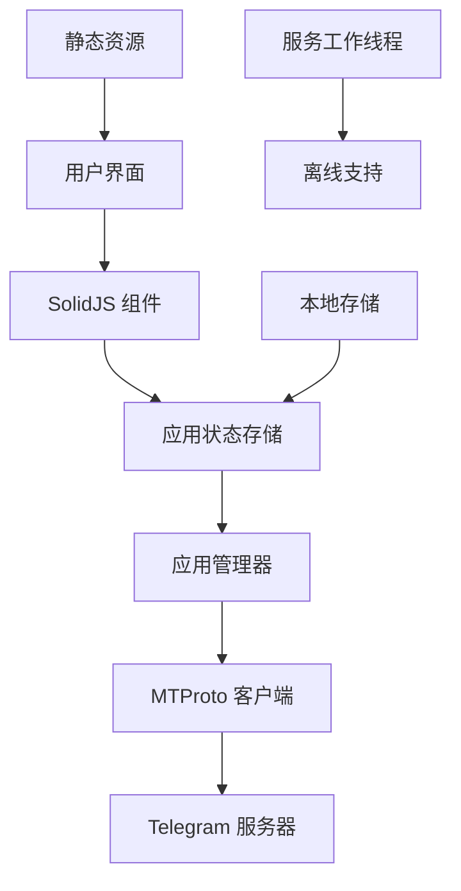
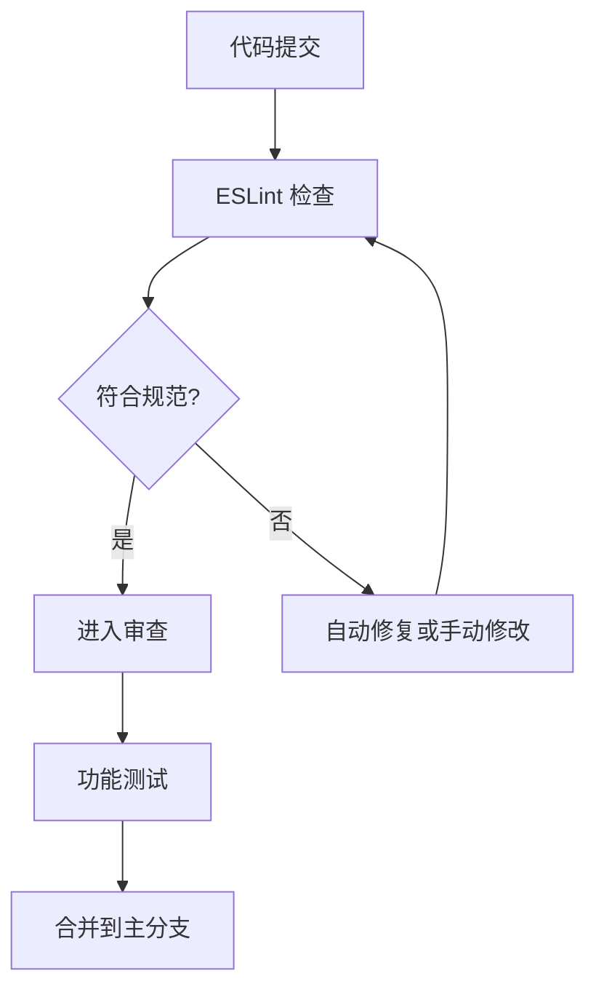
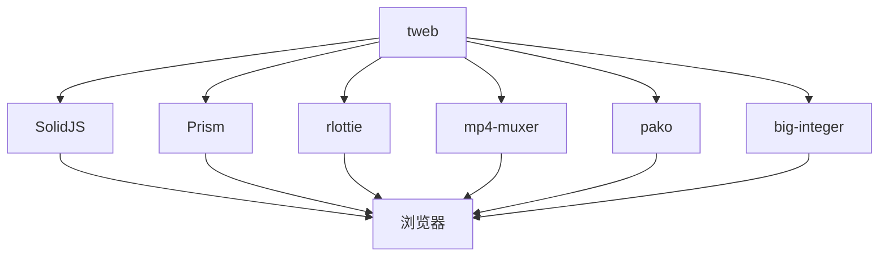

# 贡献指南

<cite>
**本文档中引用的文件**  
- [README.md](file://README.md)
- [package.json](file://package.json)
- [SECURITY.md](file://SECURITY.md)
- [docker-compose.yaml](file://docker-compose.yaml)
- [vite.config.ts](file://vite.config.ts)
- [eslint.config.mjs](file://eslint.config.mjs)
- [tsconfig.json](file://tsconfig.json)
- [src/scripts/generate_changelog.js](file://src/scripts/generate_changelog.js)
- [src/scripts/change_version.js](file://src/scripts/change_version.js)
- [src/tests/setup.ts](file://src/tests/setup.ts)
- [public/changelogs/en_2.1.0.md](file://public/changelogs/en_2.1.0.md)
- [CHANGELOG.md](file://CHANGELOG.md)
- [CHANGELOG_ru.md](file://CHANGELOG_ru.md)
</cite>

## 目录
1. [简介](#简介)
2. [项目结构](#项目结构)
3. [核心组件](#核心组件)
4. [架构概述](#架构概述)
5. [详细组件分析](#详细组件分析)
6. [依赖分析](#依赖分析)
7. [性能考虑](#性能考虑)
8. [故障排除指南](#故障排除指南)
9. [结论](#结论)

## 简介
本贡献指南旨在为新贡献者提供完整的入门流程，涵盖环境设置、代码理解、问题报告、拉取请求审查、代码风格、文档更新、版本发布、社区行为准则和常见问题解答。项目基于 Webogram 构建，是一个功能丰富的 Telegram Web 客户端，使用 SolidJS 框架开发，支持现代化的前端工具链。

**Section sources**
- [README.md](file://README.md#L1-L88)

## 项目结构
项目采用模块化结构，主要分为以下几个部分：
- `src/`：源代码目录，包含组件、配置、帮助函数、钩子、库、页面、脚本、SCSS 样式和状态管理
- `public/`：静态资源目录，包含构建后的文件、变更日志和图像资源
- `snapshot-server/`：用于本地存储快照的小型应用
- 根目录包含构建配置、Docker 配置、环境文件和测试工具

项目使用 Vite 作为构建工具，pnpm 作为包管理器，TypeScript 作为主要开发语言，并集成 ESLint 和 Vitest 进行代码质量和测试保障。

**Diagram sources**
- [vite.config.ts](file://vite.config.ts#L1-L162)
- [tsconfig.json](file://tsconfig.json#L1-L95)

**Section sources**
- [README.md](file://README.md#L1-L88)
- [package.json](file://package.json#L1-L76)

## 核心组件
项目的核心组件包括聊天界面、媒体播放器、表情符号选择器、通话功能和设置面板。这些组件通过 SolidJS 的响应式系统进行状态管理，并通过模块化的帮助函数库提供通用功能。组件结构遵循单一职责原则，每个组件目录包含其自身的样式、测试和辅助工具。

**Section sources**
- [src/components](file://src/components)
- [src/lib](file://src/lib)

## 架构概述
系统采用分层架构，前端使用 SolidJS 实现响应式 UI，通过 MTProto 协议与 Telegram 服务器通信。应用状态通过全局状态存储管理，组件间通过事件总线和上下文进行通信。构建流程使用 Vite 提供快速的开发服务器和高效的生产构建。

**Diagram sources**
- [src/lib/appManagers](file://src/lib/appManagers)
- [src/stores](file://src/stores)

## 详细组件分析

### 开发环境设置
新贡献者需要安装 pnpm 包管理器，然后运行 `pnpm install` 安装所有依赖。开发服务器可以通过 `pnpm start` 启动，应用将在 http://localhost:8080/ 可访问。项目还支持 Docker 开发环境，可以通过 `docker-compose up tweb.develop` 启动。

**Section sources**
- [README.md](file://README.md#L5-L15)
- [docker-compose.yaml](file://docker-compose.yaml#L1-L30)

### 问题报告规范
问题报告应通过 Telegram 的[建议平台](https://bugs.telegram.org/c/4002)提交。报告应包含详细的重现步骤、预期行为、实际行为和环境信息。调试参数如 `test=1`、`debug=1` 和 `noSharedWorker=1` 可用于辅助问题诊断。

**Section sources**
- [README.md](file://README.md#L81-L83)

### 拉取请求审查流程
拉取请求需要经过代码审查，确保符合代码风格指南和功能需求。审查重点关注代码质量、性能影响、安全性和向后兼容性。合并前需要通过所有 CI 检查，包括 ESLint 验证和 Vitest 测试。

**Section sources**
- [package.json](file://package.json#L10-L12)
- [eslint.config.mjs](file://eslint.config.mjs#L1-L173)

### 代码风格指南
项目遵循严格的代码风格规范，使用 ESLint 进行自动化检查。主要规则包括：使用单引号、2 空格缩进、Unix 换行符、末尾逗号禁止、关键字后空格等。TypeScript 配置启用严格类型检查，但对 null 检查和属性初始化有特殊处理。

**Diagram sources**
- [eslint.config.mjs](file://eslint.config.mjs#L1-L173)
- [tsconfig.json](file://tsconfig.json#L1-L95)

### 提交消息规范
提交消息应简洁明了，使用英文描述更改内容。建议采用"类型: 描述"的格式，如"fix: 修复媒体播放器错误"或"feat: 添加新表情符号"。对于重大更改，应在消息正文中提供详细说明。

**Section sources**
- [package.json](file://package.json#L7-L23)

### 文档更新要求
文档更新包括变更日志、README 和内联注释。变更日志通过 `generate_changelog.js` 脚本自动生成，从 `CHANGELOG.md` 文件提取版本信息并创建多语言版本。文档应保持最新，反映代码的实际功能。

**Section sources**
- [src/scripts/generate_changelog.js](file://src/scripts/generate_changelog.js#L1-L50)
- [CHANGELOG.md](file://CHANGELOG.md)

### 版本发布流程
版本发布通过 `change_version.js` 脚本管理，该脚本更新 `.env` 文件中的版本号、构建号和语言包版本。发布流程包括：更新版本号、生成变更日志、构建生产版本和部署到服务器。Docker 配置支持生产环境的容器化部署。

**Section sources**
- [src/scripts/change_version.js](file://src/scripts/change_version.js#L1-L64)
- [docker-compose.yaml](file://docker-compose.yaml#L23-L30)

### 社区行为准则
社区遵循开放、尊重和协作的原则。贡献者应保持专业态度，尊重他人意见，积极参与讨论。安全漏洞应通过 SECURITY.md 文件中描述的流程报告，确保负责任的披露。

**Section sources**
- [SECURITY.md](file://SECURITY.md#L1-L22)

### 沟通渠道
主要沟通渠道是 GitHub 仓库的 Issues 和 Pull Requests。对于紧急安全问题，应通过私密渠道报告。项目不提供实时聊天支持，建议通过 Issues 进行功能请求和技术讨论。

**Section sources**
- [README.md](file://README.md#L83)
- [SECURITY.md](file://SECURITY.md#L15-L22)

### 常见问题解答
- **如何预览所有图标？** 在浏览器控制台调用 `showIconLibrary()` 全局函数。
- **如何启用调试模式？** 在 URL 中添加 `debug=1` 参数。
- **如何处理本地存储问题？** 使用 `snapshot-server` 应用创建和加载本地存储快照。
- **如何构建生产版本？** 运行 `node build` 命令生成最小化的生产版本。

**Section sources**
- [README.md](file://README.md#L78-L76)

## 依赖分析
项目依赖关系清晰，主要外部依赖包括 SolidJS 框架、Prism 代码高亮、rlottie 动画库和 mp4-muxer 媒体处理库。所有依赖均在 package.json 中声明，并通过 pnpm 锁定版本。项目避免使用过时或不安全的依赖，定期进行依赖更新和安全审计。

**Diagram sources**
- [package.json](file://package.json#L26-L73)
- [README.md](file://README.md#L47-L62)

## 性能考虑
项目优化了加载性能和运行时性能。使用代码分割和懒加载减少初始加载时间，通过虚拟列表和延迟加载优化大型数据集的渲染。媒体资源经过优化，支持渐进式加载和缓存。构建配置启用代码压缩和源码映射，平衡生产环境的性能和调试需求。

**Section sources**
- [vite.config.ts](file://vite.config.ts#L121-L138)
- [src/components/dynamicVirtualList](file://src/components/dynamicVirtualList)

## 故障排除指南
常见问题包括构建失败、依赖安装问题和运行时错误。构建失败通常由 ESLint 错误或 TypeScript 类型错误引起，应根据错误信息进行修复。依赖问题可通过删除 node_modules 和重新安装解决。运行时错误应检查控制台输出，使用调试参数辅助诊断。

**Section sources**
- [README.md](file://README.md#L63-L74)
- [vite.config.ts](file://vite.config.ts#L76-L91)

## 结论
本贡献指南提供了全面的项目参与信息，从环境设置到代码提交，从问题报告到版本发布。遵循这些指南可以帮助贡献者高效地参与项目开发，确保代码质量和项目稳定性。社区欢迎各种形式的贡献，包括代码改进、文档完善和问题报告。