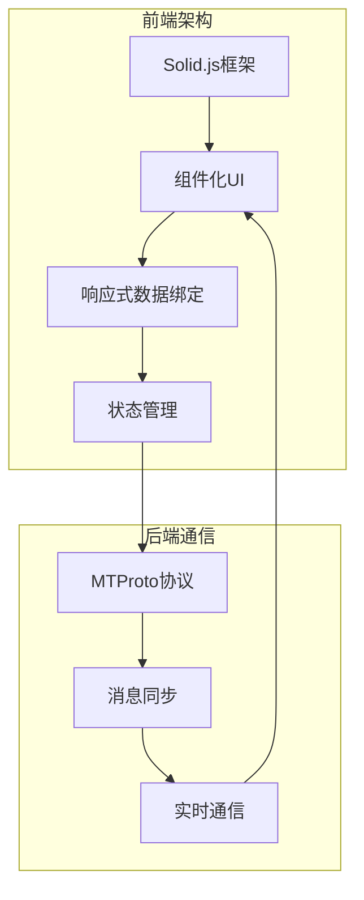
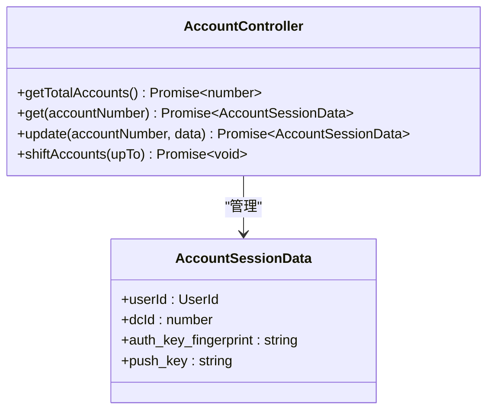

# 项目概述

<cite>
**本文档引用的文件**   
- [README.md](file://README.md)
- [package.json](file://package.json)
- [src/index.ts](file://src/index.ts)
- [src/pages/pageIm.ts](file://src/pages/pageIm.ts)
- [src/lib/appManagers/appStateManager.ts](file://src/lib/appManagers/appStateManager.ts)
- [src/lib/mtproto/mtprotoworker.ts](file://src/lib/mtproto/mtprotoworker.ts)
- [src/components/chat/chat.ts](file://src/components/chat/chat.ts)
- [src/lib/accounts/accountController.ts](file://src/lib/accounts/accountController.ts)
- [src/config/app.ts](file://src/config/app.ts)
</cite>

## 目录
1. [引言](#引言)
2. [项目架构](#项目架构)
3. [核心功能](#核心功能)
4. [技术愿景与目标用户](#技术愿景与目标用户)
5. [历史背景与发展路线图](#历史背景与发展路线图)

## 引言

tweb项目是一个基于Web的Telegram客户端，使用Solid.js框架和Vite构建工具开发。该项目旨在为用户提供一个功能完整、性能优越的Web端Telegram体验。作为Webogram的改进版本，tweb在保持原有功能的基础上，增强了多账户管理、媒体处理和安全特性。项目采用现代化的前端技术栈，结合Telegram的MTProto协议，实现了高效的消息同步和实时通信能力。

**Section sources**
- [README.md](file://README.md#L1-L88)

## 项目架构

tweb项目采用组件化设计和响应式编程架构，基于Solid.js框架构建。项目使用Vite作为构建工具，提供了快速的开发服务器和高效的生产构建。架构的核心是模块化结构，将不同的功能划分为独立的组件和管理器。

项目的主要架构特点包括：
- **组件化设计**：UI被分解为可重用的组件，如聊天界面、输入框、顶部栏等
- **响应式编程**：利用Solid.js的响应式系统实现数据驱动的UI更新
- **模块化结构**：功能被组织在不同的模块中，如appManagers、components、lib等
- **状态管理**：通过AppStateManager和Solid.js的信号系统管理应用状态

**Diagram sources **
- [src/index.ts](file://src/index.ts#L1-L682)
- [src/lib/appManagers/appStateManager.ts](file://src/lib/appManagers/appStateManager.ts#L1-L133)

**Section sources**
- [src/index.ts](file://src/index.ts#L1-L682)
- [src/lib/appManagers/appStateManager.ts](file://src/lib/appManagers/appStateManager.ts#L1-L133)

## 核心功能

### 消息收发
tweb项目实现了完整的Telegram消息收发功能，包括文本消息、多媒体消息和富媒体内容的发送与接收。通过MTProto协议与Telegram服务器通信，确保消息的实时性和可靠性。

### 多账户管理
项目支持多账户管理功能，允许用户在同一客户端中管理多个Telegram账户。通过AccountController实现账户的创建、切换和管理，最多支持4个账户。

**Diagram sources **
- [src/lib/accounts/accountController.ts](file://src/lib/accounts/accountController.ts#L1-L155)

### 媒体处理
项目集成了强大的媒体处理能力，支持图片、视频、音频等多种媒体格式的处理和显示。通过WebAssembly和Web Workers实现高效的媒体编解码。

### 安全功能
tweb项目实现了多层次的安全机制，包括：
- **会话管理**：通过sessionStorage管理用户会话数据
- **数据加密**：使用加密存储保护敏感信息
- **身份验证**：支持多种身份验证方式，包括密码、二维码等

**Section sources**
- [src/components/chat/chat.ts](file://src/components/chat/chat.ts#L1-L800)
- [src/lib/mtproto/mtprotoworker.ts](file://src/lib/mtproto/mtprotoworker.ts#L1-L800)

## 技术愿景与目标用户

tweb项目的技术愿景是为用户提供一个现代化、高性能的Web端Telegram客户端。项目采用最新的前端技术，如Solid.js和Vite，确保应用的响应速度和用户体验。目标用户包括需要在Web端使用Telegram的普通用户，以及需要多账户管理功能的专业用户。

项目与其他Telegram客户端的关系是互补的。作为Web客户端，tweb提供了跨平台的访问能力，用户可以在任何有浏览器的设备上使用Telegram服务。与原生客户端相比，tweb在功能完整性上保持一致，同时在Web环境中进行了优化。

## 历史背景与发展路线图

tweb项目基于Webogram开发，经过多次改进和优化。项目最初由Eduard Kuzmenko开发，旨在提供一个开源的Web版Telegram客户端。随着技术的发展，项目逐步采用了现代化的前端框架和技术栈。

发展路线图包括：
- 持续优化性能和用户体验
- 增强多账户管理功能
- 改进媒体处理能力
- 加强安全特性
- 支持更多Telegram新功能

**Section sources**
- [README.md](file://README.md#L1-L88)
- [src/config/app.ts](file://src/config/app.ts#L1-L46)